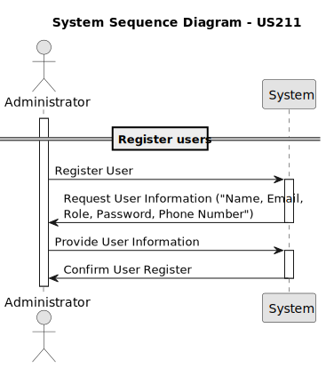
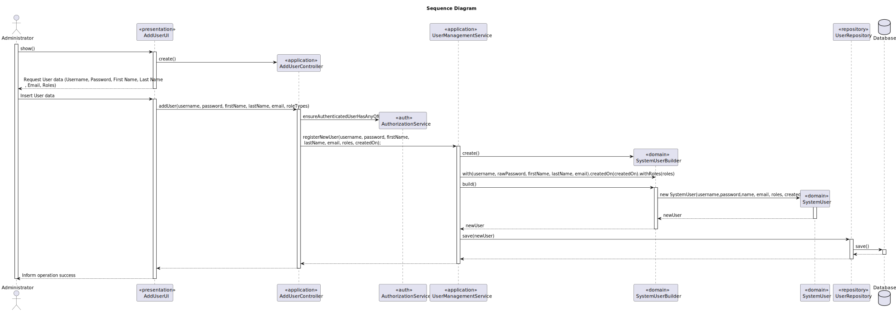
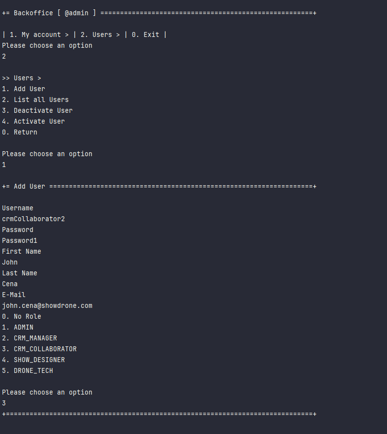
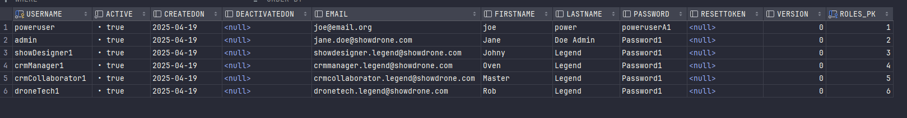

# US 211 - Register users

## 1. Context

* The system must allow administrators to register new users who need access to the backoffice. 
This includes defining their roles and credentials. A user registration interface must be provided within the backoffice, accessible only to administrators.
Additionally, a bootstrap process must be in place to automatically create initial users (such as a default admin) when the system is deployed for the first time.


## 2. Requirements

**US211** - As Administrator, I want to be able to register users of the backoffice.
This must also be achieved by a bootstrap process.


**Acceptance Criteria:**

- US211.1  The system must provide an interface in the backoffice for administrators to create new user accounts.

- US211.2  The system must allow assigning roles to users during registration.

- US211.3  The system must validate the uniqueness of user email addresses to prevent duplicates.


**Dependencies/References:**

* This user story depends on user story US210, as user registration must be integrated 
with the authentication and authorization mechanisms defined in that us.

**Forum Insight:**

* Still no questions related to this user story on forum.

## 3. Analysis




## 4. Design


### 4.1. Sequence Diagram




### 4.3. Applied Patterns

- Domain-Driven Design
- Builder
- Factory


## 5. Implementation

**Actions**

```java
package eapli.base.app.backoffice.presentation.authz;

import eapli.framework.actions.Action;

/**
 * Menu action for adding a new user to the application. Created by nuno on
 * 22/03/16.
 */
public class AddUserAction implements Action {

    @Override
    public boolean execute() {
        return new AddUserUI().show();
    }
}
```


**UI**

```java
public class AddUserUI extends AbstractUI {

    private final AddUserController theController = new AddUserController();

    @Override
    protected boolean doShow() {
        // FIXME avoid duplication with SignUpUI. reuse UserDataWidget from
        // UtenteApp
        final String username = Console.readLine("Username");
        final String password = Console.readLine("Password");
        final String firstName = Console.readLine("First Name");
        final String lastName = Console.readLine("Last Name");
        final String email = Console.readLine("E-Mail");

        final Set<Role> roleTypes = new HashSet<>();
        boolean show;
        do {
            show = showRoles(roleTypes);
        } while (!show);

        try {
            this.theController.addUser(username, password, firstName, lastName, email, roleTypes);
        } catch (final IntegrityViolationException | ConcurrencyException e) {
            System.out.println("That username is already in use.");
        }

        return false;
    }

    private boolean showRoles(final Set<Role> roleTypes) {
        // TODO we could also use the "widget" classes from the framework...
        final Menu rolesMenu = buildRolesMenu(roleTypes);
        final MenuRenderer renderer = new VerticalMenuRenderer(rolesMenu, MenuItemRenderer.DEFAULT);
        return renderer.render();
    }

    private Menu buildRolesMenu(final Set<Role> roleTypes) {
        final Menu rolesMenu = new Menu();
        int counter = 0;
        rolesMenu.addItem(MenuItem.of(counter++, "No Role", Actions.SUCCESS));
        for (final Role roleType : theController.getRoleTypes()) {
            rolesMenu.addItem(MenuItem.of(counter++, roleType.toString(), () -> roleTypes.add(roleType)));
        }
        return rolesMenu;
    }

    @Override
    public String headline() {
        return "Add User";
    }
}
```

**Controller**

```java
@UseCaseController
public class AddUserController {

    private final AuthorizationService authz = AuthzRegistry.authorizationService();
    private final UserManagementService userSvc = AuthzRegistry.userService();

    /**
     * Get existing RoleTypes available to the user.
     *
     * @return a list of RoleTypes
     */
    public Role[] getRoleTypes() {
        return Roles.nonUserValues();
    }

    public SystemUser addUser(final String username, final String password, final String firstName,
            final String lastName,
            final String email, final Set<Role> roles, final Calendar createdOn) {
        authz.ensureAuthenticatedUserHasAnyOf(Roles.POWER_USER, Roles.ADMIN);

        return userSvc.registerNewUser(username, password, firstName, lastName, email, roles,
                createdOn);
    }

    public SystemUser addUser(final String username, final String password, final String firstName,
            final String lastName,
            final String email, final Set<Role> roles) {
        return addUser(username, password, firstName, lastName, email, roles, CurrentTimeCalendars.now());
    }
}

```


**UserManagementService**

```java
@Component
public class UserManagementService {
    private final UserRepository userRepository;
    private final PasswordEncoder encoder;
    private final PasswordPolicy policy;

    @Autowired
    public UserManagementService(final UserRepository userRepo, final PasswordPolicy policy, final PasswordEncoder encoder) {
        this.userRepository = userRepo;
        this.policy = policy;
        this.encoder = encoder;
    }

    @Transactional
    public SystemUser registerNewUser(final String email, final String rawPassword, final String firstName, final String lastName, final Set<Role> roles, final Calendar createdOn) {
        SystemUserBuilder userBuilder = new SystemUserBuilder(this.policy, this.encoder);
        userBuilder.withEmailAsUsername(email).withPassword(rawPassword).withName(firstName, lastName).createdOn(createdOn).withRoles(roles);
        SystemUser newUser = userBuilder.build();
        return (SystemUser)this.userRepository.save(newUser);
    }

    @Transactional
    public SystemUser registerNewUser(final String username, final String rawPassword, final String firstName, final String lastName, final String email, final Set<Role> roles, final Calendar createdOn) {
        SystemUserBuilder userBuilder = new SystemUserBuilder(this.policy, this.encoder);
        userBuilder.with(username, rawPassword, firstName, lastName, email).createdOn(createdOn).withRoles(roles);
        SystemUser newUser = userBuilder.build();
        return (SystemUser)this.userRepository.save(newUser);
    }

    @Transactional
    public SystemUser registerNewUser(final String username, final String rawPassword, final String firstName, final String lastName, final String email, final Set<Role> roles) {
        return this.registerNewUser(username, rawPassword, firstName, lastName, email, roles, CurrentTimeCalendars.now());
    }

    @Transactional
    public SystemUser registerUser(final Username username, final Password password, final Name name, final EmailAddress email, final Set<Role> roles) {
        SystemUserBuilder userBuilder = new SystemUserBuilder(this.policy, this.encoder);
        userBuilder.with(username, password, name, email).withRoles(roles);
        SystemUser newUser = userBuilder.build();
        return (SystemUser)this.userRepository.save(newUser);
    }

    @Transactional
    public SystemUser registerUser(final EmailAddress email, final Password password, final Name name, final Set<Role> roles) {
        SystemUserBuilder userBuilder = new SystemUserBuilder(this.policy, this.encoder);
        userBuilder.withEmailAsUsername(email).withPassword(password).withName(name).withRoles(roles);
        SystemUser newUser = userBuilder.build();
        return (SystemUser)this.userRepository.save(newUser);
    }

    public Iterable<SystemUser> activeUsers() {
        return this.userRepository.findByActive(true);
    }

    public Iterable<SystemUser> deactivatedUsers() {
        return this.userRepository.findByActive(false);
    }

    public Iterable<SystemUser> allUsers() {
        return this.userRepository.findAll();
    }

    public Optional<SystemUser> userOfIdentity(final Username id) {
        return this.userRepository.ofIdentity(id);
    }

    @Transactional
    public SystemUser deactivateUser(final SystemUser user) {
        user.deactivate(CurrentTimeCalendars.now());
        return (SystemUser)this.userRepository.save(user);
    }

    @Transactional
    public SystemUser activateUser(final SystemUser user) {
        user.activate();
        return (SystemUser)this.userRepository.save(user);
    }
}

```

**SystemUserBuilder**

```java
public class SystemUserBuilder implements DomainFactory<SystemUser> {
    private static final Logger LOGGER = LogManager.getLogger(SystemUserBuilder.class);
    private Username username;
    private Password password;
    private Name name;
    private EmailAddress email;
    private Calendar createdOn;
    private final RoleSet roles;
    private final PasswordPolicy policy;
    private final PasswordEncoder encoder;

    public SystemUserBuilder(final PasswordPolicy policy, final PasswordEncoder encoder) {
        Preconditions.noneNull(new Object[]{policy, encoder});
        this.policy = policy;
        this.encoder = encoder;
        this.roles = new RoleSet();
    }

    public SystemUserBuilder with(final String userName, final String password, final String firstName, final String lastName, final String email) {
        this.withUsername(userName);
        this.withPassword(password);
        this.withName(firstName, lastName);
        this.withEmail(email);
        return this;
    }

    public SystemUserBuilder with(final Username username, final Password password, final Name name, final EmailAddress email) {
        this.withUsername(username);
        this.withPassword(password);
        this.withName(name);
        this.withEmail(email);
        return this;
    }

    public SystemUserBuilder with(final EmailAddress email, final Password password, final Name name) {
        this.withEmailAsUsername(email);
        this.withPassword(password);
        this.withName(name);
        return this;
    }

    public SystemUserBuilder withUsername(final String username) {
        this.username = Username.valueOf(username);
        return this;
    }

    public SystemUserBuilder withUsername(final Username username) {
        this.username = username;
        return this;
    }

    public SystemUserBuilder withEmailAsUsername(final String email) {
        return this.withUsername(email).withEmail(email);
    }

    public SystemUserBuilder withEmailAsUsername(final EmailAddress email) {
        return this.withUsername(email.toString()).withEmail(email);
    }

    public SystemUserBuilder withEmail(final String email) {
        this.email = EmailAddress.valueOf(email);
        return this;
    }

    public SystemUserBuilder withEmail(final EmailAddress email) {
        this.email = email;
        return this;
    }

    public SystemUserBuilder withPassword(final String rawPassword) {
        this.password = (Password)Password.encodedAndValid(rawPassword, this.policy, this.encoder).orElseThrow(IllegalArgumentException::new);
        return this;
    }

    public SystemUserBuilder withPassword(final Password password) {
        Preconditions.nonNull(password);
        this.password = password;
        return this;
    }

    public SystemUserBuilder withName(final String firstName, final String lastName) {
        this.name = new Name(firstName, lastName);
        return this;
    }

    public SystemUserBuilder withName(final Name name) {
        this.name = name;
        return this;
    }

    public SystemUserBuilder withRoles(final Role... onlyWithThis) {
        Role[] var2 = onlyWithThis;
        int var3 = onlyWithThis.length;

        for(int var4 = 0; var4 < var3; ++var4) {
            Role each = var2[var4];
            this.roles.add(new RoleAssignment(each));
        }

        return this;
    }

    public SystemUserBuilder withRole(final RoleAssignment role) {
        this.roles.add(role);
        return this;
    }

    public SystemUserBuilder createdOn(final Calendar createdOn) {
        this.createdOn = createdOn;
        return this;
    }

    public SystemUserBuilder withRoles(final Set<Role> someRoles) {
        List theRoles;
        if (this.createdOn == null) {
            theRoles = (List)someRoles.stream().map(RoleAssignment::new).collect(Collectors.toList());
        } else {
            theRoles = (List)someRoles.stream().map((rt) -> {
                return new RoleAssignment(rt, this.createdOn);
            }).collect(Collectors.toList());
        }

        this.roles.addAll(theRoles);
        return this;
    }

    public SystemUserBuilder withRoles(final RoleSet roles) {
        this.roles.addAll(roles);
        return this;
    }

    public SystemUser build() {
        SystemUser user = new SystemUser(this.username, this.password, this.name, this.email, this.roles, this.createdOn);
        if (LOGGER.isDebugEnabled()) {
            String roleLog = this.roles.roleTypes().toString();
            LOGGER.debug("Creating new user [{}] {} ({} {}) with roles {}", user, this.username, this.name, this.email, roleLog);
        }

        return user;
    }
}
```

**SystemUser**

```java
@Entity
@Table(
    name = "T_SYSTEMUSER"
)
public class SystemUser implements AggregateRoot<Username>, DTOable<GeneralDTO>, Visitable<GeneralDTO>, Serializable {
    private static final long serialVersionUID = 1L;
    @Version
    private Long version;
    @EmbeddedId
    private Username username;
    private Password password;
    private Name name;
    @Column(
        unique = true
    )
    private EmailAddress email;
    @OneToOne(
        cascade = {CascadeType.ALL},
        optional = false,
        fetch = FetchType.EAGER
    )
    private RoleSet roles;
    @Temporal(TemporalType.DATE)
    private Calendar createdOn;
    private boolean active;
    @Temporal(TemporalType.DATE)
    private Calendar deactivatedOn;
    private String resetToken;

    SystemUser(final Username username, final Password password, final Name name, final EmailAddress email, final RoleSet roles, final Calendar createdOn) {
        Preconditions.noneNull(new Object[]{roles, username, password, name, email});
        this.createdOn = createdOn == null ? CurrentTimeCalendars.now() : createdOn;
        this.username = username;
        this.password = password;
        this.name = name;
        this.email = email;
        this.roles = roles;
        this.active = true;
        this.invalidateResetToken();
    }

    protected SystemUser() {
    }

    public boolean sameAs(final Object other) {
        if (!(other instanceof SystemUser that)) {
            return false;
        } else if (this == that) {
            return true;
        } else if (this.username.equals(that.username) && this.password.equals(that.password) && this.name.equals(that.name) && this.email.equals(that.email) && !this.roles.equals(that.roles)) {
            return this.resetToken == null ? that.resetToken == null : this.resetToken.equals(that.resetToken);
        } else {
            return false;
        }
    }

    public Username identity() {
        return this.username;
    }

    public EmailAddress email() {
        return this.email;
    }

    public void assignToRole(final RoleAssignment role) {
        this.roles.add(role);
    }

    public void assignToRole(final Role role) {
        Preconditions.nonNull(role);
        this.roles.add(new RoleAssignment(role));
    }

    public boolean unassignRole(final Role role) {
        Preconditions.nonNull(role);
        return (Boolean)this.roles.getAssignment(role).map(RoleAssignment::unassign).orElse(false);
    }

    public Collection<Role> roleTypes() {
        return this.roles.roleTypes();
    }

    public GeneralDTO toDTO() {
        GeneralDTO ret = new GeneralDTO("user");
        ret.put("username", this.username.toString());
        ret.put("name", this.name.toString());
        ret.put("email", this.email.toString());
        ret.put("roles", this.roles.roleTypes().toString());
        return ret;
    }

    public boolean passwordMatches(final String rawPassword, final PasswordEncoder encoder) {
        return encoder.matches(rawPassword, this.password.value());
    }

    String encodedPassword() {
        return this.password.value();
    }

    public void accept(final Visitor<GeneralDTO> visitor) {
        visitor.visit(this.toDTO());
    }

    public Username username() {
        return this.username;
    }

    public Name name() {
        return this.name;
    }

    public boolean isActive() {
        return this.active;
    }

    public void deactivate(final Calendar deactivatedOn) {
        if (deactivatedOn != null && !deactivatedOn.before(this.createdOn)) {
            if (!this.active) {
                throw new IllegalStateException("Cannot deactivate an inactive user");
            } else {
                this.active = false;
                this.deactivatedOn = deactivatedOn;
                this.invalidateResetToken();
            }
        } else {
            throw new IllegalArgumentException();
        }
    }

    public void activate() {
        if (!this.isActive()) {
            this.active = true;
            this.deactivatedOn = null;
            this.invalidateResetToken();
        }
    }

    public int hashCode() {
        return DomainEntities.hashCode(this);
    }

    public boolean equals(final Object other) {
        return DomainEntities.areEqual(this, other);
    }

    public void changePassword(final Password newPassword) {
        this.password = newPassword;
        this.invalidateResetToken();
    }

    private void invalidateResetToken() {
        this.resetToken = null;
    }

    public String resetPassword() {
        this.resetToken = (new UUIDGenerator()).newId().toString();
        return this.resetToken;
    }

    public boolean confirmResetPassword(final String token, final Password newPass) {
        Invariants.nonNull(this.resetToken);
        Preconditions.nonEmpty(token);
        Preconditions.nonNull(newPass);
        this.invalidateResetToken();
        if (token.equals(this.resetToken)) {
            this.password = newPass;
            return true;
        } else {
            return false;
        }
    }

    public boolean hasAny(final Role... roles) {
        Role[] var2 = roles;
        int var3 = roles.length;

        for(int var4 = 0; var4 < var3; ++var4) {
            Role r = var2[var4];
            if (this.roles.hasAssignment(r)) {
                return true;
            }
        }

        return false;
    }

    public boolean hasAll(final Role... roles) {
        Role[] var2 = roles;
        int var3 = roles.length;

        for(int var4 = 0; var4 < var3; ++var4) {
            Role r = var2[var4];
            if (!this.roles.hasAssignment(r)) {
                return false;
            }
        }

        return true;
    }

    public Calendar createdOn() {
        return (Calendar)this.createdOn.clone();
    }
}
```

## 6. Integration/Demonstration

**Registering process**




**User Database**



