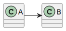

# US 211 - Register users

## 1. Context

* The system must allow administrators to register new users who need access to the backoffice. 
This includes defining their roles and credentials. A user registration interface must be provided within the backoffice, accessible only to administrators.
Additionally, a bootstrap process must be in place to automatically create initial users (such as a default admin) when the system is deployed for the first time.


## 2. Requirements

**US211** - As Administrator, I want to be able to register users of the backoffice.
This must also be achieved by a bootstrap process.


**Acceptance Criteria:**

- US211.1  The system must provide an interface in the backoffice for administrators to create new user accounts.

- US211.2  The system must allow assigning roles to users during registration.

- US211.3  The system must validate the uniqueness of user email addresses to prevent duplicates.


**Dependencies/References:**

* This user story depends on user story US210, as user registration must be integrated 
with the authentication and authorization mechanisms defined in that us.

**Forum Insight:**

* Still no questions related to this user story on forum.

## 3. Analysis

*In this section, the team should report the study/analysis/comparison that was done in order to take the best design decisions for the requirement. This section should also include supporting diagrams/artifacts (such as domain model; use case diagrams, etc.),*

## 4. Design

*In this sections, the team should present the solution design that was adopted to solve the requirement. This should include, at least, a diagram of the realization of the functionality (e.g., sequence diagram), a class diagram (presenting the classes that support the functionality), the identification and rational behind the applied design patterns and the specification of the main tests used to validade the functionality.*

### 4.1. Realization



### 4.3. Applied Patterns

### 4.4. Acceptance Tests

Include here the main tests used to validate the functionality. Focus on how they relate to the acceptance criteria. May be automated or manual tests.

**Test 1:** *Verifies that it is not possible to ...*

**Refers to Acceptance Criteria:** US101.1


```
@Test(expected = IllegalArgumentException.class)
public void ensureXxxxYyyy() {
...
}
````

## 5. Implementation

*In this section the team should present, if necessary, some evidencies that the implementation is according to the design. It should also describe and explain other important artifacts necessary to fully understand the implementation like, for instance, configuration files.*

*It is also a best practice to include a listing (with a brief summary) of the major commits regarding this requirement.*

## 6. Integration/Demonstration

*In this section the team should describe the efforts realized in order to integrate this functionality with the other parts/components of the system*

*It is also important to explain any scripts or instructions required to execute an demonstrate this functionality*

## 7. Observations

*This section should be used to include any content that does not fit any of the previous sections.*

*The team should present here, for instance, a critical prespective on the developed work including the analysis of alternative solutioons or related works*

*The team should include in this section statements/references regarding third party works that were used in the development this work.*
