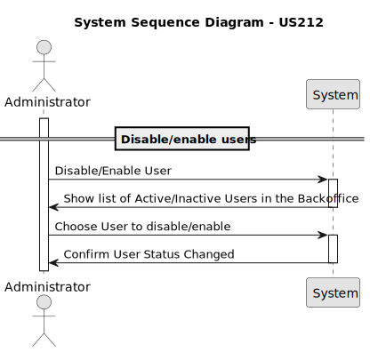
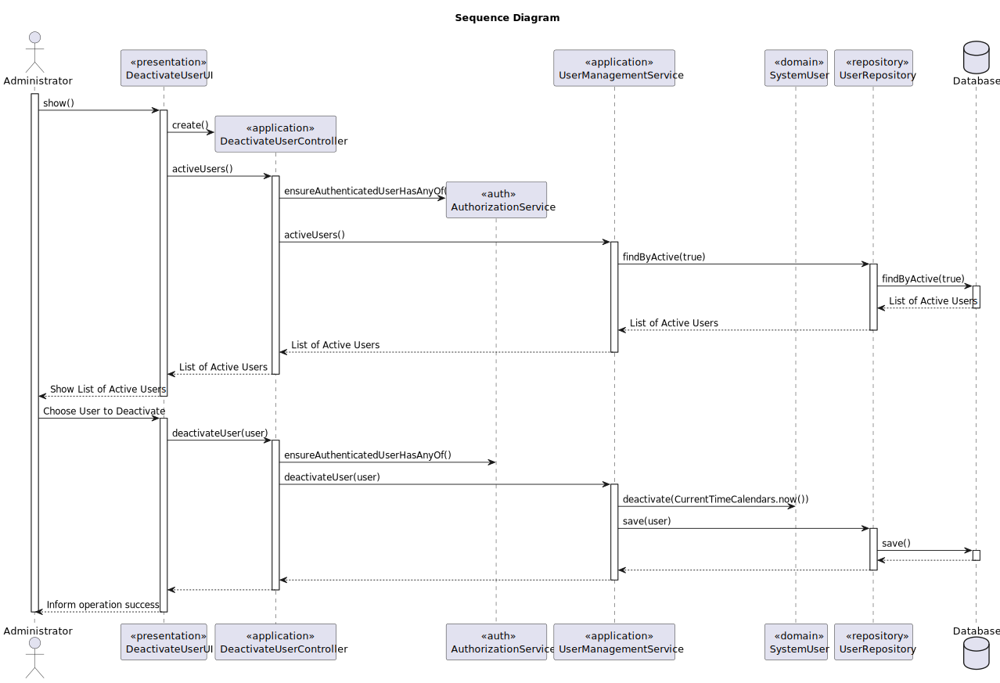
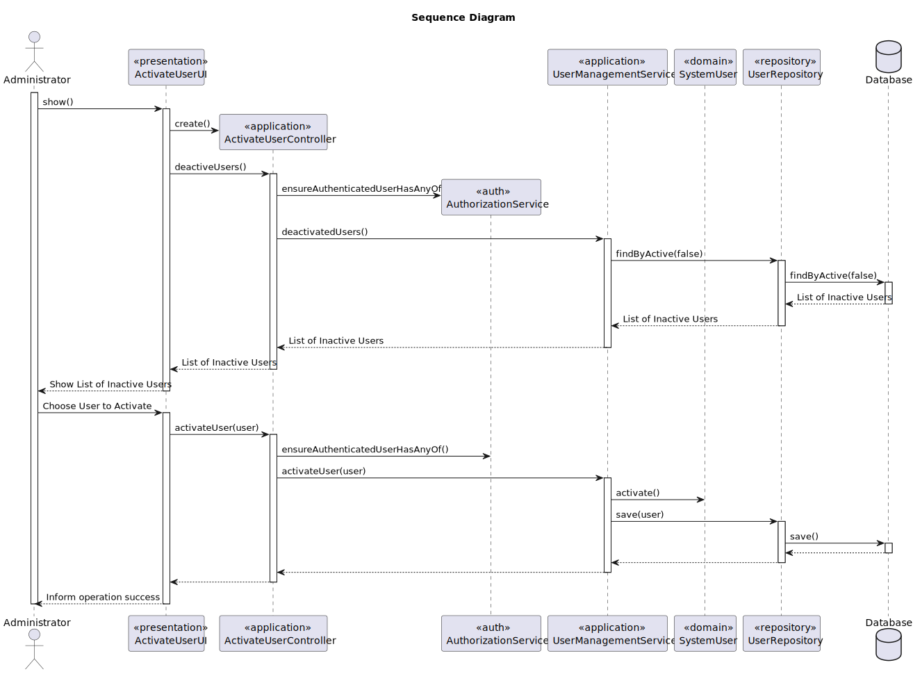
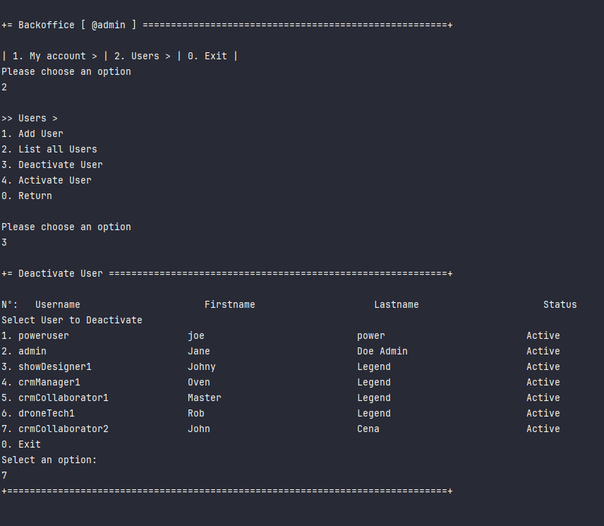
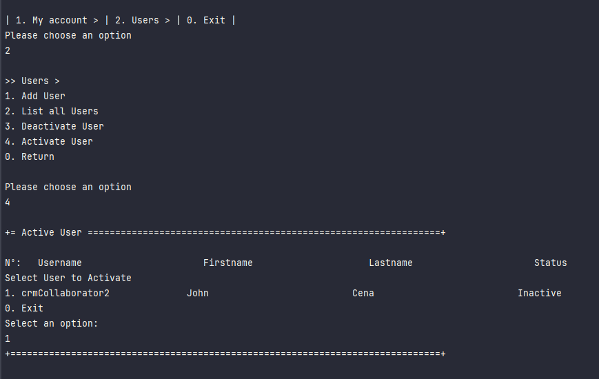

# US 212 - _Disable/enable users_

## 1. Context

* Administrators must be able to manage user access without deleting user accounts permanently. 
This includes the ability to temporarily disable a user (preventing them from logging in or accessing the system) 
and re-enable them when needed.

## 2. Requirements

**US212** - As Administrator, I want to be able to disable/enable users of the backoffice.


**Acceptance Criteria:**

- US212.1  When a user is disabled, they must be prevented from logging in or accessing any part of the system.

- US212.2  Disabled accounts must be clearly marked in the user list for easy identification.

- US212.3  Only authenticated administrators should have access to the enable/disable functionality.


**Dependencies/References:**

* This user story depends on US210 (Authentication and Authorization) and US211 (Register Users),
as it builds on the mechanisms for managing user access and identity.

**Forum Insight:**

* Still no questions related to this user story on forum.

## 3. Analysis




## 4. Design

### 4.1. Sequence Diagram

#### Deactivate User



#### Activate User




### 4.3. Applied Patterns

- Domain-Driven Design
- Factory


## 5. Implementation

**DeactivateUserAction**

```java
package eapli.base.app.backoffice.presentation.authz;

import eapli.framework.actions.Action;

public class DeactivateUserAction implements Action {

    @Override
    public boolean execute() {
        return new DeactivateUserUI().show();
    }
}
```


**ActivateUserAction**

```java
package eapli.base.app.backoffice.presentation.authz;

import eapli.framework.actions.Action;

public class ActivateUserAction implements Action {

    @Override
    public boolean execute() {
        return new ActivateUserUI().show();
    }
}

```

**DeactivateUserUI**

```java
public class DeactivateUserUI extends AbstractUI {
    private static final Logger LOGGER = LoggerFactory.getLogger(DeactivateUserUI.class);

    private final DeactivateUserController theController = new DeactivateUserController();

    @Override
    protected boolean doShow() {
        final Iterable<SystemUser> iterable = this.theController.activeUsers();
        if (!iterable.iterator().hasNext()) {
            System.out.println("There is no registered User");
        } else {
            System.out.printf("%-6s%-30s%-30s%-30s%-30s%n", "Nº:", "Username", "Firstname", "Lastname", "Status");
            final SelectWidget<SystemUser> selector = new SelectWidget<>("Select User to Deactivate", iterable, new SystemUserPrinter());
            selector.show();
            final SystemUser user = selector.selectedElement();
            if (user == null) {
                System.out.println("No user selected");
            } else {
                try {
                    this.theController.deactivateUser(user);
                } catch (IntegrityViolationException | ConcurrencyException ex) {
                    LOGGER.error("Error performing the operation", ex);
                    System.out.println(
                            "Unfortunatelly there was an unexpected error in the application. Please try again and if the problem persists, contact your system admnistrator.");
                }
            }
        }
        return true;
    }

    @Override
    public String headline() {
        return "Deactivate User";
    }
}
```


**ActivateUserUI**

```java
public class ActivateUserUI extends AbstractUI {

    private static final Logger LOGGER = LoggerFactory.getLogger(ActivateUserUI.class);

    private final ActivateUserController theController = new ActivateUserController();

    @Override
    protected boolean doShow() {
        final Iterable<SystemUser> iterable = this.theController.deactiveUsers();
        if (!iterable.iterator().hasNext()) {
            System.out.println("There is no registered User");
        } else {
            System.out.printf("%-6s%-30s%-30s%-30s%-30s%n", "Nº:", "Username", "Firstname", "Lastname", "Status");
            final SelectWidget<SystemUser> selector = new SelectWidget<>("Select User to Activate", iterable, new SystemUserPrinter());
            selector.show();
            final SystemUser user = selector.selectedElement();
            if (user == null) {
                System.out.println("No user selected");
            } else {
                try {
                    this.theController.activateUser(user);
                } catch (IntegrityViolationException | ConcurrencyException ex) {
                    LOGGER.error("Error performing the operation", ex);
                    System.out.println(
                            "Unfortunatelly there was an unexpected error in the application. Please try again and if the problem persists, contact your system admnistrator.");
                }
            }
        }
        return true;
    }

    @Override
    public String headline() {
        return "Active User";
    }

}
```

**DeactivateUserController**

```java
@UseCaseController
public class DeactivateUserController {

    private final AuthorizationService authz = AuthzRegistry.authorizationService();
    private final UserManagementService userSvc = AuthzRegistry.userService();

    public Iterable<SystemUser> activeUsers() {
        authz.ensureAuthenticatedUserHasAnyOf(Roles.POWER_USER, Roles.ADMIN);

        return userSvc.activeUsers();
    }

    public SystemUser deactivateUser(final SystemUser user) {
        authz.ensureAuthenticatedUserHasAnyOf(Roles.POWER_USER, Roles.ADMIN);
        return userSvc.deactivateUser(user);
    }
}
```

**ActivateUserController**

```java
@UseCaseController
public class ActivateUserController {
    private final AuthorizationService authz = AuthzRegistry.authorizationService();
    private final UserManagementService userSvc = AuthzRegistry.userService();

    public Iterable<SystemUser> deactiveUsers() {
        authz.ensureAuthenticatedUserHasAnyOf(Roles.POWER_USER, Roles.ADMIN);

        return userSvc.deactivatedUsers();
    }

    public SystemUser activateUser(final SystemUser user) {
        authz.ensureAuthenticatedUserHasAnyOf(Roles.POWER_USER, Roles.ADMIN);
        return userSvc.activateUser(user);
    }
}

```

**UserManagementService**

```java
@Component
public class UserManagementService {
    private final UserRepository userRepository;
    private final PasswordEncoder encoder;
    private final PasswordPolicy policy;

    @Autowired
    public UserManagementService(final UserRepository userRepo, final PasswordPolicy policy, final PasswordEncoder encoder) {
        this.userRepository = userRepo;
        this.policy = policy;
        this.encoder = encoder;
    }

    @Transactional
    public SystemUser registerNewUser(final String email, final String rawPassword, final String firstName, final String lastName, final Set<Role> roles, final Calendar createdOn) {
        SystemUserBuilder userBuilder = new SystemUserBuilder(this.policy, this.encoder);
        userBuilder.withEmailAsUsername(email).withPassword(rawPassword).withName(firstName, lastName).createdOn(createdOn).withRoles(roles);
        SystemUser newUser = userBuilder.build();
        return (SystemUser)this.userRepository.save(newUser);
    }

    @Transactional
    public SystemUser registerNewUser(final String username, final String rawPassword, final String firstName, final String lastName, final String email, final Set<Role> roles, final Calendar createdOn) {
        SystemUserBuilder userBuilder = new SystemUserBuilder(this.policy, this.encoder);
        userBuilder.with(username, rawPassword, firstName, lastName, email).createdOn(createdOn).withRoles(roles);
        SystemUser newUser = userBuilder.build();
        return (SystemUser)this.userRepository.save(newUser);
    }

    @Transactional
    public SystemUser registerNewUser(final String username, final String rawPassword, final String firstName, final String lastName, final String email, final Set<Role> roles) {
        return this.registerNewUser(username, rawPassword, firstName, lastName, email, roles, CurrentTimeCalendars.now());
    }

    @Transactional
    public SystemUser registerUser(final Username username, final Password password, final Name name, final EmailAddress email, final Set<Role> roles) {
        SystemUserBuilder userBuilder = new SystemUserBuilder(this.policy, this.encoder);
        userBuilder.with(username, password, name, email).withRoles(roles);
        SystemUser newUser = userBuilder.build();
        return (SystemUser)this.userRepository.save(newUser);
    }

    @Transactional
    public SystemUser registerUser(final EmailAddress email, final Password password, final Name name, final Set<Role> roles) {
        SystemUserBuilder userBuilder = new SystemUserBuilder(this.policy, this.encoder);
        userBuilder.withEmailAsUsername(email).withPassword(password).withName(name).withRoles(roles);
        SystemUser newUser = userBuilder.build();
        return (SystemUser)this.userRepository.save(newUser);
    }

    public Iterable<SystemUser> activeUsers() {
        return this.userRepository.findByActive(true);
    }

    public Iterable<SystemUser> deactivatedUsers() {
        return this.userRepository.findByActive(false);
    }

    public Iterable<SystemUser> allUsers() {
        return this.userRepository.findAll();
    }

    public Optional<SystemUser> userOfIdentity(final Username id) {
        return this.userRepository.ofIdentity(id);
    }

    @Transactional
    public SystemUser deactivateUser(final SystemUser user) {
        user.deactivate(CurrentTimeCalendars.now());
        return (SystemUser)this.userRepository.save(user);
    }

    @Transactional
    public SystemUser activateUser(final SystemUser user) {
        user.activate();
        return (SystemUser)this.userRepository.save(user);
    }
}
```

**SystemUser**

```java
@Entity
@Table(
    name = "T_SYSTEMUSER"
)
public class SystemUser implements AggregateRoot<Username>, DTOable<GeneralDTO>, Visitable<GeneralDTO>, Serializable {
    private static final long serialVersionUID = 1L;
    @Version
    private Long version;
    @EmbeddedId
    private Username username;
    private Password password;
    private Name name;
    @Column(
        unique = true
    )
    private EmailAddress email;
    @OneToOne(
        cascade = {CascadeType.ALL},
        optional = false,
        fetch = FetchType.EAGER
    )
    private RoleSet roles;
    @Temporal(TemporalType.DATE)
    private Calendar createdOn;
    private boolean active;
    @Temporal(TemporalType.DATE)
    private Calendar deactivatedOn;
    private String resetToken;

    SystemUser(final Username username, final Password password, final Name name, final EmailAddress email, final RoleSet roles, final Calendar createdOn) {
        Preconditions.noneNull(new Object[]{roles, username, password, name, email});
        this.createdOn = createdOn == null ? CurrentTimeCalendars.now() : createdOn;
        this.username = username;
        this.password = password;
        this.name = name;
        this.email = email;
        this.roles = roles;
        this.active = true;
        this.invalidateResetToken();
    }

    protected SystemUser() {
    }

    public boolean sameAs(final Object other) {
        if (!(other instanceof SystemUser that)) {
            return false;
        } else if (this == that) {
            return true;
        } else if (this.username.equals(that.username) && this.password.equals(that.password) && this.name.equals(that.name) && this.email.equals(that.email) && !this.roles.equals(that.roles)) {
            return this.resetToken == null ? that.resetToken == null : this.resetToken.equals(that.resetToken);
        } else {
            return false;
        }
    }

    public Username identity() {
        return this.username;
    }

    public EmailAddress email() {
        return this.email;
    }

    public void assignToRole(final RoleAssignment role) {
        this.roles.add(role);
    }

    public void assignToRole(final Role role) {
        Preconditions.nonNull(role);
        this.roles.add(new RoleAssignment(role));
    }

    public boolean unassignRole(final Role role) {
        Preconditions.nonNull(role);
        return (Boolean)this.roles.getAssignment(role).map(RoleAssignment::unassign).orElse(false);
    }

    public Collection<Role> roleTypes() {
        return this.roles.roleTypes();
    }

    public GeneralDTO toDTO() {
        GeneralDTO ret = new GeneralDTO("user");
        ret.put("username", this.username.toString());
        ret.put("name", this.name.toString());
        ret.put("email", this.email.toString());
        ret.put("roles", this.roles.roleTypes().toString());
        return ret;
    }

    public boolean passwordMatches(final String rawPassword, final PasswordEncoder encoder) {
        return encoder.matches(rawPassword, this.password.value());
    }

    String encodedPassword() {
        return this.password.value();
    }

    public void accept(final Visitor<GeneralDTO> visitor) {
        visitor.visit(this.toDTO());
    }

    public Username username() {
        return this.username;
    }

    public Name name() {
        return this.name;
    }

    public boolean isActive() {
        return this.active;
    }

    public void deactivate(final Calendar deactivatedOn) {
        if (deactivatedOn != null && !deactivatedOn.before(this.createdOn)) {
            if (!this.active) {
                throw new IllegalStateException("Cannot deactivate an inactive user");
            } else {
                this.active = false;
                this.deactivatedOn = deactivatedOn;
                this.invalidateResetToken();
            }
        } else {
            throw new IllegalArgumentException();
        }
    }

    public void activate() {
        if (!this.isActive()) {
            this.active = true;
            this.deactivatedOn = null;
            this.invalidateResetToken();
        }
    }

    public int hashCode() {
        return DomainEntities.hashCode(this);
    }

    public boolean equals(final Object other) {
        return DomainEntities.areEqual(this, other);
    }

    public void changePassword(final Password newPassword) {
        this.password = newPassword;
        this.invalidateResetToken();
    }

    private void invalidateResetToken() {
        this.resetToken = null;
    }

    public String resetPassword() {
        this.resetToken = (new UUIDGenerator()).newId().toString();
        return this.resetToken;
    }

    public boolean confirmResetPassword(final String token, final Password newPass) {
        Invariants.nonNull(this.resetToken);
        Preconditions.nonEmpty(token);
        Preconditions.nonNull(newPass);
        this.invalidateResetToken();
        if (token.equals(this.resetToken)) {
            this.password = newPass;
            return true;
        } else {
            return false;
        }
    }

    public boolean hasAny(final Role... roles) {
        Role[] var2 = roles;
        int var3 = roles.length;

        for(int var4 = 0; var4 < var3; ++var4) {
            Role r = var2[var4];
            if (this.roles.hasAssignment(r)) {
                return true;
            }
        }

        return false;
    }

    public boolean hasAll(final Role... roles) {
        Role[] var2 = roles;
        int var3 = roles.length;

        for(int var4 = 0; var4 < var3; ++var4) {
            Role r = var2[var4];
            if (!this.roles.hasAssignment(r)) {
                return false;
            }
        }

        return true;
    }

    public Calendar createdOn() {
        return (Calendar)this.createdOn.clone();
    }
}
```


## 6. Integration/Demonstration

**Deactivate User process**



**Activate User process**



