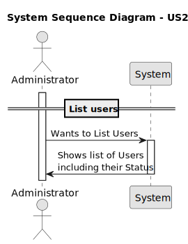
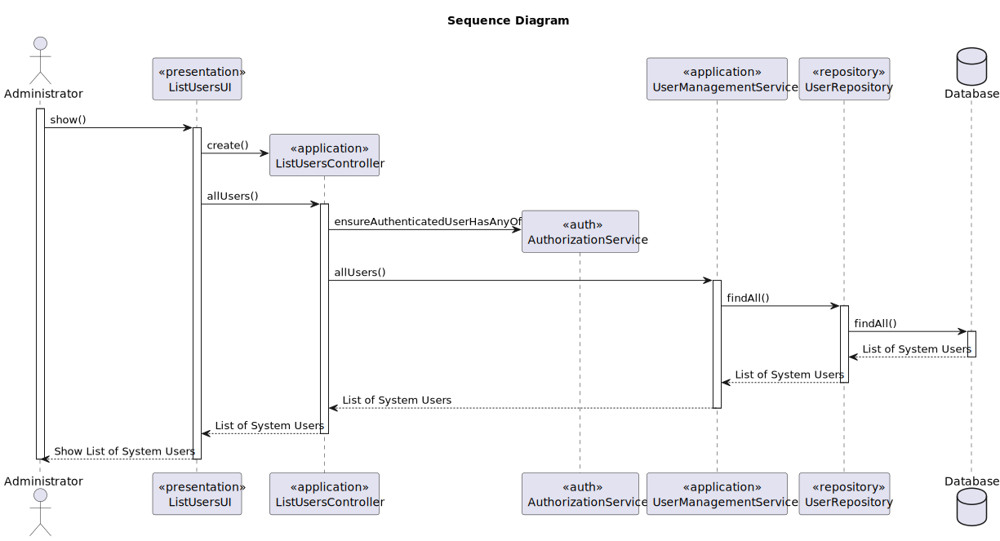
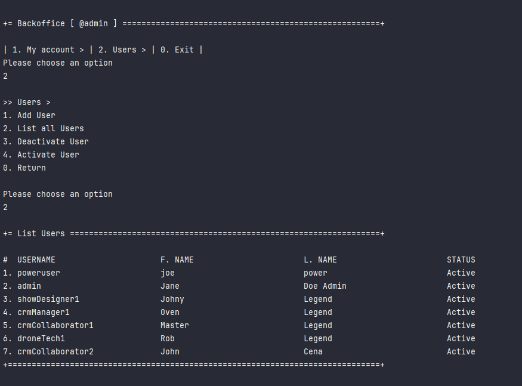

# US 213 - List users

## 1. Context

* In order to manage user access effectively, administrators must be able to view a complete list of all users registered in the backoffice.
This list should include key information such as usernames, email addresses, assigned roles, and account status (enabled or disabled).


## 2. Requirements

**US213** - As Administrator, I want to be able to list the users of the backoffice, including their status.


**Acceptance Criteria:**

- US213.1  The list must include key user information: name, email, role, and account status (enabled/disabled).


**Dependencies/References:**

* This user story depends on US210 (Authentication and Authorization), US211 (Register Users),
as it requires access to user data.


**Forum Insight:**

* Still no questions related to this user story on forum.

## 3. Analysis



## 4. Design

### 4.1. Sequence Diagram



### 4.3. Applied Patterns

- Domain-Driven Design
- Factory


## 5. Implementation

**ListUsersAction**

```java
public class ListUsersAction implements Action {

    @Override
    public boolean execute() {
        return new ListUsersUI().show();
    }
}
```


**ListUsersUI**

```java
public class ListUsersUI extends AbstractListUI<SystemUser> {
    private ListUsersController theController = new ListUsersController();

    @Override
    public String headline() {
        return "List Users";
    }

    @Override
    protected String emptyMessage() {
        return "No data.";
    }

    @Override
    protected Iterable<SystemUser> elements() {
        return theController.allUsers();
    }

    @Override
    protected Visitor<SystemUser> elementPrinter() {
        return new SystemUserPrinter();
    }

    @Override
    protected String elementName() {
        return "User";
    }

    @Override
    protected String listHeader() {
        return String.format("#  %-30s%-30s%-30s%-30s", "USERNAME", "F. NAME", "L. NAME", "STATUS");
    }
}
```

**ListUsersController**

```java
@UseCaseController
public class ListUsersController{

    private final AuthorizationService authz = AuthzRegistry.authorizationService();
    private final UserManagementService userSvc = AuthzRegistry.userService();

    public Iterable<SystemUser> allUsers() {
        authz.ensureAuthenticatedUserHasAnyOf(Roles.POWER_USER, Roles.ADMIN);

        return userSvc.allUsers();
    }

    public Optional<SystemUser> find(final Username u) {
        return userSvc.userOfIdentity(u);
    }
}

```

**UserManagementService**

```java
@Component
public class UserManagementService {
    private final UserRepository userRepository;
    private final PasswordEncoder encoder;
    private final PasswordPolicy policy;

    @Autowired
    public UserManagementService(final UserRepository userRepo, final PasswordPolicy policy, final PasswordEncoder encoder) {
        this.userRepository = userRepo;
        this.policy = policy;
        this.encoder = encoder;
    }

    @Transactional
    public SystemUser registerNewUser(final String email, final String rawPassword, final String firstName, final String lastName, final Set<Role> roles, final Calendar createdOn) {
        SystemUserBuilder userBuilder = new SystemUserBuilder(this.policy, this.encoder);
        userBuilder.withEmailAsUsername(email).withPassword(rawPassword).withName(firstName, lastName).createdOn(createdOn).withRoles(roles);
        SystemUser newUser = userBuilder.build();
        return (SystemUser)this.userRepository.save(newUser);
    }

    @Transactional
    public SystemUser registerNewUser(final String username, final String rawPassword, final String firstName, final String lastName, final String email, final Set<Role> roles, final Calendar createdOn) {
        SystemUserBuilder userBuilder = new SystemUserBuilder(this.policy, this.encoder);
        userBuilder.with(username, rawPassword, firstName, lastName, email).createdOn(createdOn).withRoles(roles);
        SystemUser newUser = userBuilder.build();
        return (SystemUser)this.userRepository.save(newUser);
    }

    @Transactional
    public SystemUser registerNewUser(final String username, final String rawPassword, final String firstName, final String lastName, final String email, final Set<Role> roles) {
        return this.registerNewUser(username, rawPassword, firstName, lastName, email, roles, CurrentTimeCalendars.now());
    }

    @Transactional
    public SystemUser registerUser(final Username username, final Password password, final Name name, final EmailAddress email, final Set<Role> roles) {
        SystemUserBuilder userBuilder = new SystemUserBuilder(this.policy, this.encoder);
        userBuilder.with(username, password, name, email).withRoles(roles);
        SystemUser newUser = userBuilder.build();
        return (SystemUser)this.userRepository.save(newUser);
    }

    @Transactional
    public SystemUser registerUser(final EmailAddress email, final Password password, final Name name, final Set<Role> roles) {
        SystemUserBuilder userBuilder = new SystemUserBuilder(this.policy, this.encoder);
        userBuilder.withEmailAsUsername(email).withPassword(password).withName(name).withRoles(roles);
        SystemUser newUser = userBuilder.build();
        return (SystemUser)this.userRepository.save(newUser);
    }

    public Iterable<SystemUser> activeUsers() {
        return this.userRepository.findByActive(true);
    }

    public Iterable<SystemUser> deactivatedUsers() {
        return this.userRepository.findByActive(false);
    }

    public Iterable<SystemUser> allUsers() {
        return this.userRepository.findAll();
    }

    public Optional<SystemUser> userOfIdentity(final Username id) {
        return this.userRepository.ofIdentity(id);
    }

    @Transactional
    public SystemUser deactivateUser(final SystemUser user) {
        user.deactivate(CurrentTimeCalendars.now());
        return (SystemUser)this.userRepository.save(user);
    }

    @Transactional
    public SystemUser activateUser(final SystemUser user) {
        user.activate();
        return (SystemUser)this.userRepository.save(user);
    }
}
```


## 6. Integration/Demonstration

**List Users process**



