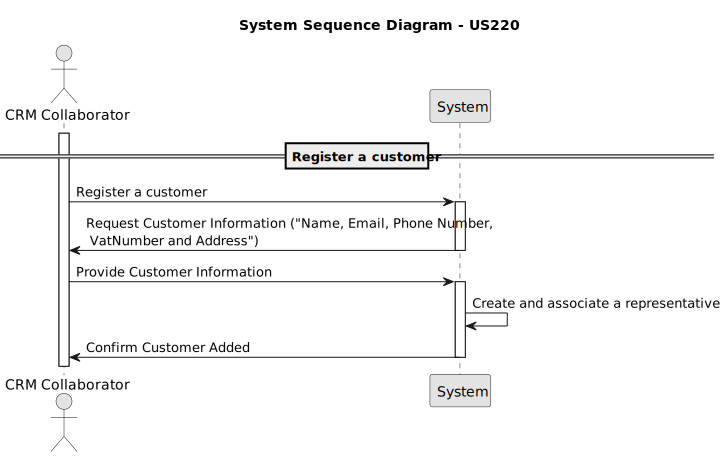
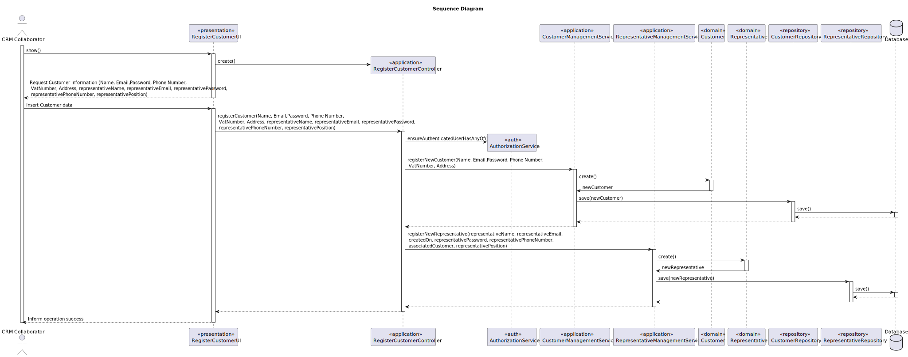

# US 220

## 1. Context

*As a CRM Collaborator, I want to register a customer, and that the system automatically creates a costumer representative for that customer.*

### 1.1 List of issues

Analysis: done

Design:

Implement:

Test:


## 2. Requirements

**US G220** As CRM, I Want to register a customer.

**Acceptance Criteria:**

- US220.1 This must also be achieved by a bootstrap process. The costumer representative will also be a user of the system (Costumer App).

**Dependencies/References:**

*There is a dependency with US210, since the costumer app must have an authentication system for each customer.*


**Forum Insight:**

* Still no questions related to this user story on forum.
* 
## 3. Analysis



## 4. Design

### 4.1. Sequence Diagram


### 4.3. Applied Patterns

- Domain-Driven Design
- Builder
- Factory

### 4.4. Acceptance Tests

Include here the main tests used to validate the functionality. Focus on how they relate to the acceptance criteria. May be automated or manual tests.

**Test 1:** *Verifies that it is not possible to ...*

**Refers to Acceptance Criteria:** US101.1


```
@Test(expected = IllegalArgumentException.class)
public void ensureXxxxYyyy() {
...
}
````

## 5. Implementation

*In this section the team should present, if necessary, some evidencies that the implementation is according to the design. It should also describe and explain other important artifacts necessary to fully understand the implementation like, for instance, configuration files.*

*It is also a best practice to include a listing (with a brief summary) of the major commits regarding this requirement.*

## 6. Integration/Demonstration

*In this section the team should describe the efforts realized in order to integrate this functionality with the other parts/components of the system*

*It is also important to explain any scripts or instructions required to execute an demonstrate this functionality*

## 7. Observations

*This section should be used to include any content that does not fit any of the previous sections.*

*The team should present here, for instance, a critical prespective on the developed work including the analysis of alternative solutioons or related works*

*The team should include in this section statements/references regarding third party works that were used in the development this work.*
