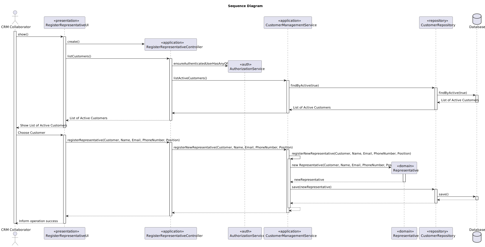

# US 221

## 1. Context

*As a CRM Collaborator, I want to register a new representative of a customer.*


## 2. Requirements

**US G221** As a CRM Collaborator, I want to register a new representative of a customer.

**Acceptance Criteria:**

- US221.1 The customer representative will also be a user of the system (Costumer App).

- US221.2. There is no need to verify that customer representative’s email in the customer’s domain.

**Dependencies/References:**

*There is a dependency with US220, since the costumer must exist to be possible to assign a new representative.*

**Forum Insight:**

* Still no questions related to this user story on forum.

## 3. Analysis


## 4. Design

### 4.1. Sequence Diagram



### 4.3. Applied Patterns

- Domain-Driven Design
- Factory

### 4.4. Acceptance Tests

Include here the main tests used to validate the functionality. Focus on how they relate to the acceptance criteria. May be automated or manual tests.

**Test 1:** *Verifies that it is not possible to ...*

**Refers to Acceptance Criteria:** US101.1


```
@Test(expected = IllegalArgumentException.class)
public void ensureXxxxYyyy() {
...
}
````

## 5. Implementation


**RegisterRepresentativeAction**

```java
package eapli.base.app.backoffice.presentation.representativeManagement;

import eapli.framework.actions.Action;

public class RegisterRepresentativeAction implements Action {

    @Override
    public boolean execute() {
        return new RegisterRepresentativeUI().show();
    }
}


```
**RegisterRepresentativeUI**
```java
public class RegisterRepresentativeUI extends AbstractUI {

    private final RegisterRepresentativeController theController = new RegisterRepresentativeController();

    private Customer selectedCustomer;

    @Override
    public boolean doShow() {

        if (selectedCustomer == null) {
            selectCustomer();
        }
        String name = null,email = null,password = null,phone = null,position = null;

        while (true) {
            try {
                name = Console.readLine("Representative Name: ");
                if (name.trim().isEmpty()) {
                    throw new IllegalArgumentException("Name cannot be empty.");
                }
                break;
            } catch (IllegalArgumentException e) {
                System.out.println("Error: " + e.getMessage());
            }
        }

        while (true) {
            try {
                email = Console.readLine("Representative Email: ");
                if (theController.isEmailUsed(email)) {
                    throw new IllegalArgumentException("Email is already used by another representative.");
                }
                break;
            } catch (IllegalArgumentException e) {
                System.out.println("Error: " + e.getMessage());
            }
        }

        while (true) {
            try {
                password = Console.readLine("Representative Password: ");
                if (password.length() < 6) {
                    throw new IllegalArgumentException("Password must be at least 6 characters long.");
                }
                break;
            } catch (IllegalArgumentException e) {
                System.out.println("Error: " + e.getMessage());
            }
        }
        while (true) {
            try {
                phone = Console.readLine("Representative Phone Number: ");
                if (theController.isPhoneNumberUsed(phone)) {
                    throw new IllegalArgumentException("Phone number is already used by another representative.");
                }
                break;
            } catch (IllegalArgumentException e) {
                System.out.println("Error: " + e.getMessage());
            }
        }

        while (true) {
            try {
                position = Console.readLine("Representative Position: ");
                if (position.trim().isEmpty()) {
                    throw new IllegalArgumentException("Position cannot be empty.");
                }
                break;
            } catch (IllegalArgumentException e) {
                System.out.println("Error: " + e.getMessage());
            }
        }
        try{
            this.theController.registerRepresentative(name, email, password, phone, selectedCustomer, position);
        } catch (IllegalArgumentException e){
            System.out.println("\nERROR: " + e.getMessage() + "\n");
        }
        return true;
    }

    @Override
    public String headline() {
        return "Register Representative";
    }

    private void selectCustomer() {
        System.out.println("Select a Customer:");
        Iterable<Customer> customers = theController.allCustomers();
        int index = 1;
        for (Customer customer : customers) {
            System.out.printf("%d - %s%n", index++, customer.customerName());
        }

        int choice = Console.readInteger("Select a customer: ");
        index = 1;
        for (Customer customer : customers) {
            if (index == choice) {
                selectedCustomer = customer;
                break;
            }
            index++;
        }
    }
}

```

**RegisterCustomerController**
```java
public class RegisterCustomerController {
    private final AuthorizationService authz = AuthzRegistry.authorizationService();

    private final CustomerRepository repo = PersistenceContext.repositories().customers();
    private final RepresentativeRepository repo2 = PersistenceContext.repositories().representatives();

    private final CustomerManagementService customersvc = new CustomerManagementService(repo);
    private final RepresentativeManagementService representativesvc = new RepresentativeManagementService(repo2, repo);

    public Customer registerCustomer(final String customerName, final String customerAddress, final String customerEmail, final String password, final String customerPhoneNumber, final String customerVatNumber, final String representativeName, final String representativeEmail, final String representativePassword,  final String representativePhoneNumber,final String representativePosition) {
        authz.ensureAuthenticatedUserHasAnyOf(Roles.CRM_COLLABORATOR);
        Customer newCustomer = customersvc.registerNewCustomer(customerName, customerAddress, customerEmail, password, customerPhoneNumber, customerVatNumber, authz.session().get().authenticatedUser());
        representativesvc.registerNewRepresentative(representativeName, representativeEmail, representativePassword, representativePhoneNumber, newCustomer, representativePosition, authz.session().get().authenticatedUser());
        return newCustomer;
    }
}


```

**RepresentativeManagementService**
```Java
public class RepresentativeManagementService {

    private final RepresentativeRepository representativeRepository;
    private final CustomerRepository customerRepository;

    public RepresentativeManagementService(final RepresentativeRepository representativeRepository, final CustomerRepository customerRepository) {
        this.representativeRepository = representativeRepository;
        this.customerRepository = customerRepository;
    }

    public void registerNewRepresentative(final String representativeName, final String representativeEmail, final Calendar createdOn, final String representativePassword, final String representativePhoneNumber, final Customer associatedCustomer, final String representativePosition, final SystemUser createdBy){
        if(representativeName == null || representativeName.isEmpty()){
            throw new IllegalArgumentException("Representative Name cannot be null or empty!");
        }
        if(representativeEmail == null || representativeEmail.isEmpty() || isEmailUsed(representativeEmail)){
            throw new IllegalArgumentException("Representative Email is already in use. (Also it cannot be null or empty!)");
        }
        if(representativePassword == null || representativePassword.isEmpty()){
            throw new IllegalArgumentException("Representative Password cannot be null or empty!");
        }
        if(representativePhoneNumber == null || representativePhoneNumber.isEmpty()){
            throw new IllegalArgumentException("Representative Phone Number cannot be null or empty!");
        }
        if(associatedCustomer == null){
            throw new IllegalArgumentException("Associated Customer cannot be null!");
        }
        if(representativePosition == null || representativePosition.isEmpty()){
            throw new IllegalArgumentException("Representative Position cannot be null or empty!");
        }
        if(createdBy == null){
            throw new IllegalArgumentException("Created By cannot be null!");
        }

        Representative newRepresentative = new Representative(representativeName, representativeEmail, createdOn, representativePassword, representativePhoneNumber, associatedCustomer, representativePosition, createdBy);
        associatedCustomer.addRepresentative(newRepresentative);
        this.customerRepository.save(associatedCustomer);
    }

    public void registerNewRepresentative(final String representativeName, final String representativeEmail,final String representativePassword, final String representativePhoneNumber, final Customer associatedCustomer, final String representativePosition, final SystemUser createdBy){
        registerNewRepresentative(representativeName, representativeEmail, CurrentTimeCalendars.now(), representativePassword, representativePhoneNumber, associatedCustomer, representativePosition, createdBy);
    }

    public void editRepresentative(final Representative representative, final String newName, final String newEmail, final String newPassword, final String newPhoneNumber, final String newPosition){
        boolean edited = false;
        if(newName == null || newName.isEmpty()){
            throw new IllegalArgumentException("Representative Name cannot be null or empty!");
        }else if(!newName.equals("N")){
            edited = true;
            representative.changeName(newName);
        }
        if(newEmail == null || newEmail.isEmpty() || isEmailUsed(newEmail) || isEmailUsed(newEmail)){
            throw new IllegalArgumentException("Representative Email is already in use. (Also it cannot be null or empty!)");
        }else if(!newEmail.equals("N")){
            edited = true;
            representative.changeEmail(newEmail);
        }
        if(newPassword == null || newPassword.isEmpty()){
            throw new IllegalArgumentException("Representative Password cannot be null or empty!");
        }else if(!newPassword.equals("N")){
            edited = true;
            representative.changePassword(newPassword);
        }
        if(newPhoneNumber == null || newPhoneNumber.isEmpty()){
            throw new IllegalArgumentException("Representative Phone Number cannot be null or empty!");
        }else if(!newPhoneNumber.equals("N")){
            edited = true;
            representative.changePhoneNumber(newPhoneNumber);
        }
        if(newPosition == null || newPosition.isEmpty()){
            throw new IllegalArgumentException("Representative Position cannot be null or empty!");
        }else if(!newPosition.equals("N")){
            edited = true;
            representative.changePosition(newPosition);
        }

        if (edited) {
            representative.changeChangedOn();
            this.representativeRepository.save(representative);
        }
    }

    public boolean isEmailUsed(String representativeEmail) {
        return this.representativeRepository.isEmailUsed(representativeEmail);
    }

    public boolean isPhoneNumberUsed(String representativePhoneNumber) {
        return this.representativeRepository.isPhoneNumberUsed(representativePhoneNumber);
    }

    public Optional<Representative> findById(final Long id){
        return this.representativeRepository.findById(id);
    }
    public Iterable<Representative> findByActive(final boolean active){
        return this.representativeRepository.findByActive(active);
    }
    public Iterable<Representative> findAll(){
        return this.representativeRepository.findAll();
    }
    public Iterable<Representative> findByAssociatedCustomer(final Customer associatedCustomer){
        return this.representativeRepository.findByAssociatedCustomer(associatedCustomer);
    }

    public Representative deactivateCustomerRepresentative(final Representative representative) {
        representative.deactivate(CurrentTimeCalendars.now());
        return (Representative) this.representativeRepository.save(representative);
    }
    public Representative activateRepresentative(final Representative representative) {
        representative.activate();
        return (Representative) this.representativeRepository.save(representative);
    }
}

```

**Representative**

```Java
public class Representative implements AggregateRoot<Long> {

    @Id
    @GeneratedValue(strategy = GenerationType.AUTO)
    private Long representativeId;
    @Column
    private String representativeName;
    @Column
    private String representativeEmail;
    @Column
    private String representativePassword;
    @Column
    private String representativePhoneNumber;

    @ManyToOne
    private Customer associatedCustomer;
    @Column
    private String representativePosition;

    private boolean active;
    @Temporal(TemporalType.DATE)
    private Calendar deactivatedOn;

    @Temporal(TemporalType.DATE)
    private Calendar createdOn;

    @Temporal(TemporalType.DATE)
    private Calendar changedOn;
    @ManyToOne
    private SystemUser createdBy;

    protected Representative() {
    }

    public Representative(final String representativeName, final String representativeEmail, final Calendar createdOn, final String representativePassword, final String representativePhoneNumber, final Customer associatedCustomer, final String representativePosition, final SystemUser createdBy) {
        this.representativeName = representativeName;
        this.representativeEmail = representativeEmail;
        this.representativePassword = representativePassword;
        this.representativePhoneNumber = representativePhoneNumber;
        this.associatedCustomer = associatedCustomer;
        this.representativePosition = representativePosition;
        this.createdBy = createdBy;
        this.createdOn = createdOn == null ? CurrentTimeCalendars.now() : createdOn;
        this.changedOn = createdOn == null ? CurrentTimeCalendars.now() : createdOn;
        this.active = true;
    }

    public String representativeName() {
        return this.representativeName;
    }
    public String representativeEmail() {
        return this.representativeEmail;
    }
    public String representativePassword() {
        return this.representativePassword;
    }
    public String representativePhoneNumber() {
        return this.representativePhoneNumber;
    }
    public Customer associatedCustomer() {
        return this.associatedCustomer;
    }
    public String representativePosition() {
        return this.representativePosition;
    }
    public SystemUser createdBy() {
        return this.createdBy;
    }
    public Calendar createdOn() {
        return this.createdOn;
    }
    public Calendar changedOn() {return this.changedOn;}
    public boolean isActive() {
        return this.active;
    }
    public Calendar deactivatedOn(){
        return this.deactivatedOn;
    }
    public void deactivate(final Calendar deactivatedOn) {
        if (deactivatedOn != null && !deactivatedOn.before(this.createdOn)) {
            if (!this.active) {
                throw new IllegalStateException("Cannot deactivate an inactive Drone Model!");
            } else {
                this.active = false;
                this.deactivatedOn = deactivatedOn;
            }
        } else {
            throw new IllegalArgumentException();
        }
    }

    public void changeName(final String representativeName) {
        this.representativeName = representativeName;
    }
    public void changeEmail(final String representativeEmail) {
        this.representativeEmail = representativeEmail;
    }
    public void changePassword(final String representativePassword) {
        this.representativePassword = representativePassword;
    }
    public void changePhoneNumber(final String representativePhoneNumber) {
        this.representativePhoneNumber = representativePhoneNumber;
    }
    public void changePosition(final String representativePosition) {
        this.representativePosition = representativePosition;
    }
    public void changeChangedOn() {
        this.changedOn = Calendar.getInstance();
    }

    public void activate() {
        if (!this.isActive()) {
            this.active = true;
            this.deactivatedOn = null;
        }
    }
    @Override
    public boolean sameAs(final Object other) {
        if (this == other) return true;
        if (!(other instanceof Representative)) return false;
        Representative that = (Representative) other;
        return representativeId != null && representativeId.equals(that.representativeId);
    }
    @Override
    public String toString() {
        return "Representative{" +
                "representativeName='" + representativeName + '\'' +
                ", representativeEmail='" + representativeEmail + '\'' +
                ", representativePassword='" + representativePassword + '\'' +
                ", representativePhoneNumber='" + representativePhoneNumber + '\'' +
                ", associatedCustomer=" + associatedCustomer +
                ", representativePosition='" + representativePosition + '\'' +
                ", active=" + active +
                '}';
    }
    @Override
    public Long identity() {
        return this.representativeId;
    }
}
```
## 6. Integration/Demonstration

**Customer Selection**


**Registering Representative**


