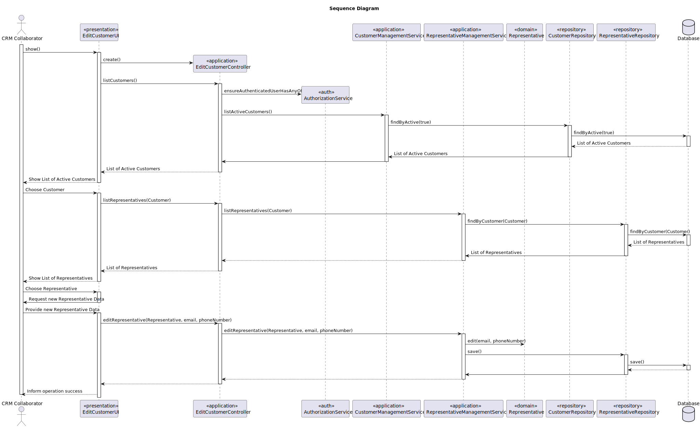

# US 223

## 1. Context

*As a CRM Collaborator, I want to edit the information (email and phone number) of a customer representative.*

## 2. Requirements

**US 223** As a CRM Collaborator, I want to edit the information (email and phone number) of a customer representative.

**Acceptance Criteria:**

- US223.1 There are no acceptance criteria defined for this user story.

**Dependencies/References:**

*There is a dependency with US220, since the costumer must exist so it's information can be edited.*

**Forum Insight:**

* Still no questions related to this user story on forum.

# 3. Analysis


## 4. Design

### 4.1. Sequence Diagram


### 4.3. Applied Patterns

- Information Expert
- Controller
- Low Coupling
- High Cohesion
- Polymorphism
- Pure Fabrication
- Indirection
- Protected Variations

### 4.4. Acceptance Tests

**Test 1:** *Verifies that the representative information is updated*

```
    @Test
    void changeMethods_shouldUpdateFieldsCorrectly() {
        Representative rep = new Representative(
                "Felipe",
                "felipe@email.com",
                now,
                "pass123",
                "963456789",
                customer,
                "Analyst",
                user
        );

        rep.changeName("Felipe Santos");
        rep.changeEmail("felipe.santos@email.com");
        rep.changePassword("newpass123");
        rep.changePhoneNumber("964444444");
        rep.changePosition("Senior Analyst");

        assertEquals("Felipe Santos", rep.representativeName());
        assertEquals("felipe.santos@email.com", rep.representativeEmail());
        assertEquals("newpass123", rep.representativePassword());
        assertEquals("964444444", rep.representativePhoneNumber());
        assertEquals("Senior Analyst", rep.representativePosition());
    }
````
**Test 2:** *Verifies that the changedOn field is updated when the representative information is changed*

```
@Test
void changeChangedOn_shouldUpdateChangedOnField() throws InterruptedException {
Representative rep = new Representative(
"Helena",
"helena@email.com",
now,
"mypassword",
"967777777",
customer,
"Manager",
user
);

        Calendar originalChangedOn = rep.createdOn();

        Thread.sleep(10);

        rep.changeChangedOn();

        Calendar updatedChangedOn = rep.changedOn();

        assertNotNull(updatedChangedOn);
        assertTrue(updatedChangedOn.after(originalChangedOn),
                "Expected changedOn to be after the original value");
    }
````
## 5. Implementation


**EditRepresentativesAction**

```java
public class EditRepresentativeAction implements Action {
    @Override
    public boolean execute() {
        return new EditRepresentativeUI().show();
    }
}

```
**EditRepresentativeUI**
```java
public class EditRepresentativeUI extends AbstractListUI<Representative> {
    private final EditRepresentativeController theController = new EditRepresentativeController();
    private Customer selectedCustomer;
    @Override
    public String headline() {
        return "Edit Representative";
    }

    @Override
    protected Iterable<Representative> elements() {
        if (selectedCustomer == null) {
            selectCustomer();
        }
        return theController.allRepresentatives(selectedCustomer);
    }

    @Override
    protected String elementName() {
        return "Representative";
    }

    @Override
    protected String listHeader() {
        return String.format("#  %-30s%-30s%-30s%-30s%-30s", "REPRESENTATIVE NAME", "REPRESENTATIVE EMAIL", "REPRESENTATIVE PASSWORD", "REPRESENTATIVE PHONE NUMBER", "REPRESENTATIVE POSITION");
    }

    @Override
    protected String emptyMessage() {
        return "No representatives found.";
    }
    @Override
    protected Visitor<Representative> elementPrinter() {
        return new RepresentativePrinter();
    }


    private void selectCustomer() {
        System.out.println("Select a Customer:");
        Iterable<Customer> customers = theController.allCustomers();
        int index = 1;
        for (Customer customer : customers) {
            System.out.printf("%d - %s%n", index++, customer.customerName());
        }

        Scanner scanner = new Scanner(System.in);
        int choice = scanner.nextInt();
        index = 1;
        for (Customer customer : customers) {
            if (index == choice) {
                selectedCustomer = customer;
                break;
            }
            index++;
        }
    }

    @Override
    protected boolean doShow() {
        final Iterable<Representative> representatives = elements();
        if (!representatives.iterator().hasNext()) {
            System.out.println("There are no registered Representatives in the system");
        } else {
            final SelectWidget<Representative> selector = new SelectWidget<>(listHeader(), representatives, elementPrinter());
            selector.show();
            final Representative representative = selector.selectedElement();
            if (representative == null) {
                System.out.println("No representative selected");
            } else {
                String name = null, email = null, password = null, phoneNumber = null, position = null;


                System.out.println("\nEditing Representative:");
                System.out.println("Current values: ");
                System.out.printf("%-30s%-30s%-30s%-30s%-30s\n", representative.representativeName(), representative.representativeEmail(), representative.representativePassword(), representative.representativePhoneNumber(), representative.representativePosition());

                while (true) {
                    try {
                        name = Console.readLine("Name |(If you do not desire to change type N)| : ");
                        if (!name.equalsIgnoreCase("N") && name.trim().isEmpty()) {
                            throw new IllegalArgumentException("Name cannot be empty.");
                        }
                        break;
                    } catch (IllegalArgumentException e) {
                        System.out.println("Error: " + e.getMessage());
                    }
                }

                while (true) {
                    try {
                        email = Console.readLine("Email |(If you do not desire to change type N)| : ");
                        if (!email.equalsIgnoreCase("N")) {
                            if (theController.isEmailUsed(email)) {
                                throw new IllegalArgumentException("Email is already used by another representative.");
                            }
                        }
                        break;
                    } catch (IllegalArgumentException e) {
                        System.out.println("Error: " + e.getMessage());
                    }
                }

                while (true) {
                    try {
                        password = Console.readLine("Password |(If you do not desire to change type N)| : ");
                        if (!password.equals("N") && password.length() < 6) {
                            throw new IllegalArgumentException("Password must be at least 6 characters long.");
                        }
                        break;
                    } catch (IllegalArgumentException e) {
                        System.out.println("Error: " + e.getMessage());
                    }
                }

                while (true) {
                    try {
                        phoneNumber = Console.readLine("Phone Number |(If you do not desire to change type N)| : ");
                        if (!phoneNumber.equals("N") || !phoneNumber.trim().isEmpty() ) {
                            if (theController.isPhoneNumberUsed(phoneNumber)) {
                                throw new IllegalArgumentException("Phone number is already used by another representative.");
                            }
                        }
                        break;
                    } catch (IllegalArgumentException e) {
                        System.out.println("Error: " + e.getMessage());
                    }
                }

                while (true) {
                    try {
                        position = Console.readLine("Position |(If you do not desire to change type N)| : ");
                        if (!position.equalsIgnoreCase("N") && position.trim().isEmpty()) {
                            throw new IllegalArgumentException("Position cannot be empty.");
                        }
                        break;
                    } catch (IllegalArgumentException e) {
                        System.out.println("Error: " + e.getMessage());
                    }
                }

                try {
                    this.theController.editRepresentative(representative, name, email, password, phoneNumber, position);
                    System.out.println("Representative edited successfully\n");
                } catch (IllegalArgumentException e) {
                    System.out.println("Unexpected error while editing representative: " + e.getMessage());
                }
            }
        }
        return true;
    }
}


```

**EditRepresentativeController**
```java
public class EditRepresentativeController {
    private final AuthorizationService authz = AuthzRegistry.authorizationService();

    private final RepresentativeRepository representativeRepo = PersistenceContext.repositories().representatives();

    private final CustomerRepository customerRepo = PersistenceContext.repositories().customers();

    private final RepresentativeManagementService representativesvc = new RepresentativeManagementService(representativeRepo, customerRepo);

    private final CustomerManagementService customersvc = new CustomerManagementService(customerRepo);

    public Representative editRepresentative(Representative representative,String representativeName, String representativeEmail, String representativePassword, String representativePhoneNumber, String representativePosition){
        authz.ensureAuthenticatedUserHasAnyOf(Roles.CRM_COLLABORATOR);
        representativesvc.editRepresentative(representative, representativeName, representativeEmail, representativePassword, representativePhoneNumber, representativePosition);
        return representative;
    }
    public Iterable<Representative> allRepresentatives(Customer customer) {
        authz.ensureAuthenticatedUserHasAnyOf(Roles.CRM_COLLABORATOR);
        return representativesvc.findByAssociatedCustomer(customer);
    }

    public Iterable<Customer> allCustomers() {
        authz.ensureAuthenticatedUserHasAnyOf(Roles.CRM_COLLABORATOR);
        return customersvc.findAllCustomers();
    }

    public boolean isEmailUsed(String email) {
        authz.ensureAuthenticatedUserHasAnyOf(Roles.CRM_COLLABORATOR);
        return representativeRepo.isEmailUsed(email);
    }

    public boolean isPhoneNumberUsed(String phoneNumber) {
        authz.ensureAuthenticatedUserHasAnyOf(Roles.CRM_COLLABORATOR);
        return representativeRepo.isPhoneNumberUsed(phoneNumber);
    }
}

```

**RepresentativeManagementService**
```Java
public class RepresentativeManagementService {

    private final RepresentativeRepository representativeRepository;
    private final CustomerRepository customerRepository;

    public RepresentativeManagementService(final RepresentativeRepository representativeRepository, final CustomerRepository customerRepository) {
        this.representativeRepository = representativeRepository;
        this.customerRepository = customerRepository;
    }

    public void registerNewRepresentative(final String representativeName, final String representativeEmail, final Calendar createdOn, final String representativePassword, final String representativePhoneNumber, final Customer associatedCustomer, final String representativePosition, final SystemUser createdBy){
        if(representativeName == null || representativeName.isEmpty()){
            throw new IllegalArgumentException("Representative Name cannot be null or empty!");
        }
        if(representativeEmail == null || representativeEmail.isEmpty() || isEmailUsed(representativeEmail)){
            throw new IllegalArgumentException("Representative Email is already in use. (Also it cannot be null or empty!)");
        }
        if(representativePassword == null || representativePassword.isEmpty()){
            throw new IllegalArgumentException("Representative Password cannot be null or empty!");
        }
        if(representativePhoneNumber == null || representativePhoneNumber.isEmpty()){
            throw new IllegalArgumentException("Representative Phone Number cannot be null or empty!");
        }
        if(associatedCustomer == null){
            throw new IllegalArgumentException("Associated Customer cannot be null!");
        }
        if(representativePosition == null || representativePosition.isEmpty()){
            throw new IllegalArgumentException("Representative Position cannot be null or empty!");
        }
        if(createdBy == null){
            throw new IllegalArgumentException("Created By cannot be null!");
        }

        Representative newRepresentative = new Representative(representativeName, representativeEmail, createdOn, representativePassword, representativePhoneNumber, associatedCustomer, representativePosition, createdBy);
        associatedCustomer.addRepresentative(newRepresentative);
        this.customerRepository.save(associatedCustomer);
    }

    public void registerNewRepresentative(final String representativeName, final String representativeEmail,final String representativePassword, final String representativePhoneNumber, final Customer associatedCustomer, final String representativePosition, final SystemUser createdBy){
        registerNewRepresentative(representativeName, representativeEmail, CurrentTimeCalendars.now(), representativePassword, representativePhoneNumber, associatedCustomer, representativePosition, createdBy);
    }

    public void editRepresentative(final Representative representative, final String newName, final String newEmail, final String newPassword, final String newPhoneNumber, final String newPosition){
        boolean edited = false;
        if(newName == null || newName.isEmpty()){
            throw new IllegalArgumentException("Representative Name cannot be null or empty!");
        }else if(!newName.equals("N")){
            edited = true;
            representative.changeName(newName);
        }
        if(newEmail == null || newEmail.isEmpty() || isEmailUsed(newEmail) || isEmailUsed(newEmail)){
            throw new IllegalArgumentException("Representative Email is already in use. (Also it cannot be null or empty!)");
        }else if(!newEmail.equals("N")){
            edited = true;
            representative.changeEmail(newEmail);
        }
        if(newPassword == null || newPassword.isEmpty()){
            throw new IllegalArgumentException("Representative Password cannot be null or empty!");
        }else if(!newPassword.equals("N")){
            edited = true;
            representative.changePassword(newPassword);
        }
        if(newPhoneNumber == null || newPhoneNumber.isEmpty()){
            throw new IllegalArgumentException("Representative Phone Number cannot be null or empty!");
        }else if(!newPhoneNumber.equals("N")){
            edited = true;
            representative.changePhoneNumber(newPhoneNumber);
        }
        if(newPosition == null || newPosition.isEmpty()){
            throw new IllegalArgumentException("Representative Position cannot be null or empty!");
        }else if(!newPosition.equals("N")){
            edited = true;
            representative.changePosition(newPosition);
        }

        if (edited) {
            representative.changeChangedOn();
            this.representativeRepository.save(representative);
        }
    }

    public boolean isEmailUsed(String representativeEmail) {
        return this.representativeRepository.isEmailUsed(representativeEmail);
    }

    public boolean isPhoneNumberUsed(String representativePhoneNumber) {
        return this.representativeRepository.isPhoneNumberUsed(representativePhoneNumber);
    }

    public Optional<Representative> findById(final Long id){
        return this.representativeRepository.findById(id);
    }
    public Iterable<Representative> findByActive(final boolean active){
        return this.representativeRepository.findByActive(active);
    }
    public Iterable<Representative> findAll(){
        return this.representativeRepository.findAll();
    }
    public Iterable<Representative> findByAssociatedCustomer(final Customer associatedCustomer){
        return this.representativeRepository.findByAssociatedCustomer(associatedCustomer);
    }

    public Representative deactivateCustomerRepresentative(final Representative representative) {
        representative.deactivate(CurrentTimeCalendars.now());
        return (Representative) this.representativeRepository.save(representative);
    }
    public Representative activateRepresentative(final Representative representative) {
        representative.activate();
        return (Representative) this.representativeRepository.save(representative);
    }
}

```

**Representative**

```Java
public class Representative implements AggregateRoot<Long> {

    @Id
    @GeneratedValue(strategy = GenerationType.AUTO)
    private Long representativeId;
    @Column
    private String representativeName;
    @Column
    private String representativeEmail;
    @Column
    private String representativePassword;
    @Column
    private String representativePhoneNumber;

    @ManyToOne
    private Customer associatedCustomer;
    @Column
    private String representativePosition;

    private boolean active;
    @Temporal(TemporalType.DATE)
    private Calendar deactivatedOn;

    @Temporal(TemporalType.DATE)
    private Calendar createdOn;

    @Temporal(TemporalType.DATE)
    private Calendar changedOn;
    @ManyToOne
    private SystemUser createdBy;

    protected Representative() {
    }

    public Representative(final String representativeName, final String representativeEmail, final Calendar createdOn, final String representativePassword, final String representativePhoneNumber, final Customer associatedCustomer, final String representativePosition, final SystemUser createdBy) {
        this.representativeName = representativeName;
        this.representativeEmail = representativeEmail;
        this.representativePassword = representativePassword;
        this.representativePhoneNumber = representativePhoneNumber;
        this.associatedCustomer = associatedCustomer;
        this.representativePosition = representativePosition;
        this.createdBy = createdBy;
        this.createdOn = createdOn == null ? CurrentTimeCalendars.now() : createdOn;
        this.changedOn = createdOn == null ? CurrentTimeCalendars.now() : createdOn;
        this.active = true;
    }

    public String representativeName() {
        return this.representativeName;
    }
    public String representativeEmail() {
        return this.representativeEmail;
    }
    public String representativePassword() {
        return this.representativePassword;
    }
    public String representativePhoneNumber() {
        return this.representativePhoneNumber;
    }
    public Customer associatedCustomer() {
        return this.associatedCustomer;
    }
    public String representativePosition() {
        return this.representativePosition;
    }
    public SystemUser createdBy() {
        return this.createdBy;
    }
    public Calendar createdOn() {
        return this.createdOn;
    }
    public Calendar changedOn() {return this.changedOn;}
    public boolean isActive() {
        return this.active;
    }
    public Calendar deactivatedOn(){
        return this.deactivatedOn;
    }
    public void deactivate(final Calendar deactivatedOn) {
        if (deactivatedOn != null && !deactivatedOn.before(this.createdOn)) {
            if (!this.active) {
                throw new IllegalStateException("Cannot deactivate an inactive Drone Model!");
            } else {
                this.active = false;
                this.deactivatedOn = deactivatedOn;
            }
        } else {
            throw new IllegalArgumentException();
        }
    }

    public void changeName(final String representativeName) {
        this.representativeName = representativeName;
    }
    public void changeEmail(final String representativeEmail) {
        this.representativeEmail = representativeEmail;
    }
    public void changePassword(final String representativePassword) {
        this.representativePassword = representativePassword;
    }
    public void changePhoneNumber(final String representativePhoneNumber) {
        this.representativePhoneNumber = representativePhoneNumber;
    }
    public void changePosition(final String representativePosition) {
        this.representativePosition = representativePosition;
    }
    public void changeChangedOn() {
        this.changedOn = Calendar.getInstance();
    }

    public void activate() {
        if (!this.isActive()) {
            this.active = true;
            this.deactivatedOn = null;
        }
    }
    @Override
    public boolean sameAs(final Object other) {
        if (this == other) return true;
        if (!(other instanceof Representative)) return false;
        Representative that = (Representative) other;
        return representativeId != null && representativeId.equals(that.representativeId);
    }
    @Override
    public String toString() {
        return "Representative{" +
                "representativeName='" + representativeName + '\'' +
                ", representativeEmail='" + representativeEmail + '\'' +
                ", representativePassword='" + representativePassword + '\'' +
                ", representativePhoneNumber='" + representativePhoneNumber + '\'' +
                ", associatedCustomer=" + associatedCustomer +
                ", representativePosition='" + representativePosition + '\'' +
                ", active=" + active +
                '}';
    }
    @Override
    public Long identity() {
        return this.representativeId;
    }
}
```

## 6. Integration/Demonstration

**Customer Selection**


**Representative Selection**


**Editing Representative**


**Database Result**


*after*


*before*

