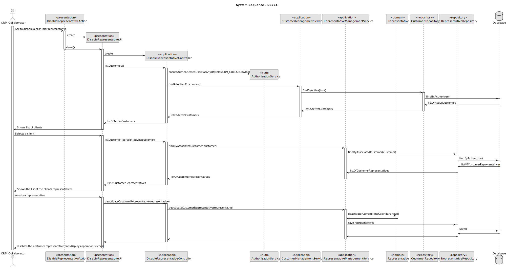

# US 224 -  Disable a customer representative


## 1. Context

* The US224 introduces a functionality that allows a CRM Collaborator to disable a customer representative to prevent further contact.

## 2. Requirements

**US224** - As a CRM Collaborator, I want to disable a customer representative so that they are not contacted in
29 the future.

**Acceptance Criteria:**

- US244.1 The system must guarantee that there is a customer registered
- US224.2 The system must detect if a customer is already disabled 
- US224.3 The system must return all the representatives associated to customer
- US224.4 The system must guarantee that the customer gets disabled

**Dependencies/References:**

* This user story depends on user story US220 because to disable a customer representative there must be a customer in the system already

**Forum Insight:**

* Still no questions related to this user story on forum.

## 3. Analysis


## 4. Design


### 4.1. Sequence Diagram



### 4.3. Applied Patterns

- Information Expert
- Controller
- Low Coupling
- High Cohesion
- Polymorphism
- Pure Fabrication
- Indirection
- Protected Variations

### 4.4. Acceptance Tests

**Test 1:** *Verifies that all active customers are returned*

**Refers to Acceptance Criteria:** US224.2


```
@Test
    void findAllActiveCustomers_shouldReturnActiveCustomers() {
        List<Customer> expected = List.of(customer);
        when(customerRepository.findByActive()).thenReturn(expected);

        Iterable<Customer> result = service.findAllActiveCustomers();

        assertNotNull(result);
        assertEquals(expected, result);
        verify(customerRepository).findByActive();
    }
````

**Test 2:** *Verifies that all customer representatives are return*

**Refers to Acceptance Criteria:** US224.3

```
@Test
    void findByAssociatedCustomer_shouldReturnCustomerRepresentatives() {
        List<Representative> expected = List.of(representative);
        when(representativeRepository.findByAssociatedCustomer(customer)).thenReturn(expected);

        Iterable<Representative> result = service.findByAssociatedCustomer(customer);

        assertNotNull(result);
        assertEquals(expected, result);
        verify(representativeRepository).findByAssociatedCustomer(customer);
    }
```

**Test 3:** *Verifies that the customer representative gets disabled*

**Refers to Acceptance Criteria:** US224.4

```
    @Test
    void deactivateCustomerRepresentative_shouldDeactivateAndSaveRepresentative() {
    when(representativeRepository.save(any(Representative.class))).thenAnswer(invocation -> invocation.getArgument(0));

        Representative result = service.deactivateCustomerRepresentative(representative);

        assertNotNull(result);
        assertFalse(result.isActive());
        assertNotNull(result.deactivatedOn());
        verify(representativeRepository).save(representative);
    }
    @Test
    void deactivate_validDate_shouldDeactivateRepresentative() {
        Representative rep = new Representative(
                "Bob Jones",
                "bob@email.com",
                now,
                "pass123",
                "923456789",
                customer,
                "Support",
                user
        );

        Calendar futureDate = (Calendar) now.clone();
        futureDate.add(Calendar.DAY_OF_YEAR, 1);

        rep.deactivate(futureDate);
        assertFalse(rep.isActive());
        assertEquals(futureDate, rep.deactivatedOn());
    }

    @Test
    void deactivate_withDateBeforeCreatedOn_shouldThrowException() {
        Representative rep = new Representative(
                "Carla Lima",
                "carla@email.com",
                now,
                "pass123",
                "933456789",
                customer,
                "Marketing",
                user
        );

        Calendar pastDate = (Calendar) now.clone();
        pastDate.add(Calendar.DAY_OF_YEAR, -1);

        assertThrows(IllegalArgumentException.class, () -> rep.deactivate(pastDate));
    }

    @Test
    void deactivate_whenAlreadyInactive_shouldThrowException() {
        Representative rep = new Representative(
                "David Silva",
                "david@email.com",
                now,
                "pass123",
                "943456789",
                customer,
                "IT",
                user
        );

        Calendar futureDate = (Calendar) now.clone();
        futureDate.add(Calendar.DAY_OF_YEAR, 1);

        rep.deactivate(futureDate);
        assertThrows(IllegalStateException.class, () -> rep.deactivate(futureDate));
    }
```

## 5. Implementation

**DisableRepresentativeAction**

```java
public class DisableRepresentativeAction implements Action {
    @Override
    public boolean execute() {
        return new DisableRepresentativeUI().doShow();
    }
}
```

**DisableRepresentativeUI**

```java
public class DisableRepresentativeUI extends AbstractUI {
    private final DisableRepresentativeController controller = new DisableRepresentativeController();
    @Override
    protected boolean doShow() {
        while (true) {
            final SelectWidget<Customer> selectWidgetFigure = new SelectWidget<>("Available figures (Enter 0 to finish)", this.controller.listCustomers(), new CustomerPrinter());
            selectWidgetFigure.show();
            Customer customer = selectWidgetFigure.selectedElement();
            Iterable<Representative> listOfCustomerRepresentatives = this.controller.listCustomerRepresentatives(customer);
            if (!listOfCustomerRepresentatives.iterator().hasNext()) {
                System.out.println("This customer doesnt have any representative.");
                break;
            }
            while (true) {
                boolean verification = verifyCustomerRepresentativesAllDeactivated(listOfCustomerRepresentatives);
                if (verification) {
                    break;
                }
                Representative representative = GenericSelector.selectItem(listOfCustomerRepresentatives, new RepresentativePrinter(), "Select a Customer Representative");
                if (!representative.isActive()) {
                    System.out.println("The Selected Customer Representative is already deactivated.");
                } else {
                    this.controller.deactivateCustomerRepresentative(representative);
                }
            }
        }
        return true;
    }

    @Override
    public String headline() {
        return "";
    }

    private boolean verifyCustomerRepresentativesAllDeactivated(Iterable<Representative> representatives) {
        int cont = 0;
        for (Representative representative : representatives) {
            if (representative.isActive()) {
                cont++;
                break;
            }
        }
        if (cont == 0) {
            System.out.println("The Customer Representatives are all deactivated.");
            return true;
        }
        return false;
    }
}
```

**DisableRepresentativeController**

```java
public class DisableRepresentativeController {
    private final AuthorizationService authz = AuthzRegistry.authorizationService();
    private final CustomerRepository customerRepo = PersistenceContext.repositories().customers();
    private final CustomerManagementService customerManagementService = new CustomerManagementService(customerRepo);
    private final RepresentativeRepository representativeRepo = PersistenceContext.repositories().representatives();
    private final RepresentativeManagementService representativeManagementService = new RepresentativeManagementService(representativeRepo, customerRepo);

    public Iterable<Customer> listCustomers() {
        authz.ensureAuthenticatedUserHasAnyOf(Roles.CRM_COLLABORATOR);
        return customerManagementService.findAllActiveCustomers();
    }

    public Iterable<Representative> listCustomerRepresentatives(Customer customer) {
        return representativeManagementService.findByAssociatedCustomer(customer);
    }

    public Representative deactivateCustomerRepresentative(Representative representative) {
        return this.representativeManagementService.deactivateCustomerRepresentative(representative);
    }
}
```

**CustomerManagementService**

```java
public Iterable<Customer> findAllActiveCustomers() {
        return this.customerRepository.findByActive();
}
```

**RepresentativeManagementService**

```java
public Iterable<Representative> findByAssociatedCustomer(final Customer associatedCustomer){
        return this.representativeRepository.findByAssociatedCustomer(associatedCustomer);
}
public Representative deactivateCustomerRepresentative(final Representative representative) {
    representative.deactivate(CurrentTimeCalendars.now());
    return (Representative) this.representativeRepository.save(representative);
}
```

**Representative**

```java
public void deactivate(final Calendar deactivatedOn) {
        if (deactivatedOn != null && !deactivatedOn.before(this.createdOn)) {
            if (!this.active) {
                throw new IllegalStateException("Cannot deactivate an inactive Drone Model!");
            } else {
                this.active = false;
                this.deactivatedOn = deactivatedOn;
            }
        } else {
            throw new IllegalArgumentException();
        }
}
```

## 6. Integration/Demonstration

**Disabling Customer Representative**

.png)
.png)

**Representative Database**


