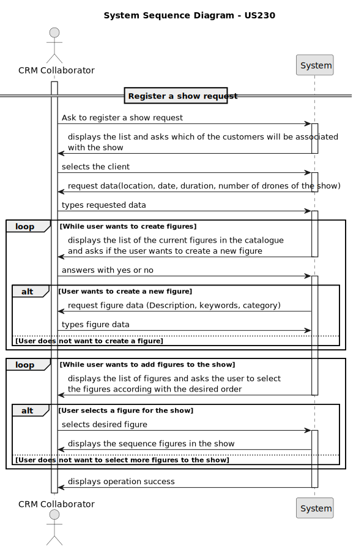

# US 230 - Register show request

## 1. Context

* US230 introduces the functionality for registering a show request into the system by a CRM Collaborator.
* The show request includes key information such as the customer’s details, location, date and time of the show, tentative number of drones required, duration, and a detailed show description. This description may include a sequence of figures from Shodrone’s catalogue, requests for new figures, and any exclusivity requirements from the customer.

## 2. Requirements

**US230** - As a CRM Collaborator, I want to register a show request.

**Acceptance Criteria:**

- US230.1 The system must guarantee the show date is a valid one
- US230.2 The system must guarantee there are drones in the inventory

**Dependencies/References:**

* This user story depends on user story US231 because this user story allows the public figures in the catalogue to be displayed during the show request proposal 
* This user story depends on user story US233 because this user story needs to be capable of adding a figure to the catalogue in case the customer asks for a new figure
* This user story depends on user story US241 because the show in composed of drones, so we need to make sure there are drones in the inventory

**Forum Insight:**

* Still no questions related to this user story on forum.

## 3. Analysis



## 4. Design

*In this sections, the team should present the solution design that was adopted to solve the requirement. This should include, at least, a diagram of the realization of the functionality (e.g., sequence diagram), a class diagram (presenting the classes that support the functionality), the identification and rational behind the applied design patterns and the specification of the main tests used to validade the functionality.*

### 4.1. Realization


### 4.3. Applied Patterns

### 4.4. Acceptance Tests

Include here the main tests used to validate the functionality. Focus on how they relate to the acceptance criteria. May be automated or manual tests.

**Test 1:** *Verifies that it is not possible to ...*

**Refers to Acceptance Criteria:** US101.1


```
@Test(expected = IllegalArgumentException.class)
public void ensureXxxxYyyy() {
...
}
````

## 5. Implementation

*In this section the team should present, if necessary, some evidencies that the implementation is according to the design. It should also describe and explain other important artifacts necessary to fully understand the implementation like, for instance, configuration files.*

*It is also a best practice to include a listing (with a brief summary) of the major commits regarding this requirement.*

## 6. Integration/Demonstration

*In this section the team should describe the efforts realized in order to integrate this functionality with the other parts/components of the system*

*It is also important to explain any scripts or instructions required to execute an demonstrate this functionality*

## 7. Observations

*This section should be used to include any content that does not fit any of the previous sections.*

*The team should present here, for instance, a critical prespective on the developed work including the analysis of alternative solutioons or related works*

*The team should include in this section statements/references regarding third party works that were used in the development this work.*
