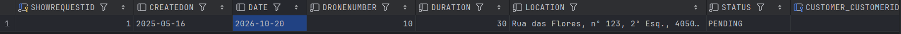

# US 230 - Register show request

## 1. Context

* US230 introduces the functionality for registering a show request into the system by a CRM Collaborator.
* The show request includes key information such as the customer’s details, location, date and time of the show, tentative number of drones required, duration, and a detailed show description. This description may include a sequence of figures from Shodrone’s catalogue, requests for new figures, and any exclusivity requirements from the customer.

## 2. Requirements

**US230** - As a CRM Collaborator, I want to register a show request.

**Acceptance Criteria:**

- US230.1 The system must guarantee the show date is a valid one
- US230.2 The system must guarantee there are drones in the inventory
- US230.3 The system must display only active customers
- US230.4 The system must display figure that are associated to the customer and all public figures

**Dependencies/References:**

* This user story depends on user story US231 because this user story allows the public figures in the catalogue to be displayed during the show request proposal 
* This user story depends on user story US233 because this user story needs to be capable of adding a figure to the catalogue in case the customer asks for a new figure
* This user story depends on user story US241 because the show in composed of drones, so we need to make sure there are drones in the inventory

**Forum Insight:**

>> Boa tarde, um cliente pode pedir dois show requests na mesma data e hora? Se sim, podem também ser na mesma geolocalozação?
> 
>Bom dia,\
Não há nada nos requisitos que o impeça.\
Cumprimentos,\
Angelo Martins

>>Bom dia, existe algum atributo do show request que o identifique unicamente no negócio?
> 
> Boa tarde,\
Cada show request terá provavelmente um número ou um código. Uma prática usual é numerar sequencialmente os show requests dentro do mesmo ano (e.g. 22/2025).\
Cumprimentos,\
Angelo Martins

>>Boa tarde,\
Tendo em conta que o Show request terá que ter informação acerca da localização do espetáculo, o cliente deseja implementar regras de negócio para este campo?\
Por exemplo:\
 existem zonas de exclusão aérea, onde não é permitido tráfego aéreo\
 existem zonas onde não são permitidos drones.
> 
> Bom dia,\
O local terá uma localização, incluindo altitude, porque esta última pode afetar o funcionamento dos drone.
Nada mais.\
Cumprimentos,\
Angelo Martins

>>Bom dia, como é que os show requests\
são identificados no sistema, ou seja, quando\
se pesquisa por um show request por exemplo, pesquisa-se\
pelo cliente ou outra coisa?
> 
>Boa tarde,\
Seria interessante conseguir pesquisar por cliente e/ou intervalo de datas e/ou CRM Colaborator. Ou seja, qualquer combinação dos três.\
Cumprimentos,\
Angelo Martins

>>Boa tarde,\
No show request pedido pelo cliente, o local que ele fornecerá pode ser considerado um address?\
Cumprimentos,\
Grupo 41
> 
>Boa tarde,\
Faz mais sentido uma geolocalização.\
Cumprimentos,\
Angelo Martins


## 3. Analysis


## 4. Design


### 4.1. Sequence Diagram


### 4.3. Applied Patterns

- Information Expert
- Creator
- Controller
- Low Coupling
- High Cohesion
- Polymorphism
- Pure Fabrication
- Indirection
- Protected Variations

### 4.4. Acceptance Tests

**Test 1:** *Verifies that all active customers are returned*

**Refers to Acceptance Criteria:** US230.3

```
    @Test
    void findAllActiveCustomers_shouldReturnActiveCustomers() {
        List<Customer> expected = List.of(customer);
        when(customerRepository.findByActive()).thenReturn(expected);

        Iterable<Customer> result = service.findAllActiveCustomers();

        assertNotNull(result);
        assertEquals(expected, result);
        verify(customerRepository).findByActive();
    }
````

**Test 3:** *Verifies that all figures that are associated to a customer and public are returned*

**Refers to Acceptance Criteria:** US230.4

````
    @Test
    public void findByExclusivityAndCustomer_returnsCorrectFigures() {

        List<Figure> expected = List.of(figure);
        when(repo.findByExclusivityAndCustomer(false, customer)).thenReturn(expected);

        Iterable<Figure> result = service.findByExclusivityAndCustomer(false, customer);

        assertNotNull(result);
        List<Figure> resultList = new ArrayList<>();
        result.forEach(resultList::add);

        assertEquals(1, resultList.size());
        assertEquals(figure, resultList.get(0));
        verify(repo).findByExclusivityAndCustomer(false, customer);
    }
````

**Test 3:** *Verifies that the new figure is successfully registered*

**Refers to Acceptance Criteria:** no acceptance criteria is referenced
````
    @Test
    public void registerNewFigure_success() {
        when(repo.save(any(Figure.class))).thenAnswer(i -> i.getArguments()[0]);

        Figure result = service.registerNewFigure(
                "Triângulo equilátero",
                Set.of("triângulo", "ângulo", "figura"),
                category,
                false,
                null
        );

        assertEquals("Triângulo equilátero", result.description());
        verify(repo).save(any(Figure.class));
    }
````

**Test 4:** *Verifies that the show request is successfully registered*

**Refers to Acceptance Criteria:** no acceptance criteria is referenced
````
    @Test
    void registerShowRequest_success() {
        String location = "Parque da Cidade";
        int duration = 30;
        int drones = 5;

        when(showRequestRepository.save(any(ShowRequest.class)))
                .thenAnswer(invocation -> invocation.getArgument(0));

        ShowRequest result = service.registerShowRequest(customer, location, date, duration, drones, figures);

        assertNotNull(result);
        assertEquals(location, result.location());
        assertEquals(date, result.date());
        assertEquals(drones, result.droneNumber());
        assertEquals(duration, result.duration());
        assertEquals(figures, result.requestedFigures());
        assertEquals(customer, result.customer());

        verify(showRequestRepository).save(any(ShowRequest.class));
    }
````

**Test 5:** *Verifies that all active figure categories are returned*

**Refers to Acceptance Criteria:** no acceptance criteria is referenced

````
    @Test
    void findByActive_returnsCorrectList() {
        Iterable<FigureCategory> expected = List.of(
                new FigureCategory("ActiveCat", "Still in use", now)
        );
        when(repo.findByActive(true)).thenReturn(expected);

        Iterable<FigureCategory> result = service.findByActive(true);

        assertIterableEquals(expected, result);
    }
````


## 5. Implementation

**RegisterShowRequestAction**
```java
package eapli.base.app.backoffice.presentation.showRequestManagement;

import eapli.framework.actions.Action;

public class RegisterShowRequestAction implements Action {
    @Override
    public boolean execute() {
        return new RegisterShowRequestUI().show();
    }
}
```
**RegisterShowRequestUI**
```java
package eapli.base.app.backoffice.presentation.showRequestManagement;

import eapli.base.app.backoffice.presentation.customerManagement.CustomerPrinter;
import eapli.base.app.backoffice.presentation.figureCategoryManagement.FigureCategoryPrinter;
import eapli.base.app.backoffice.presentation.figureManagement.FigurePrinter;
import eapli.base.customerManagement.domain.Customer;
import eapli.base.figureCategoryManagement.domain.FigureCategory;
import eapli.base.figureManagement.domain.Figure;
import eapli.base.showRequestManagement.application.RegisterShowRequestController;
import eapli.base.showRequestManagement.domain.GenericSelector;
import eapli.framework.io.util.Console;
import eapli.framework.presentation.console.AbstractUI;
import eapli.framework.presentation.console.SelectWidget;

import java.text.ParseException;
import java.text.SimpleDateFormat;
import java.util.*;

public class RegisterShowRequestUI extends AbstractUI {
    private final RegisterShowRequestController controller = new RegisterShowRequestController();
    @Override
    protected boolean doShow() {
        Customer customer = GenericSelector.selectItem(this.controller.listCustomers(), new CustomerPrinter(), "Select a Customer");

        String location = requestLocation();
        Calendar date = requestDate();
        int droneNumber = requestDroneNumber();
        int duration = requestDuration();
        Iterable<Figure> figures = this.controller.figures(customer);

        boolean inputAnswer = true;
        boolean start = true;
        while (inputAnswer) {
            System.out.println("\nCurrent list of available figures: ");
            for (Figure figure : figures) {
                System.out.println(figure.description());
            }
            System.out.print("\n");
            inputAnswer = verifyAddFigure(start);
            start = false;
            if (inputAnswer) {
                try {
                    FigureCategory figureCategory = requestCategory();
                    String description = requestDescription();
                    Set<String> keywords = requestListKeywords();
                    if(excluviseMenu()){
                        boolean exclusive = true;
                        controller.addFigure(description, keywords, figureCategory, exclusive, customer);
                    } else {
                        boolean exclusive = false;
                        controller.addFigure(description, keywords, figureCategory, exclusive, null);
                    }
                    figures = this.controller.figures(customer);

                } catch (IllegalArgumentException e) {
                    System.out.println("ERROR: " + e.getMessage());
                    return false;
                }
            }
        }
        List<Figure> figureSequence = new ArrayList<>();
        List<Figure> availableFigures = new ArrayList<>();
        figures.forEach(availableFigures::add);
        final SelectWidget<Figure> selectWidgetFigure = new SelectWidget<>("Available figures (Enter 0 to finish)", availableFigures, new FigurePrinter());
        System.out.println("\nSelect the following figures in the pretended order.");
        while (true) {
            if (availableFigures.isEmpty()) {
                System.out.println("No more figures available to select.");
                break;
            }

            selectWidgetFigure.show();
            Figure selected = selectWidgetFigure.selectedElement();

            if (selected == null) {
                if (figureSequence.isEmpty()) {
                    System.out.println("You must select at least one figure before exiting.");
                    continue;
                } else {
                    break;
                }
            } else {
                figureSequence.add(selected);
                availableFigures.remove(selected);
            }

            System.out.print("Current sequence of figures: ");
            for (int i = 0; i < figureSequence.size(); i++) {
                Figure figure = figureSequence.get(i);
                System.out.printf("%-20s", figure.description());
                if (i != figureSequence.size() - 1) {
                    System.out.print(" / ");
                } else {
                    System.out.print(".");
                }
            }
            System.out.println("\n");
        }
        try {
            controller.registerShowRequest(customer, location, date, duration, droneNumber, figureSequence);
            System.out.println("Show Request successfully registered!");
        } catch (IllegalArgumentException e) {
            System.out.println("\nERROR: " + e.getMessage() + "\n");
        }

        return true;
    }

    @Override
    public String headline() {
        return "";
    }

    private String requestLocation() {
        String location;
        do {
            location = Console.readLine("\nEnter the show location:");
            if (location.trim().isEmpty() || location.matches("\\d+")) {
                System.out.println("Invalid location. It cannot be empty or consist only of numbers. Please enter a valid location.");
            }
        } while (location.trim().isEmpty() || location.matches("\\d+"));
        return location;
    }
    private Calendar requestDate() {
        Calendar date = null;
        SimpleDateFormat sdf = new SimpleDateFormat("yyyy-MM-dd");
        sdf.setLenient(false);
        Calendar currentDate = Calendar.getInstance();

        String dateRegex = "\\d{4}-\\d{2}-\\d{2}";

        while (date == null) {
            String dateInput = Console.readLine("\nEnter the show date (yyyy-MM-dd):");

            if (!dateInput.matches(dateRegex)) {
                System.out.println("Invalid date. Please ensure the date is real and follows the format yyyy-MM-dd.");
                continue;
            }

            try {
                Date parsedDate = sdf.parse(dateInput);
                Calendar enteredDate = Calendar.getInstance();
                enteredDate.setTime(parsedDate);

                if (enteredDate.before(currentDate)) {
                    System.out.println("The entered date is in the past. Please enter a future date.");
                } else {
                    date = enteredDate;
                }

            } catch (ParseException e) {
                System.out.println("Invalid date. Please ensure the date is real and follows the format yyyy-MM-dd.");
            }
        }
        return date;
    }
    private int requestDroneNumber() {
        int droneNumber = -1;
        while (droneNumber <= 0) {
            try {
                droneNumber = Integer.parseInt(Console.readLine("\nEnter number of drones:"));
                if (droneNumber <= 0) {
                    System.out.println("The number must be greater than 0.");
                }
            } catch (NumberFormatException e) {
                System.out.println("Invalid input. Please enter a valid integer.");
            }
        }
        return droneNumber;
    }

    private int requestDuration() {
        int duration = -1;
        while (duration <= 0) {
            try {
                duration = Integer.parseInt(Console.readLine("\nEnter duration (in minutes):"));
                if (duration <= 0) {
                    System.out.println("Duration must be greater than 0.");
                }
            } catch (NumberFormatException e) {
                System.out.println("Invalid input. Please enter a valid integer.");
            }
        }
        return duration;
    }
    private boolean verifyAddFigure(boolean start) {
        String newFigureInput;
        boolean inputAnswer;

        do {
            if (start) {
                newFigureInput = Console.readLine("Do you wish to add a figure? (yes/no):").trim().toLowerCase();
            } else {
                newFigureInput = Console.readLine("Do you wish to add another figure? (yes/no):").trim().toLowerCase();
            }
            if (newFigureInput.isEmpty() || (!newFigureInput.equals("yes") && !newFigureInput.equals("no"))) {
                System.out.println("Invalid input. Please type 'yes' or 'no'.");
            }
        } while (newFigureInput.isEmpty() || (!newFigureInput.equals("yes") && !newFigureInput.equals("no")));

        inputAnswer = newFigureInput.equals("yes");
        return inputAnswer;
    }
    private Set<String> requestListKeywords() {
        Set<String> keywords = requestKeyWords();

        while (keywords.isEmpty()) {
            System.out.println("No keywords added. Please enter at least one keyword.");
            keywords = requestKeyWords();
        }
        return keywords;
    }
    private boolean excluviseMenu(){
        System.out.println("Is this Figure exclusive to a customer?");
        System.out.println("1. Yes");
        System.out.println("2. No");
        int option = Console.readInteger("Select an option: ");
        switch (option) {
            case 1:
                return true;
            case 2:
                return false;
            default:
                System.out.println("Invalid option. Please try again.");
                excluviseMenu();
        }
        return false;
    }
    private Set<String> requestKeyWords(){
        Set<String> keywords = new HashSet<>();
        System.out.println("\nInsert keywords:");
        boolean addMore = true;
        while (addMore) {
            String kw = Console.readLine("Enter a keyword:").trim();
            if (!kw.isEmpty()) {
                keywords.add(kw);
            } else {
                System.out.println("ERROR: Keyword cannot be empty. Please enter a valid keyword.");
            }

            String response = Console.readLine("Do you want to add another keyword? (yes/no):").trim().toLowerCase();
            addMore = response.equals("yes");
        }
        return keywords;
    }
    private FigureCategory requestCategory() {
        FigureCategory figureCategory;
        Iterable<FigureCategory> iterable = controller.listFigureCategories();

        if (!iterable.iterator().hasNext()) {
            throw new IllegalArgumentException("No figure categories available.");
        }
        String headerFigureCategoryModel = String.format("Select Figure Category\n#  %-30s%-30s%-30s%-30s%-30s", "NAME", "DESCRIPTION", "STATUS", "CREATED ON", "CHANGED ON");
        final SelectWidget<FigureCategory> selector = new SelectWidget<>(headerFigureCategoryModel, iterable, new FigureCategoryPrinter());
        selector.show();

        figureCategory = selector.selectedElement();
        while (figureCategory == null) {
            System.out.println("No figure category selected! Please select a valid category.");
            selector.show();
            figureCategory = selector.selectedElement();
        }
        return figureCategory;
    }
    private String requestDescription() {
        String description = "";
        boolean validDescription = false;
        while (!validDescription) {
            description = Console.readLine("Enter figure description:").trim();
            if (description.isEmpty()) {
                System.out.println("Description cannot be empty. Please enter a valid description.");
            } else {
                validDescription = true;
            }
        }
        return description;
    }
}

```

**RegisterShowRequestController**
```java
package eapli.base.showRequestManagement.application;

import eapli.base.customerManagement.application.CustomerManagementService;
import eapli.base.customerManagement.domain.Customer;
import eapli.base.customerManagement.repositories.CustomerRepository;
import eapli.base.figureCategoryManagement.application.FigureCategoryManagementService;
import eapli.base.figureCategoryManagement.domain.FigureCategory;
import eapli.base.figureCategoryManagement.repositories.FigureCategoryRepository;
import eapli.base.figureManagement.application.FigureManagementService;
import eapli.base.figureManagement.domain.Figure;
import eapli.base.figureManagement.repository.FigureRepository;
import eapli.base.infrastructure.persistence.PersistenceContext;
import eapli.base.showRequestManagement.domain.ShowRequest;
import eapli.base.showRequestManagement.repositories.ShowRequestRepository;
import eapli.base.usermanagement.domain.Roles;
import eapli.framework.domain.repositories.TransactionalContext;
import eapli.framework.infrastructure.authz.application.AuthorizationService;
import eapli.framework.infrastructure.authz.application.AuthzRegistry;

import java.util.Calendar;
import java.util.List;
import java.util.Set;

public class RegisterShowRequestController {
    private final TransactionalContext autoTx = PersistenceContext.repositories().newTransactionalContext();
    private final AuthorizationService authz = AuthzRegistry.authorizationService();
    private final CustomerRepository customerRepository = PersistenceContext.repositories().customers(autoTx);
    private final CustomerManagementService customerManagementService = new CustomerManagementService(customerRepository);
    private final ShowRequestRepository showRequestRepository = PersistenceContext.repositories().showRequests();
    private final ShowRequestManagementService showRequestManagementService = new ShowRequestManagementService(showRequestRepository);
    private final FigureRepository figureRepository = PersistenceContext.repositories().figures();
    private final FigureManagementService figureManagementService = new FigureManagementService(figureRepository);
    private final FigureCategoryRepository figureCategoryRepository = PersistenceContext.repositories().figureCategories(autoTx);
    private final FigureCategoryManagementService figureCategoryManagementService = new FigureCategoryManagementService(figureCategoryRepository);

    public Iterable<Customer> listCustomers() {
        authz.ensureAuthenticatedUserHasAnyOf(Roles.CRM_COLLABORATOR);
        return customerManagementService.findAllActiveCustomers();
    }
    public Iterable<Figure> figures(Customer customer) {
        return figureManagementService.findByExclusivityAndCustomer(false, customer);
    }
    public Figure addFigure(String figureDescription, Set<String> keywords, FigureCategory figureCategory, boolean exclusive, Customer customer) {
        return figureManagementService.registerNewFigure(figureDescription, keywords, figureCategory, exclusive, customer);
    }
    public ShowRequest registerShowRequest(Customer customer, String location, Calendar date, int duration, int droneNumber, List<Figure> figureSequence) {
        return showRequestManagementService.registerShowRequest(customer, location, date, duration, droneNumber, figureSequence);
    }
    public Iterable<FigureCategory> listFigureCategories() {
        return figureCategoryManagementService.findByActive(true);
    }
}
```
**FigureManagementService**
```java
public Iterable<Figure> findByExclusivityAndCustomer(boolean exclusive, Customer customer) {
        return this.figureRepository.findByExclusivityAndCustomer(exclusive, customer);
}
public Figure registerNewFigure(String description, Set<String> keywords, FigureCategory figureCategory, boolean exclusive, Customer customer){
    Figure newFigure = new Figure(description, keywords, figureCategory, exclusive, customer);
    return (Figure) this.figureRepository.save(newFigure);
}
```
**FigureCategoryManagementService**
```java
public Iterable<FigureCategory> findByActive(boolean active) {  
    return this.figureCategoryRepository.findByActive(active);
}
```
**CustomerManagementService**
```java
public Iterable<Customer> findAllActiveCustomers() {
    return this.customerRepository.findByActive();
}
```
**ShowRequestManagementService**
```java
public ShowRequest registerShowRequest(Customer customer, String location, Calendar date, int duration, int droneNumber, List<Figure> figureSequence) {
    //RequestedFigures newRequestedFigures = new RequestedFigures(figureSequence);
    ShowRequest newShowRequest = new ShowRequest(location, date, droneNumber, duration, figureSequence, customer);
    return (ShowRequest) this.showRequestRepository.save(newShowRequest);
}
```

## 6. Integration/Demonstration

**Registering a show request**

.png)
.png)
.png)
.png)

**Show Request Database**


