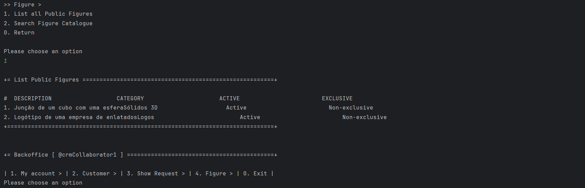
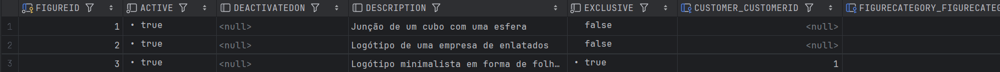

# US 231 - Figure catalogue

## 1. Context

* This user story aims to enhance the functionality of the show request process by allowing CRM Collaborators to access and view all public figures available in the system’s catalogue.

## 2. Requirements

**US231** - As CRM Collaborator, I want to list al public figures in the catalogue so that I can select them during a show request proposal.

**Acceptance Criteria:**

- US231.1 The system must guarantee there are public figures in the catalogue

**Dependencies/References:**

* There are no dependencies related to this user story

**Forum Insight:**

* Still no questions related to this user story on forum.

## 3. Analysis


## 4. Design


### 4.1. Sequence Diagram


### 4.3. Applied Patterns

- Information Expert
- Controller
- Low Coupling
- High Cohesion
- Polymorphism
- Polymorphism
- Pure Fabrication
- Indirection
- Protected Variations

### 4.4. Acceptance Tests

Include here the main tests used to validate the functionality. Focus on how they relate to the acceptance criteria. May be automated or manual tests.

**Test 1:** *Verifies that all public figures are returned*

**Refers to Acceptance Criteria:** US231.1


```
    @Test
    public void listPublicFigures_returnsNonExclusiveFigures() {
        List<Figure> expected = List.of(figure);
        when(repo.findByExclusivity(false)).thenReturn(expected);

        Iterable<Figure> result = service.listPublicFigures();

        assertNotNull(result);
        assertEquals(expected, result);
        verify(repo).findByExclusivity(false);
    }
````

## 5. Implementation

**ListFigureAction**
```java
package eapli.base.app.backoffice.presentation.figureManagement;

import eapli.framework.actions.Action;

public class ListFigureAction implements Action {
    @Override
    public boolean execute() { return new ListFigureUI().show(); }
}
```

**ListFigureUI**
```java
package eapli.base.app.backoffice.presentation.figureManagement;

import eapli.base.figureManagement.application.ListFigureController;
import eapli.base.figureManagement.domain.Figure;
import eapli.framework.presentation.console.AbstractListUI;
import eapli.framework.visitor.Visitor;

public class ListFigureUI extends AbstractListUI<Figure> {
    private final ListFigureController controller = new ListFigureController();

    @Override
    protected Iterable<Figure> elements() {
        return controller.listPublicFigures();
    }

    @Override
    protected Visitor<Figure> elementPrinter() {
        return new FigurePrinter();
    }

    @Override
    protected String elementName() {
        return "";
    }

    @Override
    protected String listHeader() {
        return String.format("#  %-30s%-30s%-30s%-30s", "DESCRIPTION", "CATEGORY", "ACTIVE", "EXCLUSIVE");
    }

    @Override
    protected String emptyMessage() {
        return "There no public figures!";
    }

    @Override
    public String headline() {
        return "List Public Figures";
    }
}

```

**ListFigureController**
```java
package eapli.base.figureManagement.application;

import eapli.base.figureManagement.domain.Figure;
import eapli.base.figureManagement.repository.FigureRepository;
import eapli.base.infrastructure.persistence.PersistenceContext;
import eapli.base.usermanagement.domain.Roles;
import eapli.framework.domain.repositories.TransactionalContext;
import eapli.framework.infrastructure.authz.application.AuthorizationService;
import eapli.framework.infrastructure.authz.application.AuthzRegistry;

public class ListFigureController {
    private final TransactionalContext autoTx = PersistenceContext.repositories().newTransactionalContext();
    private final AuthorizationService authz = AuthzRegistry.authorizationService();
    private final FigureRepository repo = PersistenceContext.repositories().figures(autoTx);
    private final FigureManagementService figureManagementService = new FigureManagementService(repo);

    public Iterable<Figure> listPublicFigures() {
        authz.ensureAuthenticatedUserHasAnyOf(Roles.CRM_COLLABORATOR);
        return figureManagementService.listPublicFigures();
    }
}
```

**FigureManagementService**
```java
public Iterable<Figure> listPublicFigures(){
        return this.figureRepository.findByExclusivity(false);
}
```

## 6. Integration/Demonstration


**Listing all public figures**



**Figure Database**


