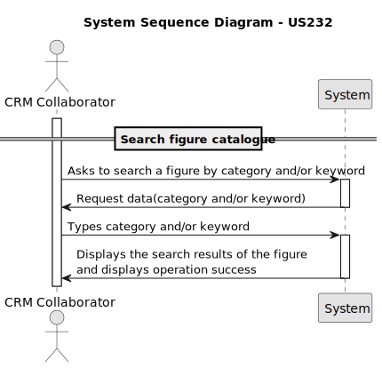

# US 101 - Search figure catalogue

## 1. Context

* This user story introduces a search functionality to the figure catalogue, allowing CRM Collaborators to filter figures by category and/or keyword.

## 2. Requirements

**US232** - As CRM Collaborator, I want to search the figure catalogue by category and/or keyword.
The search should ignore accents and shouldn’t be case sensitive.

**Acceptance Criteria:**

- US232.1 The system should guarantee there are figures available in the catalogue before the search
- US232.2 The system should guarantee all active figure categories are returned
- US232.3 The system should be able to make the search by keyword, category or keyword and category
- US232.4 The search should ignore accents and shouldn’t be case sensitive.

**Dependencies/References:**

* There are no dependencies related to this user story

**Forum Insight:**

>>Boa tarde,\
Na US232, é pedido a pesquisa no catálogo de figuras. A minha pergunta é se o cliente apenas quer que sejam apresentadas as figuras públicas ou também as exclusivas, por exemplo com o nome do customer nesse caso.\
Obrigado,\
Diogo Pereira
> 
>Bom dia,\
Pode mostrar todas, claro que assinalando as que são exclusivas.\
Cumprimentos,\
Angelo Martins

## 3. Analysis



## 4. Design


### 4.1. Sequence Diagram


### 4.3. Applied Patterns

- Information Expert
- Controller
- Low Coupling
- High Cohesion
- Polymorphism
- Polymorphism
- Pure Fabrication
- Indirection
- Protected Variations

### 4.4. Acceptance Tests

**Test 1:** *Verifies that all active figure categories are returned*

**Refers to Acceptance Criteria:** US232.2

```
    @Test
    void findByActive_returnsCorrectList() {
        Iterable<FigureCategory> expected = List.of(
                new FigureCategory("ActiveCat", "Still in use", now)
        );
        when(repo.findByActive(true)).thenReturn(expected);

        Iterable<FigureCategory> result = service.findByActive(true);

        assertIterableEquals(expected, result);
    }
````

**Test 2:** *Verifies that returns all the figures with the associated keyword*

**Refers to Acceptance Criteria:** US232.3, US232.4
```
    @Test
    public void findByKeyword_returnsCorrectFigures() {
        when(repo.findByKeyword("triângulo")).thenReturn(List.of(figure));

        Iterable<Figure> result = service.findByKeyword("triângulo");

        assertNotNull(result);

        List<Figure> figures = new ArrayList<>();
        result.forEach(figures::add);

        assertEquals(1, figures.size());
        assertEquals(figure, figures.get(0));
    }
```

**Test 3:** *Verifies that returns all the figures with the associated category*

**Refers to Acceptance Criteria:** US232.3
```
    @Test
    public void findByCategory_returnsCorrectFigures() {
        List<Figure> expected = List.of(figure);
        when(repo.findByFigureCategory(category)).thenReturn(expected);

        Iterable<Figure> result = service.findByCategory(category);

        assertEquals(expected, result);
        verify(repo).findByFigureCategory(category);
    }
```

**Test 3:** *Verifies that returns all the figures with the associated keyword and category*

**Refers to Acceptance Criteria:** US232.3, US232.4

```
    @Test
    public void findByKeywordAndCategory_returnsCorrectFigures() {
        List<Figure> expected = List.of(figure);
        when(repo.findByKeywordAndCategory("triângulo", category)).thenReturn(expected);

        Iterable<Figure> result = service.findByKeywordAndCategory("triângulo", category);

        assertNotNull(result);
        List<Figure> figures = new ArrayList<>();
        result.forEach(figures::add);

        assertEquals(1, figures.size());
        assertEquals(figure, figures.get(0));
        verify(repo).findByKeywordAndCategory("triângulo", category);
    }
```
## 5. Implementation

**SearchFigureAction**
```java
package eapli.base.app.backoffice.presentation.figureManagement;

import eapli.framework.actions.Action;

public class SearchFigureAction implements Action {
    @Override
    public boolean execute() {
        return new SearchFigureUI().show();
    }
}

```
**SearchFigureUI**
```java
package eapli.base.app.backoffice.presentation.figureManagement;

import eapli.base.app.backoffice.presentation.figureCategoryManagement.FigureCategoryPrinter;
import eapli.base.figureCategoryManagement.domain.FigureCategory;
import eapli.base.figureManagement.application.SearchFigureController;
import eapli.base.figureManagement.domain.Figure;
import eapli.framework.presentation.console.AbstractListUI;
import eapli.framework.presentation.console.SelectWidget;
import eapli.framework.visitor.Visitor;

import java.util.Scanner;

public class SearchFigureUI extends AbstractListUI<Figure> {
    private final SearchFigureController controller = new SearchFigureController();
    @Override
    protected Iterable<Figure> elements() {
        controller.ensureAuthenticatedUser();
        Scanner scanner = new Scanner(System.in);
        while (true) {
            menu();
            int choice;

            try {
                choice = Integer.parseInt(scanner.nextLine());
                System.out.print("\n");
            } catch (NumberFormatException e) {
                System.out.println("\nInvalid input. Please enter a number.\n");
                continue;
            }

            if (choice == 1) {
                System.out.print("Enter keyword: ");
                String keyword = scanner.nextLine();
                return controller.findFiguresByKeyword(keyword);

            } else if (choice == 2) {
                final Iterable<FigureCategory> figuresCategories = this.controller.figuresCategories();
                final SelectWidget<FigureCategory> selectWidget = new SelectWidget<>("Select a Figure Category", figuresCategories, new FigureCategoryPrinter());
                selectWidget.show();
                final FigureCategory category = selectWidget.selectedElement();
                System.out.println("\n");
                return controller.findFiguresByCategory(category);

            } else if (choice == 3) {
                System.out.print("Enter keyword: ");
                String keyword = scanner.nextLine();
                System.out.print("\n");
                final Iterable<FigureCategory> figuresCategories = this.controller.figuresCategories();
                final SelectWidget<FigureCategory> selectWidget = new SelectWidget<>("Select a Figure Category", figuresCategories, new FigureCategoryPrinter());
                selectWidget.show();
                final FigureCategory category = selectWidget.selectedElement();
                System.out.print("\n");
                return controller.findFiguresByKeywordAndCategory(keyword, category);

            } else {
                System.out.println("Invalid option. Please choose a valid menu number.\n");
            }
        }
    }

    @Override
    protected Visitor<Figure> elementPrinter() {
        return new FigurePrinter();
    }

    @Override
    protected String elementName() {
        return "";
    }

    @Override
    protected String listHeader() {
        return String.format("#  %-30s%-30s%-30s%-30s", "DESCRIPTION", "CATEGORY", "ACTIVE", "EXCLUSIVE");
    }

    @Override
    protected String emptyMessage() {
        return "No figures found in the catalogue!";
    }

    @Override
    public String headline() {
        return "Search Figure Catalogue";
    }
    private void menu() {
        System.out.println("=============================================\n");
        System.out.println("Please select one of the following options:");
        System.out.println("1. Search figures by keyword");
        System.out.println("2. Search figures by category");
        System.out.println("3. Search figures by both keyword and category");
        System.out.println("\n=============================================");
        System.out.print("Select your option: ");
    }
}

```
**SearchFigureController**
```java
package eapli.base.figureManagement.application;

import eapli.base.figureCategoryManagement.application.FigureCategoryManagementService;
import eapli.base.figureCategoryManagement.domain.FigureCategory;
import eapli.base.figureCategoryManagement.repositories.FigureCategoryRepository;
import eapli.base.figureManagement.domain.Figure;
import eapli.base.figureManagement.repository.FigureRepository;
import eapli.base.infrastructure.persistence.PersistenceContext;
import eapli.base.usermanagement.domain.Roles;
import eapli.framework.domain.repositories.TransactionalContext;
import eapli.framework.infrastructure.authz.application.AuthorizationService;
import eapli.framework.infrastructure.authz.application.AuthzRegistry;

public class SearchFigureController {
    private final TransactionalContext autoTx = PersistenceContext.repositories().newTransactionalContext();
    private final AuthorizationService authz = AuthzRegistry.authorizationService();
    private final FigureRepository figureRepository = PersistenceContext.repositories().figures(autoTx);
    private final FigureManagementService figureManagementService = new FigureManagementService(figureRepository);
    private final FigureCategoryRepository figureCategoryRepository = PersistenceContext.repositories().figureCategories(autoTx);
    private final FigureCategoryManagementService figureCategoryManagementService = new FigureCategoryManagementService(figureCategoryRepository);

    public void ensureAuthenticatedUser() {
        authz.ensureAuthenticatedUserHasAnyOf(Roles.CRM_COLLABORATOR);
    }

    public Iterable<FigureCategory> figuresCategories() {
        return figureCategoryManagementService.findByActive(true);
    }
    public Iterable<Figure> findFiguresByKeyword(String keyword) {
        return figureManagementService.findByKeyword(keyword);
    }

    public Iterable<Figure> findFiguresByCategory(FigureCategory category) {
        return figureManagementService.findByCategory(category);
    }

    public Iterable<Figure> findFiguresByKeywordAndCategory(String keyword, FigureCategory category) {
        return figureManagementService.findByKeywordAndCategory(keyword, category);
    }
}
```
**FigureCategoryManagementService**
```java
public Iterable<FigureCategory> findByActive(boolean active) {
    return this.figureCategoryRepository.findByActive(active);
}
```
**FigureManagementService**
```java
public Iterable<Figure> findByCategory(FigureCategory figureCategory){     
    return this.figureRepository.findByFigureCategory(figureCategory);
}
public Iterable<Figure> findByKeyword(String keyword){     
    return this.figureRepository.findByKeyword(keyword);
} 
public Iterable<Figure> findByKeywordAndCategory(String keyword, FigureCategory category){     
    return this.figureRepository.findByKeywordAndCategory(keyword, category);
}
```


## 6. Integration/Demonstration

**Searching figures by keyword, category or keyword and category**

.png)
.png)

**Figure Database**


