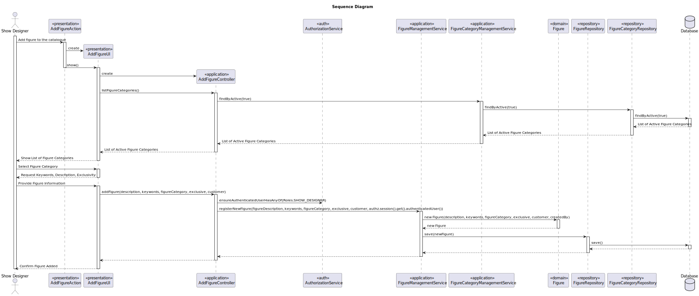

# US 233 - Add figure to the catalogue

## 1. Context

* This user story is part of the functionality that manages the figure catalogue used in show creation. 
The catalogue acts as a central repository for all figures that can be included in shows
* Additionally, the system must distinguish between public figures (available for use in any show) and custom-made figures (created specifically at a customer’s request). 
Custom figures are not publicly visible and can only be used in shows for that particular customer.

## 2. Requirements

**US233** - As Show designer I want to add a figure to the public catalogue.
Figures are classified with a category and a set of keywords.
If a figure is custom-made to a customer’s request it is not public and can only be used in shows for that customer.


**Acceptance Criteria:**

- US233.1 The system must guarantee that all the information to add a figure is given.

- US233.2 The system must guarantee that the figure is added correctly to the catalogue.

- US233.3 The system must guarantee that the figure code/id is different from the ones already added.

**Dependencies/References:**

* This user story doesn't depend on others user stories.

**Forum Insight:**

>> É relevante para o domínio o colaborador que criou a figura?
>
> Acho que a ideia de dar o devido crédito ao autor da figura é boa. É como no Ikea.


>> Gostaria de saber se ao adicionar uma figura ao catálogo, têm que ser logo adicionados os campos todos no momento do registo, ou se por exemplo o código DSL da figura e da versão podem ser adicionados posteriormente.
>
> Não há user stories sobre a criação de figuras em estado "incompleto".


## 3. Analysis


## 4. Design

### 4.1. Sequence Diagram



### 4.3. Applied Patterns

- Domain-Driven Design
- Factory


## 5. Implementation

**AddFigureAction**

```java
public class AddFigureAction implements Action {

    @Override
    public boolean execute() {
        return new AddFigureUI().show();
    }
}
```
**AddFigureUI**

```java
public class AddFigureUI extends AbstractUI {

    private final AddFigureController controller = new AddFigureController();

    @Override
    protected boolean doShow() {
        final Iterable<FigureCategory> iterable = controller.listFigureCategories();

        if (!iterable.iterator().hasNext()) {
            System.out.println("There is no registered Figure Categories!");
            return false;
        }

        final SelectWidget<FigureCategory> selector = new SelectWidget<>("Select Figure Category", iterable, new FigureCategoryPrinter());
        System.out.printf("%-30s%-30s%-30s%n", "Name", "Description", "Status");
        selector.show();

        final FigureCategory figureCategory = selector.selectedElement();
        if (figureCategory == null) {
            System.out.println("No Figure Category Selected!\n");
            return false;
        }

        final String description = Console.readLine("Enter figure description:").trim();

        System.out.println("\nInsert keywords:");
        final Set<String> keywords = new HashSet<>();
        boolean addMore = true;

        while (addMore) {
            final String kw = Console.readLine("Enter a keyword:");
            if (!kw.trim().isEmpty()) {
                keywords.add(kw.trim());
            }else {
                System.out.println("Keyword cannot be empty. Please enter a valid keyword.");
            }

            final String response = Console.readLine("Do you want to add another keyword? (yes/no):").trim().toLowerCase();
            addMore = response.equals("yes");
        }

        if (keywords.isEmpty()) {
            System.out.println("No keywords added. Figure will not be added.");
            return false;
        }

        try {
            if(excluviseMenu()){
                boolean exclusive = true;
                String headerModel = String.format("List of Active Customers\n#  %-30s%-30s%-30s%-30s", "CUSTOMER NAME", "STATUS", "PHONE NUMBER", "EMAIL");
                SelectWidget<Customer> selectorCustomer = new SelectWidget<>(headerModel, controller.listCustomers(), new CustomerPrinter());
                selectorCustomer.show();
                Customer customer = selectorCustomer.selectedElement();
                if (customer == null) {
                    System.out.println("No Customer Selected!\n");
                    return false;
                }
                controller.addFigure(description, keywords, figureCategory, exclusive, customer);
            }else{
                boolean exclusive = false;
                controller.addFigure(description, keywords, figureCategory, exclusive, null);
            }
            System.out.println("Figure added successfully!");
        } catch (IllegalArgumentException e) {
            System.out.println("\nERROR: " + e.getMessage() + "\n");
        }
        return true;
    }


    @Override
    public String headline() {
        return "Add Figure";
    }


    public boolean excluviseMenu(){
        System.out.println("Is this Figure exclusive to a customer?");
        System.out.println("1. Yes");
        System.out.println("2. No");
        int option = Console.readInteger("Select an option: ");
        switch (option) {
            case 1:
                return true;
            case 2:
                return false;
            default:
                System.out.println("Invalid option. Please try again.");
                excluviseMenu();
        }
        return false;
    }
}
```

**AddFigureController**

```java
@UseCaseController
public class AddFigureController {

    private final AuthorizationService authz = AuthzRegistry.authorizationService();

     private final FigureRepository repo = PersistenceContext.repositories().figures();

     private final CustomerRepository repoCustomer = PersistenceContext.repositories().customers();

     private final CustomerManagementService customerManagementService = new CustomerManagementService(repoCustomer);

    private final FigureManagementService figureManagementService = new FigureManagementService(repo);

    private final FigureCategoryManagementService figureCategoryManagementService = new FigureCategoryManagementService(PersistenceContext.repositories().figureCategories());

    public Figure addFigure(final String figureDescription, final Set<String> keywords, final FigureCategory figureCategory, boolean exclusive, Customer customer) {
        authz.ensureAuthenticatedUserHasAnyOf(Roles.SHOW_DESIGNER);
        return figureManagementService.registerNewFigure(figureDescription, keywords, figureCategory, exclusive, customer);
    }

    public Iterable<FigureCategory> listFigureCategories() {
        return figureCategoryManagementService.findByActive(true);
    }

    public Iterable<Customer> listCustomers(){
        return customerManagementService.findAllActiveCustomers();
    }
}
```

**FigureCategoryManagementService**

```java
public class FigureCategoryManagementService {

    private final FigureCategoryRepository figureCategoryRepository;

    public FigureCategoryManagementService(final FigureCategoryRepository figureCategoryRepository) {
        this.figureCategoryRepository = figureCategoryRepository;
    }

    public FigureCategory registerNewFigureCategory(final String name, final String description) {
        if(isFigureCategoryNameUsed(figureCategoryRepository, name)){
            throw new IllegalArgumentException("Figure Category name already in use");
        }
        FigureCategory figureCategory = new FigureCategory(name, description, CurrentTimeCalendars.now());
        return (FigureCategory) this.figureCategoryRepository.save(figureCategory);
    }

    public Optional<FigureCategory> findFigureCategoryById(Long id) {
        return this.figureCategoryRepository.findById(id);
    }

    public Iterable<FigureCategory> findFigureCategoryByName(String name) {
        return this.figureCategoryRepository.findByName(name);
    }

    public Iterable<FigureCategory> findFigureCategoryByDescription(String description) {
        return this.figureCategoryRepository.findByDescription(description);
    }

    public Iterable<FigureCategory> findAll() {
        return this.figureCategoryRepository.findAll();
    }

    public FigureCategory deactivateFigureCategory(FigureCategory figureCategory) {
        figureCategory.deactivate(CurrentTimeCalendars.now());
        return (FigureCategory) this.figureCategoryRepository.save(figureCategory);
    }

    public FigureCategory activateFigureCategory(FigureCategory figureCategory) {
        figureCategory.activate(CurrentTimeCalendars.now());
        return (FigureCategory) this.figureCategoryRepository.save(figureCategory);
    }


    public boolean isFigureCategoryNameUsed(FigureCategoryRepository repo, String name) {
        return repo.isFigureCategoryNameUsed(name);
    }

    public Iterable<FigureCategory> findByActive(boolean active) {
        return this.figureCategoryRepository.findByActive(active);
    }
}
```

**FigureManagementService**

```java
public class FigureManagementService {

    private final FigureRepository figureRepository;

    public FigureManagementService(final FigureRepository figureRepository){
        this.figureRepository = figureRepository;
    }

    public Figure registerNewFigure(String description, Set<String> keywords, FigureCategory figureCategory, boolean exclusive, Customer customer){
        Figure newFigure = new Figure(description, keywords, figureCategory, exclusive, customer);
        return (Figure) this.figureRepository.save(newFigure);
    }

    public Figure decommissionFigure(Figure figure){
        figure.deactivate(CurrentTimeCalendars.now());
        return (Figure) this.figureRepository.save(figure);
    }

    public Figure activateFigure(Figure figure){
        figure.activate();
        return (Figure) this.figureRepository.save(figure);
    }

    public Iterable<Figure> activeFigures(){
        return this.figureRepository.findByActive(true);
    }

    public Iterable<Figure> inactiveFigures(){
        return this.figureRepository.findByActive(false);
    }

    public Iterable<Figure> findByCategory(FigureCategory figureCategory){
        return this.figureRepository.findByFigureCategory(figureCategory);
    }

    public Iterable<Figure> findByKeyword(String keyword){
        return this.figureRepository.findByKeyword(keyword);
    }

    public Iterable<Figure> findByExclusivity(boolean exclusive){
        return this.figureRepository.findByExclusivity(exclusive);
    }
    public Iterable<Figure> listPublicFigures(){
        return this.figureRepository.findByExclusivity(false);
    }
    public Iterable<Figure> findByKeywordAndCategory(String keyword, FigureCategory category){
        return this.figureRepository.findByKeywordAndCategory(keyword, category);
    }
}
```

**Figure**

```java
@Entity
public class Figure implements AggregateRoot<Long> {

    @Id
    @GeneratedValue(strategy = GenerationType.AUTO)
    private Long figureId;

    @ElementCollection
    private Set<String> keywords;

    private String description;

    @ManyToOne
    private FigureCategory figureCategory;

    private boolean exclusive;

    private boolean active;


    @ManyToOne
    private Customer customer;

    @Temporal(TemporalType.DATE)
    private Calendar deactivatedOn;

    protected Figure(){
    }

    public Figure(final String description, Set<String> keywords, FigureCategory figureCategory, boolean exclusive, Customer customer) {
        Preconditions.noneNull(new Object[] {keywords, figureCategory});
        this.keywords = new HashSet<>(keywords);
        this.description = description;
        this.figureCategory = figureCategory;
        this.active = true;
        this.exclusive = exclusive;
        this.customer = customer;
    }

    public Set<String> keywords(){
        return this.keywords;
    }

    public String description(){
        return this.description;
    }

    public FigureCategory figureCategory(){
        return this.figureCategory;
    }

    public Calendar deactivatedOn(){
        return this.deactivatedOn;
    }

    public Customer customer(){
        return this.customer;
    }

    public boolean isActive(){return this.active;}

    public boolean isExclusive(){return this.exclusive;}


    public void deactivate(final Calendar deactivatedOn) {
        if (deactivatedOn != null) {
            if (!this.active) {
                throw new IllegalStateException("Cannot deactivate an inactive Drone!");
            } else {
                this.active = false;
                this.deactivatedOn = deactivatedOn;
            }
        } else {
            throw new IllegalArgumentException();
        }
    }

    public void activate() {
        if (!this.isActive()) {
            this.active = true;
            this.deactivatedOn = null;
        }
    }

    @Override
    public String toString() {
        return "Figure{" +
                "figureId=" + figureId +
                ", keywords=" + keywords +
                ", description='" + description + '\'' +
                ", figureCategory=" + figureCategory +
                ", exclusive=" + exclusive +
                ", active=" + active +
                ", deactivatedOn=" + deactivatedOn +
                '}';
    }

    @Override
    public boolean sameAs(Object other) {
        if (this == other) return true;
        if (!(other instanceof Figure)) return false;
        Figure that = (Figure) other;
        return figureId != null && figureId.equals(that.figureId);
    }

    @Override
    public Long identity() {
        return this.figureId;
    }
}
```

## 6. Integration/Demonstration

**Registering Figure**


**Figure Database**


