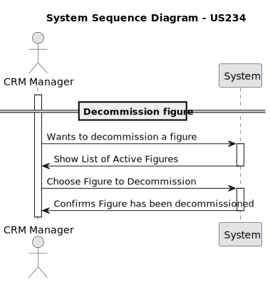
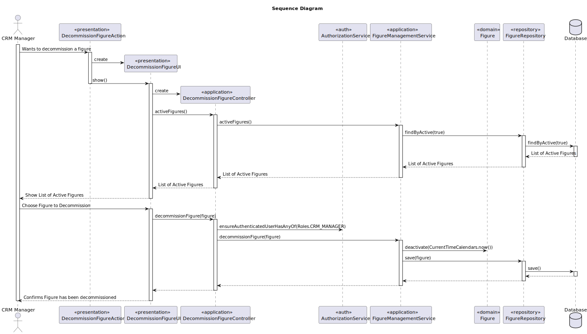

# US 234 - Decommission figure

## 1. Context

*  The goal is to implement a feature that allows the CRM Manager to decommission a figure from the catalogue, 
ensuring it is no longer available for future use.


## 2. Requirements

**US234** - As CRM Manager, I want to decommission a figure from the catalogue so that it will not be used anymore.


**Acceptance Criteria:**

- US234.1 The system should make sure that the figure can not be used after being decommissioned.


**Dependencies/References:**

* This user story depends on user story US233 because to decommission a figure from the catalogue, the figure must be added first to the catalogue.


**Forum Insight:**

>> Ao descomissionar uma figura, que informação deve ser guardada? Data, motivo? Algo mais?
>
> A data em que foi desactivada é importante. Não estou a ver mais nada.

>> É importante ter acesso a uma lista de figuras descomissionadas?
>
> Não há user stories nesse sentido, pois não?

>> Uma figura que foi "decommissioned" pode ser "reativada"?
>
> Isso é relevante para o projeto?

## 3. Analysis



## 4. Design

### 4.1. Sequence Diagram



### 4.3. Applied Patterns

- Information Expert
- Controller
- Low Coupling
- High Cohesion
- Pure Fabrication
- Indirection

### 4.4. Acceptance Tests

**Test 1:** *Verifies that deactivating a figure sets it as inactive and stores the date*

```
    @Test
    void deactivate_setsInactiveAndStoresDate() {
        Figure figure = new Figure("Alien sculpture", keywords, category, false, null, user);
        Calendar today = Calendar.getInstance();

        figure.deactivate(today);

        assertFalse(figure.isActive());
        assertEquals(today, figure.deactivatedOn());
    }
````

**Test 2:** *Verifies that deactivating an already inactive figure throws an exception*

````
    @Test
    void deactivate_alreadyInactive_throwsException() {
        Figure figure = new Figure("Alien sculpture", keywords, category, false,null, user);
        Calendar today = Calendar.getInstance();
        figure.deactivate(today);

        IllegalStateException exception = assertThrows(IllegalStateException.class,
                () -> figure.deactivate(today));

        assertEquals("Cannot deactivate an inactive Drone!", exception.getMessage());
    }
````

**Test 3:** *Verifies that the service deactivates the figure and persists it*

````
   @Test
    public void decommissionFigure_setsInactive() {
        when(repo.save(figure)).thenReturn(figure);

        Figure result = service.decommissionFigure(figure);

        assertFalse(result.isActive());
        assertNotNull(result.deactivatedOn());
        verify(repo).save(figure);
    }
````

## 5. Implementation

**DecommissionFigureAction**

```java
public class DecommissionFigureAction implements Action {

    @Override
    public boolean execute() {
        return new DecommissionFigureUI().show();
    }
}
```
**DecommissionFigureUI**

```java
public class DecommissionFigureUI extends AbstractUI {

    private final DecommissionFigureController controller = new DecommissionFigureController();

    @Override
    protected boolean doShow() {
        final Iterable<Figure> figures = this.controller.activeFigures();
        if(!figures.iterator().hasNext()){
            System.out.println("There are no registered Figures");
        }else {
            String headerModel = String.format("Select Figure to Decommission\n#  %-30s%-30s%-30s%-30s", "DESCRIPTION", "FIGURE CATEGORY", "STATUS", "EXCLUSIVITY");
            final SelectWidget<Figure> selectWidget = new SelectWidget<>(headerModel, figures, new FigurePrinter());
            selectWidget.show();
            final Figure figure = selectWidget.selectedElement();
            if(figure == null) {
                System.out.println("No figure selected");
            }else {
                this.controller.decommissionFigure(figure);
            }
        }
        return false;
    }

    @Override
    public String headline() {
        return "Decommission Figure";
    }
}

```

**DecommissionFigureController**

```java
@UseCaseController
public class DecommissionFigureController {

    private final AuthorizationService authz = AuthzRegistry.authorizationService();

    private final FigureRepository repo = PersistenceContext.repositories().figures();

    private final FigureManagementService figureManagementService = new FigureManagementService(repo);

    public Iterable<Figure> activeFigures() {
        return this.figureManagementService.activeFigures();
    }

    public Figure decommissionFigure(Figure figure) {
        authz.ensureAuthenticatedUserHasAnyOf(Roles.CRM_MANAGER);
        return this.figureManagementService.decommissionFigure(figure);
    }
}
```

**FigureManagementService**

```java
public class FigureManagementService {

    private final FigureRepository figureRepository;

    public FigureManagementService(final FigureRepository figureRepository){
        this.figureRepository = figureRepository;
    }

    public Figure registerNewFigure(String description, Set<String> keywords, FigureCategory figureCategory, boolean exclusive, Customer customer){
        Figure newFigure = new Figure(description, keywords, figureCategory, exclusive, customer);
        return (Figure) this.figureRepository.save(newFigure);
    }

    public Figure decommissionFigure(Figure figure){
        figure.deactivate(CurrentTimeCalendars.now());
        return (Figure) this.figureRepository.save(figure);
    }

    public Figure activateFigure(Figure figure){
        figure.activate();
        return (Figure) this.figureRepository.save(figure);
    }

    public Iterable<Figure> activeFigures(){
        return this.figureRepository.findByActive(true);
    }

    public Iterable<Figure> inactiveFigures(){
        return this.figureRepository.findByActive(false);
    }

    public Iterable<Figure> findByCategory(FigureCategory figureCategory){
        return this.figureRepository.findByFigureCategory(figureCategory);
    }

    public Iterable<Figure> findByKeyword(String keyword){
        return this.figureRepository.findByKeyword(keyword);
    }

    public Iterable<Figure> findByExclusivity(boolean exclusive){
        return this.figureRepository.findByExclusivity(exclusive);
    }
    public Iterable<Figure> listPublicFigures(){
        return this.figureRepository.findByExclusivity(false);
    }
    public Iterable<Figure> findByKeywordAndCategory(String keyword, FigureCategory category){
        return this.figureRepository.findByKeywordAndCategory(keyword, category);
    }
}
```

**Figure**

```java
@Entity
public class Figure implements AggregateRoot<Long> {

    @Id
    @GeneratedValue(strategy = GenerationType.AUTO)
    private Long figureId;

    @ElementCollection
    private Set<String> keywords;

    private String description;

    @ManyToOne
    private FigureCategory figureCategory;

    private boolean exclusive;

    private boolean active;


    @ManyToOne
    private Customer customer;

    @Temporal(TemporalType.DATE)
    private Calendar deactivatedOn;

    protected Figure(){
    }

    public Figure(final String description, Set<String> keywords, FigureCategory figureCategory, boolean exclusive, Customer customer) {
        Preconditions.noneNull(new Object[] {keywords, figureCategory});
        this.keywords = new HashSet<>(keywords);
        this.description = description;
        this.figureCategory = figureCategory;
        this.active = true;
        this.exclusive = exclusive;
        this.customer = customer;
    }

    public Set<String> keywords(){
        return this.keywords;
    }

    public String description(){
        return this.description;
    }

    public FigureCategory figureCategory(){
        return this.figureCategory;
    }

    public Calendar deactivatedOn(){
        return this.deactivatedOn;
    }

    public Customer customer(){
        return this.customer;
    }

    public boolean isActive(){return this.active;}

    public boolean isExclusive(){return this.exclusive;}


    public void deactivate(final Calendar deactivatedOn) {
        if (deactivatedOn != null) {
            if (!this.active) {
                throw new IllegalStateException("Cannot deactivate an inactive Drone!");
            } else {
                this.active = false;
                this.deactivatedOn = deactivatedOn;
            }
        } else {
            throw new IllegalArgumentException();
        }
    }

    public void activate() {
        if (!this.isActive()) {
            this.active = true;
            this.deactivatedOn = null;
        }
    }

    @Override
    public String toString() {
        return "Figure{" +
                "figureId=" + figureId +
                ", keywords=" + keywords +
                ", description='" + description + '\'' +
                ", figureCategory=" + figureCategory +
                ", exclusive=" + exclusive +
                ", active=" + active +
                ", deactivatedOn=" + deactivatedOn +
                '}';
    }

    @Override
    public boolean sameAs(Object other) {
        if (this == other) return true;
        if (!(other instanceof Figure)) return false;
        Figure that = (Figure) other;
        return figureId != null && figureId.equals(that.figureId);
    }

    @Override
    public Long identity() {
        return this.figureId;
    }
}
```

## 6. Integration/Demonstration

**Decommission Figure**

