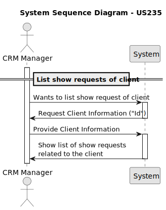
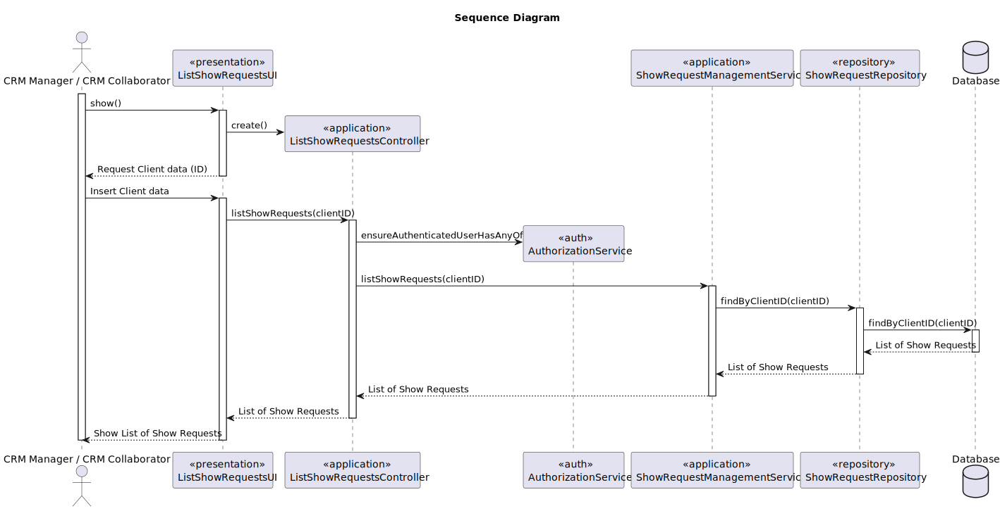
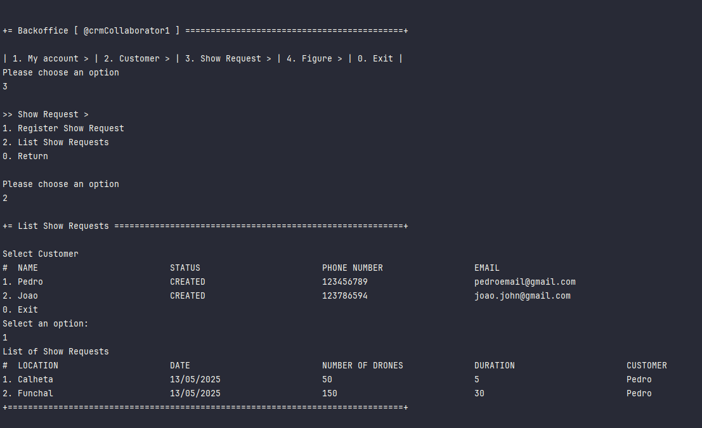

# US 235 - List show requests of client

## 1. Context

* This functionality helps CRM users track client engagement, follow up on ongoing or past requests, and ensure a high level of customer service.
Therefore, a feature to list all show requests associated with a client, including their current status, is essential for efficient and informed client management.

## 2. Requirements

**US235** - As CRM Manager or CRM Collaborator, I want to list all show requests of a client.
The show request status information should be provided.


**Acceptance Criteria:**

- US235.1 When the list is displayed, each request must include its current status.

- US235.2 Given a client with no show requests, a message should be displayed indicating that no requests were related to that client.


**Dependencies/References:**

* This user story depends on US230 because to list the show requests, the CRM Collaborator must register them in the system before.

**Forum Insight:**

>> Ao listar um show request, além de mostrar campos como "request ID", "date/time", "location", "number of drones", "duration", e "current status", também prefere que seja mostrado a descrição do show request? Esta dúvida surgiu pois queriamos confirmar se não fica demasiada informação a exibir.
>
> Porquê incluir "number of drones" e "duration", mas excluir a descrição?! A ideia da US235 é consultar o conteúdo do show request ou listar os show requests de um cliente?


>> Que informação deve ser exibida em cada show request? Tudo o que foi inserido no momento de criação deste + data de criação e o colaborador?
>
> Ao listar os show requests de um cliente não se pode saturar a UI de informação, sob pena de se tornar inútil. Listar todos os show requests com certeza que é diferente de consultar todos os detalhes de um show request.

>> A lista deve incluir show requests com qualquer status (Created ou Draft) ou só os ativos (Created)?
>
> O texto da US não apresenta restrições.

>> No caso do CRM collaborator, ele pode ver os pedidos de qualquer cliente, ou só os pedidos atribuídos à ele?
>
> Dá-me a impressão que a pergunta é disparatada, uma vez que não encontro nada sobre "atribuir show request a CRM Collaborator". Se existe, agradeço que me indique onde está.


## 3. Analysis




## 4. Design


### 4.1. Sequence Diagram



### 4.3. Applied Patterns

- Information Expert
- Controller
- Low Coupling
- High Cohesion
- Pure Fabrication
- Indirection

### 4.4. Acceptance Tests

**Test 1:** *Verifies that findByCustomer returns the correct show requests for a given customer*

```
    @Test
    void findByCustomer_returnsRequests() {
        List<ShowRequest> expected = List.of(showRequest);
        when(showRequestRepository.findByCustomer(customer)).thenReturn(expected);

        Iterable<ShowRequest> result = service.findByCustomer(customer);

        assertNotNull(result);
        assertEquals(expected, result);
        verify(showRequestRepository).findByCustomer(customer);
    }
````


## 5. Implementation

**ListShowRequestsAction**

```java
public class ListShowRequestsAction implements Action {
    @Override
    public boolean execute() {
        return new ListShowRequestsUI().show();
    }
}
```
**ListShowRequestsUI**

```java
public class ListShowRequestsUI extends AbstractUI {

    private final ListShowRequestsController controller = new ListShowRequestsController();

    @Override
    protected boolean doShow() {
        Iterable<Customer> customers = this.controller.listCustomers();
        if (!customers.iterator().hasNext()) {
            System.out.println("There are no registered Customers in the system!");
            return false;
        } else {
            String headerModel = String.format("Select Customer\n#  %-30s%-30s%-30s%-30s", "NAME", "STATUS", "PHONE NUMBER", "EMAIL");
            final SelectWidget<Customer> selector = new SelectWidget<>(headerModel, customers, new CustomerPrinter());
            selector.show();
            final Customer customer = selector.selectedElement();
            if (customer == null) {
                System.out.println("No customer selected!");
                return false;
            }else{
                final Iterable<ShowRequest> showRequests = this.controller.findByCustomer(customer);
                if(!showRequests.iterator().hasNext()) {
                    System.out.println("There are no registered Show Requests in the system for this Customer!");
                } else {
                    String headerShowRequest = String.format("List of Show Requests\n#  %-30s%-30s%-30s%-30s%-30s", "LOCATION", "DATE", "NUMBER OF DRONES", "DURATION", "CUSTOMER");
                    final ListWidget<ShowRequest> listWidget = new ListWidget<>(headerShowRequest, showRequests, new ShowRequestPrinter());
                    listWidget.show();
                }
            }
        }
        return true;
    }

    @Override
    public String headline() {
        return "List Show Requests";
    }
}
```

**ListShowRequestsController**

```java
@UseCaseController
public class ListShowRequestsController {

    private final AuthorizationService authz = AuthzRegistry.authorizationService();

    private final CustomerRepository customerRepository = PersistenceContext.repositories().customers();
    private final CustomerManagementService customerManagementService = new CustomerManagementService(customerRepository);

    private final ShowRequestRepository showRequestRepository = PersistenceContext.repositories().showRequests();

    private final ShowRequestManagementService showRequestManagementService = new ShowRequestManagementService(showRequestRepository);

    public Iterable<Customer> listCustomers() {
        return customerManagementService.findAllActiveCustomers();
    }

    public Iterable<ShowRequest> findByCustomer(Customer customer) {
        authz.ensureAuthenticatedUserHasAnyOf(Roles.CRM_COLLABORATOR, Roles.CRM_MANAGER);
        return showRequestManagementService.findByCustomer(customer);
    }

}
```

**CustomerManagementService**

```java
@Component
public class CustomerManagementService {

    private final CustomerRepository customerRepository;

    public CustomerManagementService(final CustomerRepository customerRepository) {
        this.customerRepository = customerRepository;
    }

    public Customer registerNewCustomer(final String customerName, final String customerAddress, final String customerEmail, final String password, final String customerPhoneNumber, final String customerVatNumber, final SystemUser createdBy, final Customer.CustomerStatus status, final Calendar createdOn) {
        if (customerName == null || customerName.isEmpty()) {
            throw new IllegalArgumentException("Customer name cannot be null or empty");
        }
        if (customerAddress == null || customerAddress.isEmpty()) {
            throw new IllegalArgumentException("Customer address cannot be null or empty");
        }
        if (customerEmail == null || customerEmail.isEmpty() || isEmailUsed(customerEmail)) {
            throw new IllegalArgumentException("Customer email cannot be null or empty");
        }
        if (password == null || password.isEmpty()) {
            throw new IllegalArgumentException("Customer password cannot be null or empty");
        }
        if (customerPhoneNumber == null || customerPhoneNumber.isEmpty()) {
            throw new IllegalArgumentException("Customer phone number cannot be null or empty");
        }
        if (customerVatNumber == null || customerVatNumber.isEmpty() || isVatNumberUsed(customerVatNumber)) {
            throw new IllegalArgumentException("Customer VAT number cannot be null or empty");
        }
        if (createdBy == null) {
            throw new IllegalArgumentException("Created by cannot be null");
        }
        if (status == null) {
            throw new IllegalArgumentException("Customer status cannot be null");
        }
        Customer newCustomer = new Customer(customerName, customerAddress, customerEmail, password, customerPhoneNumber, customerVatNumber, createdBy, status, createdOn);
        return (Customer) this.customerRepository.save(newCustomer);
    }

    public Customer registerNewCustomer(final String customerName, final String customerAddress, final String customerEmail, final String password, final String customerPhoneNumber, final String customerVatNumber, final SystemUser createdBy) {
        return registerNewCustomer(customerName, customerAddress, customerEmail, password, customerPhoneNumber, customerVatNumber, createdBy, Customer.CustomerStatus.CREATED, CurrentTimeCalendars.now());
    }

    public Optional<Customer> findCustomerById(final Long id) {
        return this.customerRepository.findById(id);
    }

    public Iterable<Customer> findAllActiveCustomers() {
        return this.customerRepository.findByActive();
    }

    public Iterable<Customer> findAllCustomers() {
        return this.customerRepository.findAll();
    }

    public Customer changeCustomerStatus(final Customer customer, final Customer.CustomerStatus status) {
        customer.changeStatus(status);
        return (Customer) this.customerRepository.save(customer);
    }


    public boolean isEmailUsed(String customerEmail) {
        return this.customerRepository.isEmailUsed(customerEmail);
    }

    public boolean isVatNumberUsed(String customerVatNumber) {
        return this.customerRepository.isVatNumberUsed(customerVatNumber);
    }
}
```

**ShowRequestManagementService**

```java
public class ShowRequestManagementService {
    private final ShowRequestRepository showRequestRepository;

    public ShowRequestManagementService(final ShowRequestRepository showRequestRepository) {
        this.showRequestRepository = showRequestRepository;
    }
    public ShowRequest registerShowRequest(Customer customer, String location, Calendar date, int duration, int droneNumber, List<Figure> figureSequence) {
        //RequestedFigures newRequestedFigures = new RequestedFigures(figureSequence);
        ShowRequest newShowRequest = new ShowRequest(location, date, droneNumber, duration, figureSequence, customer);
        return (ShowRequest) this.showRequestRepository.save(newShowRequest);
    }

    public Iterable<ShowRequest> findByCustomer(Customer customer) {
        return this.showRequestRepository.findByCustomer(customer);
    }

}
```

**Customer**

```java
@Entity
public class Customer implements AggregateRoot<Long> {

    @Id
    @GeneratedValue(strategy = GenerationType.AUTO)
    private Long customerId;

    @Column( unique = true, nullable = false)
    private String customerName;

    @Column
    private String customerAddress;
    @Column( unique = true, nullable = false)
    private String customerEmail;
    @Column
    private String customerPassword;
    @Column
    private String customerPhoneNumber;
    @Column
    private String customerVatNumber;

    @OneToMany(mappedBy = "associatedCustomer", cascade = CascadeType.ALL)
    private List<Representative> representatives;

    @ManyToOne
    private SystemUser createdBy;
    @Temporal(TemporalType.DATE)
    private Calendar createdOn;

    @Enumerated(EnumType.STRING)
    @Column(nullable = false)
    private CustomerStatus status;


    public enum CustomerStatus {
        DELETED,
        INFRINGEMENT,
        CREATED,
        REGULAR,
        VIP
    }

    protected Customer() {
    }

    public Customer(final String customerName, final String customerAddress, final String customerEmail, final String password, final String customerPhoneNumber, final String customerVatNumber, final SystemUser createdBy, final CustomerStatus status, final Calendar createdOn) {
        this.customerName = customerName;
        this.customerAddress = customerAddress;
        this.customerEmail = customerEmail;
        this.customerPassword = password;
        this.customerPhoneNumber = customerPhoneNumber;
        this.customerVatNumber = customerVatNumber;
        this.createdBy = createdBy;
        this.status = status;
        this.createdOn = createdOn == null ? CurrentTimeCalendars.now() : createdOn;
        this.representatives = new ArrayList<>();
    }

    public String customerName() {
        return this.customerName;
    }
    public String customerAddress() {
        return this.customerAddress;
    }
    public String customerEmail() {
        return this.customerEmail;
    }
    public String customerPassword() {
        return this.customerPassword;
    }
    public String customerPhoneNumber() {
        return this.customerPhoneNumber;
    }
    public String customerVatNumber() {
        return this.customerVatNumber;
    }
    public SystemUser createdBy() {
        return this.createdBy;
    }
    public Calendar createdOn() {
        return this.createdOn;
    }

    public CustomerStatus status() {
        return this.status;
    }
    public void changeStatus(CustomerStatus newStatus) {
        this.status = newStatus;
    }
    public List<Representative> representatives() {
        return this.representatives;
    }
    public void addRepresentative(Representative representative) {
        this.representatives.add(representative);
    }

    @Override
    public String toString() {
        return "Customer{" +
                "customerName='" + customerName + '\'' +
                ", customerAddress='" + customerAddress + '\'' +
                ", customerEmail='" + customerEmail + '\'' +
                ", CustomerPassword='" + customerPassword + '\'' +
                ", customerPhoneNumber='" + customerPhoneNumber + '\'' +
                ", customerVatNumber='" + customerVatNumber + '\'' +
                ", status=" + status + '\'' +
                ", createdBy=" + createdBy + '\'' +
                ", createdOn=" + createdOn + '\'' +
                ", representatives=" + representatives +
                '}';
    }

    @Override
    public boolean sameAs(final Object other) {
        if (this == other) return true;
        if (!(other instanceof Customer)) return false;
        Customer that = (Customer) other;
        return customerId != null && customerId.equals(that.customerId);
    }

    @Override
    public Long identity() {
        return this.customerId;
    }
}
```

**ShowRequest**

```java
@Entity
public class ShowRequest implements AggregateRoot<Long> {
    @Id
    @GeneratedValue(strategy = GenerationType.AUTO)
    private Long showRequestId;

    @Temporal(TemporalType.DATE)
    private Calendar createdOn;

    @Column(nullable = false)
    private String location;

    @Temporal(TemporalType.DATE)
    private Calendar date;

    @Column(nullable = false)
    private int droneNumber;

    @Column(nullable = false)
    private int duration;

    @ManyToMany
    private List<Figure> requestedFigures;

    @Enumerated(EnumType.STRING)
    @Column(nullable = false)
    private ShowRequestStatus status;

    @ManyToOne
    private Customer customer;

    protected ShowRequest() {}

    public ShowRequest(String location, Calendar date, int droneNumber, int duration, List<Figure> requestedFigures, Customer customer) {
        this.location = location;
        this.date = date;
        this.droneNumber = droneNumber;
        this.duration = duration;
        this.requestedFigures = requestedFigures;
        this.customer = customer;
        this.createdOn = Calendar.getInstance();
        this.status = ShowRequestStatus.PENDING;
    }

    public Calendar createdOn() { return this.createdOn; }

    public String location() { return this.location; }

    public Calendar date() { return this.date; }

    public int droneNumber() { return this.droneNumber; }

    public int duration() { return this.duration; }

    public List<Figure> requestedFigures() { return this.requestedFigures; }

    public ShowRequestStatus status() { return this.status; }

    public Customer customer() { return this.customer; }

    @Override
    public String toString() {
        return "ShowRequest{" +
                "showRequestId=" + showRequestId +
                ", createdOn=" + createdOn +
                ", location='" + location + '\'' +
                ", date=" + date +
                ", droneNumber=" + droneNumber +
                ", duration=" + duration +
                ", requestedFigures=" + requestedFigures +
                ", status=" + status +
                '}';
    }

    @Override
    public boolean sameAs(Object other) {
        if (this == other) return true;
        if (!(other instanceof ShowRequest)) return false;
        ShowRequest that = (ShowRequest) other;
        return showRequestId != null && showRequestId.equals(that.showRequestId);
    }

    @Override
    public Long identity() {
        return showRequestId;
    }
}
```

## 6. Integration/Demonstration

**Show Request List of Client**



