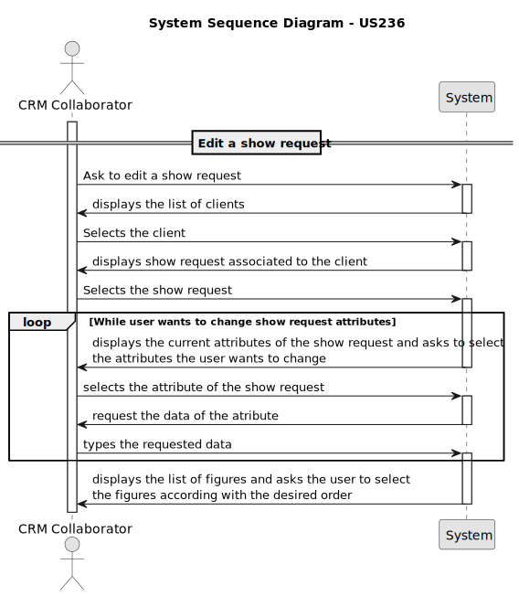
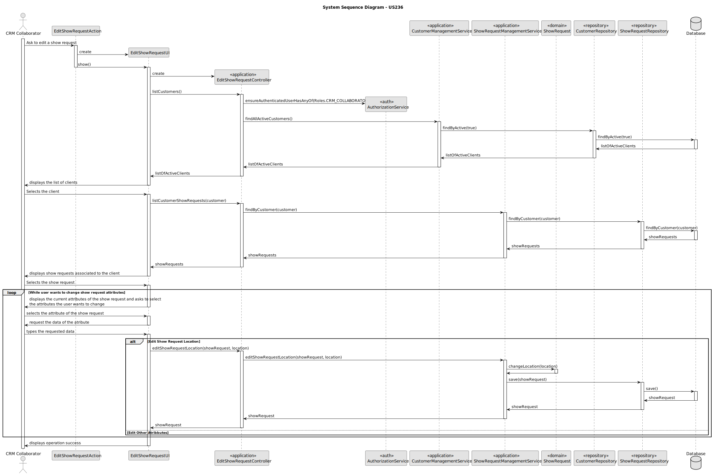

# US 236 - Edit a show request

## 1. Context

* In the Shodrone CRM system, a show request is created by a CRM Collaborator when a customer expresses interest in scheduling a drone show. This request includes details such as customer identity, event location, date and time, tentative number of drones, duration, and a document describing the sequence of figures and exclusivity requirements.
* User Story US236 is focused on allowing CRM Collaborators to edit show requests — but strictly only those that do not yet have an associated proposal. This ensures consistency and integrity of the negotiation and proposal process, preventing retroactive changes that could impact agreed terms or design work already underway.

## 2. Requirements

**US236** - As CRM Collaborator, I want to edit a show requests of a client.

**Acceptance Criteria:**

- US230.1 The system must guarantee only show requests without a proposal can be edited.

**Dependencies/References:**

* This user story depends on user story US230 because to edit a show request the show request must already be registered in the system

**Forum Insight:**

>>Boa tarde,/
Ao editar um show request, acha relevante registar essa edição no seu histórico, uma vez que se trata de um acontecimento relacionado com o próprio show request?/
Muito obrigado,/
Gabriel Sotto Mayor
>
> Boa tarde,/
Parece-me apropriado registar as alterações do show request./
Cumprimentos,/
Angelo Martins

>>Boa tarde,
Relativamente à user story US236 – Edit Show Requests, gostaria de confirmar alguns pontos:\
1 Que campos de um show request podem ser editados?
   É possível editar todos os dados inseridos no momento da criação ou há campos que devem permanecer inalteráveis?\
2 O CRM Collaborator pode editar qualquer show request, ou apenas os criados por si?\
3 Deve existir algum registo dessa edição?\
Cumprimentos,
> 
>Boa tarde,\
1 O enunciado da US236 tem boas indicações sobre o que pode ser alterado. Não me parece razoável alterar o cliente.\
2 No enunciado não são indicadas restrições.\
3 Era muito mau se não houvesse.\
Cumprimentos,\
Angelo Martins

>>Boa tarde,\
Na us 236, todos os campos de um show request podem ser editados ? ou o cliente apenas quer que seja possivel editar alguns campos em especifico ?
Um show request pode ser editato para cancelar o pedido?\
Obrigado.
> 
> Boa tarde,\
1 Não vai alterar o cliente...\
2 Não.\
Cumprimentos,\
Angelo Martins

## 3. Analysis



## 4. Design


### 4.1. Sequence Diagram


* The bottom part of the sequence diagram contains an alternative with "edit other attributes", because editing the other attributes(date, duration, number of drones, sequence of figures) would have flowed the same pattern as editing the location 

### 4.3. Applied Patterns

- Information Expert
- Controller
- Low Coupling
- High Cohesion
- Polymorphism
- Polymorphism
- Pure Fabrication
- Indirection
- Protected Variations

### 4.4. Acceptance Tests


**Test 1:** *Verifies that all active figure categories are returned*

**Refers to Acceptance Criteria:** no acceptance criteria is referenced

```
   @Test
    void findByActive_returnsCorrectList() {
        Iterable<FigureCategory> expected = List.of(
                new FigureCategory("ActiveCat", "Still in use", now)
        );
        when(repo.findByActive(true)).thenReturn(expected);

        Iterable<FigureCategory> result = service.findByActive(true);

        assertIterableEquals(expected, result);
    }
```
**Test 2:** *Verifies that all the show requests associated to the customer are returned*

**Refers to Acceptance Criteria:** no acceptance criteria is referenced
```
   @Test
    void findByCustomer_returnsRequests() {
        List<ShowRequest> expected = List.of(showRequest);
        when(showRequestRepository.findByCustomer(customer)).thenReturn(expected);

        Iterable<ShowRequest> result = service.findByCustomer(customer);

        assertNotNull(result);
        assertEquals(expected, result);
        verify(showRequestRepository).findByCustomer(customer);
    }
```
**Test 3:** *Verifies that all the figures associated to the customer and public are returned*

**Refers to Acceptance Criteria:** no acceptance criteria is referenced
```
   @Test
    public void findByExclusivityAndCustomer_returnsCorrectFigures() {

        List<Figure> expected = List.of(figure);
        when(repo.findByExclusivityAndCustomer(false, customer)).thenReturn(expected);

        Iterable<Figure> result = service.findByExclusivityAndCustomer(false, customer);

        assertNotNull(result);
        List<Figure> resultList = new ArrayList<>();
        result.forEach(resultList::add);

        assertEquals(1, resultList.size());
        assertEquals(figure, resultList.get(0));
        verify(repo).findByExclusivityAndCustomer(false, customer);
    }
```
**Test 4:** *Verifies that a figure is successfully registered*

**Refers to Acceptance Criteria:** no acceptance criteria is referenced
```
   @Test
    public void registerNewFigure_success() {
        when(repo.save(any(Figure.class))).thenAnswer(i -> i.getArguments()[0]);

        Figure result = service.registerNewFigure(
                "Triângulo equilátero",
                Set.of("triângulo", "ângulo", "figura"),
                category,
                false,
                null
        );

        assertEquals("Triângulo equilátero", result.description());
        verify(repo).save(any(Figure.class));
    }
```
**Test 5:** *Verifies that all active customers are returned*

**Refers to Acceptance Criteria:** no acceptance criteria is referenced
```
   @Test
    void findAllActiveCustomers_shouldReturnActiveCustomers() {
        List<Customer> expected = List.of(customer);
        when(customerRepository.findByActive()).thenReturn(expected);

        Iterable<Customer> result = service.findAllActiveCustomers();

        assertNotNull(result);
        assertEquals(expected, result);
        verify(customerRepository).findByActive();
    }
```
**Test 6:** *Verifies that the show request location is edited*

**Refers to Acceptance Criteria:** no acceptance criteria is referenced
```
   @Test
    void editShowRequestLocation_success() {
        String newLocation = "Avenida Central";
        showRequest.changeLocation(newLocation);

        when(showRequestRepository.save(any(ShowRequest.class)))
                .thenReturn(showRequest);

        ShowRequest updated = service.editShowRequestLocation(showRequest, newLocation);

        assertNotNull(updated);
        assertEquals(newLocation, updated.location());
        verify(showRequestRepository).save(showRequest);
    }
    @Test
    void changeLocation_updatesLocation() {
        ShowRequest request = new ShowRequest("Old Place", now, 2, 20, figures, customer);
        request.changeLocation("New Place");
        assertEquals("New Place", request.location());
    }

    @Test
    void changeLocation_null_throwsException() {
        ShowRequest request = new ShowRequest("Old Place", now, 2, 20, figures, customer);
        assertThrows(IllegalArgumentException.class, () -> request.changeLocation(null));
    }
```
**Test 7:** *Verifies that the show request date is edited*

**Refers to Acceptance Criteria:** no acceptance criteria is referenced
```
   @Test
    void editShowRequestDate_success() {
        Calendar newDate = Calendar.getInstance();
        newDate.add(Calendar.DAY_OF_MONTH, 10);
        showRequest.changeDate(newDate);

        when(showRequestRepository.save(any(ShowRequest.class)))
                .thenReturn(showRequest);

        ShowRequest updated = service.editShowRequestDate(showRequest, newDate);

        assertNotNull(updated);
        assertEquals(newDate, updated.date());
        verify(showRequestRepository).save(showRequest);
    }
    @Test
    void changeDate_updatesDate() {
        ShowRequest request = new ShowRequest("Location", now, 2, 20, figures, customer);
        Calendar newDate = Calendar.getInstance();
        newDate.add(Calendar.DAY_OF_MONTH, 10);
        request.changeDate(newDate);
        assertEquals(newDate, request.date());
    }

    @Test
    void changeDate_null_throwsException() {
        ShowRequest request = new ShowRequest("Location", now, 2, 20, figures, customer);
        assertThrows(IllegalArgumentException.class, () -> request.changeDate(null));
    }
```
**Test 8:** *Verifies that the show request drone number is edited*

**Refers to Acceptance Criteria:** no acceptance criteria is referenced
```
   @Test
    void editShowRequestDroneNumber_success() {
        int newDroneNumber = 8;
        showRequest.changeDroneNumber(newDroneNumber);

        when(showRequestRepository.save(any(ShowRequest.class)))
                .thenReturn(showRequest);

        ShowRequest updated = service.editShowRequestDroneNumber(showRequest, newDroneNumber);

        assertNotNull(updated);
        assertEquals(newDroneNumber, updated.droneNumber());
        verify(showRequestRepository).save(showRequest);
    }
    @Test
    void changeDroneNumber_validNumber_updatesNumber() {
        ShowRequest request = new ShowRequest("Location", now, 2, 20, figures, customer);
        request.changeDroneNumber(7);
        assertEquals(7, request.droneNumber());
    }

    @Test
    void changeDroneNumber_zero_throwsException() {
        ShowRequest request = new ShowRequest("Location", now, 2, 20, figures, customer);
        assertThrows(IllegalArgumentException.class, () -> request.changeDroneNumber(0));
    }
```
**Test 9:** *Verifies that the show request duration is edited*

**Refers to Acceptance Criteria:** no acceptance criteria is referenced
```
   @Test
    void editShowRequestDuration_success() {
        int newDuration = 45;
        showRequest.changeDuration(newDuration);

        when(showRequestRepository.save(any(ShowRequest.class)))
                .thenReturn(showRequest);

        ShowRequest updated = service.editShowRequestDuration(showRequest, newDuration);

        assertNotNull(updated);
        assertEquals(newDuration, updated.duration());
        verify(showRequestRepository).save(showRequest);
    }
    @Test
    void changeDuration_valid_updatesDuration() {
        ShowRequest request = new ShowRequest("Location", now, 2, 20, figures, customer);
        request.changeDuration(50);
        assertEquals(50, request.duration());
    }

    @Test
    void changeDuration_null_throwsException() {
        ShowRequest request = new ShowRequest("Location", now, 2, 20, figures, customer);
        assertThrows(IllegalArgumentException.class, () -> request.changeDuration(null));
    }
```
**Test 10:** *Verifies that the show request sequence of figures is edited*

**Refers to Acceptance Criteria:** no acceptance criteria is referenced
```
   @Test
    void editShowRequestSequenceOfFigures_success() {
        Set<String> keywords = new HashSet<>(Set.of("circle", "round"));
        Figure newFigure = new Figure("Circle", keywords, category, true, null);
        List<Figure> newFigures = List.of(newFigure);

        showRequest.changeRequestedFigures(newFigures);

        when(showRequestRepository.save(any(ShowRequest.class)))
                .thenReturn(showRequest);

        ShowRequest updated = service.editShowRequestSequenceOfFigures(showRequest, newFigures);

        assertNotNull(updated);
        assertEquals(newFigures, updated.requestedFigures());
        verify(showRequestRepository).save(showRequest);
    }
    @Test
    void changeRequestedFigures_valid_updatesFigures() {
        ShowRequest request = new ShowRequest("Location", now, 2, 20, figures, customer);
        Set<String> newKeywords = new HashSet<>(Set.of("robot", "AI"));
        Figure newFigure = new Figure("Robot figure", newKeywords, category, true, customer);
        List<Figure> newFigures = List.of(newFigure);

        request.changeRequestedFigures(newFigures);
        assertEquals(newFigures, request.requestedFigures());
    }

    @Test
    void changeRequestedFigures_null_throwsException() {
        ShowRequest request = new ShowRequest("Location", now, 2, 20, figures, customer);
        assertThrows(IllegalArgumentException.class, () -> request.changeRequestedFigures(null));
    }
```

## 5. Implementation

**EditShowRequestAction**
```java
package eapli.base.app.backoffice.presentation.showRequestManagement;

import eapli.framework.actions.Action;

public class EditShowRequestAction implements Action{
    @Override
    public boolean execute() {
        return new EditShowRequestUI().show();
    }
}

```
**EditShowRequestUI**
```java
package eapli.base.app.backoffice.presentation.showRequestManagement;

import eapli.base.app.backoffice.presentation.customerManagement.CustomerPrinter;
import eapli.base.app.backoffice.presentation.figureCategoryManagement.FigureCategoryPrinter;
import eapli.base.app.backoffice.presentation.figureManagement.FigurePrinter;
import eapli.base.customerManagement.domain.Customer;
import eapli.base.figureCategoryManagement.domain.FigureCategory;
import eapli.base.figureManagement.domain.Figure;
import eapli.base.showRequestManagement.application.EditShowRequestController;
import eapli.base.showRequestManagement.domain.GenericSelector;
import eapli.base.showRequestManagement.domain.ShowRequest;
import eapli.framework.io.util.Console;
import eapli.framework.presentation.console.AbstractUI;
import eapli.framework.presentation.console.SelectWidget;

import java.text.ParseException;
import java.text.SimpleDateFormat;
import java.util.*;

public class EditShowRequestUI extends AbstractUI {
    private final EditShowRequestController controller = new EditShowRequestController();
    SimpleDateFormat sdf = new SimpleDateFormat("dd/MM/yyyy");
    @Override
    protected boolean doShow() {
        Iterable<Customer> customers = this.controller.listCustomers();
        if (!customers.iterator().hasNext()) {
            System.out.println("There are no registered Customers in the system!");
            return false;
        }
        String headerModel = String.format("Select Customer\n#  %-30s%-30s%-30s%-30s", "NAME", "STATUS", "PHONE NUMBER", "EMAIL");
        Customer customer = GenericSelector.selectItem(customers, new CustomerPrinter(), headerModel);

        Iterable<ShowRequest> showRequests = this.controller.listCustomerShowRequests(customer);
        if (!showRequests.iterator().hasNext()) {
            System.out.println("There are no registered Show Requests associated with this Customer!");
            return false;
        }

        headerModel = String.format("\nSelect a Show Requests\n#  %-30s%-30s%-30s%-30s%-30s", "LOCATION", "DATE", "NUMBER OF DRONES", "DURATION", "CUSTOMER");
        ShowRequest showRequest = GenericSelector.selectItem(showRequests, new ShowRequestPrinter(), headerModel);
        if (showRequest == null) {
            System.out.println("Show Request cannot be null!");
            return false;
        }
        while (true) {
            menuAttributes(showRequest);
            menuSelection();
            while (true) {
                String input = Console.readLine("Enter your choice: ");
                if (!input.matches("[0-5]")) {
                    System.out.println("Invalid option. Please enter a number between 0 and 5.");
                    continue;
                }
                int choice = Integer.parseInt(input);

                if (choice == 0) {
                    return true;
                }
                switch (choice) {
                    case 1:
                        System.out.println("\nEdit Show Request Location");
                        String location = requestLocation();
                        showRequest = this.controller.editShowRequestLocation(showRequest, location);
                        break;
                    case 2:
                        System.out.println("\nEdit Show Request Date");
                        Calendar date = requestDate();
                        showRequest = this.controller.editShowRequestDate(showRequest, date);
                        break;
                    case 3:
                        System.out.println("\nEdit Show Request Drone Number");
                        int droneNumber = requestDroneNumber();
                        showRequest = this.controller.editShowRequestDroneNumber(showRequest, droneNumber);
                        break;
                    case 4:
                        System.out.println("\nEdit Show Request Duration");
                        int duration = requestDuration();
                        showRequest = this.controller.editShowRequestDuration(showRequest, duration);
                        break;
                    case 5:
                        System.out.println("\nEdit Show Request Sequence of Figures");
                        List<Figure> sequenceFigures = requestSequenceOfFigures(customer);
                        showRequest = this.controller.editShowRequestSequenceOfFigures(showRequest, sequenceFigures);
                        break;
                }
                break;
            }
        }
    }

    @Override
    public String headline() {
        return "";
    }

    private void menuAttributes(ShowRequest showRequest) {
        System.out.println("\nCurrent Show Request attributes:");
        System.out.printf("Location: %s\n", showRequest.location());
        System.out.printf("Date: %s\n", showRequest.date()!= null ? sdf.format(showRequest.date().getTime()) : "N/A");
        System.out.printf("Drone Number: %s\n", showRequest.droneNumber());
        System.out.printf("Duration: %s\n", showRequest.duration());
        List<Figure> figureSequence = showRequest.requestedFigures();
        System.out.print("Sequence of figures :");
        for (int i = 0; i < figureSequence.size(); i++) {
            Figure figure = figureSequence.get(i);
            System.out.printf("%-20s", figure.description());
            if (i != figureSequence.size() - 1) {
                System.out.print(" / ");
            } else {
                System.out.print(".\n");
            }
        }
    }
    private void menuSelection() {
        System.out.println("\nSelect the attribute you which to edit.");
        System.out.println("1. Location");
        System.out.println("2. Date");
        System.out.println("3. Drone Number");
        System.out.println("4. Duration");
        System.out.println("5. Sequence of figures");
        System.out.println("0. Exit");
    }
    private String requestLocation() {
        String location;
        do {
            location = Console.readLine("Enter the show location:");
            if (location.trim().isEmpty() || location.matches("\\d+")) {
                System.out.println("Invalid location. It cannot be empty or consist only of numbers. Please enter a valid location.");
            }
        } while (location.trim().isEmpty() || location.matches("\\d+"));
        return location;
    }
    private Calendar requestDate() {
        Calendar date = null;
        SimpleDateFormat sdf = new SimpleDateFormat("yyyy-MM-dd");
        sdf.setLenient(false);
        Calendar currentDate = Calendar.getInstance();

        String dateRegex = "\\d{4}-\\d{2}-\\d{2}";

        while (date == null) {
            String dateInput = Console.readLine("Enter the show date (yyyy-MM-dd):");

            if (!dateInput.matches(dateRegex)) {
                System.out.println("Invalid date. Please ensure the date is real and follows the format yyyy-MM-dd.");
                continue;
            }

            try {
                Date parsedDate = sdf.parse(dateInput);
                Calendar enteredDate = Calendar.getInstance();
                enteredDate.setTime(parsedDate);

                if (enteredDate.before(currentDate)) {
                    System.out.println("The entered date is in the past. Please enter a future date.");
                } else {
                    date = enteredDate;
                }

            } catch (ParseException e) {
                System.out.println("Invalid date. Please ensure the date is real and follows the format yyyy-MM-dd.");
            }
        }
        return date;
    }
    private int requestDroneNumber() {
        int droneNumber = -1;
        while (droneNumber <= 0) {
            try {
                droneNumber = Integer.parseInt(Console.readLine("Enter number of drones:"));
                if (droneNumber <= 0) {
                    System.out.println("The number must be greater than 0.");
                }
            } catch (NumberFormatException e) {
                System.out.println("Invalid input. Please enter a valid integer.");
            }
        }
        return droneNumber;
    }

    private int requestDuration() {
        int duration = -1;
        while (duration <= 0) {
            try {
                duration = Integer.parseInt(Console.readLine("Enter duration (in minutes):"));
                if (duration <= 0) {
                    System.out.println("Duration must be greater than 0.");
                }
            } catch (NumberFormatException e) {
                System.out.println("Invalid input. Please enter a valid integer.");
            }
        }
        return duration;
    }

    private List<Figure> requestSequenceOfFigures(Customer customer) {
        Iterable<Figure> figures = this.controller.figures(customer);
        boolean inputAnswer = true;
        boolean start = true;
        while (inputAnswer) {
            System.out.println("Current list of available figures: ");
            for (Figure figure : figures) {
                System.out.println(figure.description());
            }
            System.out.print("\n");
            inputAnswer = verifyAddFigure(start);
            start = false;
            if (inputAnswer) {
                try {
                    FigureCategory figureCategory = requestCategory();
                    String description = requestDescription();
                    Set<String> keywords = requestListKeywords();
                    if(excluviseMenu()){
                        boolean exclusive = true;
                        controller.addFigure(description, keywords, figureCategory, exclusive, customer);
                    } else {
                        boolean exclusive = false;
                        controller.addFigure(description, keywords, figureCategory, exclusive, null);
                    }
                    figures = this.controller.figures(customer);

                } catch (IllegalArgumentException e) {
                    System.out.println("ERROR: " + e.getMessage());
                    return null;
                }
            }
        }
        List<Figure> figureSequence = new ArrayList<>();
        List<Figure> availableFigures = new ArrayList<>();
        figures.forEach(availableFigures::add);
        final SelectWidget<Figure> selectWidgetFigure = new SelectWidget<>("Available figures (Enter 0 to finish)", availableFigures, new FigurePrinter());
        System.out.println("\nSelect the following figures in the pretended order.");
        while (true) {
            if (availableFigures.isEmpty()) {
                System.out.println("No more figures available to select.");
                break;
            }

            selectWidgetFigure.show();
            Figure selected = selectWidgetFigure.selectedElement();

            if (selected == null) {
                if (figureSequence.isEmpty()) {
                    System.out.println("You must select at least one figure before exiting.");
                    continue;
                } else {
                    break;
                }
            } else {
                figureSequence.add(selected);
                availableFigures.remove(selected);
            }

            System.out.print("Current sequence of figures: ");
            for (int i = 0; i < figureSequence.size(); i++) {
                Figure figure = figureSequence.get(i);
                System.out.printf("%-20s", figure.description());
                if (i != figureSequence.size() - 1) {
                    System.out.print(" / ");
                } else {
                    System.out.print(".");
                }
            }
            System.out.println("\n");
        }
        return figureSequence;
    }
    private boolean verifyAddFigure(boolean start) {
        String newFigureInput;
        boolean inputAnswer;

        do {
            if (start) {
                newFigureInput = Console.readLine("Do you wish to add a figure? (yes/no):").trim().toLowerCase();
            } else {
                newFigureInput = Console.readLine("Do you wish to add another figure? (yes/no):").trim().toLowerCase();
            }
            if (newFigureInput.isEmpty() || (!newFigureInput.equals("yes") && !newFigureInput.equals("no"))) {
                System.out.println("Invalid input. Please type 'yes' or 'no'.");
            }
        } while (newFigureInput.isEmpty() || (!newFigureInput.equals("yes") && !newFigureInput.equals("no")));

        inputAnswer = newFigureInput.equals("yes");
        return inputAnswer;
    }
    private boolean excluviseMenu(){
        System.out.println("Is this Figure exclusive to a customer?");
        System.out.println("1. Yes");
        System.out.println("2. No");
        int option = Console.readInteger("Select an option: ");
        switch (option) {
            case 1:
                return true;
            case 2:
                return false;
            default:
                System.out.println("Invalid option. Please try again.");
                excluviseMenu();
        }
        return false;
    }
    private Set<String> requestListKeywords() {
        Set<String> keywords = requestKeyWords();

        while (keywords.isEmpty()) {
            System.out.println("No keywords added. Please enter at least one keyword.");
            keywords = requestKeyWords();
        }
        return keywords;
    }
    private Set<String> requestKeyWords(){
        Set<String> keywords = new HashSet<>();
        System.out.println("\nInsert keywords:");
        boolean addMore = true;
        while (addMore) {
            String kw = Console.readLine("Enter a keyword:").trim();
            if (!kw.isEmpty()) {
                keywords.add(kw);
            } else {
                System.out.println("ERROR: Keyword cannot be empty. Please enter a valid keyword.");
            }

            String response = Console.readLine("Do you want to add another keyword? (yes/no):").trim().toLowerCase();
            addMore = response.equals("yes");
        }
        return keywords;
    }
    private FigureCategory requestCategory() {
        FigureCategory figureCategory;
        Iterable<FigureCategory> iterable = controller.listFigureCategories();

        if (!iterable.iterator().hasNext()) {
            throw new IllegalArgumentException("No figure categories available.");
        }
        String headerFigureCategoryModel = String.format("Select Figure Category\n#  %-30s%-30s%-30s%-30s%-30s", "NAME", "DESCRIPTION", "STATUS", "CREATED ON", "CHANGED ON");
        final SelectWidget<FigureCategory> selector = new SelectWidget<>(headerFigureCategoryModel, iterable, new FigureCategoryPrinter());
        selector.show();

        figureCategory = selector.selectedElement();
        while (figureCategory == null) {
            System.out.println("No figure category selected! Please select a valid category.");
            selector.show();
            figureCategory = selector.selectedElement();
        }
        return figureCategory;
    }
    private String requestDescription() {
        String description = "";
        boolean validDescription = false;
        while (!validDescription) {
            description = Console.readLine("Enter figure description:").trim();
            if (description.isEmpty()) {
                System.out.println("Description cannot be empty. Please enter a valid description.");
            } else {
                validDescription = true;
            }
        }
        return description;
    }
}

```
**EditShowRequestController**
```java
package eapli.base.showRequestManagement.application;

import eapli.base.customerManagement.application.CustomerManagementService;
import eapli.base.customerManagement.domain.Customer;
import eapli.base.customerManagement.repositories.CustomerRepository;
import eapli.base.figureCategoryManagement.application.FigureCategoryManagementService;
import eapli.base.figureCategoryManagement.domain.FigureCategory;
import eapli.base.figureCategoryManagement.repositories.FigureCategoryRepository;
import eapli.base.figureManagement.application.FigureManagementService;
import eapli.base.figureManagement.domain.Figure;
import eapli.base.figureManagement.repository.FigureRepository;
import eapli.base.infrastructure.persistence.PersistenceContext;
import eapli.base.showRequestManagement.domain.ShowRequest;
import eapli.base.showRequestManagement.repositories.ShowRequestRepository;
import eapli.base.usermanagement.domain.Roles;
import eapli.framework.application.UseCaseController;
import eapli.framework.infrastructure.authz.application.AuthorizationService;
import eapli.framework.infrastructure.authz.application.AuthzRegistry;

import java.util.Calendar;
import java.util.List;
import java.util.Set;

@UseCaseController
public class EditShowRequestController {
    private final AuthorizationService authz = AuthzRegistry.authorizationService();
    private final CustomerRepository customerRepository = PersistenceContext.repositories().customers();
    private final CustomerManagementService customerManagementService = new CustomerManagementService(customerRepository);
    private final ShowRequestRepository showRequestRepository = PersistenceContext.repositories().showRequests();
    private final ShowRequestManagementService showRequestManagementService = new ShowRequestManagementService(showRequestRepository);
    private final FigureRepository figureRepository = PersistenceContext.repositories().figures();
    private final FigureManagementService figureManagementService = new FigureManagementService(figureRepository);
    private final FigureCategoryRepository figureCategoryRepository = PersistenceContext.repositories().figureCategories();
    private final FigureCategoryManagementService figureCategoryManagementService = new FigureCategoryManagementService(figureCategoryRepository);

    public Iterable<Customer> listCustomers() {
        authz.ensureAuthenticatedUserHasAnyOf(Roles.CRM_COLLABORATOR);
        return customerManagementService.findAllActiveCustomers();
    }

    public Iterable<ShowRequest> listCustomerShowRequests(Customer customer) {
        return showRequestManagementService.findByCustomer(customer);
    }

    public Iterable<Figure> figures(Customer customer) {
        return figureManagementService.findByExclusivityAndCustomer(false, customer);
    }

    public Figure addFigure(String figureDescription, Set<String> keywords, FigureCategory figureCategory, boolean exclusive, Customer customer) {
        return figureManagementService.registerNewFigure(figureDescription, keywords, figureCategory, exclusive, customer);
    }

    public Iterable<FigureCategory> listFigureCategories() {
        return figureCategoryManagementService.findByActive(true);
    }

    public ShowRequest editShowRequestLocation(ShowRequest showRequest, String location) {
        return this.showRequestManagementService.editShowRequestLocation(showRequest, location);
    }

    public ShowRequest editShowRequestDate(ShowRequest showRequest, Calendar date) {
        return this.showRequestManagementService.editShowRequestDate(showRequest, date);
    }

    public ShowRequest editShowRequestDroneNumber(ShowRequest showRequest, int droneNumber) {
        return this.showRequestManagementService.editShowRequestDroneNumber(showRequest, droneNumber);
    }

    public ShowRequest editShowRequestDuration(ShowRequest showRequest, int duration) {
        return this.showRequestManagementService.editShowRequestDuration(showRequest, duration);
    }

    public ShowRequest editShowRequestSequenceOfFigures(ShowRequest showRequest, List<Figure> sequenceOfFigures) {
        return this.showRequestManagementService.editShowRequestSequenceOfFigures(showRequest, sequenceOfFigures);
    }
}

```
**CustomerManagementService**
```java
public Iterable<Customer> findAllActiveCustomers() {
   return this.customerRepository.findByActive();
}

```
**FigureManagementService**
```java
public Iterable<Figure> findByExclusivityAndCustomer(boolean exclusive, Customer customer) {
        return this.figureRepository.findByExclusivityAndCustomer(exclusive, customer);
}
public Figure registerNewFigure(String description, Set<String> keywords, FigureCategory figureCategory, boolean exclusive, Customer customer){
   Figure newFigure = new Figure(description, keywords, figureCategory, exclusive, customer);
   return (Figure) this.figureRepository.save(newFigure);
}
```

**FigureCategoryManagementService**
```java
public Iterable<FigureCategory> findByActive(boolean active) {
        return this.figureCategoryRepository.findByActive(active);
}
```
**ShowRequestManagementService**
```java
package eapli.base.showRequestManagement.application;

import eapli.base.customerManagement.domain.Customer;
import eapli.base.figureManagement.domain.Figure;
import eapli.base.showRequestManagement.domain.ShowRequest;
import eapli.base.showRequestManagement.repositories.ShowRequestRepository;

import java.util.Calendar;
import java.util.List;

public class ShowRequestManagementService {
    private final ShowRequestRepository showRequestRepository;

    public ShowRequestManagementService(final ShowRequestRepository showRequestRepository) {
        this.showRequestRepository = showRequestRepository;
    }
    public ShowRequest registerShowRequest(Customer customer, String location, Calendar date, int duration, int droneNumber, List<Figure> figureSequence) {
        //RequestedFigures newRequestedFigures = new RequestedFigures(figureSequence);
        ShowRequest newShowRequest = new ShowRequest(location, date, droneNumber, duration, figureSequence, customer);
        return (ShowRequest) this.showRequestRepository.save(newShowRequest);
    }

    public Iterable<ShowRequest> findByCustomer(Customer customer) {
        return this.showRequestRepository.findByCustomer(customer);
    }

    public ShowRequest editShowRequestLocation(ShowRequest showRequest, String location) {
        showRequest.changeLocation(location);
        return (ShowRequest) this.showRequestRepository.save(showRequest);
    }

    public ShowRequest editShowRequestDate(ShowRequest showRequest, Calendar date) {
        showRequest.changeDate(date);
        return (ShowRequest) this.showRequestRepository.save(showRequest);
    }

    public ShowRequest editShowRequestDroneNumber(ShowRequest showRequest, int droneNumber) {
        showRequest.changeDroneNumber(droneNumber);
        return (ShowRequest) this.showRequestRepository.save(showRequest);
    }

    public ShowRequest editShowRequestDuration(ShowRequest showRequest, int duration) {
        showRequest.changeDuration(duration);
        return (ShowRequest) this.showRequestRepository.save(showRequest);
    }

    public ShowRequest editShowRequestSequenceOfFigures(ShowRequest showRequest, List<Figure> sequenceOfFigures) {
        showRequest.changeRequestedFigures(sequenceOfFigures);
        return (ShowRequest) this.showRequestRepository.save(showRequest);
    }
}

```
**ShowRequest**
```java
package eapli.base.showRequestManagement.domain;

import eapli.base.customerManagement.domain.Customer;
import eapli.base.figureManagement.domain.Figure;
import eapli.framework.domain.model.AggregateRoot;
import jakarta.persistence.*;

import java.util.Calendar;
import java.util.List;

@Entity
public class ShowRequest implements AggregateRoot<Long> {
    @Id
    @GeneratedValue(strategy = GenerationType.AUTO)
    private Long showRequestId;

    @Temporal(TemporalType.DATE)
    private Calendar createdOn;

    @Column(nullable = false)
    private String location;

    @Temporal(TemporalType.DATE)
    private Calendar date;

    @Column(nullable = false)
    private int droneNumber;

    @Column(nullable = false)
    private int duration;

    @ManyToMany
    private List<Figure> requestedFigures;

    @Enumerated(EnumType.STRING)
    @Column(nullable = false)
    private ShowRequestStatus status;

    @ManyToOne
    private Customer customer;

    protected ShowRequest() {}

    public ShowRequest(String location, Calendar date, int droneNumber, int duration, List<Figure> requestedFigures, Customer customer) {
        this.location = location;
        this.date = date;
        this.droneNumber = droneNumber;
        this.duration = duration;
        this.requestedFigures = requestedFigures;
        this.customer = customer;
        this.createdOn = Calendar.getInstance();
        this.status = ShowRequestStatus.PENDING;
    }

    public Calendar createdOn() { return this.createdOn; }

    public String location() { return this.location; }

    public Calendar date() { return this.date; }

    public int droneNumber() { return this.droneNumber; }

    public int duration() { return this.duration; }

    public List<Figure> requestedFigures() { return this.requestedFigures; }

    public ShowRequestStatus status() { return this.status; }

    public Customer customer() { return this.customer; }

    public void changeLocation(String location) {
        if (location != null) {
            this.location = location;
        } else {
            throw new IllegalArgumentException();
        }
    }

    public void changeDate(Calendar date) {
        if (date != null) {
            this.date = date;
        } else {
            throw new IllegalArgumentException();
        }
    }

    public void changeDroneNumber(Integer droneNumber) {
        if (droneNumber != 0) {
            this.droneNumber = droneNumber;
        } else {
            throw new IllegalArgumentException();
        }
    }

    public void changeDuration(Integer duration) {
        if (duration != null) {
            this.duration = duration;
        } else {
            throw new IllegalArgumentException();
        }
    }

    public void changeRequestedFigures(List<Figure> requestedFigures) {
        if (requestedFigures != null) {
            this.requestedFigures = requestedFigures;
        } else {
            throw new IllegalArgumentException();
        }
    }

    @Override
    public String toString() {
        return "ShowRequest{" +
                "showRequestId=" + showRequestId +
                ", createdOn=" + createdOn +
                ", location='" + location + '\'' +
                ", date=" + date +
                ", droneNumber=" + droneNumber +
                ", duration=" + duration +
                ", requestedFigures=" + requestedFigures +
                ", status=" + status +
                '}';
    }

    @Override
    public boolean sameAs(Object other) {
        if (this == other) return true;
        if (!(other instanceof ShowRequest)) return false;
        ShowRequest that = (ShowRequest) other;
        return showRequestId != null && showRequestId.equals(that.showRequestId);
    }

    @Override
    public Long identity() {
        return showRequestId;
    }
}

```


## 6. Integration/Demonstration

**Searching figures by keyword, category or keyword and category**

.png)
.png)
.png)
**Figure Database**


