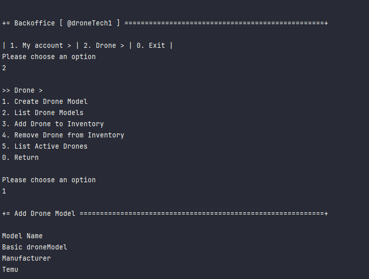
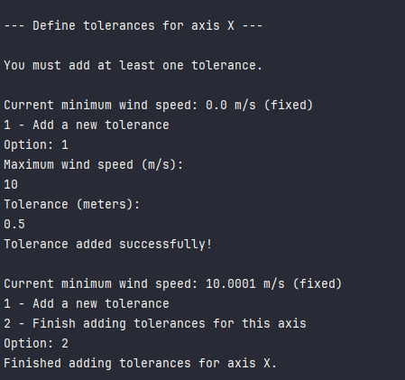
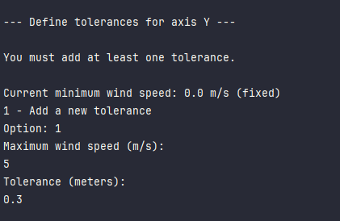
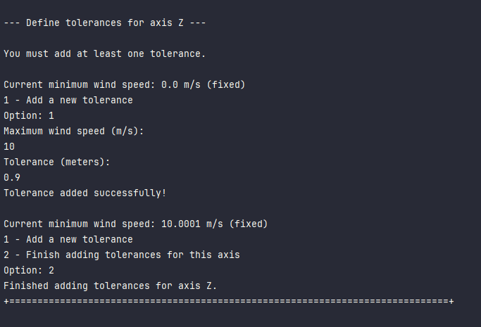
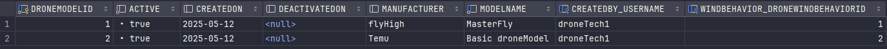

# US 240 - Drone model Creation

## 1. Context

* The goal is to allow Drone Techs to create new drone models in the system, 
either manually through the user interface or automatically through a bootstrap process.


## 2. Requirements

**US240** - As a Drone Tech, I want to create a drone model in the system.
This must also be achieved by a bootstrap process.


**Acceptance Criteria:**

- US240.1 The system must guarantee that all the information to register a drone model is given.

- US240.2 The system must guarantee that the drone model is registered.


**Dependencies/References:**

* This user story doesn't depend on others user stories.


**Forum Insight:**

>> Gostava de esclarecer os conceitos de "drone's model" (secção 3.1.3) e "drone brand/type" (secção 3.1.5)?
>
> "Drone model" e "drone type" serão a mesma coisa.

>> Peço desculpa pelo incómodo, mas no enunciado (pág. 9) está escrito o seguinte:
"To generate the drone's code for a figure, one has to supply the actual drone model for each element.
The same model can be supplied for all drone types, i.e., use a single drone model in the show."
Então só para confirmar "drone type" e "drone model" são mesma coisa?
> 
> Os termos usados pela empresa podem ter diferentes significados em contextos distintos. No caso das figuras, a cada drone type da figura temos de fazer corresponder um drone model. 
É assim que vai poder gerar o código para os drones utilizados.

>> Bom dia, como é que os modelos de drones são identificados no sistema, ou seja, quando
se pesquisa por um modelo por exemplo, pesquisa-se pelo nome ou outra coisa?
>
> A pesquisa pode ser por designação do modelo (mesmo aprcial), fabricante, etc.

>> Esta "linguagem de programação" será sempre uma já estabelecida (como C ou Java) ou uma criada pela Shodrone (como a DSL)? 
É importante á Shodrone saber informação relacionada á linguagem para além do nome/identificação, e se sim, que informação?
>
> Os drones têm linguagens de programação próprias. Acontece que os fabricantes tendem a tentar usar a mesma linguagem em todos os seus modelos. É suposto haver um plugin que é usado para gerar o código do drone a partir da DSL.

>> Existe mais qualquer informação sobre drone models, como um nome ou um número ID?
>
> O fabricante do modelo de drone parece-me importante. O nome do modelo também.

>> Na criação de um drone model, na parte de adicionar a tolerância ao vento, podemos assumir um número mínimo de intervalos a existir para a criação?
>
> Não percebi. Podia explicar melhor?
>> Por exemplo, se existir apenas um intervalo relativamente à tolerância do vento (e.g., vento > 5 — não é seguro voar), isso é válido ou será necessário definir um número mínimo para evitar estes casos?
> 
> O exemplo do documento refere-se a uma dada direção. Pode haver valores para 3 direções (x, y, z).
> Como cliente, não tenho nada contra o o exemplo que dá, mas acredito que vai ter alguns desafios quando implementar o simulador. O meu conselho é que não invente.

>> Boa tarde, dois drone models podem ter o mesmo nome? Se sim, podem ter o mesmo nome e o mesmo fabricante?
>
> Um modelo terá um designação, que provavelmente será única. Pode incluir a versão no nome.


## 3. Analysis


## 4. Design

### 4.1. Sequence Diagram


### 4.3. Applied Patterns

- Information Expert
- Creator
- Controller
- Low Coupling
- High Cohesion
- Pure Fabrication
- Indirection

### 4.4. Acceptance Tests

**Test 1:** *Verifies that a valid DroneModel object is created with the correct properties*

```
    @Test
    void constructor_validData_shouldCreateDroneModel() {
        DroneModel model = new DroneModel("Falcon", "DJI", now, user, behavior);
        assertEquals("Falcon", model.modelName());
        assertEquals("DJI", model.manufacturer());
        assertEquals(user, model.createdBy());
        assertEquals(now, model.createdOn());
        assertEquals(behavior, model.windBehavior());
        assertTrue(model.isActive());
    }
````

**Test 2:** *Verifies that the constructor throws an exception when required parameters are null*

````
    @Test
    void constructor_nullModelName_shouldThrowException() {
        assertThrows(IllegalArgumentException.class, () -> new DroneModel(null, "DJI", now, user, behavior));
    }

    @Test
    void constructor_nullManufacturer_shouldThrowException() {
        assertThrows(IllegalArgumentException.class, () -> new DroneModel("Falcon", null, now, user, behavior));
    }

    @Test
    void constructor_nullBehavior_shouldThrowException() {
        assertThrows(IllegalArgumentException.class, () -> new DroneModel("Falcon", "DJI", now, user, null));
    }
````

**Test 3:** *Verifies that a new drone model is successfully registered when the model name is not already used*

````
    @Test
    public void registerNewDroneModel_success() {
        String name = "Falcon";
        String manufacturer = "DJI";


        when(repo.isDroneModelNameUsed(name)).thenReturn(false);
        when(repo.save(any(DroneModel.class))).thenAnswer(i -> i.getArguments()[0]);

        DroneModel model = service.registerNewDroneModel(name, manufacturer, user, behavior);

        Assertions.assertEquals(name, model.modelName());
        verify(repo).save(any(DroneModel.class));
    }
````

**Test 4:** *Verifies that registering a drone model with a duplicate name throws an exception*

````
    @Test
    void registerNewDroneModel_duplicateName_throwsException() {
        String name = "Falcon";
        when(repo.isDroneModelNameUsed(name)).thenReturn(true);
        assertThrows(IllegalArgumentException.class, () ->
                service.registerNewDroneModel(name, "DJI", user, behavior)
        );
    }
````

**Test 5:** *Verifies that registering a drone model with null parameters throws exceptions*

````
    @Test
    void registerNewDroneModel_null_modelName_throwsException() {

        assertThrows(IllegalArgumentException.class, () ->
                service.registerNewDroneModel(null, "DJI", user, behavior)
        );
    }

    @Test
    void registerNewDroneModel_null_manufacturer_throwsException() {
        String name = "Falcon";
        when(repo.isDroneModelNameUsed(name)).thenReturn(false);

        assertThrows(IllegalArgumentException.class, () ->
                service.registerNewDroneModel(name, null, user, behavior)
        );
    }

    @Test
    void registerNewDroneModel_null_user_throwsException() {
        String name = "Falcon";
        when(repo.isDroneModelNameUsed(name)).thenReturn(false);
        assertThrows(IllegalArgumentException.class, () ->
                service.registerNewDroneModel(name, "DJI", null, behavior)
        );
    }
````

## 5. Implementation

**AddDroneModelAction**

```java
public class AddDroneModelAction implements Action {
    @Override
    public boolean execute() {
        return new AddDroneModelUI().show();
    }
}
```
**AddDroneModelUI**

```java
public class AddDroneModelUI extends AbstractUI {

    private final AddDroneModelController theController = new AddDroneModelController();


    @Override
    protected boolean doShow() {
        final String modelName = Console.readLine("Model Name");
        final String manufacturer = Console.readLine("Manufacturer");
        final DroneWindBehavior windBehavior = new DroneWindBehavior();
        for (Axis axis : Axis.values()) {
            requestWindBehavior(windBehavior, axis);
        }
        try{
            this.theController.addDroneModel(modelName, manufacturer, windBehavior);
        } catch(IllegalArgumentException e){
            System.out.println("\nERROR: " + e.getMessage() + "\n");
        }
        return true;
    }

    @Override
    public String headline() {
        return "Add Drone Model";
    }


    public void requestWindBehavior(DroneWindBehavior windBehavior, Axis axis) {
        double min = 0.0;
        boolean addedAtLeastOne = false;
        Scanner scanner = new Scanner(System.in);

        System.out.println("\n--- Define tolerances for axis " + axis + " ---");

        while (true) {
            if (!addedAtLeastOne) {
                System.out.println("\nYou must add at least one tolerance.");
            }

            System.out.println("\nCurrent minimum wind speed: " + min + " m/s (fixed)");
            System.out.println("1 - Add a new tolerance");
            if (addedAtLeastOne) {
                System.out.println("2 - Finish adding tolerances for this axis");
            }

            System.out.print("Option: ");
            int option;
            try {
                option = Integer.parseInt(scanner.nextLine());
            } catch (NumberFormatException e) {
                System.out.println("Invalid input! Please enter a number.");
                continue;
            }

            if (option == 2 && addedAtLeastOne) {
                //windBehavior.addTolerance(axis,min, Double.MAX_VALUE,);
                break;
            }

            if (option != 1) {
                System.out.println("Invalid option!");
                continue;
            }

            double max = Console.readDouble("Maximum wind speed (m/s): ");
            if (max <= min) {
                System.out.println("Maximum wind speed must be greater than the current minimum!");
                continue;
            }

            double tolerance = Console.readDouble("Tolerance (meters): ");
            boolean success = windBehavior.addTolerance(axis, min, max, tolerance);
            if (success) {
                System.out.println("Tolerance added successfully!");
                min = max + 0.0001;
                addedAtLeastOne = true;
            } else {
                System.out.println("Tolerance not added!");
            }
        }
        System.out.println("Finished adding tolerances for axis " + axis + ".");
    }

}
```

**AddDroneModelController**

```java
@UseCaseController
public class AddDroneModelController {
    private final AuthorizationService authz = AuthzRegistry.authorizationService();

    private final DroneModelRepository repo = PersistenceContext.repositories().droneModels();

    private final DroneModelManagementService droneModelsvc = new DroneModelManagementService(repo);


    public DroneModel addDroneModel(final String modelName, final String manufacturer, final DroneWindBehavior windBehavior) {
        authz.ensureAuthenticatedUserHasAnyOf(Roles.DRONE_TECH);
        return droneModelsvc.registerNewDroneModel(modelName,manufacturer, authz.session().get().authenticatedUser(), windBehavior);
    }
}
```

**DroneModelManagementService**

```java
public class DroneModelManagementService {

    private final DroneModelRepository droneModelRepository;

    public DroneModelManagementService(final DroneModelRepository droneModelRepository){
        this.droneModelRepository = droneModelRepository;
    }

    public DroneModel registerNewDroneModel(final String modelName, final String manufacturer, final Calendar createdOn, final SystemUser createdBy, final DroneWindBehavior windBehavior){
        if(isModelNameUsed(droneModelRepository, modelName)){
            throw new IllegalArgumentException("This Model Name is already registered in the system!");
        }
        if(windBehavior == null){
            throw new IllegalArgumentException("Wind Behavior cannot be null!");
        }
        if (createdBy == null){
            throw new IllegalArgumentException("Created By cannot be null!");
        }
        DroneModel newDroneModel = new DroneModel(modelName, manufacturer, createdOn, createdBy, windBehavior);
        return (DroneModel) this.droneModelRepository.save(newDroneModel);
    }


    public DroneModel registerNewDroneModel(final String modelName, final String manufacturer, final SystemUser createdBy, final DroneWindBehavior windBehavior){
        return registerNewDroneModel(modelName, manufacturer, CurrentTimeCalendars.now(), createdBy, windBehavior);
    }

    public Optional<DroneModel> findById(final Long id){
        return this.droneModelRepository.findById(id);
    }

    public Iterable<DroneModel> findByManufacturer(final String manufacturer){
        return this.droneModelRepository.findByManufacturer(manufacturer);
    }

    public Iterable<DroneModel> findAll(){
        return this.droneModelRepository.findAll();
    }

    public Iterable<DroneModel> listActiveDroneModels(){return this.droneModelRepository.findByActive(true);}


    public DroneModel deactivateDroneModel(final DroneModel droneModel) {
        droneModel.deactivate(CurrentTimeCalendars.now());
        return (DroneModel) this.droneModelRepository.save(droneModel);
    }

    public DroneModel activateDroneModel(final DroneModel droneModel) {
        droneModel.activate();
        return (DroneModel) this.droneModelRepository.save(droneModel);
    }


    public boolean isModelNameUsed(DroneModelRepository repo, String modelName){
        return repo.isDroneModelNameUsed(modelName);
    }
}
```


**DroneModel**

```java
@Entity
public class DroneModel implements AggregateRoot<Long> {

    @Id
    @GeneratedValue(strategy = GenerationType.AUTO)
    private Long droneModelId;

    @Column( unique = true, nullable = false)
    private String modelName;

    private String manufacturer;

    @Temporal(TemporalType.DATE)
    private Calendar createdOn;
    private boolean active;
    @Temporal(TemporalType.DATE)
    private Calendar deactivatedOn;

    @ManyToOne
    private SystemUser createdBy;

    @ManyToOne(cascade = CascadeType.PERSIST)
    private DroneWindBehavior windBehavior;

    protected DroneModel(){
    }


    public DroneModel(final String modelName, final String manufacturer,  final Calendar createdOn, final SystemUser createdBy, final DroneWindBehavior windBehavior) {
        Preconditions.noneNull(new Object[] {modelName, manufacturer, windBehavior});
        this.modelName = modelName;
        this.manufacturer = manufacturer;
        this.createdBy = createdBy;
        this.createdOn = createdOn == null ? CurrentTimeCalendars.now() : createdOn;
        this.windBehavior = windBehavior;
        this.active = true;
    }

    public DroneWindBehavior windBehavior() {return this.windBehavior;}

    public String modelName (){ return this.modelName;}

    public String manufacturer(){return this.manufacturer;}

    public SystemUser createdBy(){return this.createdBy;}

    public Calendar createdOn(){return this.createdOn;}

    public boolean isActive() {return this.active;}

    public Calendar deactivatedOn(){return this.deactivatedOn;}

    public void deactivate(final Calendar deactivatedOn) {
        if (deactivatedOn != null && !deactivatedOn.before(this.createdOn)) {
            if (!this.active) {
                throw new IllegalStateException("Cannot deactivate an inactive Drone Model!");
            } else {
                this.active = false;
                this.deactivatedOn = deactivatedOn;
            }
        } else {
            throw new IllegalArgumentException();
        }
    }

    public void activate() {
        if (!this.isActive()) {
            this.active = true;
            this.deactivatedOn = null;
        }
    }

    @Override
    public boolean sameAs(final Object other) {
        if (this == other) return true;
        if (!(other instanceof DroneModel)) return false;
        DroneModel that = (DroneModel) other;
        return droneModelId != null && droneModelId.equals(that.droneModelId);
    }


    @Override
    public String toString() {
        return "DroneModel{" +
                "modelName='" + modelName + '\'' +
                ", manufacturer='" + manufacturer + '\'' +
                ", active=" + active +
                '}';
    }

    @Override
    public Long identity() {return this.droneModelId;}

}
```

## 6. Integration/Demonstration

**Registering DroneModel**



**Registering WindBehavior for X**



**Registering WindBehavior for Y**



**Registering WindBehavior for Z**



**DroneModel Database**


