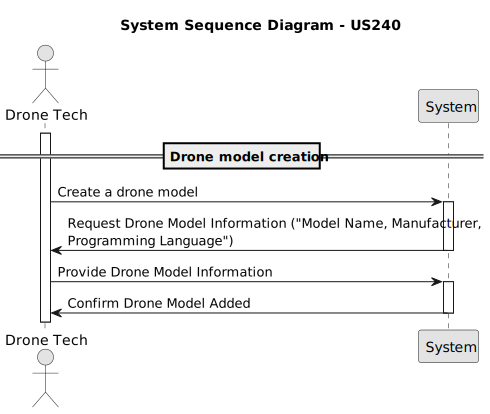
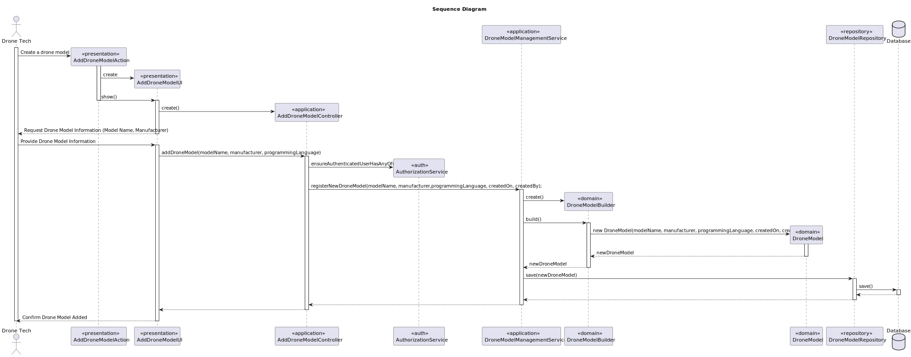

# US 240 - Drone model Creation

## 1. Context

* The goal is to allow Drone Techs to create new drone models in the system, 
either manually through the user interface or automatically through a bootstrap process.


## 2. Requirements

**US240** - As a Drone Tech, I want to create a drone model in the system.
This must also be achieved by a bootstrap process.


**Acceptance Criteria:**

- US240.1 The system must guarantee that all the information to register a drone model is given.

- US240.2 The system must guarantee that the drone model is registered.


**Dependencies/References:**

* This user story doesn't depend on others user stories.


**Forum Insight:**

>> Gostava de esclarecer os conceitos de "drone's model" (secção 3.1.3) e "drone brand/type" (secção 3.1.5)?
>
> "Drone model" e "drone type" serão a mesma coisa.

>> Peço desculpa pelo incómodo, mas no enunciado (pág. 9) está escrito o seguinte:
"To generate the drone's code for a figure, one has to supply the actual drone model for each element.
The same model can be supplied for all drone types, i.e., use a single drone model in the show."
Então só para confirmar "drone type" e "drone model" são mesma coisa?
> 
> Os termos usados pela empresa podem ter diferentes significados em contextos distintos. No caso das figuras, a cada drone type da figura temos de fazer corresponder um drone model. 
É assim que vai poder gerar o código para os drones utilizados.

>> Bom dia, como é que os modelos de drones são identificados no sistema, ou seja, quando
se pesquisa por um modelo por exemplo, pesquisa-se pelo nome ou outra coisa?
>
> A pesquisa pode ser por designação do modelo (mesmo aprcial), fabricante, etc.

>> Esta "linguagem de programação" será sempre uma já estabelecida (como C ou Java) ou uma criada pela Shodrone (como a DSL)? 
É importante á Shodrone saber informação relacionada á linguagem para além do nome/identificação, e se sim, que informação?
>
> Os drones têm linguagens de programação próprias. Acontece que os fabricantes tendem a tentar usar a mesma linguagem em todos os seus modelos. É suposto haver um plugin que é usado para gerar o código do drone a partir da DSL.

>> Existe mais qualquer informação sobre drone models, como um nome ou um número ID?
>
> O fabricante do modelo de drone parece-me importante. O nome do modelo também.


## 3. Analysis



## 4. Design

### 4.1. Sequence Diagram



### 4.3. Applied Patterns

- Domain-Driven Design
- Builder
- Factory

### 4.4. Acceptance Tests

Include here the main tests used to validate the functionality. Focus on how they relate to the acceptance criteria. May be automated or manual tests.

**Test 1:** *Verifies that it is not possible to ...*

**Refers to Acceptance Criteria:** US101.1


```
@Test(expected = IllegalArgumentException.class)
public void ensureXxxxYyyy() {
...
}
````

## 5. Implementation

*In this section the team should present, if necessary, some evidencies that the implementation is according to the design. It should also describe and explain other important artifacts necessary to fully understand the implementation like, for instance, configuration files.*

*It is also a best practice to include a listing (with a brief summary) of the major commits regarding this requirement.*

## 6. Integration/Demonstration

*In this section the team should describe the efforts realized in order to integrate this functionality with the other parts/components of the system*

*It is also important to explain any scripts or instructions required to execute an demonstrate this functionality*

## 7. Observations

*This section should be used to include any content that does not fit any of the previous sections.*

*The team should present here, for instance, a critical prespective on the developed work including the analysis of alternative solutioons or related works*

*The team should include in this section statements/references regarding third party works that were used in the development this work.*
