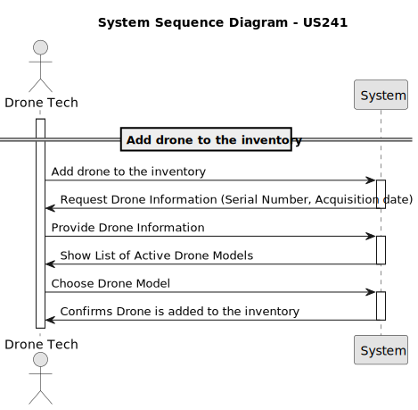

# US 241 - Add drone to the inventory 

## 1. Context

* The aim is to allow Drone Techs to add new drones of an existing model to the system’s inventory. 
Each drone must be registered with a unique serial number to ensure traceability and proper management.


## 2. Requirements

**US241** - As a Drone Tech, I want to add drones of an existing type to inventory. For each drone the serial number has to be stored.
This must also be achieved by a bootstrap process.


**Acceptance Criteria:**

- US241.1 The system must guarantee that all the information to register a drone is given.

- US241.2 The system must guarantee that the drone is added to the inventory.


**Dependencies/References:**

* This user story depends on US240 because to add a drone of an existing type/model, the drone model must be already created.


**Forum Insight:**

>> Que conceito/atributo identifica um Drone? Ou seja, o que deverá diferenciar uma drone de todos as outros?
>
> O que têm normalmente todos os dispositvos de diferente?

>> E relativamente apenas ao drone, que informações devem estar associadas além do estado?
>
> Um drone deve ter naturalmente um número de série e um modelo. 
Normalmente, guarda-se também a data de aquisição. 
Quando for desativado, a data em que isso acontece também é importante.


## 3. Analysis



## 4. Design

*In this sections, the team should present the solution design that was adopted to solve the requirement. This should include, at least, a diagram of the realization of the functionality (e.g., sequence diagram), a class diagram (presenting the classes that support the functionality), the identification and rational behind the applied design patterns and the specification of the main tests used to validade the functionality.*

### 4.1. Realization


### 4.3. Applied Patterns

### 4.4. Acceptance Tests

Include here the main tests used to validate the functionality. Focus on how they relate to the acceptance criteria. May be automated or manual tests.

**Test 1:** *Verifies that it is not possible to ...*

**Refers to Acceptance Criteria:** US101.1


```
@Test(expected = IllegalArgumentException.class)
public void ensureXxxxYyyy() {
...
}
````

## 5. Implementation

*In this section the team should present, if necessary, some evidencies that the implementation is according to the design. It should also describe and explain other important artifacts necessary to fully understand the implementation like, for instance, configuration files.*

*It is also a best practice to include a listing (with a brief summary) of the major commits regarding this requirement.*

## 6. Integration/Demonstration

*In this section the team should describe the efforts realized in order to integrate this functionality with the other parts/components of the system*

*It is also important to explain any scripts or instructions required to execute an demonstrate this functionality*

## 7. Observations

*This section should be used to include any content that does not fit any of the previous sections.*

*The team should present here, for instance, a critical prespective on the developed work including the analysis of alternative solutioons or related works*

*The team should include in this section statements/references regarding third party works that were used in the development this work.*
