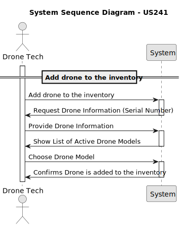
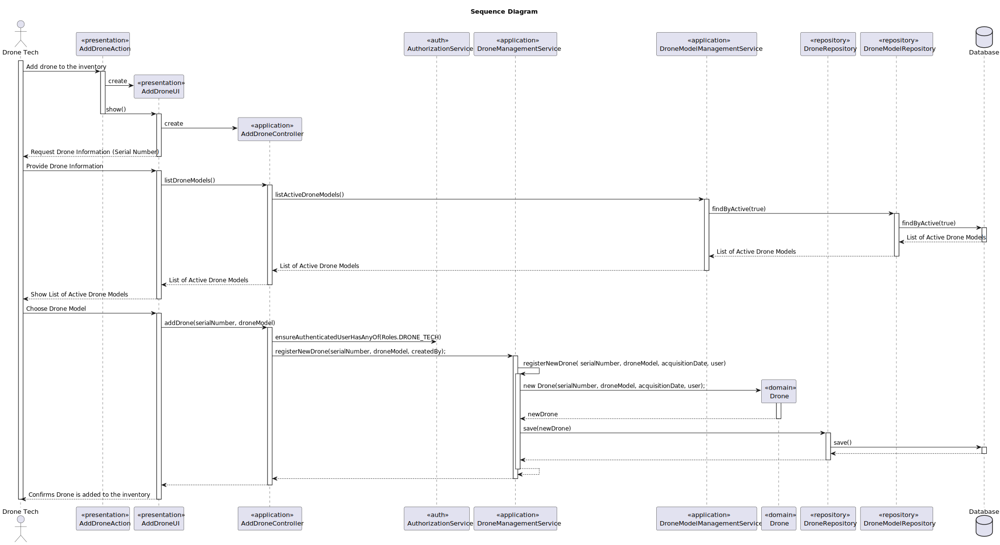

# US 241 - Add drone to the inventory 

## 1. Context

* The aim is to allow Drone Techs to add new drones of an existing model to the system’s inventory. 
Each drone must be registered with a unique serial number to ensure traceability and proper management.


## 2. Requirements

**US241** - As a Drone Tech, I want to add drones of an existing type to inventory. For each drone the serial number has to be stored.
This must also be achieved by a bootstrap process.


**Acceptance Criteria:**

- US241.1 The system must guarantee that all the information to register a drone is given.

- US241.2 The system must guarantee that the drone is added to the inventory.


**Dependencies/References:**

* This user story depends on US240 because to add a drone of an existing type/model, the drone model must be already created.


**Forum Insight:**

>> Que conceito/atributo identifica um Drone? Ou seja, o que deverá diferenciar uma drone de todos as outros?
>
> O que têm normalmente todos os dispositvos de diferente?

>> E relativamente apenas ao drone, que informações devem estar associadas além do estado?
>
> Um drone deve ter naturalmente um número de série e um modelo. 
Normalmente, guarda-se também a data de aquisição. 
Quando for desativado, a data em que isso acontece também é importante.

>> Bom dia, noutra pergunta o cliente referiu que era necessário guardar a data de aquisição dos drones. Essa data corresponde à data de registo do drone no sistema?
>
> Data de aquisição. Acho que diz tudo, não?

>> Quando um drone é adicionado ao inventário podemos assumir sempre um estado como, por exemplo, o estado ativo, ou também pode ser de outro estado ao adicionar?
>
> Fará sentido adicionar um drone desactivado ao sistema? Acho que seria perder tempo.

>> É suposto o drone tech, ao adicionar o drone ao inventário, além de inserir o serial number do drone, também inserir o estado do drone se não for possível assumir sempre um estado do drone ao adicionar o mesmo no inventário?
>
> Adicionar um drone em manutenção ao sistema seria um problema muito complexo, pois teria que incluir também o processo de manutenção. Esqueça...

## 3. Analysis



## 4. Design

### 4.1. Sequence Diagram



### 4.3. Applied Patterns

- Domain-Driven Design
- Factory

## 5. Implementation

**AddDroneAction**

```java
public class AddDroneAction implements Action {
    @Override
    public boolean execute() {
        return new AddDroneUI().show();
    }
}
```
**AddDroneUI**

```java
public class AddDroneUI extends AbstractUI {

    private final AddDroneController controller = new AddDroneController();
    @Override
    protected boolean doShow() {
        final String serialNumber = Console.readLine("Serial Number");
        final Iterable<DroneModel> iterable = controller.listDroneModels();
        if (!iterable.iterator().hasNext()) {
            System.out.println("There is no registered Drone Models!");
        } else {
            String headerModel = String.format("Select Drone Model\n#  %-30s%-30s%-30s%-30s", "MODEL NAME", "MANUFACTURER", "STATUS", "CREATED BY");
            final SelectWidget<DroneModel> selector = new SelectWidget<>(headerModel, iterable, new DroneModelPrinter());
            selector.show();
            final DroneModel droneModel = selector.selectedElement();
            if(droneModel == null){
                System.out.println("No Drone Model Selected!\n");
            }else{
                try{
                    this.controller.addDrone(serialNumber, droneModel);
                } catch(IllegalArgumentException e){
                    System.out.println("\nERROR: " + e.getMessage() + "\n");
                }
            }

        }
        return true;
    }

    @Override
    public String headline() {
        return "Add Drone";
    }
}
```

**AddDroneController**

```java
@UseCaseController
public class AddDroneController {

    private final AuthorizationService authz = AuthzRegistry.authorizationService();

    private final DroneRepository repo = PersistenceContext.repositories().drones();

    private final DroneModelRepository droneModelRepository = PersistenceContext.repositories().droneModels();

    private final DroneModelManagementService droneModelSvc = new DroneModelManagementService(droneModelRepository);

    private final DroneManagementService droneSvc = new DroneManagementService(repo);


    public Iterable<DroneModel> listDroneModels (){
        return this.droneModelSvc.listActiveDroneModels();
    }

    public Drone addDrone(final String serialNumber, final DroneModel droneModel){
        authz.ensureAuthenticatedUserHasAnyOf(Roles.DRONE_TECH);
        return this.droneSvc.registerNewDrone(serialNumber, droneModel,authz.session().get().authenticatedUser());
    }

}
```

**DroneManagementService**

```java
public class DroneManagementService {

    private final DroneRepository droneRepository;


    public DroneManagementService(final DroneRepository droneRepository){
        this.droneRepository = droneRepository;
    }

    public Drone registerNewDrone(final String serialNumber, final DroneModel droneModel, final Calendar acquisitionDate, final SystemUser user){
        if(isSerialNumberUsed(serialNumber)){
            throw new IllegalArgumentException("This Serial Number is already registered in the system!");
        }
        Drone newDrone = new Drone(serialNumber, droneModel,acquisitionDate, user);
        return (Drone) this.droneRepository.save(newDrone);
    }

    public Drone registerNewDrone(final String serialNumber, final DroneModel droneModel, final SystemUser user){
        return registerNewDrone(serialNumber, droneModel, CurrentTimeCalendars.now(), user);
    }


    public Drone removeDrone(final Drone drone, final String reason){
        drone.remove(CurrentTimeCalendars.now(), reason);
        return (Drone) this.droneRepository.save(drone);
    }

    public Drone activateDrone(final Drone drone) {
        drone.activate();
        return (Drone) this.droneRepository.save(drone);
    }

    public Iterable<Drone> findByDroneModel(final DroneModel droneModel) {
        return this.droneRepository.findByDroneModel(droneModel);
    }
    public Iterable<Drone> activeDrones(){
        return this.droneRepository.findByActive(true);
    }

    public Optional<Drone> findById(Long id){return this.droneRepository.findById(id);}

    public boolean isSerialNumberUsed(String serialNumber){return this.droneRepository.isSerialNameUsed(serialNumber);}
}
```

**Drone**

```java
@Entity
public class Drone implements AggregateRoot<Long> {

    @Id
    @GeneratedValue(strategy = GenerationType.AUTO)
    private Long droneId;


    @Column(unique = true, nullable = false)
    private String serialNumber;

    @ManyToOne
    private DroneModel droneModel;

    private String removeReason;

    @Temporal(TemporalType.DATE)
    private Calendar acquisitionDate;

    private boolean active;

    @Temporal(TemporalType.DATE)
    private Calendar deactivatedOn;

    @ManyToOne
    private SystemUser createdBy;

    protected Drone(){

    }

    public Drone(final String serialNumber, final DroneModel droneModel, final Calendar acquisitionDate, final SystemUser user){
        Preconditions.noneNull(new Object[] {serialNumber, droneModel, user, acquisitionDate});

        this.serialNumber = serialNumber;
        this.droneModel = droneModel;
        this.createdBy = user;
        this.acquisitionDate = acquisitionDate == null ? CurrentTimeCalendars.now() : acquisitionDate;
        this.active = true;
    }


    public String serialNumber(){return this.serialNumber;}

    public DroneModel droneModel(){return this.droneModel;}

    public Calendar acquisitionDate(){return this.acquisitionDate;}

    public boolean isActive(){return this.active;}

    public SystemUser createdBy(){return this.createdBy;}

    public Calendar deactivatedOn(){return this.deactivatedOn;}

    public void remove(final Calendar deactivatedOn, final String reason) {
        if (deactivatedOn != null && !deactivatedOn.before(this.acquisitionDate)) {
            if (!this.active) {
                throw new IllegalStateException("Cannot deactivate an inactive Drone!");
            } else {
                this.active = false;
                this.deactivatedOn = deactivatedOn;
                this.removeReason = reason;
            }
        } else {
            throw new IllegalArgumentException();
        }
    }

    public void activate() {
        if (!this.isActive()) {
            this.active = true;
            this.deactivatedOn = null;
            this.removeReason = null;
        }
    }

    @Override
    public boolean sameAs(Object other) {
        if (this == other) return true;
        if (!(other instanceof Drone)) return false;
        Drone that = (Drone) other;
        return droneId != null && droneId.equals(that.droneId);
    }

    @Override
    public Long identity() {
        return this.droneId;
    }

    @Override
    public String toString() {
        return "Drone{" +
                "id=" + droneId +
                ", serialNumber='" + serialNumber + '\'' +
                ", droneModel=" + droneModel +
                ", acquisitionDate=" + acquisitionDate +
                ", active=" + active +
                ", deactivatedOn=" + deactivatedOn +
                ", removeReason='" + removeReason + '\'' +
                ", createdBy=" + createdBy +
                '}';
    }
}

```

## 6. Integration/Demonstration

**Registering Drone**


**Drone Database**


