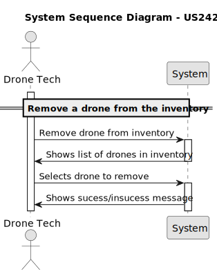

# US 242 - Remove a drone from the inventory


## 1. Context

* This user story is part of improving inventory management functionalities for the Drone Tech role.
* Implementing this feature will help ensure the inventory reflects only active and operational drones. 
* The removal process must include storing both the reason for removal and the date to maintain accurate records and support
audit and reporting needs.

## 2. Requirements

**US242** - As a Drone Tech, I want to remove a specific drone from the inventory. The reason for removal and the date must be stored.


**Acceptance Criteria:**

- US242.1 The system must guarantee that the drone is removed correctly to the inventory.


**Dependencies/References:**

* There is a dependency on the US240 Drone model creation and US241 Add drone to the inventory, as the drone to be removed must exist in the system before it can be removed.

**Forum Insight:**

>> É relevante para o domínio o colaborador que criou a figura?
>
> Acho que a ideia de dar o devido crédito ao autor da figura é boa. É como no Ikea.


## 3. Analysis



## 4. Design
### 4.1. Sequence Diagram


### 4.3. Applied Patterns

- Domain-Driven Design
- Factory

### 4.4. Acceptance Tests

**Test 1:** *Verifies that removes drone and saves the date of deactivation*

**Refers to Acceptance Criteria:** US242.1
```java
@Test
    void removeDrone_savesDeactivatedDrone() {
        Drone drone = new Drone("DRONE10001", droneModel, now, user);
        when(repo.save(drone)).thenReturn(drone);

        Drone result = service.removeDrone(drone, "Test reason");

        Assertions.assertFalse(result.isActive());
        verify(repo).save(drone);
    }
````
**Test 2:** *Verifies that removes drone and saves the correct date of deactivation*

**Refers to Acceptance Criteria:** US242.1
```java
@Test
void removeDrone_setsCorrectDeactivationDate() {
Drone drone = new Drone("DRONE10003", droneModel, now, user);
service.removeDrone(drone, "Test reason");
assertNotNull(drone.deactivatedOn());
}
````


## 5. Implementation


**RemoveDroneAction**

```java
public class RemoveDroneAction implements Action {
    @Override
    public boolean execute() {
        return new RemoveDroneUI().show();
    }
}

```
**RemoveDroneUI**

```java
public class RemoveDroneUI extends AbstractUI {

    private final RemoveDroneController controller = new RemoveDroneController();

    @Override
    protected boolean doShow() {
        final Iterable<Drone> drones = this.controller.activeDrones();
        if (!drones.iterator().hasNext()) {
            System.out.println("There are no registered Drones");
        } else {
            final SelectWidget<Drone> selector = new SelectWidget<>("Select Drone to Remove", drones, new DronePrinter());
            selector.show();
            final Drone drone = selector.selectedElement();
            if (drone == null) {
                System.out.println("No drone selected");
            } else {
                final String reason = Console.readLine("Reason for removing the drone: ");
                if (reason.isEmpty()) {
                    System.out.println("Reason cannot be empty");
                }else {
                    this.controller.removeDrone(drone, reason);
                }
            }
        }
        return true;
    }

    @Override
    public String headline() {
        return "Remove Drone";
    }
}
```

**RemoveDroneController**

```java
@UseCaseController
public class RemoveDroneController {

    private final AuthorizationService authz = AuthzRegistry.authorizationService();

    private final DroneRepository repo = PersistenceContext.repositories().drones();

    private final DroneManagementService droneSvc = new DroneManagementService(repo);

    public void removeDrone(final Drone drone, final String reason) {
        authz.ensureAuthenticatedUserHasAnyOf(Roles.DRONE_TECH);
        this.droneSvc.removeDrone(drone,reason);
    }

    public Iterable<Drone> activeDrones() {
        authz.ensureAuthenticatedUserHasAnyOf(Roles.DRONE_TECH);
        return this.droneSvc.activeDrones();
    }
}
```

**DroneManagementService**

```java
public class DroneManagementService {

    private final DroneRepository droneRepository;


    public DroneManagementService(final DroneRepository droneRepository){
        this.droneRepository = droneRepository;
    }

    public Drone registerNewDrone(final String serialNumber, final DroneModel droneModel, final Calendar acquisitionDate, final SystemUser user){
        if(isSerialNumberUsed(serialNumber)){
            throw new IllegalArgumentException("This Serial Number is already registered in the system!");
        }
        Drone newDrone = new Drone(serialNumber, droneModel,acquisitionDate, user);
        return (Drone) this.droneRepository.save(newDrone);
    }

    public Drone registerNewDrone(final String serialNumber, final DroneModel droneModel, final SystemUser user){
        return registerNewDrone(serialNumber, droneModel, CurrentTimeCalendars.now(), user);
    }


    public Drone removeDrone(final Drone drone, final String reason){
        drone.remove(CurrentTimeCalendars.now(), reason);
        return (Drone) this.droneRepository.save(drone);
    }

    public Drone activateDrone(final Drone drone) {
        drone.activate();
        return (Drone) this.droneRepository.save(drone);
    }

    public Iterable<Drone> findByDroneModel(final DroneModel droneModel) {
        return this.droneRepository.findByDroneModel(droneModel);
    }
    public Iterable<Drone> activeDrones(){
        return this.droneRepository.findByActive(true);
    }

    public Optional<Drone> findById(Long id){return this.droneRepository.findById(id);}

    public boolean isSerialNumberUsed(String serialNumber){return this.droneRepository.isSerialNameUsed(serialNumber);}
}
```
## 6. Integration/Demonstration

**Removing Drone**

**Drone Database**
