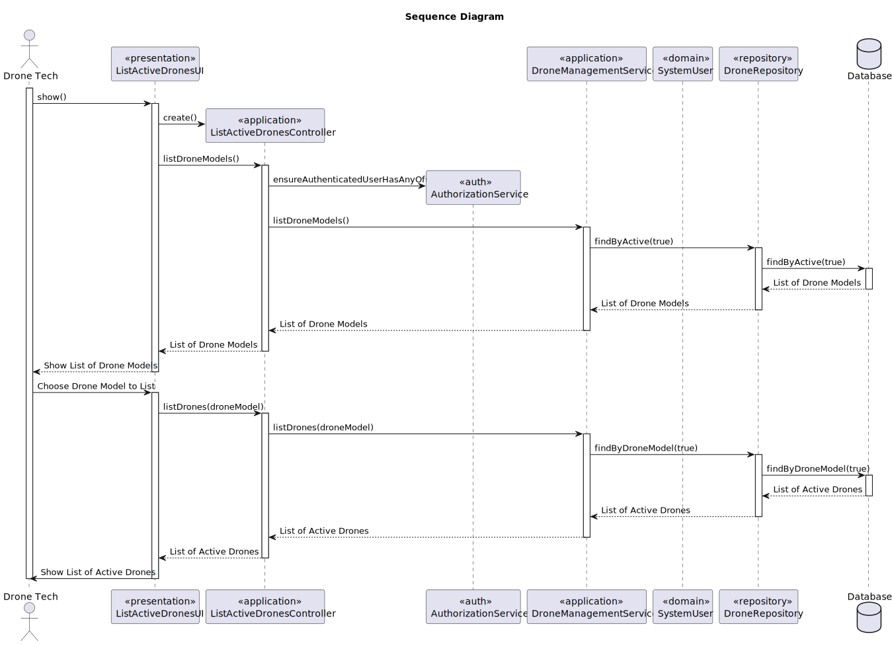
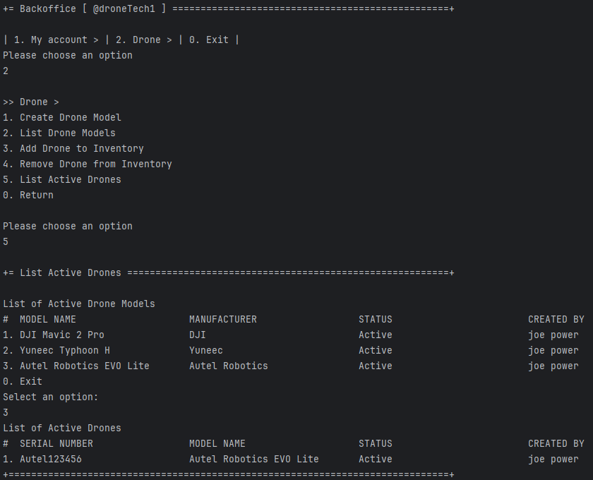
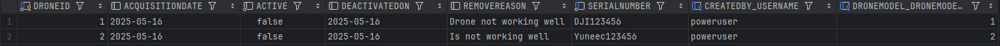

# US 243 - List drones in the inventory


## 1. Context

* This functionality is essential for quickly identifying available drones of a specific type, especially when preparing 
for maintenance, deployment, or replacement tasks.
* By enabling the listing of active drones filtered by model, this feature will improve efficiency and accuracy in inventory management.

## 2. Requirements

**US243** - As a Drone Tech, I want to list active drones of a given model in the inventory.


**Acceptance Criteria:**

- US243.1 The system must guarantee that all drones in the inventory are active.
- US243.2 The system must guarantee that the drone models are active.


**Dependencies/References:**

* There is a dependency on the US240 Drone model creation and US241 Add drone to the inventory, as the drone to be removed must exist in the system before it can be removed.

**Forum Insight:**

>> É relevante para o domínio o colaborador que criou a figura?
>
> Acho que a ideia de dar o devido crédito ao autor da figura é boa. É como no Ikea.


## 3. Analysis


## 4. Design

### 4.1. Sequence Diagram



### 4.3. Applied Patterns

- Information Expert
- Controller
- Low Coupling
- High Cohesion
- Polymorphism
- Pure Fabrication
- Indirection
- Protected Variations

### 4.4. Acceptance Tests


**Test 1:** *Verifies that all drones listed are active*

**Refers to Acceptance Criteria:** US243.1


```java
 @Test
    void listActiveDrones_returnsOnlyActiveDrones() {
        Drone activeDrone1 = new Drone("DRONE10001", droneModel, now, user);
        Drone activeDrone2 = new Drone("DRONE10002", droneModel, now, user);

        when(repo.findByActive(true)).thenReturn((Iterable<Drone>) List.of(activeDrone1, activeDrone2));

        Iterable<Drone> result = service.activeDrones();

        Assertions.assertIterableEquals(List.of(activeDrone1, activeDrone2), result);
        verify(repo).findByActive(true);
    }
````
**Test 2:** *Verifies that all drones models listed are active*

**Refers to Acceptance Criteria:** US243.1


```java
 @Test
void listActiveDroneModels_returnsOnlyActiveModels() {
    DroneModel active1 = new DroneModel("Alpha", "DJI", CurrentTimeCalendars.now(), user, behavior);
    DroneModel active2 = new DroneModel("Beta", "DJI", CurrentTimeCalendars.now(), user, behavior);

    when(repoModel.findByActive(true)).thenReturn((Iterable<DroneModel>) List.of(active1, active2));


    Iterable<DroneModel> result = serviceModel.listActiveDroneModels();

    Assertions.assertIterableEquals(List.of(active1, active2), result);
    verify(repoModel).findByActive(true);
}
````
## 5. Implementation

**ListDronesAction**

```java
public class ListActiveDronesAction implements Action {

    @Override
    public boolean execute() {
        return new ListActiveDronesUI().show();
}}
```

**ListActiveDronesUI**

```java
public class ListActiveDronesUI extends AbstractUI {

    private final ListActiveDronesController controller = new ListActiveDronesController();


    @Override
    public String headline() {
        return "List Active Drones";
    }

    @Override
    protected boolean doShow() {
        final Iterable<DroneModel> droneModels = this.controller.activeDroneModel();
        if (!droneModels.iterator().hasNext()) {
            System.out.println("There are no registered Drone Models in the system");
        } else {
            String headerModel = String.format("List of Active Drone Models\n#  %-30s%-30s%-30s%-30s", "MODEL NAME", "MANUFACTURER", "STATUS", "CREATED BY");
            final SelectWidget<DroneModel> selector = new SelectWidget<>(headerModel, droneModels, new DroneModelPrinter());
            selector.show();
            final DroneModel droneModel = selector.selectedElement();
            if (droneModel == null) {
                System.out.println("No drone Model selected");
            } else {
                final Iterable<Drone> drones = this.controller.findByDroneModel(droneModel);
                if(!drones.iterator().hasNext()) {
                    System.out.println("There are no registered Drones in the system");
                } else {
                    String headerDrone = String.format("List of Active Drones\n#  %-30s%-30s%-30s%-30s", "SERIAL NUMBER", "MODEL NAME", "STATUS", "CREATED BY");
                    final ListWidget<Drone> listWidget = new ListWidget<>(headerDrone, drones, new DronePrinter());
                    listWidget.show();
                }
            }
        }
        return true;
    }

}
```

**ListActiveDronesController**

```java
public class ListActiveDronesController {

    private final DroneRepository repo = PersistenceContext.repositories().drones();

    private final AuthorizationService authz = AuthzRegistry.authorizationService();

    private final DroneManagementService droneSvc = new DroneManagementService(repo);

    private final DroneModelManagementService droneModelSvc = new DroneModelManagementService(PersistenceContext.repositories().droneModels());

    public Iterable<DroneModel> activeDroneModel() {
        authz.ensureAuthenticatedUserHasAnyOf(Roles.DRONE_TECH);
        return this.droneModelSvc.listActiveDroneModels();
    }

    public Iterable<Drone> findByDroneModel(final DroneModel droneModel) {
        authz.ensureAuthenticatedUserHasAnyOf(Roles.DRONE_TECH);
        return this.droneSvc.findByDroneModel(droneModel);
    }
}
```
**DroneManagementService**

```java
@Component
public class DroneManagementService {

    private final DroneRepository droneRepository;


    public DroneManagementService(final DroneRepository droneRepository){
        this.droneRepository = droneRepository;
    }

    public Drone registerNewDrone(final String serialNumber, final DroneModel droneModel, final Calendar acquisitionDate, final SystemUser user){
        if(isSerialNumberUsed(serialNumber)){
            throw new IllegalArgumentException("This Serial Number is already registered in the system!");
        }
        Drone newDrone = new Drone(serialNumber, droneModel,acquisitionDate, user);
        return (Drone) this.droneRepository.save(newDrone);
    }

    public Drone registerNewDrone(final String serialNumber, final DroneModel droneModel, final SystemUser user){
        return registerNewDrone(serialNumber, droneModel, CurrentTimeCalendars.now(), user);
    }


    public Drone removeDrone(final Drone drone, final String reason){
        drone.remove(CurrentTimeCalendars.now(), reason);
        return (Drone) this.droneRepository.save(drone);
    }

    public Drone activateDrone(final Drone drone) {
        drone.activate();
        return (Drone) this.droneRepository.save(drone);
    }

    public Iterable<Drone> findByDroneModel(final DroneModel droneModel) {
        return this.droneRepository.findByDroneModel(droneModel);
    }
    public Iterable<Drone> activeDrones(){
        return this.droneRepository.findByActive(true);
    }

    public Optional<Drone> findById(Long id){return this.droneRepository.findById(id);}

    public boolean isSerialNumberUsed(String serialNumber){return this.droneRepository.isSerialNameUsed(serialNumber);}
}
```
**DroneModelManagementService**

```java
@Component
public class DroneModelManagementService {

    private final DroneModelRepository droneModelRepository;

    public DroneModelManagementService(final DroneModelRepository droneModelRepository){
        this.droneModelRepository = droneModelRepository;
    }

    public DroneModel registerNewDroneModel(final String modelName, final String manufacturer, final Calendar createdOn, final SystemUser createdBy, final DroneWindBehavior windBehavior){
        if(isModelNameUsed(droneModelRepository, modelName)){
            throw new IllegalArgumentException("This Model Name is already registered in the system!");
        }
        if(windBehavior == null){
            throw new IllegalArgumentException("Wind Behavior cannot be null!");
        }
        if (createdBy == null){
            throw new IllegalArgumentException("Created By cannot be null!");
        }
        DroneModel newDroneModel = new DroneModel(modelName, manufacturer, createdOn, createdBy, windBehavior);
        return (DroneModel) this.droneModelRepository.save(newDroneModel);
    }


    public DroneModel registerNewDroneModel(final String modelName, final String manufacturer, final SystemUser createdBy, final DroneWindBehavior windBehavior){
        return registerNewDroneModel(modelName, manufacturer, CurrentTimeCalendars.now(), createdBy, windBehavior);
    }

    public Optional<DroneModel> findById(final Long id){
        return this.droneModelRepository.findById(id);
    }

    public Iterable<DroneModel> findByManufacturer(final String manufacturer){
        return this.droneModelRepository.findByManufacturer(manufacturer);
    }

    public Iterable<DroneModel> findAll(){
        return this.droneModelRepository.findAll();
    }

    public Iterable<DroneModel> listActiveDroneModels(){return this.droneModelRepository.findByActive(true);}


    public DroneModel deactivateDroneModel(final DroneModel droneModel) {
        droneModel.deactivate(CurrentTimeCalendars.now());
        return (DroneModel) this.droneModelRepository.save(droneModel);
    }

    public DroneModel activateDroneModel(final DroneModel droneModel) {
        droneModel.activate();
        return (DroneModel) this.droneModelRepository.save(droneModel);
    }


    public boolean isModelNameUsed(DroneModelRepository repo, String modelName){
        return repo.isDroneModelNameUsed(modelName);
    }
}
```


## 6. Integration/Demonstration

**List drones in the inventory**



**Drone Database**

