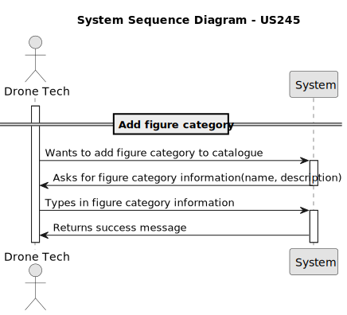
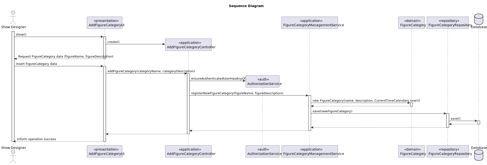
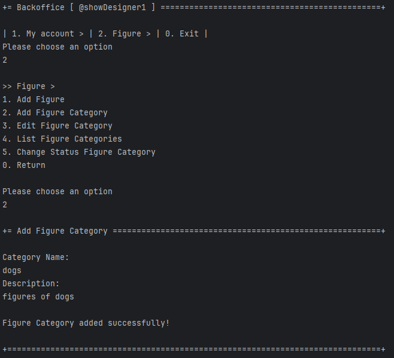
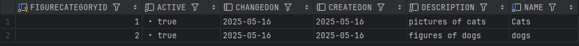

# US 245 - Add figure category


## 1. Context

Adding categories will help Drone Techs and other users organize and filter figures more efficiently, especially as the number of available figures grows. 
The system must ensure that each category has a unique name, includes timestamps for creation and updates, and supports activation or deactivation to control visibility and usage within the platform.

## 2. Requirements

**US245** - As a Show Designer, I want to add a figure category to the figure category catalogue. The category name must be unique (not case sensitive).

**Acceptance Criteria:**

- US245.1 The system must guarantee that category name is unique.
- US245.2 The system must store both creation date and last update date.
- US245.3 The system must have a status to activate and deactivate category.


**Dependencies/References:**

* There is a dependency on the US231 Figure Catalogue 


**Forum Insight:**
>> As US's 245 a 248 referem uma 'figure category' que classifica um conjunto de figuras e que poderá ser adicionada ou removida. Esta 'category' consiste em quê por exemplo?
>
> Bom dia,
> 
>Consiste no que o cliente quiser. Tem de ter total liberdade para adicionar novas categorias, como é referido na US245.
> 
>Cumprimentos, Angelo Martins

> >Boa tarde,
>Em relação às categorias no sistema, gostava de confirmar que tipo de informação considera importante guardar no momento da sua criação. Um nome, uma descrição e um status são suficientes? Se não, então que dados considera importantes guardar?
> 
>Boa tarde, 
> 
> "Um nome, uma descrição e um status são suficientes?" - São necessários.
>Quando se activa/desactiva qualquer coisa convém guardar a data da alteração. Isso permite fazer pesquisas no passado com os estados válidos à data. Claro que andar a ativar e desativar várias vezes obrigaria a manter uma lista de estados e complica um bocado. Mas guardar pelo menos a data de criação e a última alteração de estado parece-me essencial.
> 
>Cumprimentos, Angelo Martins

> >Boa noite, a categoria ou as keywords de uma figura podem mudar quando uma versão nova da mesma é lançada?
>
> Bom dia, 
> 
>Claro.
> 
>Cumprimentos, Angelo Martins


## 3. Analysis


## 4. Design
### 4.1. Sequence Diagram



### 4.3. Applied Patterns

- Information Expert
- Creator
- Controller
- Low Coupling
- High Cohesion
- Polymorphism
- Pure Fabrication
- Indirection
- Protected Variations

### 4.4. Acceptance Tests


**Test 1:** *Verifies that category name is unique*

**Refers to Acceptance Criteria:** US245.1


```java
@Test
    void editFigureCategory_nameAlreadyUsed_throwsException() {
        FigureCategory cat = new FigureCategory("OldName", "Old Description", now);
        when(repo.isFigureCategoryNameUsed("UsedName")).thenReturn(true);

        assertThrows(IllegalArgumentException.class, () ->
                service.editFigureCategory(cat, "UsedName", "Any Description")
        );

        verify(repo, never()).save(any());
    }
````

**Test 2:** *Verifies that category is created successfully with created date and changed on*

**Refers to Acceptance Criteria:** US245.2


```java
 @Test
void registerNewFigureCategory_success() {
    String name = "Animals";
    String desc = "Figures of animals";

    when(repo.save(any(FigureCategory.class))).thenAnswer(i -> i.getArguments()[0]);

    FigureCategory result = service.registerNewFigureCategory(name, desc);

    assertEquals(name, result.name());
    assertTrue(result.isActive());
    verify(repo).save(any(FigureCategory.class));
}
````

**Test 3:** *Verifies that category is activating and deactivating*

**Refers to Acceptance Criteria:** US245.3


```java
 @Test
void deactivateFigureCategory_success() {
    FigureCategory cat = new FigureCategory("Sci-Fi", "Science fiction", now);
    when(repo.save(cat)).thenReturn(cat);

    FigureCategory result = service.deactivateFigureCategory(cat);

    assertFalse(result.isActive());
    assertNotNull(result.changedOn());
    verify(repo).save(cat);
}

@Test
void activateFigureCategory_success() {
    FigureCategory cat = new FigureCategory("Fantasy", "Fantasy world", now);
    cat.deactivate(CurrentTimeCalendars.now());
    when(repo.save(cat)).thenReturn(cat);

    FigureCategory result = service.activateFigureCategory(cat);

    assertTrue(result.isActive());

    verify(repo).save(cat);
}
````
## 5. Implementation

**addFigureCategoryAction**

```java
public class AddFigureCategoryAction implements Action {

    @Override
    public boolean execute() {
        return new AddFigureCategoryUI().show();
    }
}
```
**AddFigureCategoryUI**

```java
public class AddFigureCategoryUI extends AbstractUI {

    private final AddFigureCategoryController controller = new AddFigureCategoryController();

    @Override
    protected boolean doShow() {
        final String categoryName = Console.readLine("Category Name: ");
        final String categoryDescription = Console.readLine("Description: ");

        try {
            this.controller.addFigureCategory(categoryName, categoryDescription);
        } catch (IllegalArgumentException e) {
            System.out.println("\nERROR: " + e.getMessage() + "\n");
        }
        return true;
    }

    @Override
    public String headline() {
        return "Add Figure Category";
    }
}

```
**AddFigureCategoryController**

```java
public class AddFigureCategoryController {
    private final AuthorizationService authz = AuthzRegistry.authorizationService();

    private final FigureCategoryRepository repo = PersistenceContext.repositories().figureCategories();

    private final FigureCategoryManagementService figureCategorySvc = new FigureCategoryManagementService(repo);

    public FigureCategory addFigureCategory(final String name, final String description) {
        authz.ensureAuthenticatedUserHasAnyOf(Roles.SHOW_DESIGNER);
        return figureCategorySvc.registerNewFigureCategory(name, description);
    }
}

```
**FigureCategoryManagementService**

```java
public class FigureCategoryManagementService {

    private final FigureCategoryRepository figureCategoryRepository;

    public FigureCategoryManagementService(final FigureCategoryRepository figureCategoryRepository) {
        this.figureCategoryRepository = figureCategoryRepository;
    }

    public FigureCategory registerNewFigureCategory(final String name, final String description) {
        if(isFigureCategoryNameUsed(figureCategoryRepository, name)){
            throw new IllegalArgumentException("Figure Category name already in use");
        }
        FigureCategory figureCategory = new FigureCategory(name, description, CurrentTimeCalendars.now());
        return (FigureCategory) this.figureCategoryRepository.save(figureCategory);
    }

    public Optional<FigureCategory> findFigureCategoryById(Long id) {
        return this.figureCategoryRepository.findById(id);
    }

    public Iterable<FigureCategory> findFigureCategoryByName(String name) {
        return this.figureCategoryRepository.findByName(name);
    }

    public Iterable<FigureCategory> findFigureCategoryByDescription(String description) {
        return this.figureCategoryRepository.findByDescription(description);
    }

    public void editFigureCategory(FigureCategory figureCategory, String newName, String newDescription) {
        boolean edited = false;
        if (newName == null || newName.isEmpty()) {
            throw new IllegalArgumentException("Figure Category name cannot be null or empty!");
        } else if (!newName.equals("N")) {
            edited = true;
           if (isFigureCategoryNameUsed(figureCategoryRepository, newName)) {
                throw new IllegalArgumentException("Figure Category name already in use");
            }else {
                figureCategory.changeName(newName);
            }
        }
        if (newDescription == null || newDescription.isEmpty()) {
            throw new IllegalArgumentException("Figure Category description cannot be null or empty!");
        } else if (!newDescription.equals("N")) {
            edited = true;
            figureCategory.changeDescription(newDescription);
        }
        if (edited) {
            figureCategoryRepository.save(figureCategory);
        }
    }


    public Iterable<FigureCategory> findAll() {
        return this.figureCategoryRepository.findAll();
    }

    public FigureCategory deactivateFigureCategory(FigureCategory figureCategory) {
        figureCategory.deactivate(CurrentTimeCalendars.now());
        return (FigureCategory) this.figureCategoryRepository.save(figureCategory);
    }

    public FigureCategory activateFigureCategory(FigureCategory figureCategory) {
        figureCategory.activate(CurrentTimeCalendars.now());
        return (FigureCategory) this.figureCategoryRepository.save(figureCategory);
    }


    public boolean isFigureCategoryNameUsed(FigureCategoryRepository repo, String name) {
        return repo.isFigureCategoryNameUsed(name);
    }

    public Iterable<FigureCategory> findByActive(boolean active) {
        return this.figureCategoryRepository.findByActive(active);
    }

    public void changeStatus (FigureCategory figureCategory, boolean newStatus) {
        if (newStatus) {
            figureCategory.activate(Calendar.getInstance());
        } else {
            figureCategory.deactivate(Calendar.getInstance());
        }
        this.figureCategoryRepository.save(figureCategory);
    }
}

```
**FigureCategory**

```java
@Entity
public class FigureCategory implements AggregateRoot<Long> {

    @Id
    @GeneratedValue(strategy = GenerationType.AUTO)
    private Long figureCategoryId;

    @Column(unique = true, nullable = false)
    private String name;

    @Column(nullable = false)
    private String description;

    @Temporal(TemporalType.DATE)
    private Calendar createdOn;
    private boolean active;
    @Temporal(TemporalType.DATE)
    private Calendar changedOn;


    protected FigureCategory() {
    }

    public FigureCategory(final String name, final String description, final Calendar createdOn) {
        Preconditions.noneNull(new Object[]{name, description});
        this.name = name;
        this.description = description;
        this.active = true;
        this.createdOn = createdOn == null ? Calendar.getInstance() : createdOn;
        this.changedOn = createdOn == null ? Calendar.getInstance() : createdOn;
    }

    public String name() {
        return this.name;
    }
    public void changeName(final String name) {
        Preconditions.noneNull(name);
        this.name = name;
        this.changedOn = Calendar.getInstance();
    }

    public void changeDescription(final String description) {
        Preconditions.noneNull(description);
        this.description = description;
        this.changedOn = Calendar.getInstance();
    }

    public String description() {
        return this.description;
    }

    public Calendar createdOn() {return this.createdOn;}

    public Calendar changedOn() {return this.changedOn;}

    public boolean isActive() {
        return this.active;
    }

    public void deactivate(final Calendar changedOn) {
        if (changedOn != null && !changedOn.before(this.createdOn)) {
            if (!this.active) {
                throw new IllegalStateException("FigureCategory is already deactivated");
            }
            this.active = false;
            this.changedOn = changedOn;
        } else {
            throw new IllegalArgumentException("Deactivation date cannot be before creation date");
        }
    }

    public void activate(final Calendar changedOn) {
        if (!this.isActive()) {
            this.active = true;
            this.changedOn = changedOn == null ? Calendar.getInstance() : changedOn;
        } else {
            throw new IllegalStateException("FigureCategory is already active");
        }
    }

    public void editFigureCategory(final String name, final String description) {
        Preconditions.noneNull(new Object[]{name, description});
        this.name = name;
        this.description = description;
        this.changedOn = Calendar.getInstance();
    }

    @Override
    public boolean sameAs(Object other) {
        if (this == other) {
            return true;
        }
        if (!(other instanceof FigureCategory)) {
            return false;
        }
        FigureCategory that = (FigureCategory) other;
        return this.name.equals(that.name);
    }

    @Override
    public String toString() {
        return "FigureCategory{" +
                "figureCategoryId=" + figureCategoryId +
                ", name='" + name + '\'' +
                ", description='" + description + '\'' +
                ", createdOn=" + createdOn +
                ", active=" + active +
                ", changedOn=" + changedOn +
                '}';
    }


    @Override
    public Long identity() {
        return figureCategoryId;
    }
}

```
## 6. Integration/Demonstration

**Add figure Category**



**Figure Category Database**


