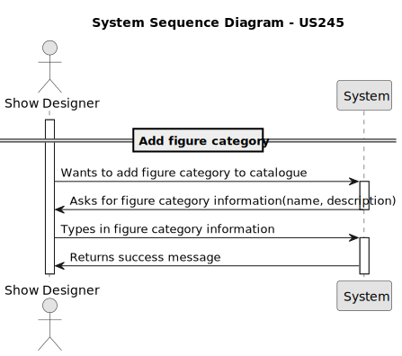

# US 245 - Add figure category


## 1. Context

Adding categories will help Drone Techs and other users organize and filter figures more efficiently, especially as the number of available figures grows. 
The system must ensure that each category has a unique name, includes timestamps for creation and updates, and supports activation or deactivation to control visibility and usage within the platform.

## 2. Requirements

**US245** - As a Show Designer, I want to add a figure category to the figure category catalogue. The category name must be unique (not case sensitive).

**Acceptance Criteria:**

- US245.1 The system must guarantee that category name is unique.
- US245.2 The system must store both creation date and last update date.
- US245.3 The system must have a status to activate and deactivate category.


**Dependencies/References:**

* There is a dependency on the US231 Figure Catalogue 


**Forum Insight:**
>> As US's 245 a 248 referem uma 'figure category' que classifica um conjunto de figuras e que poderá ser adicionada ou removida. Esta 'category' consiste em quê por exemplo?
>
> Bom dia,
> 
>Consiste no que o cliente quiser. Tem de ter total liberdade para adicionar novas categorias, como é referido na US245.
> 
>Cumprimentos, Angelo Martins

> >Boa tarde,
>Em relação às categorias no sistema, gostava de confirmar que tipo de informação considera importante guardar no momento da sua criação. Um nome, uma descrição e um status são suficientes? Se não, então que dados considera importantes guardar?
> 
>Boa tarde, 
> 
> "Um nome, uma descrição e um status são suficientes?" - São necessários.
>Quando se activa/desactiva qualquer coisa convém guardar a data da alteração. Isso permite fazer pesquisas no passado com os estados válidos à data. Claro que andar a ativar e desativar várias vezes obrigaria a manter uma lista de estados e complica um bocado. Mas guardar pelo menos a data de criação e a última alteração de estado parece-me essencial.
> 
>Cumprimentos, Angelo Martins

> >Boa noite, a categoria ou as keywords de uma figura podem mudar quando uma versão nova da mesma é lançada?
>
> Bom dia, 
> 
>Claro.
> 
>Cumprimentos, Angelo Martins


## 3. Analysis


## 4. Design
### 4.1. Sequence Diagram


### 4.3. Applied Patterns

- Domain-Driven Design
- Factory
### 4.4. Acceptance Tests

Include here the main tests used to validate the functionality. Focus on how they relate to the acceptance criteria. May be automated or manual tests.

**Test 1:** *Verifies that it is not possible to ...*

**Refers to Acceptance Criteria:** US101.1


```
@Test(expected = IllegalArgumentException.class)
public void ensureXxxxYyyy() {
...
}
````

## 5. Implementation

*In this section the team should present, if necessary, some evidencies that the implementation is according to the design. It should also describe and explain other important artifacts necessary to fully understand the implementation like, for instance, configuration files.*

*It is also a best practice to include a listing (with a brief summary) of the major commits regarding this requirement.*

## 6. Integration/Demonstration

*In this section the team should describe the efforts realized in order to integrate this functionality with the other parts/components of the system*

*It is also important to explain any scripts or instructions required to execute an demonstrate this functionality*

## 7. Observations

*This section should be used to include any content that does not fit any of the previous sections.*

*The team should present here, for instance, a critical prespective on the developed work including the analysis of alternative solutioons or related works*

*The team should include in this section statements/references regarding third party works that were used in the development this work.*

