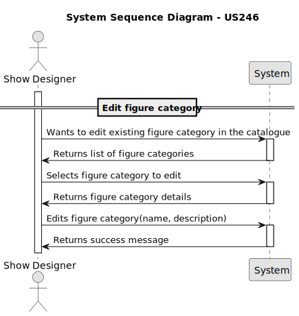
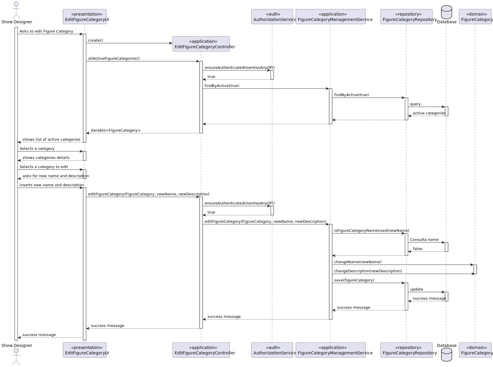
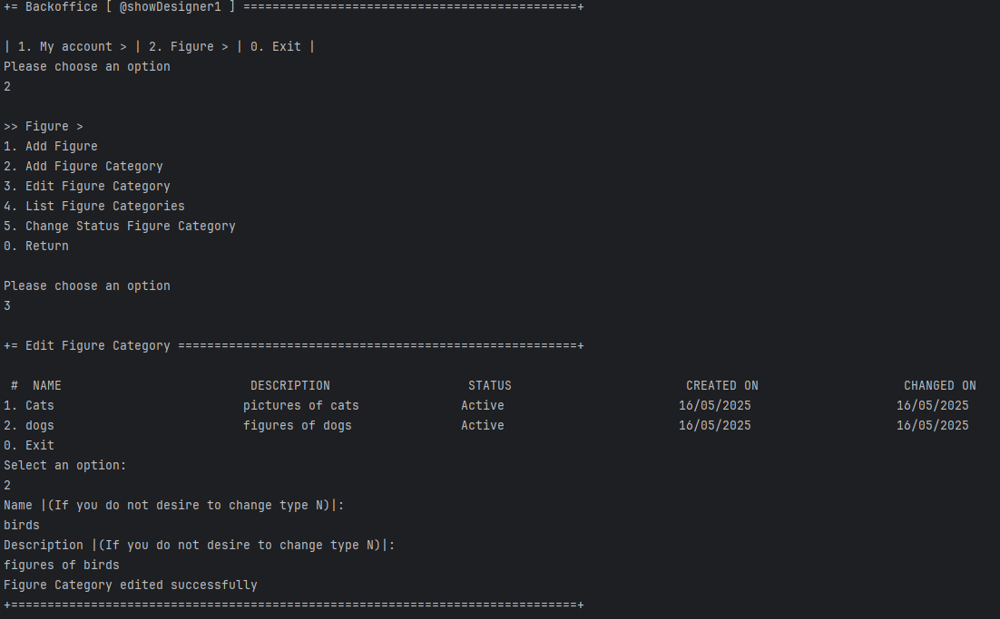
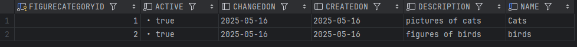

# US 246 - Edit figure category


## 1. Context

This user story extends the figure category management functionality by allowing Show Designers to edit existing categories in the catalogue. 
This capability is important for maintaining consistency and accuracy as the naming, organization, or status of categories evolve over time. 
Ensuring unique category names and tracking the last update date supports data integrity and improves usability for those managing a growing set of figures.

## 2. Requirements

**US246** - As a Show Designer, I want to edit an existing figure category in the figure category catalogue.


**Acceptance Criteria:**

- US246.1 The system must guarantee that category name is unique.
- US246.2 The system must store last update date.

**Dependencies/References:**

* There is a dependency on the US245 Add figure category and US231 Figure Catalogue. 

**Forum Insight:**

* No questions were raised in the forum regarding this requirement.

## 3. Analysis


## 4. Design

### 4.1. Sequence Diagram



### 4.3. Applied Patterns
- Domain-Driven Design
- Factory
### 4.4. Acceptance Tests


**Test 1:** *Verifies that new category name is unique*

**Refers to Acceptance Criteria:** US246.1


```java
@Test
    void editFigureCategory_success() {
        FigureCategory cat = new FigureCategory("OldName", "Old Description", now);
        when(repo.isFigureCategoryNameUsed("NewName")).thenReturn(false);

        service.editFigureCategory(cat, "NewName", "New Description");

        assertEquals("NewName", cat.name());
        assertEquals("New Description", cat.description());
        verify(repo).save(cat);
    }

    @Test
    void editFigureCategory_nameAlreadyUsed_throwsException() {
        FigureCategory cat = new FigureCategory("OldName", "Old Description", now);
        when(repo.isFigureCategoryNameUsed("UsedName")).thenReturn(true);

        assertThrows(IllegalArgumentException.class, () ->
                service.editFigureCategory(cat, "UsedName", "Any Description")
        );

        verify(repo, never()).save(any());
    }
````

**Test 2:** *Verifies that stores last update date*

**Refers to Acceptance Criteria:** US246.2


```java
@Test
void editFigureCategory_nameAlreadyUsed_throwsException() {
    FigureCategory cat = new FigureCategory("OldName", "Old Description", now);
    when(repo.isFigureCategoryNameUsed("UsedName")).thenReturn(true);

    assertThrows(IllegalArgumentException.class, () ->
            service.editFigureCategory(cat, "UsedName", "Any Description")
    );

    verify(repo, never()).save(any());
}
````

## 5. Implementation

**EditFigureCategoryAction**

```java
public class EditFigureCategoryAction implements Action {
    @Override
    public boolean execute() {
        return new EditFigureCategoryUI().show();
    }
}
```
**EditFigureCategoryUI**

```java
public class EditFigureCategoryUI extends AbstractListUI<FigureCategory> {

    private final EditFigureCategoryController theController = new EditFigureCategoryController();
    @Override
    public String headline() {
        return "Edit Figure Category";
    }

    @Override
    protected String listHeader() {
        return String.format(" #  %-30s%-30s%-30s%-30s%-30s", "NAME", "DESCRIPTION", "STATUS", "CREATED ON", "CHANGED ON");
    }

    @Override
    protected String emptyMessage() {
        return "No figure categories found";
    }

    @Override
    protected String elementName() {
        return "Figure Category";
    }

    @Override
    protected Iterable<FigureCategory> elements() {
        return null;
    }

    @Override
    protected Visitor elementPrinter() {
        return new FigureCategoryPrinter();
    }

    @Override
    protected boolean doShow() {
        final Iterable<FigureCategory> figureCategories = this.theController.allActiveFigureCategories();
        if (!figureCategories.iterator().hasNext()) {
            System.out.println("There are no registered Figure Categories in the system");
        } else {
            final SelectWidget<FigureCategory> selector = new SelectWidget<>(listHeader(), figureCategories, elementPrinter());
            selector.show();
            final FigureCategory figureCategory = selector.selectedElement();
            if (figureCategory == null) {
                System.out.println("No figure category selected");
            } else {
                String name = null, description = null;

                while (true) {
                    try {
                        name = Console.readLine("Name |(If you do not desire to change type N)|: ");
                        if (!name.equalsIgnoreCase("N") && name.trim().isEmpty()) {
                            throw new IllegalArgumentException("Name cannot be empty.");
                        }
                        break;
                    } catch (IllegalArgumentException e) {
                        System.out.println("Error: " + e.getMessage());
                    }
                }

                while (true) {
                    try {
                        description = Console.readLine("Description |(If you do not desire to change type N)|: ");
                        if (!description.equalsIgnoreCase("N") && description.trim().isEmpty()) {
                            throw new IllegalArgumentException("Description cannot be empty.");
                        }
                        break;
                    } catch (IllegalArgumentException e) {
                        System.out.println("Error: " + e.getMessage());
                    }
                }

                try {
                    this.theController.editFigureCategory(figureCategory, name, description);
                    System.out.println("Figure Category edited successfully");
                } catch (IllegalArgumentException e) {
                    System.out.println("Unexpected error while editing figure category: " + e.getMessage());
                }
            }
            return true;
        }
        return true;
    }
}

```
**EditFigureCategoryController**

```java
public class EditFigureCategoryController {
    private final AuthorizationService authz = AuthzRegistry.authorizationService();

    private final FigureCategoryRepository repo = PersistenceContext.repositories().figureCategories();

    private final FigureCategoryManagementService figureCategorySvc = new FigureCategoryManagementService(repo);

    public FigureCategory editFigureCategory(FigureCategory figureCategory, String newName, String newDescription) {
        authz.ensureAuthenticatedUserHasAnyOf(Roles.SHOW_DESIGNER);
        figureCategorySvc.editFigureCategory(figureCategory, newName, newDescription);
        return figureCategory;
    }


    public Iterable<FigureCategory> allActiveFigureCategories() {
        authz.ensureAuthenticatedUserHasAnyOf(Roles.SHOW_DESIGNER);
        return this.figureCategorySvc.findByActive(true);
    }
}

```
**FigureCategoryManagementService**

```java
@ExtendWith(MockitoExtension.class)
public class FigureCategoryManagementServiceTest {

    @Mock
    private FigureCategoryRepository repo;

    @InjectMocks
    private FigureCategoryManagementService service;

    private Calendar now;

    @BeforeEach
    public void setup() {
        now = CurrentTimeCalendars.now();
    }

    @Test
    void registerNewFigureCategory_success() {
        String name = "Animals";
        String desc = "Figures of animals";

        when(repo.save(any(FigureCategory.class))).thenAnswer(i -> i.getArguments()[0]);

        FigureCategory result = service.registerNewFigureCategory(name, desc);

        assertEquals(name, result.name());
        assertTrue(result.isActive());
        verify(repo).save(any(FigureCategory.class));
    }

    @Test
    void registerNewFigureCategory_withNullName_throwsException() {
        assertThrows(IllegalArgumentException.class, () ->
                service.registerNewFigureCategory(null, "Description")
        );
    }

    @Test
    void createFigureCategory_withNullDescription_throwsException() {
        assertThrows(IllegalArgumentException.class, () ->
                service.registerNewFigureCategory("Name", null)
        );
    }

    @Test
    void deactivateFigureCategory_success() {
        FigureCategory cat = new FigureCategory("Sci-Fi", "Science fiction", now);
        when(repo.save(cat)).thenReturn(cat);

        FigureCategory result = service.deactivateFigureCategory(cat);

        assertFalse(result.isActive());
        assertNotNull(result.changedOn());
        verify(repo).save(cat);
    }

    @Test
    void activateFigureCategory_success() {
        FigureCategory cat = new FigureCategory("Fantasy", "Fantasy world", now);
        cat.deactivate(CurrentTimeCalendars.now());
        when(repo.save(cat)).thenReturn(cat);

        FigureCategory result = service.activateFigureCategory(cat);

        assertTrue(result.isActive());

        verify(repo).save(cat);
    }

    @Test
    void findAll_returnsList() {
        List<FigureCategory> list = List.of(
                new FigureCategory("A", "Desc A", now),
                new FigureCategory("B", "Desc B", now)
        );
        when(repo.findAll()).thenReturn(list);

        Iterable<FigureCategory> result = service.findAll();

        assertIterableEquals(list, result);
        verify(repo).findAll();
    }

    @Test
    void findById_existing_returnsCategory() {
        FigureCategory cat = new FigureCategory("Mythology", "Gods & Creatures", now);
        when(repo.findById(100L)).thenReturn(Optional.of(cat));

        Optional<FigureCategory> result = service.findFigureCategoryById(100L);

        assertTrue(result.isPresent());
        assertEquals(cat, result.get());
    }

    @Test
    void findById_notFound_returnsEmpty() {
        when(repo.findById(999L)).thenReturn(Optional.empty());

        Optional<FigureCategory> result = service.findFigureCategoryById(999L);

        assertTrue(result.isEmpty());
    }

    @Test
    void editFigureCategory_success() {
        FigureCategory cat = new FigureCategory("OldName", "Old Description", now);
        when(repo.isFigureCategoryNameUsed("NewName")).thenReturn(false);

        service.editFigureCategory(cat, "NewName", "New Description");

        assertEquals("NewName", cat.name());
        assertEquals("New Description", cat.description());
        verify(repo).save(cat);
    }

    @Test
    void editFigureCategory_nameAlreadyUsed_throwsException() {
        FigureCategory cat = new FigureCategory("OldName", "Old Description", now);
        when(repo.isFigureCategoryNameUsed("UsedName")).thenReturn(true);

        assertThrows(IllegalArgumentException.class, () ->
                service.editFigureCategory(cat, "UsedName", "Any Description")
        );

        verify(repo, never()).save(any());
    }

    @Test
    void findFigureCategoryByName_returnsResults() {
        Iterable<FigureCategory> expected = List.of(
                new FigureCategory("Animals", "Various animals", now)
        );
        when(repo.findByName("Animals")).thenReturn(expected);

        Iterable<FigureCategory> result = service.findFigureCategoryByName("Animals");

        assertIterableEquals(expected, result);
    }

    @Test
    void findFigureCategoryByDescription_returnsResults() {
        Iterable<FigureCategory> expected = List.of(
                new FigureCategory("Sci-Fi", "Spaceships and aliens", now)
        );
        when(repo.findByDescription("Spaceships")).thenReturn(expected);

        Iterable<FigureCategory> result = service.findFigureCategoryByDescription("Spaceships");

        assertIterableEquals(expected, result);
    }

    @Test
    void findByActive_returnsCorrectList() {
        Iterable<FigureCategory> expected = List.of(
                new FigureCategory("ActiveCat", "Still in use", now)
        );
        when(repo.findByActive(true)).thenReturn(expected);

        Iterable<FigureCategory> result = service.findByActive(true);

        assertIterableEquals(expected, result);
    }

    @Test
    void isFigureCategoryNameUsed_returnsTrueIfUsed() {
        when(repo.isFigureCategoryNameUsed("Duplicate")).thenReturn(true);

        boolean result = service.isFigureCategoryNameUsed(repo, "Duplicate");

        assertTrue(result);
    }

    @Test
    void changeStatus_shouldActivateFigureCategory_ifInactive() {
        FigureCategory cat = new FigureCategory("Dinosaurs", "Prehistoric figures", now);
        cat.deactivate(Calendar.getInstance()); // começa desativada

        when(repo.save(cat)).thenReturn(cat);

        service.changeStatus(cat, true);

        assertTrue(cat.isActive());
        verify(repo).save(cat);
    }

    @Test
    void changeStatus_shouldDeactivateFigureCategory_ifActive() {
        FigureCategory cat = new FigureCategory("Aliens", "Extraterrestrial figures", now);
        assertTrue(cat.isActive());

        when(repo.save(cat)).thenReturn(cat);

        service.changeStatus(cat, false);

        assertFalse(cat.isActive());
        verify(repo).save(cat);
    }

    @Test
    void changeStatus_shouldThrowException_ifActivatingAlreadyActiveCategory() {
        FigureCategory cat = new FigureCategory("Fantasy", "Magic and myths", now); // já ativa

        assertThrows(IllegalStateException.class, () -> service.changeStatus(cat, true));

        verify(repo, never()).save(any());
    }

    @Test
    void changeStatus_shouldThrowException_ifDeactivationDateBeforeCreatedOn() {
        FigureCategory cat = new FigureCategory("Futuristic", "Futurescapes", now);

        Calendar invalidDeactivationDate = (Calendar) now.clone();
        invalidDeactivationDate.add(Calendar.DATE, -10);

        assertThrows(IllegalArgumentException.class, () -> cat.deactivate(invalidDeactivationDate));
    }


}
```


## 6. Integration/Demonstration

**Edit figure Category**


**Figure Category Database**




