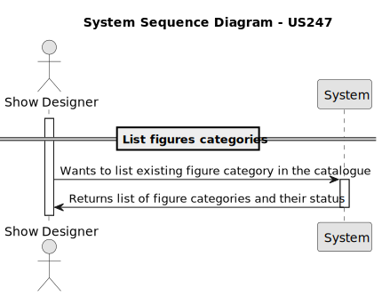
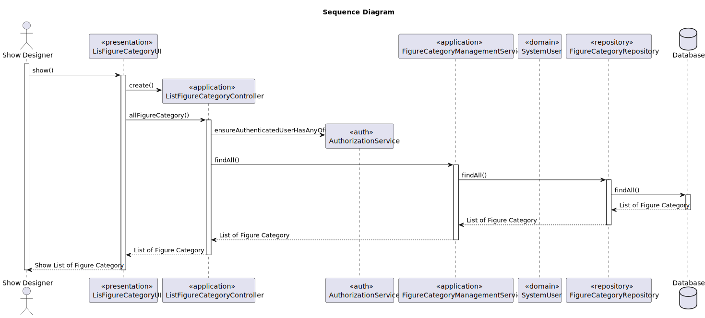
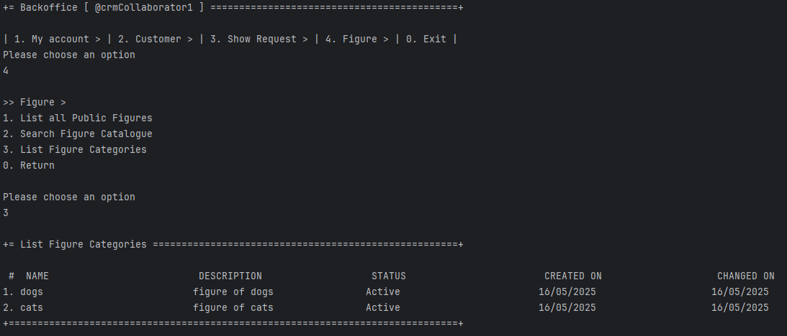
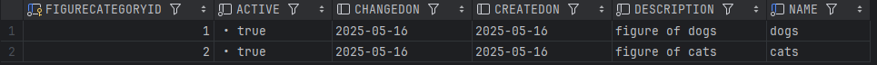

# US 247 - List figure categories


## 1. Context

This task introduces the ability to list all figure categories in the catalogue, supporting both Show Designers and CRM Collaborators in managing and reviewing available content. Including the status of each category (active or inactive).
This feature enhances visibility and organization as the number of categories grows.

## 2. Requirements

**US247** - As a Show Designer or as a CRM Collaborator, I want to list all figure categories in the catalogue. The category status information should be provided.

**Acceptance Criteria:**

* There is no acceptance criteria for this requirement at the current moment.

**Dependencies/References:**

* There is a dependency on the US245 Add figure category and US231 Figure Catalogue. 

**Forum Insight:**

* No questions were raised in the forum regarding this requirement.

## 3. Analysis


## 4. Design

### 4.1. Sequence Diagram



### 4.3. Applied Patterns
- Domain-Driven Design
- Factory
### 4.4. Acceptance Tests

Include here the main tests used to validate the functionality. Focus on how they relate to the acceptance criteria. May be automated or manual tests.

**Test 1:** *Verifies that lits all categories*


```java
 @Test
    void findAll_returnsList() {
        List<FigureCategory> list = List.of(
                new FigureCategory("A", "Desc A", now),
                new FigureCategory("B", "Desc B", now)
        );
        when(repo.findAll()).thenReturn(list);

        Iterable<FigureCategory> result = service.findAll();

        assertIterableEquals(list, result);
        verify(repo).findAll();
    }
````

## 5. Implementation

**ListFigureCategoriesAction**

```java
public class ListFigureCategoriesAction implements Action {
    @Override
    public boolean execute() {
        return new ListFigureCategoriesUI().show();
    }
}
```
**ListFigureCategoriesUI**

```java
public class ListFigureCategoriesUI extends AbstractListUI<FigureCategory> {

    private final ListFigureCategoryController theController = new ListFigureCategoryController();

    @Override
    protected Iterable<FigureCategory> elements() {
        return theController.allFigureCategories() ;
    }

    @Override
    protected Visitor elementPrinter() {
        return new FigureCategoryPrinter();
    }

    @Override
    protected String elementName() {
        return "Figure Category";
    }

    @Override
    protected String listHeader() {
        return String.format(" #  %-30s%-30s%-30s%-30s%-30s", "NAME", "DESCRIPTION", "STATUS", "CREATED ON", "CHANGED ON");
    }

    @Override
    protected String emptyMessage() {
        return "No figure categories found";
    }

    @Override
    public String headline() {
        return "List Figure Categories";
    }
}

```
**ListFigureCategoryController**

```java
@UseCaseController
public class ListFigureCategoryController {

    private final TransactionalContext autoTX = PersistenceContext.repositories().newTransactionalContext();

    private final AuthorizationService authz = AuthzRegistry.authorizationService();

    private final FigureCategoryRepository repo = PersistenceContext.repositories().figureCategories(autoTX);

    private final FigureCategoryManagementService figureCategorySvc = new FigureCategoryManagementService(repo);

    public Iterable<FigureCategory> allFigureCategories() {
        authz.ensureAuthenticatedUserHasAnyOf(Roles.SHOW_DESIGNER);
        return figureCategorySvc.findAll();
    }
}
```

**FigureCategoryManagementService**

```java
public class FigureCategoryManagementService {

    private final FigureCategoryRepository figureCategoryRepository;

    public FigureCategoryManagementService(final FigureCategoryRepository figureCategoryRepository) {
        this.figureCategoryRepository = figureCategoryRepository;
    }

    public FigureCategory registerNewFigureCategory(final String name, final String description) {
        if(isFigureCategoryNameUsed(figureCategoryRepository, name)){
            throw new IllegalArgumentException("Figure Category name already in use");
        }
        FigureCategory figureCategory = new FigureCategory(name, description, CurrentTimeCalendars.now());
        return (FigureCategory) this.figureCategoryRepository.save(figureCategory);
    }

    public Optional<FigureCategory> findFigureCategoryById(Long id) {
        return this.figureCategoryRepository.findById(id);
    }

    public Iterable<FigureCategory> findFigureCategoryByName(String name) {
        return this.figureCategoryRepository.findByName(name);
    }

    public Iterable<FigureCategory> findFigureCategoryByDescription(String description) {
        return this.figureCategoryRepository.findByDescription(description);
    }

    public void editFigureCategory(FigureCategory figureCategory, String newName, String newDescription) {
        boolean edited = false;
        if (newName == null || newName.isEmpty()) {
            throw new IllegalArgumentException("Figure Category name cannot be null or empty!");
        } else if (!newName.equals("N")) {
            edited = true;
           if (isFigureCategoryNameUsed(figureCategoryRepository, newName)) {
                throw new IllegalArgumentException("Figure Category name already in use");
            }else {
                figureCategory.changeName(newName);
            }
        }
        if (newDescription == null || newDescription.isEmpty()) {
            throw new IllegalArgumentException("Figure Category description cannot be null or empty!");
        } else if (!newDescription.equals("N")) {
            edited = true;
            figureCategory.changeDescription(newDescription);
        }
        if (edited) {
            figureCategoryRepository.save(figureCategory);
        }
    }


    public Iterable<FigureCategory> findAll() {
        return this.figureCategoryRepository.findAll();
    }

    public FigureCategory deactivateFigureCategory(FigureCategory figureCategory) {
        figureCategory.deactivate(CurrentTimeCalendars.now());
        return (FigureCategory) this.figureCategoryRepository.save(figureCategory);
    }

    public FigureCategory activateFigureCategory(FigureCategory figureCategory) {
        figureCategory.activate(CurrentTimeCalendars.now());
        return (FigureCategory) this.figureCategoryRepository.save(figureCategory);
    }


    public boolean isFigureCategoryNameUsed(FigureCategoryRepository repo, String name) {
        return repo.isFigureCategoryNameUsed(name);
    }

    public Iterable<FigureCategory> findByActive(boolean active) {
        return this.figureCategoryRepository.findByActive(active);
    }

    public void changeStatus (FigureCategory figureCategory, boolean newStatus) {
        if (newStatus) {
            figureCategory.activate(Calendar.getInstance());
        } else {
            figureCategory.deactivate(Calendar.getInstance());
        }
        this.figureCategoryRepository.save(figureCategory);
    }
}

```

## 6. Integration/Demonstration

**List figure Categories**



**Figure Category Database**

