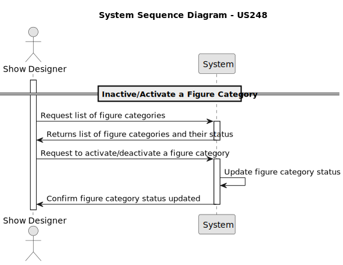
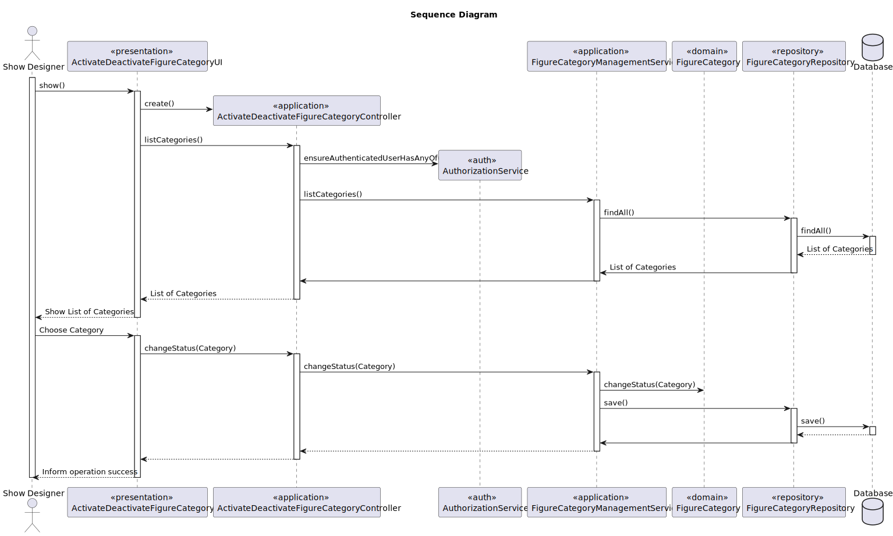

# US 248 - Inactive/Activate a Figure Category


## 1. Context

This task introduces the ability to list all figure categories in the catalogue, supporting both Show Designers and CRM Collaborators in managing and reviewing available content. Including the status of each category (active or inactive).
This feature enhances visibility and organization as the number of categories grows.

## 2. Requirements

**US 248** - As a Show Designer, I want to inactivate/activate an existing figure category in the figure category catalogue.

**Acceptance Criteria:**

* 248.1 Inactivated categories cannot be used in new figures.

**Dependencies/References:**

* There is a dependency on the US245 Add figure category and US231 Figure Catalogue. 

**Forum Insight:**

* Still no questions related to this user story on forum.

## 3. Analysis



## 4. Design

### 4.1. Sequence Diagram


### 4.3. Applied Patterns

- Domain-Driven Design
- Factory

## 5. Implementation

**ChangeFigureCategoryStatusAction**

```java
public class ChangeFigureCategoryStatusAction implements Action {

    @Override
    public boolean execute() {
        return new ChangeFigureCategoryStatusUI().show();
    }
}


```
**ChangeFigureCategoryStatusUI**
```java
public class ChangeFigureCategoryStatusUI extends AbstractUI{

    private final ChangeFigureCategoryStatusController theController = new ChangeFigureCategoryStatusController();

    @Override
    public String headline() {
        return "Change Figure Category Status";
    }

    protected String listHeader() {
        return String.format(" #  %-30s%-30s%-30s%-30s%-30s", "NAME", "DESCRIPTION", "STATUS", "CREATED ON", "CHANGED ON");
    }

    protected String emptyMessage() {
        return "No figure categories found";
    }

    protected String elementName() {
        return "Figure Category";
    }

    protected Iterable<FigureCategory> elements() {
        return this.theController.allFigureCategories();
    }


    protected Visitor<FigureCategory> elementPrinter() {
        return new FigureCategoryPrinter();
    }


    @Override
    protected boolean doShow() {
        final Iterable<FigureCategory> figureCategories = elements();
        if (!figureCategories.iterator().hasNext()) {
            System.out.println("There are no registered Figure Categories in the system");
        } else {
            final SelectWidget<FigureCategory> selector = new SelectWidget<>(listHeader(), figureCategories, elementPrinter());
            selector.show();
            final FigureCategory figureCategory = selector.selectedElement();
            if (figureCategory == null) {
                System.out.println("No figure category selected");
            } else {
                this.theController.changeFigureCategoryStatus(figureCategory, !figureCategory.isActive());
                System.out.println("Figure Category status changed successfully");
            }
        }
        return true;
    }

}


```

**FigureCategoryManagementService**
```Java
public class FigureCategoryManagementService {

    private final FigureCategoryRepository figureCategoryRepository;

    public FigureCategoryManagementService(final FigureCategoryRepository figureCategoryRepository) {
        this.figureCategoryRepository = figureCategoryRepository;
    }

    public FigureCategory registerNewFigureCategory(final String name, final String description) {
        if(isFigureCategoryNameUsed(figureCategoryRepository, name)){
            throw new IllegalArgumentException("Figure Category name already in use");
        }
        FigureCategory figureCategory = new FigureCategory(name, description, CurrentTimeCalendars.now());
        return (FigureCategory) this.figureCategoryRepository.save(figureCategory);
    }

    public Optional<FigureCategory> findFigureCategoryById(Long id) {
        return this.figureCategoryRepository.findById(id);
    }

    public Iterable<FigureCategory> findFigureCategoryByName(String name) {
        return this.figureCategoryRepository.findByName(name);
    }

    public Iterable<FigureCategory> findFigureCategoryByDescription(String description) {
        return this.figureCategoryRepository.findByDescription(description);
    }

    public FigureCategory editFigureCategory(FigureCategory figureCategory,
                                             String newName,
                                             String newDescription) {
        if (isFigureCategoryNameUsed(figureCategoryRepository, newName)) {
            throw new IllegalArgumentException("Figure Category name already in use");
        }else {
            figureCategory.changeName(newName);
            figureCategory.changeDescription(newDescription);
        }
        return (FigureCategory) this.figureCategoryRepository.save(figureCategory);
    }


    public Iterable<FigureCategory> findAll() {
        return this.figureCategoryRepository.findAll();
    }

    public FigureCategory deactivateFigureCategory(FigureCategory figureCategory) {
        figureCategory.deactivate(CurrentTimeCalendars.now());
        return (FigureCategory) this.figureCategoryRepository.save(figureCategory);
    }

    public FigureCategory activateFigureCategory(FigureCategory figureCategory) {
        figureCategory.activate(CurrentTimeCalendars.now());
        return (FigureCategory) this.figureCategoryRepository.save(figureCategory);
    }


    public boolean isFigureCategoryNameUsed(FigureCategoryRepository repo, String name) {
        return repo.isFigureCategoryNameUsed(name);
    }

    public Iterable<FigureCategory> findByActive(boolean active) {
        return this.figureCategoryRepository.findByActive(active);
    }

    public void changeStatus (FigureCategory figureCategory, boolean newStatus) {
        if (newStatus) {
            figureCategory.activate(Calendar.getInstance());
        } else {
            figureCategory.deactivate(Calendar.getInstance());
        }
        this.figureCategoryRepository.save(figureCategory);
    }
}


```

**FigureCategory**

```Java
public class FigureCategory implements AggregateRoot<Long> {

    @Id
    @GeneratedValue(strategy = GenerationType.AUTO)
    private Long figureCategoryId;

    @Column(unique = true, nullable = false)
    private String name;

    @Column(nullable = false)
    private String description;

    @Temporal(TemporalType.DATE)
    private Calendar createdOn;
    private boolean active;
    @Temporal(TemporalType.DATE)
    private Calendar changedOn;


    protected FigureCategory() {
    }

    public FigureCategory(final String name, final String description, final Calendar createdOn) {
        Preconditions.noneNull(new Object[]{name, description});
        this.name = name;
        this.description = description;
        this.active = true;
        this.createdOn = createdOn == null ? Calendar.getInstance() : createdOn;
        this.changedOn = createdOn == null ? Calendar.getInstance() : createdOn;
    }

    public String name() {
        return this.name;
    }
    public void changeName(final String name) {
        Preconditions.noneNull(name);
        this.name = name;
        this.changedOn = Calendar.getInstance();
    }

    public void changeDescription(final String description) {
        Preconditions.noneNull(description);
        this.description = description;
        this.changedOn = Calendar.getInstance();
    }

    public String description() {
        return this.description;
    }

    public Calendar createdOn() {return this.createdOn;}

    public Calendar changedOn() {return this.changedOn;}

    public boolean isActive() {
        return this.active;
    }

    public void deactivate(final Calendar changedOn) {
        if (changedOn != null && !changedOn.before(this.createdOn)) {
            if (!this.active) {
                throw new IllegalStateException("FigureCategory is already deactivated");
            }
            this.active = false;
            this.changedOn = changedOn;
        } else {
            throw new IllegalArgumentException("Deactivation date cannot be before creation date");
        }
    }

    public void activate(final Calendar changedOn) {
        if (!this.isActive()) {
            this.active = true;
            this.changedOn = changedOn == null ? Calendar.getInstance() : changedOn;
        } else {
            throw new IllegalStateException("FigureCategory is already active");
        }
    }

    public void editFigureCategory(final String name, final String description) {
        Preconditions.noneNull(new Object[]{name, description});
        this.name = name;
        this.description = description;
        this.changedOn = Calendar.getInstance();
    }

    @Override
    public boolean sameAs(Object other) {
        if (this == other) {
            return true;
        }
        if (!(other instanceof FigureCategory)) {
            return false;
        }
        FigureCategory that = (FigureCategory) other;
        return this.name.equals(that.name);
    }

    @Override
    public String toString() {
        return "FigureCategory{" +
                "figureCategoryId=" + figureCategoryId +
                ", name='" + name + '\'' +
                ", description='" + description + '\'' +
                ", createdOn=" + createdOn +
                ", active=" + active +
                ", changedOn=" + changedOn +
                '}';
    }


    @Override
    public Long identity() {
        return figureCategoryId;
    }
}

```
## 6. Integration/Demonstration

**Category Selection and changing status**


**Database Result**

*after*


*before*

