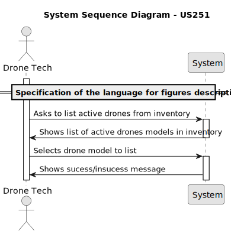
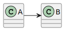

# US 251 - Specification of the language for figures description


## 1. Context

* This user story aims to define a high-level, neutral DSL for describing drone figures and shows, based on the requirements outlined in section 3.1.3.
* The language should support scalability and hardware independence, allowing descriptions to be reused across different drone models and show configurations.

## 2. Requirements

**US251** - As a PO, I want a high-level neutral language to describe figures to be specified.
This language will have to support the requirements in section 3.1.3.


**Acceptance Criteria:**

- US251.1 - The language must be able to describe the drone figures and shows in a high-level, neutral way.
- US251.2 - The language must be scalable and hardware independent.
- US251.3 - The language must support the requirements outlined in section 3.1.3.


**Dependencies/References:**

* There is a dependency on the US240 Drone model creation and US241 Add drone to the inventory, as the drone to be removed must exist in the system before it can be removed.

**Forum Insight:**

>> É relevante para o domínio o colaborador que criou a figura?
>
> Acho que a ideia de dar o devido crédito ao autor da figura é boa. É como no Ikea.


## 3. Analysis



## 4. Design

*In this sections, the team should present the solution design that was adopted to solve the requirement. This should include, at least, a diagram of the realization of the functionality (e.g., sequence diagram), a class diagram (presenting the classes that support the functionality), the identification and rational behind the applied design patterns and the specification of the main tests used to validade the functionality.*

### 4.1. Realization



### 4.3. Applied Patterns

### 4.4. Acceptance Tests

Include here the main tests used to validate the functionality. Focus on how they relate to the acceptance criteria. May be automated or manual tests.

**Test 1:** *Verifies that it is not possible to ...*

**Refers to Acceptance Criteria:** US101.1


```
@Test(expected = IllegalArgumentException.class)
public void ensureXxxxYyyy() {
...
}
````

## 5. Implementation

*In this section the team should present, if necessary, some evidencies that the implementation is according to the design. It should also describe and explain other important artifacts necessary to fully understand the implementation like, for instance, configuration files.*

*It is also a best practice to include a listing (with a brief summary) of the major commits regarding this requirement.*

## 6. Integration/Demonstration

*In this section the team should describe the efforts realized in order to integrate this functionality with the other parts/components of the system*

*It is also important to explain any scripts or instructions required to execute an demonstrate this functionality*

## 7. Observations

*This section should be used to include any content that does not fit any of the previous sections.*

*The team should present here, for instance, a critical prespective on the developed work including the analysis of alternative solutioons or related works*

*The team should include in this section statements/references regarding third party works that were used in the development this work.*

