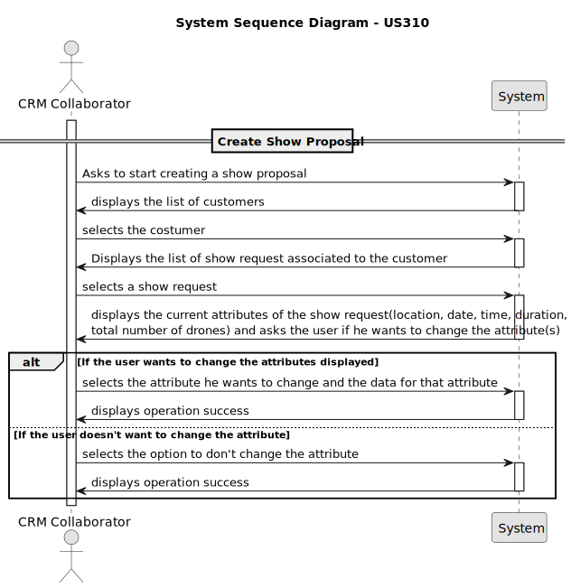
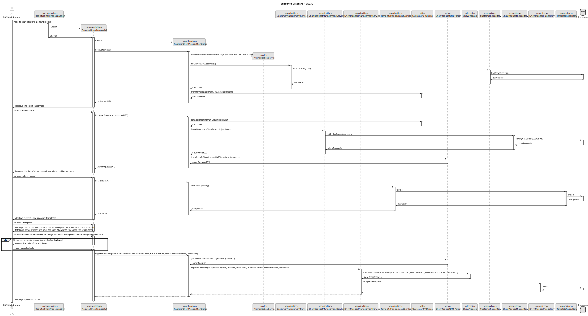

# US 310

## 1. Context

* Once a show request is created, the CRM Collaborator can initiate the process of creating a show proposal, which will be sent to the customer for approval. This proposal must include the total number of drones to be used and must follow a predefined template. At the current stage, all show figures are designed to use all available drones. A show proposal can only be created if there is no existing proposal for that request, and the show request must already be registered in the system. 
* This user story focuses on enabling CRM Collaborators to start the creation of a show proposal, ensuring that the system supports the required validations and business rules to proceed with customer engagement

## 2. Requirements

**US 310** As CRM Collaborator I want to start the process for creating a show proposal so that we can reply to the customer

**Acceptance Criteria:**

- US310.1 The show proposal includes the total number of drones to be used in the show.
- US310.2 Currently, all figures in a show must use all drones.
- US310.3 The show proposal must follow a predefined template.
- US310.4 The user cannot select a show request already with a proposal


**Dependencies/References:**

*There is a dependency with US220, because to select a show request it needs to have a user registered.* \
*There is a dependency with US230, to make a show proposal it needs to have a show request already registered.*


**Forum Insight:**

>>Queria apenas validar uma solução que estamos a ter.\
Só é permitido criar uma show proposal se já existe um show request em sistema?
> 
> Uma show proposal resulta de um show request. Acho que está mais do que claro no documento dos requisitos.\
Só uma nota: não se fazem perguntas ao cliente "só para confirmar". Está-se a fazer o cliente perder tempo.

>>quando um show proposal é criado, só pode ser criado outro depois de ele ser aceite ou não pelo cliente?
> 
> No requisitos não se fala nada disto. É normal que um pedido do cliente dê origem a várias propostas alternativas ["simultâneas"].

>>A US310 retrata a criação de uma Show Proposal.
A US235 do Sprint 2 postula:\
"The show request status information should be provided."\
A minha dúvida, apesar de ser uma minudência: há uma "aceitação manual" do Show Request por parte do CRM Collaborator prévio à criação da Proposal, ou o acto de criação da Show Proposal implica automaticamente que o request status do Show Request mude? (por exemplo, para "Accepted")
> 
>Acho que devia ler novamente o documento. Em especial, veja a figura 5. Não há aceitação de show requests.\
Eu já disse aqui que tenho dúvidas sobre a existência de estados no show request. Aliás, seria um problema complicado garantir a coerência de informação. A evitar.

>>Já que nao existe status para o show request é correto assumir que o show proposal será creado apartir da informaçao presente no show request com alteraçães, ou não, do CRM Collaborator.\
Outra duvida, era se o show proposal teria, ao contrario do show request, status?
> 
> Concordo que a Show Proposal poderá ter estado.

## 3. Analysis



## 4. Design

### 4.1. Sequence Diagram


### 4.3. Applied Patterns

- Information Expert
- Creator
- Controller
- Low Coupling
- Polymorphism

### 4.4. Acceptance Tests

**Test :** *Verifies that all attributes during the creation of a show request*

```
        @Test
    void validateShowRequest_Null_Throws() {
        IllegalArgumentException ex = assertThrows(IllegalArgumentException.class, () -> {
            proposal.validateShowRequest(null);
        });
        assertEquals("ShowRequest cannot be null", ex.getMessage());
    }

    @Test
    void validateShowRequest_Valid_Returns() {
        ShowRequest validRequest = new ShowRequest(geoLocation, now, 2, 20, figures, customer, "Initial", user);
        assertEquals(validRequest, proposal.validateShowRequest(validRequest));
    }

    @Test
    void validateLocation_Null_Throws() {
        IllegalArgumentException ex = assertThrows(IllegalArgumentException.class, () -> {
            proposal.validateLocation(null);
        });
        assertEquals("Location cannot be null", ex.getMessage());
    }

    @Test
    void validateLocation_InvalidAltitude_Throws() {
        GeoLocation loc = new GeoLocation(0, 0, 0); // altitude <= 0
        IllegalArgumentException ex = assertThrows(IllegalArgumentException.class, () -> {
            proposal.validateLocation(loc);
        });
        assertEquals("Altitude must be a positive number.", ex.getMessage());
    }

    @Test
    void validateLocation_Valid_Returns() {
        GeoLocation loc = new GeoLocation(45, 45, 10);
        assertEquals(loc, proposal.validateLocation(loc));
    }

    @Test
    void validateDate_Null_Throws() {
        IllegalArgumentException ex = assertThrows(IllegalArgumentException.class, () -> {
            proposal.validateDate(null);
        });
        assertEquals("Date cannot be null", ex.getMessage());
    }

    @Test
    void validateDate_Valid_Returns() {
        Calendar todayOrFuture = Calendar.getInstance();
        todayOrFuture.add(Calendar.DAY_OF_MONTH, 1);
        assertEquals(todayOrFuture, proposal.validateDate(todayOrFuture));
    }

    @Test
    void validateTime_Null_Throws() {
        IllegalArgumentException ex = assertThrows(IllegalArgumentException.class, () -> {
            proposal.validateTime(null);
        });
        assertEquals("Time cannot be null", ex.getMessage());
    }

    @Test
    void validateTime_Valid_Returns() {
        LocalTime time = LocalTime.now();
        assertEquals(time, proposal.validateTime(time));
    }

    @Test
    void validateDuration_Null_Throws() {
        IllegalArgumentException ex = assertThrows(IllegalArgumentException.class, () -> {
            proposal.validateDuration(null);
        });
        assertEquals("Duration cannot be null.", ex.getMessage());
    }

    @Test
    void validateDuration_NonPositive_Throws() {
        IllegalArgumentException ex0 = assertThrows(IllegalArgumentException.class, () -> {
            proposal.validateDuration(0);
        });
        IllegalArgumentException exNeg = assertThrows(IllegalArgumentException.class, () -> {
            proposal.validateDuration(-1);
        });
        assertEquals("Duration must be greater than 0.", ex0.getMessage());
        assertEquals("Duration must be greater than 0.", exNeg.getMessage());
    }

    @Test
    void validateDuration_Valid_Returns() {
        assertEquals(10, proposal.validateDuration(10));
    }

    @Test
    void validateTotalDroneNumber_Null_Throws() {
        IllegalArgumentException ex = assertThrows(IllegalArgumentException.class, () -> {
            proposal.validateTotalDroneNumber(null);
        });
        assertEquals("Total drone number cannot be null.", ex.getMessage());
    }

    @Test
    void validateTotalDroneNumber_NonPositive_Throws() {
        IllegalArgumentException ex0 = assertThrows(IllegalArgumentException.class, () -> {
            proposal.validateTotalDroneNumber(0);
        });
        IllegalArgumentException exNeg = assertThrows(IllegalArgumentException.class, () -> {
            proposal.validateTotalDroneNumber(-1);
        });
        assertEquals("Total drone number must be greater than 0.", ex0.getMessage());
        assertEquals("Total drone number must be greater than 0.", exNeg.getMessage());
    }

    @Test
    void validateTotalDroneNumber_Valid_Returns() {
        assertEquals(5, proposal.validateTotalDroneNumber(5));
    }

    @Test
    void validateProposalNumber_Negative_Throws() {
        IllegalArgumentException ex = assertThrows(IllegalArgumentException.class, () -> {
            proposal.validateProposalNumber(-1);
        });
        assertEquals("Proposal number cannot be negative", ex.getMessage());
    }

    @Test
    void validateProposalNumber_Valid_Returns() {
        assertEquals(3, proposal.validateProposalNumber(3));
    }

    @Test
    void validateCreatedBy_Null_Throws() {
        IllegalArgumentException ex = assertThrows(IllegalArgumentException.class, () -> {
            proposal.validateCreatedBy(null);
        });
        assertEquals("CreatedBy (SystemUser) cannot be null", ex.getMessage());
    }

    @Test
    void validateCreatedBy_Valid_Returns() {
        assertEquals(user, proposal.validateCreatedBy(user));
    }

    @Test
    void addVideoToProposal_ValidLink_ReturnsTrue() {
        String validLink = "https://www.youtube.com/watch?v=dQw4w9WgXcQ";
        boolean result = proposal.addVideoToProposal(validLink);
        assertTrue(result);
        assertEquals(validLink, proposal.videoLink());
    }

    @Test
    void addVideoToProposal_InvalidLink_ReturnsFalse() {
        String invalidLink = "htp:/invalid-url";
        boolean result = proposal.addVideoToProposal(invalidLink);
        assertFalse(result);
        assertNull(proposal.videoLink());
    }

    @Test
    void isValidVideoLink_ValidUrls_ReturnsTrue() {
        assertTrue(proposal.isValidVideoLink("https://youtube.com/video123"));
        assertTrue(proposal.isValidVideoLink("http://example.com"));
        assertTrue(proposal.isValidVideoLink("www.example.com/test"));
    }

    @Test
    void isValidVideoLink_InvalidUrls_ReturnsFalse() {
        assertFalse(proposal.isValidVideoLink("invalid-url"));
        assertFalse(proposal.isValidVideoLink("ftp://wrongprotocol.com"));
        assertFalse(proposal.isValidVideoLink("example..com"));
        assertFalse(proposal.isValidVideoLink(""));
    }

    @Test
    void isValidVideoLink_Null_Throws() {
        IllegalArgumentException ex = assertThrows(IllegalArgumentException.class, () -> {
            proposal.isValidVideoLink(null);
        });
        assertEquals("Video link cannot be null", ex.getMessage());
    }

    @Test
    void validateTemplate_Null_Throws() {
        IllegalArgumentException ex = assertThrows(IllegalArgumentException.class, () -> {
            proposal.validateTemplate(null);
        });
        assertEquals("Template cannot be null", ex.getMessage());
    }

    @Test
    void validateTemplate_Valid_Returns() {
        assertEquals(template, proposal.validateTemplate(template));
    }


````

## 5. Implementation

**RegisterShowProposalAction**

```java
package eapli.base.app.backoffice.presentation.showProposalManagement;

import eapli.framework.actions.Action;

public class RegisterShowProposalAction implements Action {
    @Override
    public boolean execute() {
        return new RegisterShowProposalUI().show();
    }
}


```
**RegisterShowProposalUI**
```java
package eapli.base.app.backoffice.presentation.showProposalManagement;

import eapli.base.app.backoffice.presentation.customerManagement.CustomerDTOPrinter;
import eapli.base.app.backoffice.presentation.customerManagement.CustomerPrinter;
import eapli.base.app.backoffice.presentation.showRequestManagement.ShowRequestDTOPrinter;
import eapli.base.app.backoffice.presentation.showRequestManagement.ShowRequestPrinter;
import eapli.base.customerManagement.domain.Customer;
import eapli.base.customerManagement.dto.CustomerDTO;
import eapli.base.showProposalManagement.application.RegisterShowProposalController;
import eapli.base.showProposalManagement.domain.Template;
import eapli.base.showRequestManagement.domain.GeoLocation;
import eapli.base.showRequestManagement.domain.ShowRequest;
import eapli.base.showRequestManagement.dto.ShowRequestDTO;
import eapli.framework.io.util.Console;
import eapli.framework.presentation.console.AbstractUI;
import eapli.framework.presentation.console.SelectWidget;

import java.text.ParseException;
import java.text.SimpleDateFormat;
import java.time.LocalTime;
import java.time.format.DateTimeFormatter;
import java.time.format.DateTimeParseException;
import java.util.ArrayList;
import java.util.Calendar;
import java.util.Date;
import java.util.List;

public class RegisterShowProposalUI extends AbstractUI {
    private final RegisterShowProposalController controller = new RegisterShowProposalController();
    SimpleDateFormat sdf = new SimpleDateFormat("dd/MM/yyyy");

    @Override
    protected boolean doShow() {
        Iterable<CustomerDTO> customers = controller.listCustomers();
        if (!customers.iterator().hasNext()) {
            System.out.println("\nThere are no registered Customers in the system!\n");
            return false;
        }
        ShowRequestDTO showRequest = null;
        String headerModelCustomer = String.format("Select Customer\n#  %-30s%-30s%-30s%-30s", "NAME", "STATUS", "PHONE NUMBER", "EMAIL");
        String headerModelRequest = String.format("\nSelect a Show Requests\n#  %-80s%-30s%-30s%-30s%-30s", "LOCATION", "DATE", "NUMBER OF DRONES", "DURATION", "CUSTOMER");
        boolean validRequestSelected = false;
        while (!validRequestSelected) {
            final SelectWidget<CustomerDTO> selectWidgetCustomer = new SelectWidget<>(headerModelCustomer, customers, new CustomerDTOPrinter());
            selectWidgetCustomer.show();
            CustomerDTO customer = selectWidgetCustomer.selectedElement();

            if (customer == null) {
                return true;
            }
            Iterable<ShowRequestDTO> showRequests = this.controller.listShowRequests(customer);
            if (!showRequests.iterator().hasNext()) {
                System.out.println("\nThere are no registered Show Requests associated with this Customer!\n");
                continue;
            }
            while (true) {
                final SelectWidget<ShowRequestDTO> selectWidgetRequest = new SelectWidget<>(headerModelRequest, showRequests, new ShowRequestDTOPrinter());
                selectWidgetRequest.show();
                showRequest = selectWidgetRequest.selectedElement();

                if (showRequest == null) {
                    break;
                }
                boolean exits = false;

                if (!exits) {
                    validRequestSelected = true;
                    break;
                }
            }
        }
        Iterable<Template> templates = controller.listTemplates();
        List<Template> list = new ArrayList<>();
        templates.forEach(list::add);
        if (list.isEmpty()) {
            System.out.println("No templates available!");
            return false;
        }
        Template template = requestTemplate(list);
        GeoLocation location = showRequest.getLocation();
        Calendar date = showRequest.getDate();
        int duration = showRequest.getDuration();
        int droneNumber = showRequest.getDroneNumber();
        String input;
        while (true) {
            menuAttributes(location, date, duration, droneNumber);
            menuSelection();
            while (true) {
                input = Console.readLine("Enter your choice: ");
                if (!input.matches("[0-4]")) {
                    System.out.println("Invalid option. Please enter a number between 0 and 4.");
                    continue;
                }
                int choice = Integer.parseInt(input);

                if (choice == 0) {
                    break;
                }
                switch (choice) {
                    case 1:
                        System.out.println("\nShow Proposal Location");
                        location = requestLocation();
                        break;
                    case 2:
                        System.out.println("\nShow Proposal Date");
                        date = requestDate();
                        break;
                    case 3:
                        System.out.println("\nShow Proposal Duration");
                        duration = requestDuration();
                        break;
                    case 4:
                        System.out.println("\nShow Proposal Total Drone Number");
                        droneNumber = requestTotalDroneNumber();
                        break;
                }
                break;
            }
            if (input.matches("0")) {
                break;
            }
        }
        LocalTime time = requestTime();
        double insurance = requestInsurance();

        try {
            controller.registerShowProposal(showRequest, location, date, time, duration, droneNumber, template, insurance);
            System.out.println("Show Proposal successfully registered!");
        } catch (IllegalArgumentException e) {
            System.out.println("\nERROR: " + e.getMessage() + "\n");
        }
        return true;
    }

    @Override
    public String headline() {
        return "";
    }

    private void menuAttributes(GeoLocation location, Calendar date, int duration, int droneNumber) {
        System.out.println("\nCurrent Show Proposal attributes:");
        System.out.printf("GeoLocation: %s\n", location);
        System.out.printf("Date: %s\n", date != null ? sdf.format(date.getTime()) : "N/A");
        System.out.printf("Duration: %s\n", duration);
        System.out.printf("Drone Number: %s\n", droneNumber);
    }
    private void menuSelection() {
        System.out.println("\nSelect the attribute you which to edit.");
        System.out.println("1. GeoLocation");
        System.out.println("2. Date");
        System.out.println("3. Duration");
        System.out.println("4. Drone Number");
        System.out.println("0. Exit");
    }
    private GeoLocation requestLocation() {
        double latitude = 0;
        double longitude = 0;
        boolean valid = false;

        do {
            try {
                String latStr = Console.readLine("\nEnter the latitude (-90 to 90):");
                latitude = Double.parseDouble(latStr);
                if (latitude < -90 || latitude > 90) {
                    System.out.println("Latitude must be between -90 and 90.");
                    continue;
                }

                String lonStr = Console.readLine("Enter the longitude (-180 to 180):");
                longitude = Double.parseDouble(lonStr);
                if (longitude < -180 || longitude > 180) {
                    System.out.println("Longitude must be between -180 and 180.");
                    continue;
                }

                valid = true;
            } catch (NumberFormatException e) {
                System.out.println("Invalid input. Please enter numeric values for latitude and longitude.");
            }
        } while (!valid);

        int altitude = requestAltitude();
        return new GeoLocation(latitude, longitude, altitude);
    }
    private int requestAltitude() {
        int altitude = 0;
        boolean valid = false;

        do {
            try {
                String input = Console.readLine("Enter the altitude (in meters, positive number):");
                altitude = Integer.parseInt(input);
                if (altitude <= 0) {
                    System.out.println("Altitude must be a positive number.");
                } else {
                    valid = true;
                }
            } catch (NumberFormatException e) {
                System.out.println("Invalid input. Please enter a valid number.");
            }
        } while (!valid);

        return altitude;
    }
    private Calendar requestDate() {
        Calendar date = null;
        SimpleDateFormat sdf = new SimpleDateFormat("yyyy-MM-dd");
        sdf.setLenient(false);
        Calendar currentDate = Calendar.getInstance();

        String dateRegex = "\\d{4}-\\d{2}-\\d{2}";

        while (date == null) {
            String dateInput = Console.readLine("Enter the show date (yyyy-MM-dd):");

            if (!dateInput.matches(dateRegex)) {
                System.out.println("Invalid date. Please ensure the date is real and follows the format yyyy-MM-dd.");
                continue;
            }

            try {
                Date parsedDate = sdf.parse(dateInput);
                Calendar enteredDate = Calendar.getInstance();
                enteredDate.setTime(parsedDate);

                if (enteredDate.before(currentDate)) {
                    System.out.println("The entered date is in the past. Please enter a future date.");
                } else {
                    date = enteredDate;
                }

            } catch (ParseException e) {
                System.out.println("Invalid date. Please ensure the date is real and follows the format yyyy-MM-dd.");
            }
        }
        return date;
    }
    private int requestDuration() {
        int duration = -1;
        while (duration <= 0) {
            try {
                duration = Integer.parseInt(Console.readLine("Enter duration (in minutes):"));
                if (duration <= 0) {
                    System.out.println("Duration must be greater than 0.");
                }
            } catch (NumberFormatException e) {
                System.out.println("Invalid input. Please enter a valid integer.");
            }
        }
        return duration;
    }
    private int requestTotalDroneNumber() {
        int droneNumber = -1;
        while (droneNumber <= 0) {
            try {
                droneNumber = Integer.parseInt(Console.readLine("Enter total number of drones:"));
                if (droneNumber <= 0) {
                    System.out.println("The number must be greater than 0.");
                }
            } catch (NumberFormatException e) {
                System.out.println("Invalid input. Please enter a valid integer.");
            }
        }
        return droneNumber;
    }

    private double requestInsurance(){
        double insurance = -1;
        while(insurance <= 0){
            try{
                insurance = Console.readDouble("Enter Insurance Amount:");
                if(insurance <= 0){
                    System.out.println("The number must be greater than 0.");
                }
            }catch (NumberFormatException e){
                System.out.println("Invalid input. Please enter a valid double.");

            }
        }
        return insurance;
    }

    private LocalTime requestTime() {
        LocalTime eventTime = null;
        DateTimeFormatter timeFormatter = DateTimeFormatter.ofPattern("HH:mm");

        while (eventTime == null) {
            String input = Console.readLine("Enter the event time (HH:mm): ").trim();

            if (input == null || input.isEmpty()) {
                System.out.println("Time input cannot be empty.");
                continue;
            }

            try {
                eventTime = LocalTime.parse(input, timeFormatter);
            } catch (DateTimeParseException e) {
                System.out.println("Invalid time format. Please use HH:mm (e.g., 18:30).");
            }
        }
        return eventTime;
    }

    private Template requestTemplate(List<Template> list) {
        int i = 0;
        while (true) {
            Template current = list.get(i);
            System.out.printf("%nTemplate %d of %d:%n%s%n", i + 1, list.size(), current);

            String cmd = Console.readLine("[y] choose  [n] next  [p] previous : ").trim().toLowerCase();

            switch (cmd) {
                case "y": case "yes":
                    return current;
                case "n": case "next":
                    if (i < list.size() - 1) {
                        i++;
                    } else {
                        System.out.println("No more templates. You are at the last one.");
                    }
                    break;
                case "p": case "prev": case "previous":
                    if (i > 0) {
                        i--;
                    } else {
                        System.out.println("No previous templates. You are at the first one.");
                    }
                    break;
                default:
                    System.out.println("Unknown option, try again.");
            }
        }
    }
}

```

**RegisterShowProposalController**
```java
package eapli.base.showProposalManagement.application;

import eapli.base.customerManagement.application.CustomerManagementService;
import eapli.base.customerManagement.domain.Customer;
import eapli.base.customerManagement.dto.CustomerDTO;
import eapli.base.customerManagement.dto.CustomerDTOParser;
import eapli.base.customerManagement.repositories.CustomerRepository;
import eapli.base.infrastructure.persistence.PersistenceContext;
import eapli.base.showProposalManagement.domain.ShowProposal;
import eapli.base.showProposalManagement.domain.Template;
import eapli.base.showProposalManagement.repositories.ShowProposalRepository;
import eapli.base.showProposalManagement.repositories.TemplateRepository;
import eapli.base.showRequestManagement.application.ShowRequestManagementService;
import eapli.base.showRequestManagement.domain.GeoLocation;
import eapli.base.showRequestManagement.domain.ShowRequest;
import eapli.base.showRequestManagement.dto.ShowRequestDTO;
import eapli.base.showRequestManagement.dto.ShowRequestDTOParser;
import eapli.base.showRequestManagement.repositories.ShowRequestRepository;
import eapli.base.usermanagement.domain.ExemploPasswordPolicy;
import eapli.base.usermanagement.domain.Roles;
import eapli.framework.infrastructure.authz.application.AuthorizationService;
import eapli.framework.infrastructure.authz.application.AuthzRegistry;
import eapli.framework.infrastructure.authz.domain.model.PasswordPolicy;
import eapli.framework.infrastructure.authz.domain.model.PlainTextEncoder;
import org.springframework.security.crypto.password.PasswordEncoder;

import java.time.LocalTime;
import java.util.Calendar;
import java.util.Optional;

public class RegisterShowProposalController {
    private final AuthorizationService authz = AuthzRegistry.authorizationService();
    private final PasswordEncoder passwordEncoder = new PlainTextEncoder();
    private final PasswordPolicy passwordPolicy = new ExemploPasswordPolicy();
    private final CustomerRepository customerRepository = PersistenceContext.repositories().customers();
    private final CustomerManagementService customerManagementService = new CustomerManagementService(customerRepository, passwordEncoder, passwordPolicy);
    private final ShowRequestRepository showRequestRepository = PersistenceContext.repositories().showRequests();
    private final ShowRequestManagementService showRequestManagementService = new ShowRequestManagementService(showRequestRepository);
    private final ShowProposalRepository showProposalRepository = PersistenceContext.repositories().showProposals();
    private final ShowProposalManagementService showProposalManagementService = new ShowProposalManagementService(showProposalRepository);
    private final TemplateRepository templateRepository = PersistenceContext.repositories().templates();
    private final TemplateManagementService templateManagementService = new TemplateManagementService(templateRepository);

    private final CustomerDTOParser customerDTOParser = new CustomerDTOParser();
    private final ShowRequestDTOParser showRequestDTOParser = new ShowRequestDTOParser();

    public Iterable<CustomerDTO> listCustomers() {
        authz.ensureAuthenticatedUserHasAnyOf(Roles.CRM_COLLABORATOR);
        Iterable <Customer> customers = customerManagementService.findAllActiveCustomers();
        return customerDTOParser.transformToCustomerDTOList(customers);
    }

    public Iterable<ShowRequestDTO> listShowRequests(CustomerDTO customerDTO) {
        Optional<Customer> customer = customerDTOParser.getCustomerFromDTO(customerDTO);
        Iterable<ShowRequest> showRequests = showRequestManagementService.findByCustomer(customer.get());
        return showRequestDTOParser.transformToShowRequestDTOlist(showRequests);
    }

    public ShowProposal registerShowProposal(ShowRequestDTO showRequestDTO, GeoLocation location, Calendar date, LocalTime time, int duration, int totalDroneNumber, Template template, double insurance) {
        Optional<ShowRequest> showRequest = showRequestDTOParser.getShowRequestfromDTO(showRequestDTO);
        return showProposalManagementService.registerShowProposal(showRequest.get(), location, date, time, duration, totalDroneNumber, authz.session().get().authenticatedUser(), template, insurance);
    }

    public Iterable<Template> listTemplates() {
        return templateManagementService.listAllTemplates();
    }
}

```
**CustomerManagementService**
```Java
public class CustomerManagementService {

    private final CustomerRepository customerRepository;

    public CustomerManagementService(final CustomerRepository customerRepository) {
        this.customerRepository = customerRepository;
    }

    public Customer registerNewCustomer(final String customerName, final String customerAddress, final String customerEmail, final String password, final String customerPhoneNumber, final String customerVatNumber, final SystemUser createdBy, final Customer.CustomerStatus status, final Calendar createdOn) {
        if (customerName == null || customerName.isEmpty()) {
            throw new IllegalArgumentException("Customer name cannot be null or empty");
        }
        if (customerAddress == null || customerAddress.isEmpty()) {
            throw new IllegalArgumentException("Customer address cannot be null or empty");
        }
        if (customerEmail == null || customerEmail.isEmpty() || isEmailUsed(customerEmail)) {
            throw new IllegalArgumentException("Customer email cannot be null or empty");
        }
        if (password == null || password.isEmpty()) {
            throw new IllegalArgumentException("Customer password cannot be null or empty");
        }
        if (customerPhoneNumber == null || customerPhoneNumber.isEmpty()) {
            throw new IllegalArgumentException("Customer phone number cannot be null or empty");
        }
        if (customerVatNumber == null || customerVatNumber.isEmpty() || isVatNumberUsed(customerVatNumber)) {
            throw new IllegalArgumentException("Customer VAT number cannot be null or empty");
        }
        if (createdBy == null) {
            throw new IllegalArgumentException("Created by cannot be null");
        }
        if (status == null) {
            throw new IllegalArgumentException("Customer status cannot be null");
        }
        Customer newCustomer = new Customer(customerName, customerAddress, customerEmail, password, customerPhoneNumber, customerVatNumber, createdBy, status, createdOn);
        return (Customer) this.customerRepository.save(newCustomer);
    }

    public Customer registerNewCustomer(final String customerName, final String customerAddress, final String customerEmail, final String password, final String customerPhoneNumber, final String customerVatNumber, final SystemUser createdBy) {
        return registerNewCustomer(customerName, customerAddress, customerEmail, password, customerPhoneNumber, customerVatNumber, createdBy, Customer.CustomerStatus.CREATED, CurrentTimeCalendars.now());
    }

    public Optional<Customer> findCustomerById(final Long id) {
        return this.customerRepository.findById(id);
    }

    public Iterable<Customer> findAllActiveCustomers() {
        return this.customerRepository.findByActive();
    }

    public Iterable<Customer> findAllCustomers() {
        return this.customerRepository.findAll();
    }

    public Customer changeCustomerStatus(final Customer customer, final Customer.CustomerStatus status) {
        customer.changeStatus(status);
        return (Customer) this.customerRepository.save(customer);
    }


    public boolean isEmailUsed(String customerEmail) {
        return this.customerRepository.isEmailUsed(customerEmail);
    }

    public boolean isVatNumberUsed(String customerVatNumber) {
        return this.customerRepository.isVatNumberUsed(customerVatNumber);
    }
}


```

**CustomerDTOParser**
```java
package eapli.base.customerManagement.dto;

import eapli.base.customerManagement.domain.Customer;
import eapli.base.customerManagement.repositories.CustomerRepository;
import eapli.base.infrastructure.persistence.PersistenceContext;

import java.util.Optional;
import java.util.stream.Collectors;
import java.util.stream.StreamSupport;

public class CustomerDTOParser {

    private final CustomerRepository customerRepository = PersistenceContext.repositories().customers();


    public Iterable<CustomerDTO> transformToCustomerDTOList(final Iterable<Customer> customers){
        return StreamSupport.stream(customers.spliterator(), false).map(Customer::toDTO).collect(Collectors.toUnmodifiableList());
    }

    public Optional<Customer> getCustomerFromDTO(final CustomerDTO customerDTO){
        return this.customerRepository.findById(customerDTO.getCustomerId());
    }
}

```

**ShowRequestDTOParser**
```java
package eapli.base.showRequestManagement.dto;

import eapli.base.infrastructure.persistence.PersistenceContext;
import eapli.base.showProposalManagement.domain.ShowProposal;
import eapli.base.showRequestManagement.domain.ShowRequest;
import eapli.base.showRequestManagement.repositories.ShowRequestRepository;

import java.util.Optional;
import java.util.stream.Collectors;
import java.util.stream.StreamSupport;

public class ShowRequestDTOParser {
    private final ShowRequestRepository showRequestRepository = PersistenceContext.repositories().showRequests();

    public Iterable<ShowRequestDTO> transformToShowRequestDTOlist(final Iterable<ShowRequest> showRequests){
        return StreamSupport.stream(showRequests.spliterator(), true).map(ShowRequest::toDTO).collect(Collectors.toUnmodifiableList());
    }

    public Optional<ShowRequest> getShowRequestfromDTO(ShowRequestDTO showRequestDTO){
        return this.showRequestRepository.findById(showRequestDTO.getShowRequestId());
    }
}


```

**CustomerManagementService**
```Java
public Iterable<Customer> findAllActiveCustomers() {
    return this.customerRepository.findByActive();
}

```

**ShowProposalManagementService**
```Java
public ShowProposal registerShowProposal(ShowRequest showRequest, GeoLocation location, Calendar date, LocalTime time, int duration, int totalDroneNumber, SystemUser user, Template template, double insurance) {
    long proposalCount = showProposalRepository.countByShowRequest(showRequest);
    int proposalNumber = (int) proposalCount + 1;

    ShowProposal showProposal = new ShowProposal(showRequest, location, date, time, duration, totalDroneNumber, proposalNumber, user, template, insurance);
    return (ShowProposal) this.showProposalRepository.save(showProposal);
}
```
**ShowRequestManagementService**
```Java
public Iterable<ShowRequest> findByCustomer(Customer customer) {
    return this.showRequestRepository.findByCustomer(customer);
}

```

**TemplateManagementService**
```Java
public Iterable<Template> listAllTemplates() {
        return this.templateRepository.findAll();
    }
```

**ShowProposal**
``` java
package eapli.base.showProposalManagement.domain;

import eapli.base.droneModelManagement.domain.DroneModel;
import eapli.base.figureManagement.domain.Figure;
import eapli.base.showProposalManagement.dto.ShowProposalDTO;
import eapli.base.showRequestManagement.domain.GeoLocation;
import eapli.base.showRequestManagement.domain.ShowRequest;
import eapli.base.showRequestManagement.domain.ShowStatus;
import eapli.framework.domain.model.AggregateRoot;
import eapli.framework.infrastructure.authz.domain.model.SystemUser;
import eapli.framework.representations.dto.DTOable;
import jakarta.persistence.*;

import java.time.LocalTime;
import java.util.ArrayList;
import java.util.Calendar;
import java.util.List;

@Entity
public class ShowProposal implements AggregateRoot<Long>, DTOable<ShowProposalDTO> {
    @Id
    @GeneratedValue(strategy = GenerationType.AUTO)
    private Long showProposalId;

    @ManyToOne
    private ShowRequest showRequest;

    @Column(nullable = false)
    private GeoLocation location;

    @Temporal(TemporalType.DATE)
    private Calendar date;

    @Column(nullable = false)
    private LocalTime time;

    @Column(nullable = false)
    private int duration;

    @Column(nullable = false)
    private int totalDroneNumber;

    @Column(nullable = false)
    private double insuranceAmount;

    @Temporal(TemporalType.DATE)
    private Calendar createdOn;

    @Column(nullable = false)
    private int proposalNumber;

    @ManyToOne
    private SystemUser createdBy;
    @Enumerated(EnumType.STRING)
    private ShowStatus status;

    @OneToMany(mappedBy = "showProposal", cascade = CascadeType.ALL)
    private List<DroneListItem> droneModelList;

    @OneToMany(mappedBy = "showProposal", cascade = CascadeType.ALL, orphanRemoval = true)
    private List<FigureListItem> figureListItems = new ArrayList<>();

    @Column (nullable = true)
    private String videoLink;

    @ManyToOne
    private Template template;

    @OneToOne(cascade = CascadeType.ALL)
    @JoinColumn(name = "document_id", referencedColumnName = "documentId")
    private Document document;

    @Embedded
    private ProposalAnswerFeedback proposalAnswerFeedback;

    private boolean isCompleted = false;

    protected ShowProposal() {}

    public ShowProposal(ShowRequest showRequest, GeoLocation location, Calendar date, LocalTime time, int duration, int totalDroneNumber, int proposalNumber, SystemUser createdBy, Template template, double insuranceAmount) {
        this.showRequest = validateShowRequest(showRequest);
        this.location = validateLocation(location);
        this.date = validateDate(date);
        this.time = validateTime(time);
        this.duration = validateDuration(duration);
        this.totalDroneNumber = validateTotalDroneNumber(totalDroneNumber);
        this.proposalNumber = validateProposalNumber(proposalNumber);
        this.template = validateTemplate(template);
        this.createdBy = validateCreatedBy(createdBy);
        this.createdOn = Calendar.getInstance();
        this.status = ShowStatus.PENDING;
        this.droneModelList = new ArrayList<>();
        this.figureListItems = new ArrayList<>();
        this.document = null;
        this.proposalAnswerFeedback = null;
        this.insuranceAmount = insuranceAmount;
    }

    public boolean addDroneToList(DroneModel droneModel, int quantity){
        if (droneModel == null || quantity <= 0) return false;

        int currentTotal = 0;
        for (DroneListItem item : droneModelList) {
            currentTotal += item.numberOfDrones();
        }

        if (currentTotal + quantity > totalDroneNumber) {
            return false;
        }

        for (DroneListItem item : droneModelList) {
            if (item.droneModel().equals(droneModel)) {
                return false;
            }
        }

        DroneListItem newItem = new DroneListItem(droneModel, this, quantity);
        droneModelList.add(newItem);
        return true;
    }

    public int allDroneModels_Quantity(){
        int currentTotal = 0;
        for (DroneListItem item : droneModelList) {
            currentTotal += item.numberOfDrones();
        }
        return currentTotal;
    }

    public List<DroneListItem> droneListItem (){
        return this.droneModelList;
    }

    public boolean addFigureWithDroneModel(Figure figure, DroneModel droneModel, int sequenceNumber) {
        if (figure == null || droneModel == null) {
            throw new IllegalArgumentException("Figure or DroneModel cannot be null!");
        }
        for (FigureListItem item : figureListItems) {
            if (item.figure().equals(figure) && item.droneModel().equals(droneModel)) {
                System.out.println("This Figure is already associated with the selected DroneModel!");
                return false;
            }
        }

        FigureListItem newItem = new FigureListItem(figure, droneModel, this, sequenceNumber);
        figureListItems.add(newItem);
        return true;
    }


    public boolean addVideoToProposal(String video) {
        if (isValidVideoLink(video)) {
            this.videoLink = video;
            return true;
        }
        return false;
    }

    public Template template() {return this.template;}

    public ShowStatus status(){return  this.status;}

    public ShowRequest showRequest() { return this.showRequest; }

    public Calendar createdOn() { return this.createdOn; }

    public GeoLocation location() { return this.location; }

    public Calendar date() { return this.date; }

    public int totalDroneNumber() { return this.totalDroneNumber; }

    public int duration() { return this.duration; }

    public int proposalNumber() { return this.proposalNumber; }

    public SystemUser createdBy() { return this.createdBy; }

    public LocalTime time() { return this.time; }

    public String videoLink() { return this.videoLink; }

    public double insuranceAmount() { return this.insuranceAmount; }

    public ProposalAnswerFeedback proposalAnswerFeedback(){ return this.proposalAnswerFeedback; }

    public Document document(){return this.document;}

    public ShowRequest validateShowRequest(ShowRequest showRequest) {
        if (showRequest == null)
            throw new IllegalArgumentException("ShowRequest cannot be null");
        return showRequest;
    }

    public GeoLocation validateLocation(GeoLocation location) {
        if (location == null) {
            throw new IllegalArgumentException("Location cannot be null");
        }

        double latitude = location.latitude();
        double longitude = location.longitude();
        int altitude = location.altitude();

        if (latitude < -90 || latitude > 90) {
            throw new IllegalArgumentException("Latitude must be between -90 and 90 degrees.");
        }

        if (longitude < -180 || longitude > 180) {
            throw new IllegalArgumentException("Longitude must be between -180 and 180 degrees.");
        }

        if (altitude <= 0) {
            throw new IllegalArgumentException("Altitude must be a positive number.");
        }
        return location;
    }

    public Calendar validateDate(Calendar date) {
        if (date == null) {
            throw new IllegalArgumentException("Date cannot be null");
        }
        return date;
    }

    public LocalTime validateTime(LocalTime time) {
        if (time == null)
            throw new IllegalArgumentException("Time cannot be null");
        return time;
    }

    public int validateDuration(Integer duration) {
        if (duration == null) {
            throw new IllegalArgumentException("Duration cannot be null.");
        }
        if (duration <= 0) {
            throw new IllegalArgumentException("Duration must be greater than 0.");
        }
        return duration;
    }

    public int validateTotalDroneNumber(Integer totalDroneNumber) {
        if (totalDroneNumber == null) {
            throw new IllegalArgumentException("Total drone number cannot be null.");
        }
        if (totalDroneNumber <= 0) {
            throw new IllegalArgumentException("Total drone number must be greater than 0.");
        }
        return totalDroneNumber;
    }

    public int validateProposalNumber(int proposalNumber) {
        if (proposalNumber < 0)
            throw new IllegalArgumentException("Proposal number cannot be negative");
        return proposalNumber;
    }

    public SystemUser validateCreatedBy(SystemUser createdBy) {
        if (createdBy == null)
            throw new IllegalArgumentException("CreatedBy (SystemUser) cannot be null");
        return createdBy;
    }

    public boolean isValidVideoLink(String videoLink) {
        if (videoLink == null) {
            throw new IllegalArgumentException("Video link cannot be null");
        }
        final String videoLinkPattern = "^(https?://|www\\.)[a-zA-Z0-9][-a-zA-Z0-9&',./_=?%#:~]*$";
        return videoLink.matches(videoLinkPattern);
    }

    public Template validateTemplate(Template template) {
        if (template == null) {
            throw new IllegalArgumentException("Template cannot be null");
        }
        return template;
    }
    public boolean updateProposalAnswer(ProposalAnswerFeedback answer){
        if(answer != null & answer.answer() != null){
            this.proposalAnswerFeedback = answer;
            return true;
        }
        return false;
    }

    public boolean markShowProposal(){
        if(proposalAnswerFeedback != null && proposalAnswerFeedback.answer() == ProposalAnswerFeedback.Answer.ACCEPTED){
            status = ShowStatus.ACCEPTED;
            return true;
        }
        return false;
    }

    public boolean addDocument(Document document){
        if(document != null){
            this.document = document;
            return true;
        }
        return false;
    }

    public boolean isCompleted() {
        if (videoLink != null && figureListItems.size() > 0 && droneModelList.size() > 0) {
            this.isCompleted = true;
            return true;
        }
        return false;
    }

    public void changeStatus(ShowStatus status) {
        if (status == null) {
            throw new IllegalArgumentException("Status cannot be null");
        }
        this.status = status;
    }

    @Override
    public boolean sameAs(Object other) {
        if (this == other) return true;
        if (!(other instanceof ShowProposal)) return false;
        ShowProposal that = (ShowProposal) other;
        return showProposalId != null && showProposalId.equals(that.showProposalId);
    }

    @Override
    public Long identity() {
        return this.showProposalId;
    }

    @Override
    public ShowProposalDTO toDTO() {
        Long docId = document != null ? document.identity() : null;
        return new ShowProposalDTO(showProposalId,showRequest.identity(),showRequest().customer().customerName().toString(),showRequest.description(), location, date,
                time,duration,totalDroneNumber,insuranceAmount,createdOn,proposalNumber,createdBy.name().toString(), status,videoLink,droneModelList,template.name(), docId, proposalAnswerFeedback);
    }
}
```


## 6. Integration/Demonstration

**Registering Show Proposal**


.png)

.png)

**Database Result**


