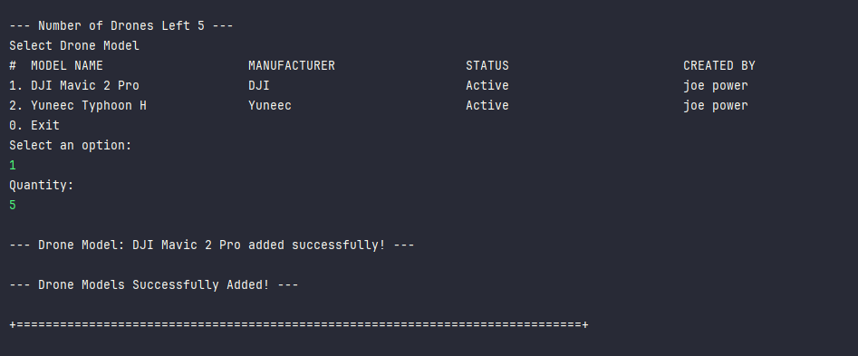

# US 311 - Add drones to a proposal

## 1. Context

*This user story focuses on enabling CRM collaborators to configure the drone list for a proposal, ensuring that only valid models (i.e., those that exist in Shodrone's inventory)
can be selected. At this stage, there is no requirement to verify whether drones are already allocated to another show on the same date.*

## 2. Requirements

**US311** As a CRM Collaborator, I want to configure the list of drone models (number of drones and model) of
a show proposal.
The drones in the proposal must be compatible with the drones in the Shodrone’s inventory. There is
no need to verify if these drones are used in another show on the same date.

**Acceptance Criteria:**

- US311.1 The drone models in the proposal must be compatible with the drones in the Shodrone’s inventory.
- US311.2 The system does not need to validate the availability of drones for a specific date.
- US311.3 The user must be able to add multiple drone models with corresponding quantities to a single proposal.

**Dependencies/References:**

*There is a dependency on the US310, since this US creates a show proposal.*

**Forum Insight:**

* Still no questions related to this user story on forum.


## 3. Analysis


## 4. Design

### 4.1. Sequence Diagram


### 4.3. Applied Patterns

- Controller
- Creator
- Polymorphism
- Indirection

### 4.4. Acceptance Tests

**Test 1:** *Tests that adding valid drone models with positive quantities to the proposal succeeds and the total quantities are updated accordingly.*

```
    @Test
    void addDroneToList_Succeed() {
        boolean result1 = proposal.addDroneToList(modelA, 3);
        assertTrue(result1);
        assertEquals(3, proposal.allDroneModels_Quantity());

        boolean result2 = proposal.addDroneToList(modelB, 2);
        assertTrue(result2);
        assertEquals(5, proposal.allDroneModels_Quantity());
    }

````

**Test 2:** *Tests failure cases for adding drone models to the proposal: when the drone model is null, quantity is non-positive, total quantity was exceeded, or the drone model has already been added.*

```
@Test
    void addDroneToList_Fail_DroneModelIsNull() {
        boolean result = proposal.addDroneToList(null, 2);
        assertFalse(result);
    }

    @Test
    void addDroneToList_Fail_QuantityIsNonPositive() {
        boolean resultZero = proposal.addDroneToList(modelA, 0);
        boolean resultNegative = proposal.addDroneToList(modelA, -1);

        assertFalse(resultZero);
        assertFalse(resultNegative);
    }

    @Test
    void addDroneToList_Fail_ExceedingTotalLimit() {
        assertTrue(proposal.addDroneToList(modelA, 4));
        assertFalse(proposal.addDroneToList(modelB, 2)); // Total é 5
    }

    @Test
    void addDroneToList_Fail_ModelAlreadyAdded() {
        assertTrue(proposal.addDroneToList(modelA, 3));
        assertFalse(proposal.addDroneToList(modelA, 1));
    }
````

**Test 3:** *Tests that the service successfully adds a drone model to a valid show proposal.*

```
   @Test
    void addDroneModelToProposal_success() {
        boolean result = service.addDroneModelToProposal(proposal, modelA, 3);
        assertTrue(result);
    }

````

**Test 4:** *Tests that the service throws an IllegalArgumentException when attempting to add a drone model to a null proposal or when the drone model itself is null.*

```
   @Test
    void addDroneModelToProposal_nullProposal_throwsException() {
        assertThrows(IllegalArgumentException.class, () ->
                service.addDroneModelToProposal(null, modelA, 3));
    }

    @Test
    void addDroneModelToProposal_nullDroneModel_throwsException() {
        assertThrows(IllegalArgumentException.class, () ->
                service.addDroneModelToProposal(proposal, null, 3));
    }

````


## 5. Implementation

**AddDronesToProposalAction**

```java
public class AddDronesToProposalAction implements Action {
    @Override
    public boolean execute() {
        return new AddDronesToProposalUI().show();
    }
}
```
**AddDronesToProposalUI**
```java
public class AddDronesToProposalUI extends AbstractUI {

    private final AddDronesToProposalController controller = new AddDronesToProposalController();
    @Override
    protected boolean doShow() {
        Iterable<ShowProposal> showProposalList = this.controller.getListShowProposals();
        if (!showProposalList.iterator().hasNext()) {
            System.out.println("There are no registered Show Proposals in the system to add Drone Models!");
            return false;
        }
        String headerModel = String.format("Select Show Proposal\n#  %-30s%-30s%-30s%-30s%-30s", "DESCRIPTION","PROPOSAL NUMBER", "CUSTOMER NAME", "DATE", "DURATION");
        SelectWidget<ShowProposal> selectorShowProposal = new SelectWidget<>(headerModel, showProposalList, new ShowProposalPrinter());
        selectorShowProposal.show();
        ShowProposal showProposal = selectorShowProposal.selectedElement();
        if(showProposal == null){
            System.out.println("Show Proposal cannot be null!");
            return false;
        }
        if(addingDroneModels(showProposal)){
            this.controller.save(showProposal);
        }

        return true;
    }


    public boolean addingDroneModels(ShowProposal showProposal){
        List<DroneModel> availableDroneModels = new ArrayList<>();
        Iterable<DroneModel> droneModels = this.controller.getListDroneModels();
        for (DroneModel model : droneModels) {
            availableDroneModels.add(model);
        }
        while(true){
            int numberOfDronesLeft = showProposal.totalDroneNumber() - controller.allDronesInDroneList(showProposal);
            if(numberOfDronesLeft == 0){
                System.out.println("\n--- Drone Models Successfully Added! ---\n");
                return true;
            }
            System.out.println("\n--- Number of Drones Left " + numberOfDronesLeft + " ---");
            if (availableDroneModels.isEmpty()) {
                System.out.println("No more Drone Models available to select.");
                break;
            }
            String headerdroneModel = String.format("Select Drone Model\n#  %-30s%-30s%-30s%-30s", "MODEL NAME", "MANUFACTURER", "STATUS", "CREATED BY");
            SelectWidget<DroneModel> droneModelSelectWidget = new SelectWidget<>(headerdroneModel, availableDroneModels, new DroneModelPrinter());
            droneModelSelectWidget.show();
            DroneModel droneModel = droneModelSelectWidget.selectedElement();
            if(droneModel == null){
                System.out.println("The Drone Model cannot be null!");
                break;
            }
            int quantity = Console.readInteger("Quantity:");
            try{
                if(controller.addDroneModelToProposal(showProposal, droneModel, quantity)){
                    System.out.printf("\n--- Drone Model: %s added successfully! ---\n", droneModel.modelName());
                    availableDroneModels.remove(droneModel);
                }else{
                    System.out.println("Error adding Drone Model!");
                }
            }catch (IllegalArgumentException e){
                System.out.println("Error: " + e.getMessage());
            }
        }
        return false;
    }

    @Override
    public String headline() {
        return "Add Drone Models to the Show Proposal";
    }
}
```

**AddDronesToProposalController**
```java
@UseCaseController
public class AddDronesToProposalController {
    
    private final ShowProposalRepository showProposalRepository = PersistenceContext.repositories().showProposals();
    private final ShowProposalManagementService showProposalManagementService = new ShowProposalManagementService(showProposalRepository);
    private final DroneModelRepository droneModelRepository = PersistenceContext.repositories().droneModels();
    
    public Iterable<DroneModel> getListDroneModels(){
        return this.droneModelRepository.findByActive(true);
    }

    public Iterable<ShowProposal> getListShowProposals(){
        return this.showProposalRepository.findByStatusAndEmptyDroneList(ShowProposalStatus.PENDING);
    }

    public boolean addDroneModelToProposal(ShowProposal showProposal,DroneModel droneModel, int quantity){
        return showProposalManagementService.addDroneModelToProposal(showProposal,droneModel, quantity);
    }

    public void save(ShowProposal showProposal){
        this.showProposalRepository.save(showProposal);
    }

    public int allDronesInDroneList(ShowProposal showProposal){
        return showProposal.allDroneModels_Quantity();
    }

}

```

**ShowProposalManagementService**

```Java
public class ShowProposalManagementService {
    private final ShowProposalRepository showProposalRepository;

    public ShowProposalManagementService(final ShowProposalRepository showProposalRepository) {
        this.showProposalRepository = showProposalRepository;
    }

    public ShowProposal registerShowProposal(ShowRequest showRequest, GeoLocation location, Calendar date, LocalTime time, int duration, int totalDroneNumber, SystemUser user) {
        long proposalCount = showProposalRepository.countByShowRequest(showRequest);
        int proposalNumber = (int) proposalCount + 1;

        ShowProposal showProposal = new ShowProposal(showRequest, location, date, time, duration, totalDroneNumber, proposalNumber, user, ShowProposalStatus.PENDING);
        return (ShowProposal) this.showProposalRepository.save(showProposal);
    }

    public boolean addDroneModelToProposal(ShowProposal showProposal, DroneModel droneModel,int quantity){
        if(showProposal == null){
            throw new IllegalArgumentException("Show Proposal cannot be null!");
        }
        if(droneModel == null){
            throw new IllegalArgumentException("Drone Model cannot be null!");
        }
        return showProposal.addDroneToList(droneModel, quantity);
    }
}
```

**ShowProposal**
```Java
@Entity
public class ShowProposal implements AggregateRoot<Long> {
    @Id
    @GeneratedValue(strategy = GenerationType.AUTO)
    private Long showProposalId;

    @ManyToOne
    private ShowRequest showRequest;

    @Column(nullable = false)
    private GeoLocation location;

    @Temporal(TemporalType.DATE)
    private Calendar date;

    @Column(nullable = false)
    private LocalTime time;

    @Column(nullable = false)
    private int duration;

    @Column(nullable = false)
    private int totalDroneNumber;

    @Temporal(TemporalType.DATE)
    private Calendar createdOn;

    @Column(nullable = false)
    private int proposalNumber;

    @ManyToOne
    private SystemUser createdBy;
    @Enumerated(EnumType.STRING)
    private ShowProposalStatus status;

    @OneToMany(mappedBy = "showProposal", cascade = CascadeType.ALL)
    private List<DroneListItem> droneModelList;

    protected ShowProposal() {}

    public ShowProposal(ShowRequest showRequest, GeoLocation location, Calendar date, LocalTime time, int duration, int totalDroneNumber, int proposalNumber, SystemUser createdBy, ShowProposalStatus status) {
        this.showRequest = showRequest;
        this.location = location;
        this.date = date;
        this.time = time;
        this.duration = duration;
        this.totalDroneNumber = totalDroneNumber;
        this.createdOn = Calendar.getInstance();
        this.proposalNumber = proposalNumber;
        this.createdBy = createdBy;
        this.status = status;
        this.droneModelList = new ArrayList<>();
    }

    public boolean addDroneToList(DroneModel droneModel, int quantity){
        if (droneModel == null || quantity <= 0) return false;

        int currentTotal = 0;
        for (DroneListItem item : droneModelList) {
            currentTotal += item.numberOfDrones();
        }

        if (currentTotal + quantity > totalDroneNumber) {
            return false;
        }

        for (DroneListItem item : droneModelList) {
            if (item.droneModel().equals(droneModel)) {
                return false;
            }
        }

        DroneListItem newItem = new DroneListItem(droneModel, this, quantity);
        droneModelList.add(newItem);
        return true;
    }

    public int allDroneModels_Quantity(){
        int currentTotal = 0;
        for (DroneListItem item : droneModelList) {
            currentTotal += item.numberOfDrones();
        }
        return currentTotal;
    }

    public ShowProposalStatus status(){return  this.status;}

    public ShowRequest showRequest() { return this.showRequest; }

    public Calendar createdOn() { return this.createdOn; }

    public GeoLocation location() { return this.location; }

    public Calendar date() { return this.date; }

    public int totalDroneNumber() { return this.totalDroneNumber; }

    public int duration() { return this.duration; }

    public int proposalNumber() { return this.proposalNumber; }

    public SystemUser createdBy() { return this.createdBy; }

    public LocalTime time() { return this.time; }

    @Override
    public boolean sameAs(Object other) {
        if (this == other) return true;
        if (!(other instanceof ShowProposal)) return false;
        ShowProposal that = (ShowProposal) other;
        return showProposalId != null && showProposalId.equals(that.showProposalId);
    }

    @Override
    public Long identity() {
        return 0L;
    }
}
```

**DroneListItem**

```Java
@Entity
public class DroneListItem {

    @EmbeddedId
    private DroneListItemId droneListItemId;

    @ManyToOne
    @MapsId("showProposalId")
    private ShowProposal showProposal;

    @ManyToOne
    @MapsId("droneModelId")
    private DroneModel droneModel;


    private int numberOfDrones;


    protected  DroneListItem(){
    }

    public DroneListItem(DroneModel droneModel, ShowProposal showProposal,int numberOfDrones){
        Preconditions.noneNull(new Object[] {droneModel, showProposal,numberOfDrones});
        Preconditions.ensure(numberOfDrones > 0, "Number of drones can't be negative!");
        this.droneModel = droneModel;
        this.showProposal = showProposal;
        this.numberOfDrones = numberOfDrones;
        this.droneListItemId = new DroneListItemId(droneModel.identity(), showProposal.identity());
    }

    public ShowProposal showProposal() {
        return showProposal;
    }

    public DroneModel droneModel() {
        return droneModel;
    }

    public int numberOfDrones() {
        return numberOfDrones;
    }

    @Override
    public boolean equals(Object o) {
        if (this == o) return true;
        if (o == null || getClass() != o.getClass()) return false;
        DroneListItem that = (DroneListItem) o;
        return Objects.equals(showProposal, that.showProposal) && Objects.equals(droneModel, that.droneModel);
    }

    @Override
    public int hashCode() {
        return Objects.hash(showProposal, droneModel);
    }
}
```

**DroneListItemId**

```Java
@Embeddable
public class DroneListItemId implements Serializable {


    private Long droneModelId;


    private Long showProposalId;

    protected DroneListItemId(){
    }


    public DroneListItemId( Long droneModelId, Long showProposalId){
        this.droneModelId = droneModelId;
        this.showProposalId = showProposalId;
    }

    public Long droneModelId() {
        return droneModelId;
    }

    public Long showProposalId() {
        return showProposalId;
    }

    @Override
    public boolean equals(Object o) {
        if (this == o) return true;
        if (o == null || getClass() != o.getClass()) return false;
        DroneListItemId that = (DroneListItemId) o;
        return Objects.equals(droneModelId, that.droneModelId) && Objects.equals(showProposalId, that.showProposalId);
    }

    @Override
    public int hashCode() {
        return Objects.hash(droneModelId, showProposalId);
    }

    @Override
    public String toString() {
        return "DroneListItemId{" +
                "droneModelId=" + droneModelId +
                ", showProposalId=" + showProposalId +
                '}';
    }
}
```


## 6. Integration/Demonstration

**Adding Drone Models to Proposal**




**Database Result**


