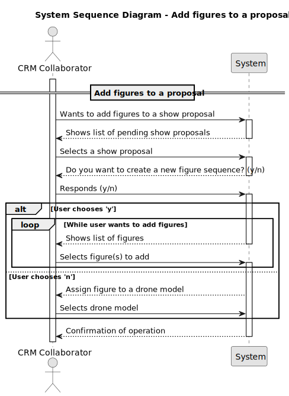
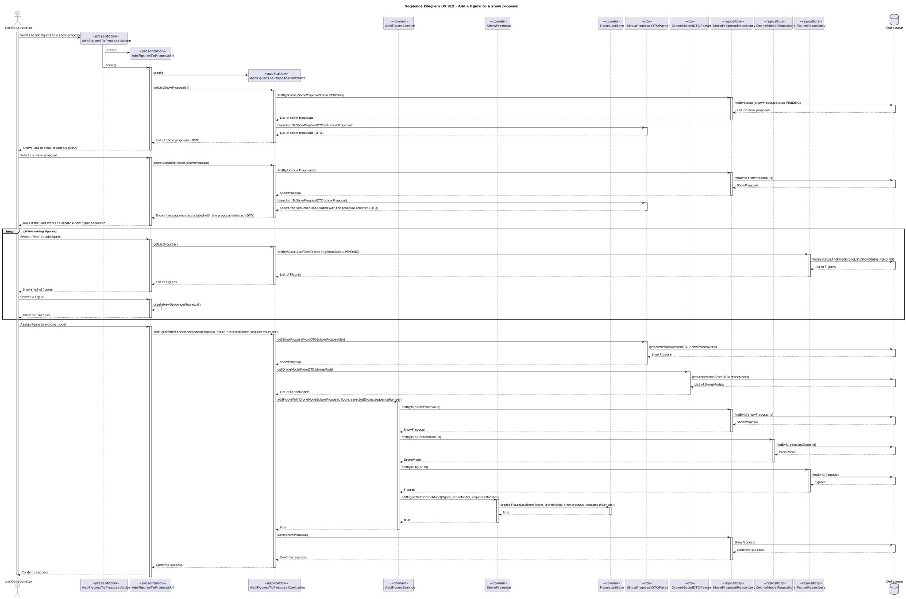

# US 312 - Add figures to a proposal

## 1. Context

* As a CRM Collaborator, I want to add one of the active figures to a show proposal making sure that te same figure cannot be repeated back to back in the proposal.
I also want to make sure that the figure is compatible with the drone models in the show.
 
## 2. Requirements

**US 312** - As a CRM Collaborator, I want to add one of the available figures to a show proposal.


**Acceptance Criteria:**

- US312.1 Any active figure can be added to the show proposal. A figure may have more than one occurrence in a show, but never in two consecutive positions.
- US312.2 For each figure, it must be established the relation between each drone type in the figure and the drone models in the show.
**Dependencies/References:**

*There is a dependency with US310, creates a proposal, US245 creates a figure category and US233 adds a figure to the catalogue*


**Forum Insight:**

* Still no questions related to this user story on forum.

## 3. Analysis



## 4. Design

### 4.1. Sequence Diag
ram


### 4.2. Applied Patterns

- Information Expert
- Controller
- Low Coupling
- High Cohesion
- Pure Fabrication
- Indirection
- Protected Variations

### 4.3. Acceptance Tests

**Test 1:** *Verifies that a Figure is associated correctly*

```
    @Test
    void addFigureWithDroneModel_Succeed() {
        Figure figure = figures.get(0);
        boolean result = proposal.addFigureWithDroneModel(figure, modelA, 1);
        assertTrue(result);
    }
````

**Test 2:** *Verifies that the Figure fails association*

```
 @Test
    void addFigureWithDroneModel_Fail_NullFigureOrDroneModel() {
        IllegalArgumentException ex1 = assertThrows(IllegalArgumentException.class, () -> {
            proposal.addFigureWithDroneModel(null, modelA, 1);
        });
        assertEquals("Figure or DroneModel cannot be null!", ex1.getMessage());

        IllegalArgumentException ex2 = assertThrows(IllegalArgumentException.class, () -> {
            proposal.addFigureWithDroneModel(figures.get(0), null, 1);
        });
        assertEquals("Figure or DroneModel cannot be null!", ex2.getMessage());
    }
````

**Test 3:** *Verifies that the same Figure cannot be added twice with the same DroneModel*

```
 @Test
    void addFigureWithDroneModel_Fail_AlreadyAssociated() {
        Figure figure = figures.get(0);
        proposal.addFigureWithDroneModel(figure, modelA, 1);
        boolean result = proposal.addFigureWithDroneModel(figure, modelA, 2);
        assertFalse(result);
    }
```
## 5. Implementation

**AddFiguresToProposalAction**
```java
public class AddFiguresToProposalAction implements Action {
    @Override
    public boolean execute() {
        return new AddFiguresToProposalUI().show();
    }
}
```

**AddFiguresToProposalUI**
```java
public class AddFiguresToProposalUI extends AbstractUI {

    private final AddFiguresToProposalController controller = new AddFiguresToProposalController();

    @Override
    protected boolean doShow() {
        Iterable<ShowProposalDTO> showProposalList = this.controller.getListShowProposals();
        if (!showProposalList.iterator().hasNext()) {
            System.out.println("There are no registered Show Proposals in the system to add Figures!");
            return false;
        }
        String headerModel = String.format("Select Show Proposal\n#  %-30s%-30s%-30s%-30s%-30s", "DESCRIPTION", "PROPOSAL NUMBER", "CUSTOMER NAME", "DATE", "DURATION");
        SelectWidget<ShowProposalDTO> selectorShowProposal = new SelectWidget<>(headerModel, showProposalList, new ShowProposalDTOPrinter());
        selectorShowProposal.show();
        ShowProposalDTO showProposal = selectorShowProposal.selectedElement();
        if (showProposal == null) {
            System.out.println("Operation canceled by collaborator!");
            return false;
        }
        if (addingFigures(showProposal)) {
            this.controller.save(showProposal);
        }
        return true;
    }

    private boolean addingFigures(ShowProposalDTO showProposal) {
        Iterable<Figure> existingSequence = this.controller.selectExistingFigures(showProposal);
        System.out.println("This is the sequence from the associated ShowRequest:");
        for (Figure figure : existingSequence) {
            System.out.print(figure.description() + " > ");
        }
        System.out.println();

        Iterable<Figure> figureList = this.controller.getListFigures(showProposal);
        if (!figureList.iterator().hasNext()) {
            System.out.println("There is no available Figures!");
            return false;
        }

        List<Figure> sequence = new ArrayList<>();
        String response = Console.readLine("Do you wish to create a new sequence? (y/n): ");
        if ("y".equalsIgnoreCase(response)) {
            sequence = createNewSequence(figureList);
        } else {
            sequence = this.controller.selectExistingFigures(showProposal);
        }

        if (!sequence.isEmpty()) {
            associateFiguresToDroneModels(showProposal, sequence);
        }

        return true;
    }

    private List<Figure> createNewSequence(Iterable<Figure> figureList) {
        List<Figure> sequence = new ArrayList<>();
        Figure previousFigure = null;

        while (true) {
            String headerModel = String.format("Select a Figure\n#  %-30s%-30s%-30s%-30s", "DESCRIPTION", "CATEGORY", "ACTIVE", "EXCLUSIVE");
            SelectWidget<Figure> selectorFigure = new SelectWidget<>(headerModel, figureList, new FigurePrinter());
            selectorFigure.show();
            Figure selectedFigure = selectorFigure.selectedElement();

            if (selectedFigure == null) {
                System.out.println("Figure can't be null!");
                continue;
            }

            if (selectedFigure.equals(previousFigure)) {
                System.out.println("You can't repeat the same Figure twice!");
                continue;
            }

            sequence.add(selectedFigure);
            previousFigure = selectedFigure;

            for (Figure figure : sequence) {
                System.out.print(figure.description() + " > ");
            }
            System.out.println();

            String addMore = Console.readLine("Do you wish to add more Figures? (y/n): ");
            if (!"y".equalsIgnoreCase(addMore)) {
                break;
            }
        }

        return sequence;
    }


    private void associateFiguresToDroneModels(ShowProposalDTO showProposal, List<Figure> figures) {
        List<DroneModelDTO> listDroneModels = new ArrayList<>();
        for (DroneListItemDTO droneListItem : showProposal.getListItemDTOS()) {
            listDroneModels.add(droneListItem.getDroneModelDTO());
        }

        if (listDroneModels.isEmpty()) {
            System.out.println("There is no Drone Models associated with this proposal!");
            return;
        }

        List<String> results = new ArrayList<>();
        int sequenceNumber = 1;
        for (Figure figure : figures) {
            boolean addMoreDrones = true;

            while (addMoreDrones) {
                System.out.println("Select a Drone Model to associate to the figure : " + figure.description());
                String headerModel = String.format("Select a Drone Model\n#  %-30s%-30s%-30s%-30s", "MODEL NAME", "MANUFACTURER", "STATUS", "CREATED BY");
                SelectWidget<DroneModelDTO> selectorDrone = new SelectWidget<>(headerModel, listDroneModels, new DroneModelDTOPrinter());
                selectorDrone.show();
                DroneModelDTO selectedDrone = selectorDrone.selectedElement();

                if (selectedDrone == null) {
                    System.out.println("The Drone Model can't be null please select again.");
                    continue;
                }

                if (this.controller.addFigureWithDroneModel(showProposal, figure, selectedDrone, sequenceNumber)) {
                    results.add("Success: Figure '" + figure.description() + "' associated with Drone Model '" + selectedDrone.getModelName() + "'.");
                } else {
                    results.add("Error: Failed to associate Figure '" + figure.description() + "' with Drone Model '" + selectedDrone.getModelName() + "'.");
                }

                String response = Console.readLine("Do you wish to add more Drones Models to this Figure? (y/n): ");
                addMoreDrones = "y".equalsIgnoreCase(response);
            }
            sequenceNumber++;
        }


        System.out.println("\nResults of Figure-Drone Model Associations:");
        results.forEach(System.out::println);
    }

    @Override
    public String headline() {
        return "Add Figures to Show Proposal";
    }
}

```

**AddFiguresToProposalController**
```java
@UseCaseController
public class AddFiguresToProposalController {

    private final ShowProposalRepository showProposalRepository = PersistenceContext.repositories().showProposals();

    private final FigureRepository figureRepository = PersistenceContext.repositories().figures();

    private final AddFigureService proposalService = new AddFigureService(figureRepository);

    private final ShowProposalDTOParser showProposalDTOParser = new ShowProposalDTOParser();
    private final DroneModelDTOParser droneModelDTOParser = new DroneModelDTOParser();

    public Iterable<Figure> getListFigures(ShowProposalDTO showProposalDTO) {
        Optional<ShowProposal> showProposal = showProposalDTOParser.getShowProposalfromDTO(showProposalDTO);
        return this.figureRepository.findByExclusivityAndCustomer(true, showProposal.get().showRequest().customer());
    }

    public Iterable<ShowProposalDTO> getListShowProposals() {
        Iterable<ShowProposal> showProposals = this.showProposalRepository.findByStatusAndFilledDroneList(ShowStatus.PENDING);
        return showProposalDTOParser.transformToShowProposalDTOlist(showProposals);
     }

    public boolean addFigureWithDroneModel(ShowProposalDTO showProposaldto, Figure figure, DroneModelDTO droneModel, int sequenceNumber) {
        Optional<ShowProposal> showProposalOpt = showProposalDTOParser.getShowProposalfromDTO(showProposaldto);
        Optional<DroneModel> droneModelOpt = droneModelDTOParser.getDroneModelFromDTO(droneModel);
        if (proposalService.addFigureWithDroneModel(showProposalOpt.get(), figure, droneModelOpt.get(), sequenceNumber)) {
            this.showProposalRepository.save(showProposalOpt.get());
            return true;
        }
        return false;
    }

    public List<Figure> selectExistingFigures(ShowProposalDTO showProposal) {
        Optional<ShowProposal> proposal = showProposalDTOParser.getShowProposalfromDTO(showProposal);
        List<Figure> requestedFigures = new ArrayList<>();
        requestedFigures.addAll(proposal.get().showRequest().requestedFigures());

        return requestedFigures;
    }

    public void save(ShowProposalDTO showProposal) {
        Optional<ShowProposal> proposal = showProposalDTOParser.getShowProposalfromDTO(showProposal);
        showProposalRepository.save(proposal.get());
    }
}
```
**AddFigureService**
```java
public class AddFigureService {

    private final FigureRepository figureRepository;

    public AddFigureService(final FigureRepository figureRepository) {
        this.figureRepository = figureRepository;
    }

    public boolean addFigureWithDroneModel(ShowProposal showProposal, Figure figure, DroneModel droneModel, int sequenceNumber) {
        if (showProposal == null || figure == null || droneModel == null) {
            throw new IllegalArgumentException("ShowProposal, Figure, or DroneModel cannot be null!");
        }
        if (!figureRepository.findById(figure.identity()).isPresent()) {
            throw new IllegalArgumentException("Figure does not exist in the system!");
        }

        return showProposal.addFigureWithDroneModel(figure, droneModel, sequenceNumber);
    }
}
```

**ShowProposal**
```java
@Entity
public class ShowProposal implements AggregateRoot<Long>, DTOable<ShowProposalDTO> {
    @Id
    @GeneratedValue(strategy = GenerationType.AUTO)
    private Long showProposalId;

    @ManyToOne
    private ShowRequest showRequest;

    @Column(nullable = false)
    private GeoLocation location;

    @Temporal(TemporalType.DATE)
    private Calendar date;

    @Column(nullable = false)
    private LocalTime time;

    @Column(nullable = false)
    private int duration;

    @Column(nullable = false)
    private int totalDroneNumber;

    @Column(nullable = false)
    private double insuranceAmount;

    @Temporal(TemporalType.DATE)
    private Calendar createdOn;

    @Column(nullable = false)
    private int proposalNumber;

    @ManyToOne
    private SystemUser createdBy;
    @Enumerated(EnumType.STRING)
    private ShowStatus status;

    @OneToMany(mappedBy = "showProposal", cascade = CascadeType.ALL)
    private List<DroneListItem> droneModelList;

    @OneToMany(mappedBy = "showProposal", cascade = CascadeType.ALL, orphanRemoval = true)
    private List<FigureListItem> figureListItems = new ArrayList<>();

    @Column (nullable = true)
    private String videoLink;

    @ManyToOne
    private Template template;

    @Embedded
    private Document document;

    @Embedded
    private ProposalAnswerFeedback proposalAnswerFeedback;


    protected ShowProposal() {}

    public ShowProposal(ShowRequest showRequest, GeoLocation location, Calendar date, LocalTime time, int duration, int totalDroneNumber, int proposalNumber, SystemUser createdBy, Template template, double insuranceAmount) {
        this.showRequest = validateShowRequest(showRequest);
        this.location = validateLocation(location);
        this.date = validateDate(date);
        this.time = validateTime(time);
        this.duration = validateDuration(duration);
        this.totalDroneNumber = validateTotalDroneNumber(totalDroneNumber);
        this.proposalNumber = validateProposalNumber(proposalNumber);
        this.template = validateTemplate(template);
        this.createdBy = validateCreatedBy(createdBy);
        this.createdOn = Calendar.getInstance();
        this.status = ShowStatus.PENDING;
        this.droneModelList = new ArrayList<>();
        this.figureListItems = new ArrayList<>();
        this.document = null;
        this.proposalAnswerFeedback = null;
        this.insuranceAmount = insuranceAmount;
    }

    public boolean addDroneToList(DroneModel droneModel, int quantity){
        if (droneModel == null || quantity <= 0) return false;

        int currentTotal = 0;
        for (DroneListItem item : droneModelList) {
            currentTotal += item.numberOfDrones();
        }

        if (currentTotal + quantity > totalDroneNumber) {
            return false;
        }

        for (DroneListItem item : droneModelList) {
            if (item.droneModel().equals(droneModel)) {
                return false;
            }
        }

        DroneListItem newItem = new DroneListItem(droneModel, this, quantity);
        droneModelList.add(newItem);
        return true;
    }

    public int allDroneModels_Quantity(){
        int currentTotal = 0;
        for (DroneListItem item : droneModelList) {
            currentTotal += item.numberOfDrones();
        }
        return currentTotal;
    }

    public boolean addFigureWithDroneModel(Figure figure, DroneModel droneModel, int sequenceNumber) {
        if (figure == null || droneModel == null) {
            throw new IllegalArgumentException("Figure or DroneModel cannot be null!");
        }
        for (FigureListItem item : figureListItems) {
            if (item.figure().equals(figure) && item.droneModel().equals(droneModel)) {
                System.out.println("This Figure is already associated with the selected DroneModel!");
                return false;
            }
        }

        FigureListItem newItem = new FigureListItem(figure, droneModel, this, sequenceNumber);
        figureListItems.add(newItem);
        return true;
    }


    public boolean addVideoToProposal(String video) {
        if (isValidVideoLink(video)) {
            this.videoLink = video;
            return true;
        }
        return false;
    }

    public List<DroneListItem> droneListItem (){
        return this.droneModelList;
    }

    public List<FigureListItem> figureListItems(){return this.figureListItems;}

    public Template template() {return this.template;}

    public ShowStatus status(){return  this.status;}

    public ShowRequest showRequest() { return this.showRequest; }

    public Calendar createdOn() { return this.createdOn; }

    public GeoLocation location() { return this.location; }

    public Calendar date() { return this.date; }

    public int totalDroneNumber() { return this.totalDroneNumber; }

    public int duration() { return this.duration; }

    public int proposalNumber() { return this.proposalNumber; }

    public SystemUser createdBy() { return this.createdBy; }

    public LocalTime time() { return this.time; }

    public String videoLink() { return this.videoLink; }

    public double insuranceAmount() { return this.insuranceAmount; }

    public ProposalAnswerFeedback proposalAnswerFeedback(){ return this.proposalAnswerFeedback; }

    public Document document(){return this.document;}

    public ShowRequest validateShowRequest(ShowRequest showRequest) {
        if (showRequest == null)
            throw new IllegalArgumentException("ShowRequest cannot be null");
        return showRequest;
    }

    public GeoLocation validateLocation(GeoLocation location) {
        if (location == null) {
            throw new IllegalArgumentException("Location cannot be null");
        }

        double latitude = location.latitude();
        double longitude = location.longitude();
        int altitude = location.altitude();

        if (latitude < -90 || latitude > 90) {
            throw new IllegalArgumentException("Latitude must be between -90 and 90 degrees.");
        }

        if (longitude < -180 || longitude > 180) {
            throw new IllegalArgumentException("Longitude must be between -180 and 180 degrees.");
        }

        if (altitude <= 0) {
            throw new IllegalArgumentException("Altitude must be a positive number.");
        }
        return location;
    }

    public Calendar validateDate(Calendar date) {
        if (date == null) {
            throw new IllegalArgumentException("Date cannot be null");
        }
        return date;
    }

    public LocalTime validateTime(LocalTime time) {
        if (time == null)
            throw new IllegalArgumentException("Time cannot be null");
        return time;
    }

    public int validateDuration(Integer duration) {
        if (duration == null) {
            throw new IllegalArgumentException("Duration cannot be null.");
        }
        if (duration <= 0) {
            throw new IllegalArgumentException("Duration must be greater than 0.");
        }
        return duration;
    }

    public int validateTotalDroneNumber(Integer totalDroneNumber) {
        if (totalDroneNumber == null) {
            throw new IllegalArgumentException("Total drone number cannot be null.");
        }
        if (totalDroneNumber <= 0) {
            throw new IllegalArgumentException("Total drone number must be greater than 0.");
        }
        return totalDroneNumber;
    }

    public int validateProposalNumber(int proposalNumber) {
        if (proposalNumber < 0)
            throw new IllegalArgumentException("Proposal number cannot be negative");
        return proposalNumber;
    }

    public SystemUser validateCreatedBy(SystemUser createdBy) {
        if (createdBy == null)
            throw new IllegalArgumentException("CreatedBy (SystemUser) cannot be null");
        return createdBy;
    }

    public boolean isValidVideoLink(String videoLink) {
        if (videoLink == null) {
            throw new IllegalArgumentException("Video link cannot be null");
        }
        final String videoLinkPattern = "^(https?://|www\\.)[a-zA-Z0-9][-a-zA-Z0-9&',./_=?%#:~]*$";
        return videoLink.matches(videoLinkPattern);
    }

    public Template validateTemplate(Template template) {
        if (template == null) {
            throw new IllegalArgumentException("Template cannot be null");
        }
        return template;
    }
    public boolean updateProposalAnswer(ProposalAnswerFeedback answer){
        if(answer != null & answer.answer() != null){
            this.proposalAnswerFeedback = answer;
            return true;
        }
        return false;
    }

    public boolean markShowProposal(){
        if(proposalAnswerFeedback != null && proposalAnswerFeedback.answer() == ProposalAnswerFeedback.Answer.ACCEPTED){
            status = ShowStatus.ACCEPTED;
            return true;
        }
        return false;
    }

    public boolean addDocument(Document document){
        if(document != null){
            this.document = document;
            return true;
        }
        return false;
    }


    public void changeStatus(ShowStatus status) {
        if (status == null) {
            throw new IllegalArgumentException("Status cannot be null");
        }
        this.status = status;
    }

    @Override
    public boolean sameAs(Object other) {
        if (this == other) return true;
        if (!(other instanceof ShowProposal)) return false;
        ShowProposal that = (ShowProposal) other;
        return showProposalId != null && showProposalId.equals(that.showProposalId);
    }

    @Override
    public Long identity() {
        return this.showProposalId;
    }

    @Override
    public ShowProposalDTO toDTO() {
        String finalContent = (document != null) ? document.finalContent() : null;
        String code = (document != null) ? document.code() : null;
        return new ShowProposalDTO(showProposalId,showRequest.identity(),showRequest().customer().customerName().toString(),showRequest.description(), location, date,
                time,duration,totalDroneNumber,insuranceAmount,createdOn,proposalNumber,createdBy.name().toString(), status,videoLink,droneModelList,template.name(), finalContent, code, proposalAnswerFeedback);
    }
}
```

**FigureListItem**
```java
@Entity
public class FigureListItem {

    @EmbeddedId
    private FigureListItemID figureListItemID;

    @ManyToOne
    @MapsId("showProposalId")
    private ShowProposal showProposal;

    @ManyToOne
    @MapsId("figureId")
    private Figure figure;

    @ManyToOne
    @MapsId("droneModelId")
    private DroneModel droneModel;


    protected FigureListItem() {
    }

    public FigureListItem(Figure figure, DroneModel droneModel, ShowProposal showProposal, int sequenceNumber) {
        this.figure = figure;
        this.droneModel = droneModel;
        this.showProposal = showProposal;
        this.figureListItemID = new FigureListItemID(figure.identity(), droneModel.identity(), showProposal.identity(), sequenceNumber);
    }

    public ShowProposal showProposal() {
        return showProposal;
    }

    public Figure figure() {
        return figure;
    }

    public DroneModel droneModel() {
        return droneModel;
    }

    public FigureListItemID figureListItemID(){return this.figureListItemID;}

    @Override
    public boolean equals(Object o) {
        if (this == o) return true;
        if (o == null || getClass() != o.getClass()) return false;
        FigureListItem that = (FigureListItem) o;
        return Objects.equals(showProposal, that.showProposal) && Objects.equals(droneModel, that.droneModel) && Objects.equals(figure, that.figure);
    }

    @Override
    public int hashCode() {
        return Objects.hash(showProposal, droneModel, figure);
    }
}
```

**FigureListItemID**
```java
@Embeddable
public class FigureListItemID implements Serializable {

    private Long figureId;
    private Long droneModelId;
    private Long showProposalId;
    private int sequenceNumber;

    protected FigureListItemID() {

    }

    public FigureListItemID(Long figureId, Long droneModelId, Long showProposalId, int sequenceNumber) {
        this.figureId = figureId;
        this.droneModelId = droneModelId;
        this.showProposalId = showProposalId;
        this.sequenceNumber = sequenceNumber;
    }


    public Long figureId() {
        return figureId;
    }

    public Long droneModelId() {
        return droneModelId;
    }

    public Long showProposalId() {
        return showProposalId;
    }

    public int sequenceNumber(){return this.sequenceNumber;}


    @Override
    public boolean equals(Object o) {
        if (this == o) return true;
        if (o == null || getClass() != o.getClass()) return false;
        FigureListItemID that = (FigureListItemID) o;
        return Objects.equals(figureId, that.figureId) &&
                Objects.equals(droneModelId, that.droneModelId) &&
                Objects.equals(showProposalId, that.showProposalId) &&
                Objects.equals(sequenceNumber, that.sequenceNumber);

    }

    @Override
    public int hashCode() {
        return Objects.hash(figureId, droneModelId, showProposalId, sequenceNumber);
    }
}
```

## 6. Integration/Demonstration

**Creating a new Sequence**


**Associating a Drone Model to a Figure**


**Database Result**


