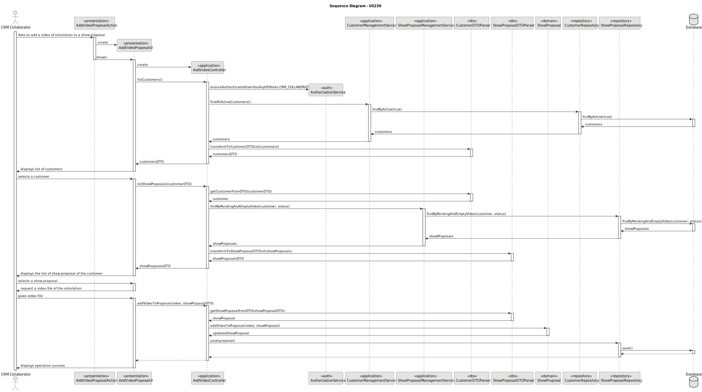

# US 315

## 1. Context

* After the show proposal has been created, the CRMCollaborator should enhance the proposal by adding a video of the simulated show.
* This video serves as a visual preview to help the customer understand how the actual drone show will look. Even though the actual video generation is out of scope for this project (LAPR4), a video file must still be attached to the proposal using an existing or mock video. This functionality improves customer communication and increases the chances of proposal approval.
* To complete this task, a valid show proposal must already exist, and the CRM Collaborator must have access to the proposal and the ability to associate it with a video file.

## 2. Requirements

**US 315** As CRM Collaborator, I want to add a video(In the scope of LAPR4, the team does not need to actually generate the video and can use any suitable video file.) of the simulated show so the customer can have a preview of the show.

**Acceptance Criteria:**

- US315.1 The user must input a video link

**Dependencies/References:**

*There is a dependency with US220, because to select a show request it needs to have a user registered.* \
*There is a dependency with US310, because to add a video of a simulation the show proposal must already be registered*

**Forum Insight:**

>>Citando a nota de rodapé: "6 In the scope of LAPR4, the team does not need to actually generate the video and can use any suitable video file. " -> para confirmar, será efetivamente um ficheiro de vídeo, ou é suficiente um link para um vídeo? Assumindo que terá de ser efetivamente um ficheiro de vídeo, qual é o limite de tamanho desejado?
> 
> É um link...


## 3. Analysis


## 4. Design

### 4.1. Sequence Diagram


### 4.3. Applied Patterns

- Information Expert
- Controller
- Low Coupling
- Polymorphism

### 4.4. Acceptance Tests

**Test 1:** *Verifies that only show proposals with status pending and without video file are returned*

```
    @Test
    void findByPendingAndEmptyVideo_returnsProposals() {
        ShowStatus status = ShowStatus.PENDING;
        List<ShowProposal> expected = List.of(proposal);

        when(repo.findByPendingAndEmptyVideo(customer, status)).thenReturn(expected);

        Iterable<ShowProposal> result = service.findByPendingAndEmptyVideo(customer, status);

        assertNotNull(result);
        assertEquals(expected, result);
        verify(repo).findByPendingAndEmptyVideo(customer, status);
    }

````

**Test 2:** *Verifies that the video file is added to the proposal*

```
    @Test
    void addVideoToProposal_ValidLink_ReturnsTrue() {
        String validLink = "https://www.youtube.com/watch?v=dQw4w9WgXcQ";
        boolean result = proposal.addVideoToProposal(validLink);
        assertTrue(result);
        assertEquals(validLink, proposal.videoLink());
    }

    @Test
    void addVideoToProposal_InvalidLink_ReturnsFalse() {
        String invalidLink = "htp:/invalid-url";
        boolean result = proposal.addVideoToProposal(invalidLink);
        assertFalse(result);
        assertNull(proposal.videoLink());
    }

````

**Test 3:** *Verifies that all active customers are returned*
````
    @Test
    void findAllActiveCustomers_shouldReturnActiveCustomers() {
    List<Customer> expected = List.of(customer);
    when(customerRepository.findByActive()).thenReturn(expected);

        Iterable<Customer> result = service.findAllActiveCustomers();

        assertNotNull(result);
        assertEquals(expected, result);
        verify(customerRepository).findByActive();
    }
````

## 5. Implementation

**AddVideoProposalAction**

```java
package eapli.base.app.backoffice.presentation.showProposalManagement;

import eapli.framework.actions.Action;

public class AddVideoProposalAction implements Action {
    @Override
    public boolean execute() {
        return new AddVideoProposalUI().show();
    }
}


```
**AddVideoProposalUI**
```java
package eapli.base.app.backoffice.presentation.showProposalManagement;

import eapli.base.app.backoffice.presentation.customerManagement.CustomerDTOPrinter;
import eapli.base.customerManagement.dto.CustomerDTO;
import eapli.base.showProposalManagement.application.AddVideoProposalController;
import eapli.base.showProposalManagement.dto.ShowProposalDTO;
import eapli.framework.io.util.Console;
import eapli.framework.presentation.console.AbstractUI;
import eapli.framework.presentation.console.SelectWidget;

public class AddVideoProposalUI extends AbstractUI {
    private final AddVideoProposalController controller = new AddVideoProposalController();
    @Override
    protected boolean doShow() {
        Iterable<CustomerDTO> customers = controller.listCustomers();
        if (!customers.iterator().hasNext()) {
            System.out.println("\nThere are no registered Customers in the system!\n");
            return false;
        }
        ShowProposalDTO showProposal = null;
        String headerModelCustomer = String.format("Select Customer\n#  %-30s%-30s%-30s%-30s", "NAME", "STATUS", "PHONE NUMBER", "EMAIL");
        String headerModelRequest = String.format("\nSelect Show Proposal\n#  %-30s%-30s%-30s%-30s%-30s", "DESCRIPTION","PROPOSAL NUMBER", "CUSTOMER NAME", "DATE", "DURATION");
        boolean validRequestSelected = false;
        while (!validRequestSelected) {
            final SelectWidget<CustomerDTO> selectWidgetCustomer = new SelectWidget<>(headerModelCustomer, customers, new CustomerDTOPrinter());
            selectWidgetCustomer.show();
            CustomerDTO customer = selectWidgetCustomer.selectedElement();

            if (customer == null) {
                return true;
            }
            Iterable<ShowProposalDTO> showProposals = this.controller.listShowProposals(customer);
            if (!showProposals.iterator().hasNext()) {
                System.out.println("\nThere are no Show Proposals without a video simulation!\n");
                continue;
            }
            while (true) {
                final SelectWidget<ShowProposalDTO> selectWidgetProposal = new SelectWidget<>(headerModelRequest, showProposals, new ShowProposalDTOPrinter());
                selectWidgetProposal.show();
                showProposal = selectWidgetProposal.selectedElement();

                if (showProposal == null) {
                    break;
                }
                boolean exits = false;

                if (!exits) {
                    validRequestSelected = true;
                    break;
                }
            }
        }
        String video = requestVideo();
        try {
            if(controller.addVideoToProposal(video, showProposal)) {
                System.out.println("Show Proposal video simulation was successfully added!");
            } else {
                System.out.println("Error adding video simulation to Show Proposal!");
            }
        } catch (IllegalArgumentException e) {
            System.out.println("\nERROR: " + e.getMessage() + "\n");
        }

        return true;
    }

    private String requestVideo() {
        String videoLink;

        final String videoLinkPattern = "^(https?://|www\\.)[a-zA-Z0-9][-a-zA-Z0-9&',./_=?%#:~]*$";

        while (true) {
            videoLink = Console.readLine("Enter the video link (starting with http://, https://, or www.): ");

            if (videoLink.trim().isEmpty()) {
                System.out.println("Video link cannot be empty. Please enter a valid video link.");
            }
            if (videoLink.matches(videoLinkPattern)) {
                return videoLink;
            } else {
                System.out.println("Invalid video link! Make sure it starts with http://, https://, or www. and only includes valid URL characters.");
            }
        }
    }
    @Override
    public String headline() {
        return "";
    }
}

```

**AddVideoProposalController**
```java
package eapli.base.showProposalManagement.application;

import eapli.base.customerManagement.application.CustomerManagementService;
import eapli.base.customerManagement.domain.Customer;
import eapli.base.customerManagement.dto.CustomerDTO;
import eapli.base.customerManagement.dto.CustomerDTOParser;
import eapli.base.customerManagement.repositories.CustomerRepository;
import eapli.base.infrastructure.persistence.PersistenceContext;
import eapli.base.showProposalManagement.domain.ShowProposal;
import eapli.base.showProposalManagement.dto.ShowProposalDTO;
import eapli.base.showProposalManagement.dto.ShowProposalDTOParser;
import eapli.base.showProposalManagement.repositories.ShowProposalRepository;
import eapli.base.showRequestManagement.domain.ShowStatus;
import eapli.base.showRequestManagement.dto.ShowRequestDTOParser;
import eapli.base.usermanagement.domain.ExemploPasswordPolicy;
import eapli.base.usermanagement.domain.Roles;
import eapli.framework.infrastructure.authz.application.AuthorizationService;
import eapli.framework.infrastructure.authz.application.AuthzRegistry;
import eapli.framework.infrastructure.authz.domain.model.PasswordPolicy;
import eapli.framework.infrastructure.authz.domain.model.PlainTextEncoder;
import org.springframework.security.crypto.password.PasswordEncoder;

import java.util.Optional;

public class AddVideoProposalController {
    private final AuthorizationService authz = AuthzRegistry.authorizationService();
    private final PasswordEncoder passwordEncoder = new PlainTextEncoder();
    private final PasswordPolicy passwordPolicy = new ExemploPasswordPolicy();
    private final CustomerRepository customerRepository = PersistenceContext.repositories().customers();
    private final CustomerManagementService customerManagementService = new CustomerManagementService(customerRepository, passwordEncoder, passwordPolicy);
    private final ShowProposalRepository showProposalRepository = PersistenceContext.repositories().showProposals();
    private final ShowProposalManagementService showProposalManagementService = new ShowProposalManagementService(showProposalRepository);

    private final CustomerDTOParser customerDTOParser = new CustomerDTOParser();
    private final ShowProposalDTOParser showProposalDTOParser = new ShowProposalDTOParser();

    public Iterable<CustomerDTO> listCustomers() {
        authz.ensureAuthenticatedUserHasAnyOf(Roles.CRM_COLLABORATOR);
        Iterable <Customer> customers = customerManagementService.findAllActiveCustomers();
        return customerDTOParser.transformToCustomerDTOList(customers);
    }

    public Iterable<ShowProposalDTO> listShowProposals(CustomerDTO customerDTO) {
        Optional<Customer> customer = customerDTOParser.getCustomerFromDTO(customerDTO);
        Iterable<ShowProposal> showProposals = showProposalManagementService.findByPendingAndEmptyVideo(customer.get(), ShowStatus.PENDING);
        return showProposalDTOParser.transformToShowProposalDTOlist(showProposals);
    }

    public boolean addVideoToProposal(String video, ShowProposalDTO showProposalDTO) {
        Optional<ShowProposal> showProposal = showProposalDTOParser.getShowProposalfromDTO(showProposalDTO);
        if (showProposal.isPresent()) {
            if (showProposal.get().addVideoToProposal(video)) {
                this.showProposalRepository.save(showProposal.get());
                return true;
            }
        }
        return false;
    }
}

```
**CustomerManagementService**
```Java
public Iterable<Customer> findAllActiveCustomers() {
    return this.customerRepository.findByActive();
}
```
**ShowProposalManagementService**
```Java
public Iterable<ShowProposal> findByPendingAndEmptyVideo(Customer customer, ShowStatus status) {
    return this.showProposalRepository.findByPendingAndEmptyVideo(customer, status);
}
```


**CustomerDTOParser**
```java
package eapli.base.customerManagement.dto;

import eapli.base.customerManagement.domain.Customer;
import eapli.base.customerManagement.repositories.CustomerRepository;
import eapli.base.infrastructure.persistence.PersistenceContext;

import java.util.Optional;
import java.util.stream.Collectors;
import java.util.stream.StreamSupport;

public class CustomerDTOParser {

    private final CustomerRepository customerRepository = PersistenceContext.repositories().customers();


    public Iterable<CustomerDTO> transformToCustomerDTOList(final Iterable<Customer> customers){
        return StreamSupport.stream(customers.spliterator(), false).map(Customer::toDTO).collect(Collectors.toUnmodifiableList());
    }

    public Optional<Customer> getCustomerFromDTO(final CustomerDTO customerDTO){
        return this.customerRepository.findById(customerDTO.getCustomerId());
    }
}

```

**ShowProposalDTOParser**
```java
package eapli.base.showProposalManagement.dto;

import eapli.base.infrastructure.persistence.PersistenceContext;
import eapli.base.showProposalManagement.domain.ShowProposal;
import eapli.base.showProposalManagement.repositories.ShowProposalRepository;

import java.util.Optional;
import java.util.stream.Collectors;
import java.util.stream.StreamSupport;

public class ShowProposalDTOParser {

    private final ShowProposalRepository showProposalRepository = PersistenceContext.repositories().showProposals();

    public Iterable<ShowProposalDTO> transformToShowProposalDTOlist(final Iterable<ShowProposal> showProposals){
        return StreamSupport.stream(showProposals.spliterator(), false).map(ShowProposal::toDTO).collect(Collectors.toUnmodifiableList());
    }

    public Optional<ShowProposal> getShowProposalfromDTO(ShowProposalDTO showProposalDTO){
        return this.showProposalRepository.findById(showProposalDTO.getShowProposalId());
    }
}
```
**ShowProposal**
```Java
public boolean addVideoToProposal(String video) {
    if (isValidVideoLink(video)) {
        this.videoLink = video;
        return true;
    }
    return false;
}
```


## 6. Integration/Demonstration

**Add Video To Show Proposal**


**Database Result**


