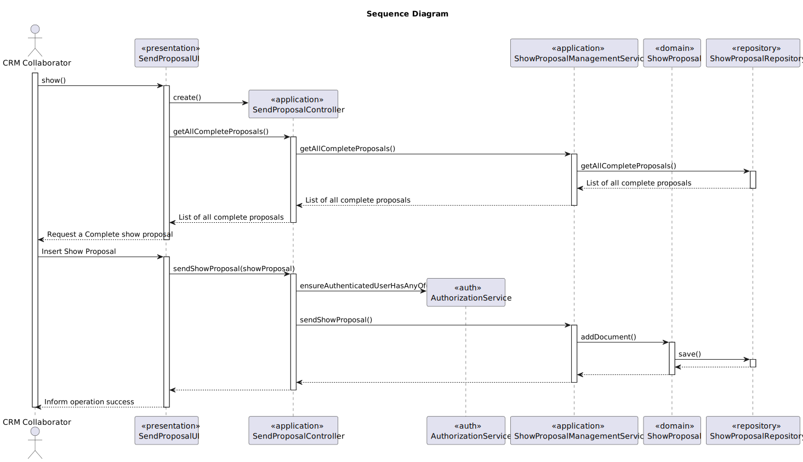

# US 316 - Send Show Proposal to Customer

## 1. Context

*As CRM Collaborator, I want to send the show proposal to the customer.The proposal to be sent is a properly formatted document with the show details and a link to the video preview. The format of the proposal must be one supported by the system and has to be generated using the correct plugin.*

## 2. Requirements

**US 316** As CRM Collaborator, I want to send the show proposal to the customer.

**Acceptance Criteria:**

- US316.1 The proposal to be sent is a properly formatted document with the show details and a link to the video preview.

- US316.2 The format of the proposal must be one supported by the system and has to be generated using the correct plugin.

**Dependencies/References:**

*There is a dependency with US310, US311, US312 and US315 as the show proposal needs to have all information needed to send it to the customer.*


*There is a dependency with US347,  as the show proposal needs to be generated and so it need to have a specific structure.*


*There is a dependency with US255,  as it needs to be generated and interpreted correctly.*

**Forum Insight:**

* Still no questions related to this user story on forum.

## 3. Analysis


## 4. Design

### 4.1. Sequence Diagram


### 4.3. Applied Patterns

- Controller
- Polymorphism
- Indirection
- DTO

### 4.4. Acceptance Tests

**Test 1:** *Verifies that every complete proposal is found*

```
    @Test
    void findByCompletedProposal_returnsCompletedProposals() {
        List<ShowProposal> expected = List.of(proposal);
        when(repo.findByCompletedProposal()).thenReturn(expected);

        Iterable<ShowProposal> result = service.findByCompletedProposal();

        assertNotNull(result);
        assertEquals(expected, result);
        verify(repo).findByCompletedProposal();
    }

````

**Test 2:** *Verifies that a show proposal cannot be sent without a template*

```

    @Test
    void sendShowProposal_failsWhenProposalWriterReturnsNull() {
        Template invalidTemplate = new Template("invalid", "");
        ShowProposal invalidProposal = new ShowProposal(
                proposal.showRequest(),
                proposal.location(),
                proposal.date(),
                proposal.time(),
                proposal.duration(),
                proposal.totalDroneNumber(),
                proposal.proposalNumber(),
                user,
                invalidTemplate,
                proposal.insuranceAmount()
        );

        boolean result = service.sendShowProposal(invalidProposal);

        assertFalse(result);
        assertNotEquals(ShowStatus.SENT, invalidProposal.status());
        verify(repo, never()).save(any(ShowProposal.class));
    }

````
## 5. Implementation

**SendShowProposalAction**

```java
public class SendShowProposalAction implements Action {

    @Override
    public boolean execute() {
        return new SendShowProposalUI().show();
    }
}


```
**SendShowProposalUI**
```java
public class SendShowProposalUI extends AbstractListUI<ShowProposal> {

    private SendShowProposalController controller = new SendShowProposalController();

    @Override
    protected Iterable<ShowProposal> elements() {
        return controller.allCompletedShowProposals();
    }

    @Override
    protected Visitor<ShowProposal> elementPrinter() {
        return new ShowProposalPrinter();
    }

    @Override
    protected String elementName() {
        return "Show Proposal";
    }

    @Override
    protected String listHeader() {
        return String.format("%-30s%-30s%-30s%-30s%-30s", "DESCRIPTION", "PROPOSAL NUMBER", "CUSTOMER NAME", "DATE", "DURATION");
    }

    @Override
    protected String emptyMessage() {
        return null;
    }

    @Override
    protected boolean doShow() {
        final Iterable<ShowProposal> showProposals = elements();
        if (!showProposals.iterator().hasNext()) {
            System.out.println("No completed show proposals available to send.");

        } else {
            final SelectWidget<ShowProposal> selector = new SelectWidget<>(listHeader(), showProposals, elementPrinter());
            selector.show();
            final ShowProposal selectedProposal = selector.selectedElement();
            if (selectedProposal != null) {
                if (controller.sendShowProposal(selectedProposal)) {
                    System.out.println("Show proposal sent successfully.");
                } else {
                    System.out.println("Failed to send show proposal.");
                }
            } else {
                System.out.println("No show proposal selected.");
            }
        }
        return true;
    }

    @Override
    public String headline() {
        return "Send Show Proposal";
    }
}
```

**SendShowProposalController**
```java
@UseCaseController
public class SendShowProposalController {

    private final AuthorizationService authz = AuthzRegistry.authorizationService();

    private final ShowProposalRepository repo = PersistenceContext.repositories().showProposals();

    ShowProposalManagementService showProposalManagementSvc= new ShowProposalManagementService(repo);

    public Iterable<ShowProposal> allCompletedShowProposals() {
        authz.ensureAuthenticatedUserHasAnyOf(Roles.CRM_COLLABORATOR);
        return showProposalManagementSvc.findByCompletedProposal();
    }

    public boolean sendShowProposal(ShowProposal showProposal) {
        authz.ensureAuthenticatedUserHasAnyOf(Roles.CRM_COLLABORATOR);
        return showProposalManagementSvc.sendShowProposal(showProposal);
    }
}


```
**ShowProposalManagementService**
```Java
public class ShowProposalManagementService {
    private final ShowProposalRepository showProposalRepository;

    public ShowProposalManagementService(final ShowProposalRepository showProposalRepository){
        this.showProposalRepository = showProposalRepository;
    }

    public ShowProposal registerShowProposal(ShowRequest showRequest, GeoLocation location, Calendar date, LocalTime time, int duration, int totalDroneNumber, SystemUser user, Template template, double insurance) {
        long proposalCount = showProposalRepository.countByShowRequest(showRequest);
        int proposalNumber = (int) proposalCount + 1;

        ShowProposal showProposal = new ShowProposal(showRequest, location, date, time, duration, totalDroneNumber, proposalNumber, user, template, insurance);
        return (ShowProposal) this.showProposalRepository.save(showProposal);
    }

    public Iterable<ShowProposal> findByShowRequest(ShowRequest showRequest) {
        return this.showProposalRepository.findByShowRequest(showRequest);
    }

    public Iterable<ShowProposal> findByPendingAndEmptyVideo(Customer customer, ShowStatus status) {
        return this.showProposalRepository.findByPendingAndEmptyVideo(customer, status);
    }

    public Iterable<ShowProposal> findByCompletedProposal () {
        return this.showProposalRepository.findByCompletedProposal();
    }

    public boolean sendShowProposal (ShowProposal showProposal) {
        try {
            ProposalWriter proposalWriter = new ProposalWriter();
            String content = proposalWriter.proposalWriter(showProposal, showProposal.template());
            if (content == null) {
                System.err.println("ERROR: proposalWriter returned null content");
                return false;
            }
            String code = generateUniqueCode();
            if (!ShowProposalValidator.validateShowProposalRealData(content)) {
                System.out.println("ERROR: Document Content invalid!");
                return false;
            }
            Document document = new Document(content, code);
            System.out.println("\n");
            System.out.println(document.finalContent());
            System.out.println("\n");
            showProposal.addDocument(document);
            showProposal.changeStatus(ShowStatus.SENT);
            this.showProposalRepository.save(showProposal);
            return true;

        } catch (IllegalStateException e) {
            System.out.println(e.getMessage());
            return false;
        }catch (Exception e){
            System.err.println("Unexpected error: " + e.getMessage());
            e.printStackTrace();
            return false;
        }
    }

    public String generateUniqueCode() {
        Random random = new Random();
        String code;

        do {
            int number = random.nextInt(1_000_000);
            code = String.format("SP%06d", number);
        } while (documentCodeExists(code));

        return code;
    }

    private boolean documentCodeExists(String code) {
        Document doc = this.showProposalRepository.findDocumentByCode(code);
        if (doc == null){
            return false;
        }
        return true;
    }
}

```
**ShowProposal**
```Java
@Entity
public class ShowProposal implements AggregateRoot<Long>, DTOable<ShowProposalDTO> {
    @Id
    @GeneratedValue(strategy = GenerationType.AUTO)
    private Long showProposalId;

    @ManyToOne
    private ShowRequest showRequest;

    @Column(nullable = false)
    private GeoLocation location;

    @Temporal(TemporalType.DATE)
    private Calendar date;

    @Column(nullable = false)
    private LocalTime time;

    @Column(nullable = false)
    private int duration;

    @Column(nullable = false)
    private int totalDroneNumber;

    @Column(nullable = false)
    private double insuranceAmount;

    @Temporal(TemporalType.DATE)
    private Calendar createdOn;

    @Column(nullable = false)
    private int proposalNumber;

    @ManyToOne
    private SystemUser createdBy;
    @Enumerated(EnumType.STRING)
    private ShowStatus status;

    @OneToMany(mappedBy = "showProposal", cascade = CascadeType.ALL)
    private List<DroneListItem> droneModelList;

    @OneToMany(mappedBy = "showProposal", cascade = CascadeType.ALL, orphanRemoval = true)
    private List<FigureListItem> figureListItems = new ArrayList<>();

    @Column (nullable = true)
    private String videoLink;

    @ManyToOne
    private Template template;

    @Embedded
    private Document document;

    @Embedded
    private ProposalAnswerFeedback proposalAnswerFeedback;


    protected ShowProposal() {}

    public ShowProposal(ShowRequest showRequest, GeoLocation location, Calendar date, LocalTime time, int duration, int totalDroneNumber, int proposalNumber, SystemUser createdBy, Template template, double insuranceAmount) {
        this.showRequest = validateShowRequest(showRequest);
        this.location = validateLocation(location);
        this.date = validateDate(date);
        this.time = validateTime(time);
        this.duration = validateDuration(duration);
        this.totalDroneNumber = validateTotalDroneNumber(totalDroneNumber);
        this.proposalNumber = validateProposalNumber(proposalNumber);
        this.template = validateTemplate(template);
        this.createdBy = validateCreatedBy(createdBy);
        this.createdOn = Calendar.getInstance();
        this.status = ShowStatus.PENDING;
        this.droneModelList = new ArrayList<>();
        this.figureListItems = new ArrayList<>();
        this.document = null;
        this.proposalAnswerFeedback = null;
        this.insuranceAmount = insuranceAmount;
    }

    public boolean addDroneToList(DroneModel droneModel, int quantity){
        if (droneModel == null || quantity <= 0) return false;

        int currentTotal = 0;
        for (DroneListItem item : droneModelList) {
            currentTotal += item.numberOfDrones();
        }

        if (currentTotal + quantity > totalDroneNumber) {
            return false;
        }

        for (DroneListItem item : droneModelList) {
            if (item.droneModel().equals(droneModel)) {
                return false;
            }
        }

        DroneListItem newItem = new DroneListItem(droneModel, this, quantity);
        droneModelList.add(newItem);
        return true;
    }

    public int allDroneModels_Quantity(){
        int currentTotal = 0;
        for (DroneListItem item : droneModelList) {
            currentTotal += item.numberOfDrones();
        }
        return currentTotal;
    }

    public boolean addFigureWithDroneModel(Figure figure, DroneModel droneModel, int sequenceNumber) {
        if (figure == null || droneModel == null) {
            throw new IllegalArgumentException("Figure or DroneModel cannot be null!");
        }
        for (FigureListItem item : figureListItems) {
            if (item.figure().equals(figure) && item.droneModel().equals(droneModel) &&  item.figureListItemID().sequenceNumber() == sequenceNumber) {
                System.out.println("This Figure is already associated with the selected DroneModel!");
                return false;
            }
        }

        FigureListItem newItem = new FigureListItem(figure, droneModel, this, sequenceNumber);
        figureListItems.add(newItem);
        return true;
    }


    public boolean addVideoToProposal(String video) {
        if (isValidVideoLink(video)) {
            this.videoLink = video;
            return true;
        }
        return false;
    }

    public List<DroneListItem> droneListItem (){
        return this.droneModelList;
    }

    public List<FigureListItem> figureListItems(){return this.figureListItems;}

    public Template template() {return this.template;}

    public ShowStatus status(){return  this.status;}

    public ShowRequest showRequest() { return this.showRequest; }

    public Calendar createdOn() { return this.createdOn; }

    public GeoLocation location() { return this.location; }

    public Calendar date() { return this.date; }

    public int totalDroneNumber() { return this.totalDroneNumber; }

    public int duration() { return this.duration; }

    public int proposalNumber() { return this.proposalNumber; }

    public SystemUser createdBy() { return this.createdBy; }

    public LocalTime time() { return this.time; }

    public String videoLink() { return this.videoLink; }

    public double insuranceAmount() { return this.insuranceAmount; }

    public ProposalAnswerFeedback proposalAnswerFeedback(){ return this.proposalAnswerFeedback; }

    public Document document(){return this.document;}

    public ShowRequest validateShowRequest(ShowRequest showRequest) {
        if (showRequest == null)
            throw new IllegalArgumentException("ShowRequest cannot be null");
        return showRequest;
    }

    public GeoLocation validateLocation(GeoLocation location) {
        if (location == null) {
            throw new IllegalArgumentException("Location cannot be null");
        }

        double latitude = location.latitude();
        double longitude = location.longitude();
        int altitude = location.altitude();

        if (latitude < -90 || latitude > 90) {
            throw new IllegalArgumentException("Latitude must be between -90 and 90 degrees.");
        }

        if (longitude < -180 || longitude > 180) {
            throw new IllegalArgumentException("Longitude must be between -180 and 180 degrees.");
        }

        if (altitude <= 0) {
            throw new IllegalArgumentException("Altitude must be a positive number.");
        }
        return location;
    }

    public Calendar validateDate(Calendar date) {
        if (date == null) {
            throw new IllegalArgumentException("Date cannot be null");
        }
        return date;
    }

    public LocalTime validateTime(LocalTime time) {
        if (time == null)
            throw new IllegalArgumentException("Time cannot be null");
        return time;
    }

    public int validateDuration(Integer duration) {
        if (duration == null) {
            throw new IllegalArgumentException("Duration cannot be null.");
        }
        if (duration <= 0) {
            throw new IllegalArgumentException("Duration must be greater than 0.");
        }
        return duration;
    }

    public int validateTotalDroneNumber(Integer totalDroneNumber) {
        if (totalDroneNumber == null) {
            throw new IllegalArgumentException("Total drone number cannot be null.");
        }
        if (totalDroneNumber <= 0) {
            throw new IllegalArgumentException("Total drone number must be greater than 0.");
        }
        return totalDroneNumber;
    }

    public int validateProposalNumber(int proposalNumber) {
        if (proposalNumber < 0)
            throw new IllegalArgumentException("Proposal number cannot be negative");
        return proposalNumber;
    }

    public SystemUser validateCreatedBy(SystemUser createdBy) {
        if (createdBy == null)
            throw new IllegalArgumentException("CreatedBy (SystemUser) cannot be null");
        return createdBy;
    }

    public boolean isValidVideoLink(String videoLink) {
        if (videoLink == null) {
            throw new IllegalArgumentException("Video link cannot be null");
        }
        final String videoLinkPattern = "^(https?://|www\\.)[a-zA-Z0-9][-a-zA-Z0-9&',./_=?%#:~]*$";
        return videoLink.matches(videoLinkPattern);
    }

    public Template validateTemplate(Template template) {
        if (template == null) {
            throw new IllegalArgumentException("Template cannot be null");
        }
        return template;
    }
    public boolean updateProposalAnswer(ProposalAnswerFeedback answer){
        if(answer != null & answer.answer() != null){
            this.proposalAnswerFeedback = answer;
            return true;
        }
        return false;
    }

    public boolean markShowProposal(){
        if(proposalAnswerFeedback != null && proposalAnswerFeedback.answer() == ProposalAnswerFeedback.Answer.ACCEPTED){
            status = ShowStatus.ACCEPTED;
            return true;
        }
        return false;
    }

    public boolean addDocument(Document document){
        if(document != null){
            this.document = document;
            return true;
        }
        return false;
    }


    public void changeStatus(ShowStatus status) {
        if (status == null) {
            throw new IllegalArgumentException("Status cannot be null");
        }
        this.status = status;
    }

    @Override
    public boolean sameAs(Object other) {
        if (this == other) return true;
        if (!(other instanceof ShowProposal)) return false;
        ShowProposal that = (ShowProposal) other;
        return showProposalId != null && showProposalId.equals(that.showProposalId);
    }

    @Override
    public Long identity() {
        return this.showProposalId;
    }

    @Override
    public ShowProposalDTO toDTO() {
        String finalContent = (document != null) ? document.finalContent() : null;
        String code = (document != null) ? document.code() : null;
        return new ShowProposalDTO(showProposalId,showRequest.identity(),showRequest().customer().customerName().toString(),showRequest.description(), location, date,
                time,duration,totalDroneNumber,insuranceAmount,createdOn,proposalNumber,createdBy.name().toString(), status,videoLink,droneModelList,template.name(), finalContent, code, proposalAnswerFeedback);
    }
}
```


## 6. Integration/Demonstration

**Sending Proposal**


**Document Sent and success massage**


***Database Result***

**Database Before**


**Database After**


