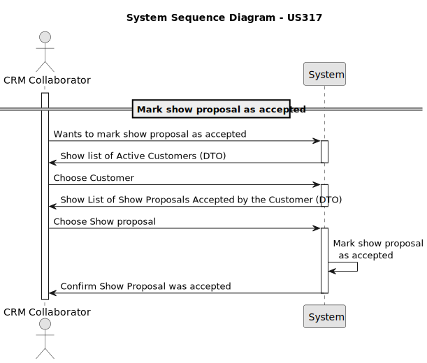
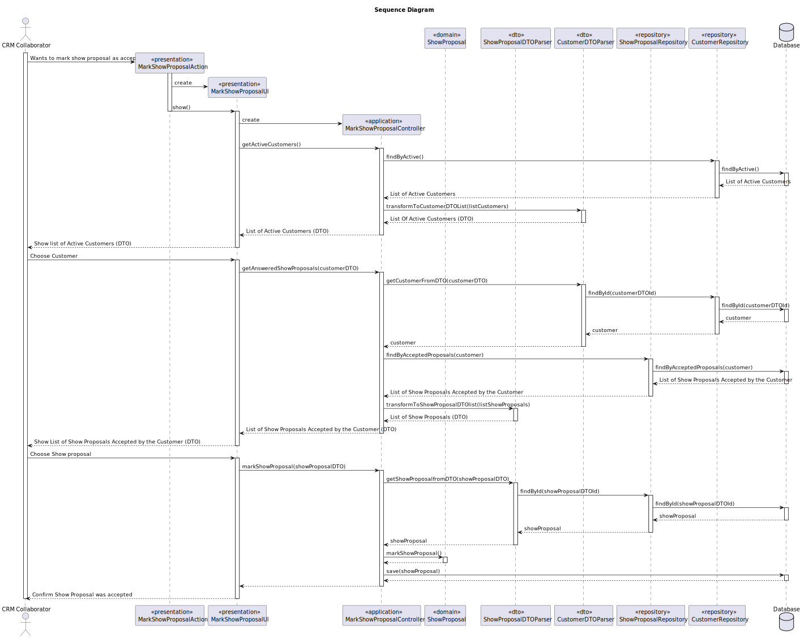

# US 317 - Mark show proposal as accepted

## 1. Context

*This user story addresses the need for CRM collaborators to explicitly record the acceptance, ensuring that approvals are documented and visible within the system.*

## 2. Requirements

**US317** As CRM Collaborator, I want to mark the proposal as accepted by the customer after it has been accept by a Customer Representative in the Customer App.

**Acceptance Criteria:**

- US317.1 Once marked as accepted, the proposal status is updated to "Accepted".

**Dependencies/References:**

*There is a dependency on the US310, since this US creates a show proposal.*
*There is a dependency on the US371, since this US is the response from the customer to the proposal.*

**Forum Insight:**

>> A funcionalidade será implementada de forma que o CRM Collaborator possa consultar, para um determinado cliente, se existe algum show proposal que já tenha sido aceite por um dos seus representativos (via Customer App). Caso exista, o Collaborator poderá então decidir marcar (ou não) essa proposta como formalmente aceite no sistema.
>
> É "representante", não "representativo". O cenário que descreve não me parece mal.

>> Durante a análise e levantamento de requisitos, o nosso grupo identificou que existe menção de um estado intermédio entre a proposta ser concretizada pelo CRM Colaborator e o parecer positivo do Representante do Cliente.
> Assim, em primeiro lugar, esse estado identificado existe? Na eventualidade da sua existência, qual seria o nome mais apropriado para esse estado (e.x Enviado, Parcialmente Aprovado, Implementado, etc.) ?
>
> Lamento, mas não percebi. Talvez pudesse enumerar os estados.

>> O acceptance email é um email gerado automaticamente assim que o cliente aceita a proposta no Customer App?
>
> Aceitar é na App. Não há email.

## 3. Analysis



## 4. Design

### 4.1. Sequence Diagram




### 4.3. Applied Patterns

- Controller
- Polymorphism
- Indirection
- DTO

### 4.4. Acceptance Tests

**Test 1:** *Verifies that it marks the show proposal successfully*

```
   @Test
    void testMarkShowProposalAccepted() {
        ProposalAnswerFeedback answer = new ProposalAnswerFeedback(ProposalAnswerFeedback.Answer.ACCEPTED, "Approved");
        proposal.updateProposalAnswer(answer);
        boolean result = proposal.markShowProposal();
        assertTrue(result);
        assertEquals(ShowStatus.ACCEPTED, proposal.status());
    }

````

**Test 2:** *Verifies that it doesn't mark as accepted if answer is REJECTED*

```
@Test
    void testMarkShowProposalFailsWhenAnswerNotAccepted() {
        ProposalAnswerFeedback answer = new ProposalAnswerFeedback(ProposalAnswerFeedback.Answer.REJECTED, "Not approved");
        proposal.updateProposalAnswer(answer);

        boolean result = proposal.markShowProposal();

        assertFalse(result);
        assertNotEquals(ShowStatus.ACCEPTED, proposal.status());
    }

````
## 5. Implementation

**MarkShowProposalAction**

```java
public class MarkShowProposalAction implements Action {
    @Override
    public boolean execute() {
        return new MarkShowProposalUI().show();
    }
}
```
**MarkShowProposalUI**

```java
public class MarkShowProposalUI extends AbstractUI {

    private MarkShowProposalController controller = new MarkShowProposalController();

    @Override
    protected boolean doShow() {
        Iterable<CustomerDTO> listActiveCustomers = controller.getActiveCustomers();
        if(!listActiveCustomers.iterator().hasNext()){
            System.out.println("\nThere are no Active Customers Registered!\n");
            return false;
        }
        String headerCustomerModel = String.format("Select Customer\n#  %-30s%-30s%-30s%-30s", "NAME","STATUS", "PHONE NUMBER", "EMAIL");
        SelectWidget<CustomerDTO> selectorCustomer = new SelectWidget<>(headerCustomerModel, listActiveCustomers, new CustomerDTOPrinter());
        selectorCustomer.show();
        CustomerDTO customerDTO = selectorCustomer.selectedElement();
        if(customerDTO == null){
            System.out.println("Customer cannot be null!");
            return false;
        }
        Iterable<ShowProposalDTO> listShowProposalAccepted = controller.getAnsweredShowProposals(customerDTO);
        if(!listShowProposalAccepted.iterator().hasNext()){
            System.out.println("\nThere are no Show Proposals Accepted by the Customers Representatives!\n");
            return false;
        }
        String headerModel = String.format("Select Show Proposal\n#  %-30s%-30s%-30s%-30s%-30s", "DESCRIPTION","PROPOSAL NUMBER", "CUSTOMER NAME", "DATE", "DURATION");
        SelectWidget<ShowProposalDTO> selector = new SelectWidget<>(headerModel, listShowProposalAccepted, new ShowProposalDTOPrinter());
        selector.show();
        ShowProposalDTO showProposal = selector.selectedElement();
        if(showProposal == null){
            System.out.println("Show Proposal cannot be null!");
            return false;
        }
        if(controller.markShowProposal(showProposal)){
            System.out.println("Show Proposal updated as Accepted!");
            return true;
        }
        System.out.println("Show Proposal was not updated as Accepted!");
        return false;
    }

    @Override
    public String headline() {
        return "Mark Show Proposal";
    }
}
```

**MarkShowProposalController**
```java
@UseCaseController
public class MarkShowProposalController {
    private final CustomerRepository customerRepository = PersistenceContext.repositories().customers();
    private final ShowProposalRepository showProposalRepository = PersistenceContext.repositories().showProposals();
    private final ShowProposalDTOParser showProposalDTOParser = new ShowProposalDTOParser();
    private final CustomerDTOParser customerDTOParser = new CustomerDTOParser();


    public Iterable<ShowProposalDTO> getAnsweredShowProposals(CustomerDTO customerDTO){
        Optional<Customer> customer = customerDTOParser.getCustomerFromDTO(customerDTO);
        Iterable<ShowProposal> list = showProposalRepository.findByAcceptedProposals(customer.get());
        return showProposalDTOParser.transformToShowProposalDTOlist(list);
    }

    public Iterable<CustomerDTO> getActiveCustomers(){
        Iterable<Customer> list = customerRepository.findByActive();
        return customerDTOParser.transformToCustomerDTOList(list);
    }

    public boolean markShowProposal(ShowProposalDTO showProposalDTO){
        Optional<ShowProposal> showProposal = showProposalDTOParser.getShowProposalfromDTO(showProposalDTO);
        if(showProposal.isPresent()){
            if(showProposal.get().markShowProposal()){
                showProposalRepository.save(showProposal.get());
                return true;
            }
        }
        return false;
    }
}
```
**CustomerDTOParser**
```Java
public class CustomerDTOParser {

    private final CustomerRepository customerRepository = PersistenceContext.repositories().customers();


    public Iterable<CustomerDTO> transformToCustomerDTOList(final Iterable<Customer> customers){
        return StreamSupport.stream(customers.spliterator(), true).map(Customer::toDTO).collect(Collectors.toUnmodifiableList());
    }

    public Optional<Customer> getCustomerFromDTO(final CustomerDTO customerDTO){
        return this.customerRepository.findById(customerDTO.getCustomerId());
    }
}
```

**ShowProposalDTOParser**

```Java
public class ShowProposalDTOParser {

    private final ShowProposalRepository showProposalRepository = PersistenceContext.repositories().showProposals();

    public Iterable<ShowProposalDTO> transformToShowProposalDTOlist(final Iterable<ShowProposal> showProposals){
        return StreamSupport.stream(showProposals.spliterator(), true).map(ShowProposal::toDTO).collect(Collectors.toUnmodifiableList());
    }

    public Optional<ShowProposal> getShowProposalfromDTO(ShowProposalDTO showProposalDTO){
        return this.showProposalRepository.findById(showProposalDTO.getShowProposalId());
    }
}
```

**ShowProposal**
```Java
@Entity
public class ShowProposal implements AggregateRoot<Long>, DTOable<ShowProposalDTO> {
    @Id
    @GeneratedValue(strategy = GenerationType.AUTO)
    private Long showProposalId;

    @ManyToOne
    private ShowRequest showRequest;

    @Column(nullable = false)
    private GeoLocation location;

    @Temporal(TemporalType.DATE)
    private Calendar date;

    @Column(nullable = false)
    private LocalTime time;

    @Column(nullable = false)
    private int duration;

    @Column(nullable = false)
    private int totalDroneNumber;

    @Column(nullable = false)
    private double insuranceAmount;

    @Temporal(TemporalType.DATE)
    private Calendar createdOn;

    @Column(nullable = false)
    private int proposalNumber;

    @ManyToOne
    private SystemUser createdBy;
    @Enumerated(EnumType.STRING)
    private ShowStatus status;

    @OneToMany(mappedBy = "showProposal", cascade = CascadeType.ALL)
    private List<DroneListItem> droneModelList;

    @Column (nullable = true)
    private String videoLink;

    @ManyToOne
    private Template template;

    @OneToOne(cascade = CascadeType.ALL)
    @JoinColumn(name = "document_id", referencedColumnName = "documentId")
    private Document document;

    @Embedded
    private ProposalAnswerFeedback proposalAnswerFeedback;

    protected ShowProposal() {}

    public ShowProposal(ShowRequest showRequest, GeoLocation location, Calendar date, LocalTime time, int duration, int totalDroneNumber, int proposalNumber, SystemUser createdBy, Template template, double insuranceAmount) {
        this.showRequest = validateShowRequest(showRequest);
        this.location = validateLocation(location);
        this.date = validateDate(date);
        this.time = validateTime(time);
        this.duration = validateDuration(duration);
        this.totalDroneNumber = validateTotalDroneNumber(totalDroneNumber);
        this.proposalNumber = validateProposalNumber(proposalNumber);
        this.template = validateTemplate(template);
        this.createdBy = validateCreatedBy(createdBy);
        this.createdOn = Calendar.getInstance();
        this.status = ShowStatus.PENDING;
        this.droneModelList = new ArrayList<>();
        this.document = null;
        this.proposalAnswerFeedback = null;
        this.insuranceAmount = insuranceAmount;
    }

    public boolean addDroneToList(DroneModel droneModel, int quantity){
        if (droneModel == null || quantity <= 0) return false;

        int currentTotal = 0;
        for (DroneListItem item : droneModelList) {
            currentTotal += item.numberOfDrones();
        }

        if (currentTotal + quantity > totalDroneNumber) {
            return false;
        }

        for (DroneListItem item : droneModelList) {
            if (item.droneModel().equals(droneModel)) {
                return false;
            }
        }

        DroneListItem newItem = new DroneListItem(droneModel, this, quantity);
        droneModelList.add(newItem);
        return true;
    }

    public int allDroneModels_Quantity(){
        int currentTotal = 0;
        for (DroneListItem item : droneModelList) {
            currentTotal += item.numberOfDrones();
        }
        return currentTotal;
    }

    public List<DroneListItem> droneListItem (){
        return this.droneModelList;
    }

    public boolean addVideoToProposal(String video) {
        if (isValidVideoLink(video)) {
            this.videoLink = video;
            return true;
        }
        return false;
    }

    public Template template() {return this.template;}

    public ShowStatus status(){return  this.status;}

    public ShowRequest showRequest() { return this.showRequest; }

    public Calendar createdOn() { return this.createdOn; }

    public GeoLocation location() { return this.location; }

    public Calendar date() { return this.date; }

    public int totalDroneNumber() { return this.totalDroneNumber; }

    public int duration() { return this.duration; }

    public int proposalNumber() { return this.proposalNumber; }

    public SystemUser createdBy() { return this.createdBy; }

    public LocalTime time() { return this.time; }

    public String videoLink() { return this.videoLink; }

    public double insuranceAmount() { return this.insuranceAmount; }

    public ProposalAnswerFeedback proposalAnswerFeedback(){ return this.proposalAnswerFeedback; }

    public Document document(){return this.document;}

    public ShowRequest validateShowRequest(ShowRequest showRequest) {
        if (showRequest == null)
            throw new IllegalArgumentException("ShowRequest cannot be null");
        return showRequest;
    }

    public GeoLocation validateLocation(GeoLocation location) {
        if (location == null) {
            throw new IllegalArgumentException("Location cannot be null");
        }

        double latitude = location.latitude();
        double longitude = location.longitude();
        int altitude = location.altitude();

        if (latitude < -90 || latitude > 90) {
            throw new IllegalArgumentException("Latitude must be between -90 and 90 degrees.");
        }

        if (longitude < -180 || longitude > 180) {
            throw new IllegalArgumentException("Longitude must be between -180 and 180 degrees.");
        }

        if (altitude <= 0) {
            throw new IllegalArgumentException("Altitude must be a positive number.");
        }
        return location;
    }

    public Calendar validateDate(Calendar date) {
        if (date == null) {
            throw new IllegalArgumentException("Date cannot be null");
        }
        return date;
    }

    public LocalTime validateTime(LocalTime time) {
        if (time == null)
            throw new IllegalArgumentException("Time cannot be null");
        return time;
    }

    public int validateDuration(Integer duration) {
        if (duration == null) {
            throw new IllegalArgumentException("Duration cannot be null.");
        }
        if (duration <= 0) {
            throw new IllegalArgumentException("Duration must be greater than 0.");
        }
        return duration;
    }

    public int validateTotalDroneNumber(Integer totalDroneNumber) {
        if (totalDroneNumber == null) {
            throw new IllegalArgumentException("Total drone number cannot be null.");
        }
        if (totalDroneNumber <= 0) {
            throw new IllegalArgumentException("Total drone number must be greater than 0.");
        }
        return totalDroneNumber;
    }

    public int validateProposalNumber(int proposalNumber) {
        if (proposalNumber < 0)
            throw new IllegalArgumentException("Proposal number cannot be negative");
        return proposalNumber;
    }

    public SystemUser validateCreatedBy(SystemUser createdBy) {
        if (createdBy == null)
            throw new IllegalArgumentException("CreatedBy (SystemUser) cannot be null");
        return createdBy;
    }

    public boolean isValidVideoLink(String videoLink) {
        if (videoLink == null) {
            throw new IllegalArgumentException("Video link cannot be null");
        }
        final String videoLinkPattern = "^(https?://|www\\.)[a-zA-Z0-9][-a-zA-Z0-9&',./_=?%#:~]*$";
        return videoLink.matches(videoLinkPattern);
    }

    public Template validateTemplate(Template template) {
        if (template == null) {
            throw new IllegalArgumentException("Template cannot be null");
        }
        return template;
    }
    public boolean updateProposalAnswer(ProposalAnswerFeedback answer){
        if(answer != null & answer.answer() != null){
            this.proposalAnswerFeedback = answer;
            return true;
        }
        return false;
    }

    public boolean markShowProposal(){
        if(proposalAnswerFeedback != null && proposalAnswerFeedback.answer() == ProposalAnswerFeedback.Answer.ACCEPTED){
            status = ShowStatus.ACCEPTED;
            return true;
        }
        return false;
    }

    public boolean addDocument(Document document){
        if(document != null){
            this.document = document;
            return true;
        }
        return false;
    }

    @Override
    public boolean sameAs(Object other) {
        if (this == other) return true;
        if (!(other instanceof ShowProposal)) return false;
        ShowProposal that = (ShowProposal) other;
        return showProposalId != null && showProposalId.equals(that.showProposalId);
    }

    @Override
    public Long identity() {
        return this.showProposalId;
    }

    @Override
    public ShowProposalDTO toDTO() {
        Long docId = document != null ? document.identity() : null;
        return new ShowProposalDTO(showProposalId,showRequest.identity(),showRequest().customer().customerName().toString(),showRequest.description(), location, date,
                time,duration,totalDroneNumber,insuranceAmount,createdOn,proposalNumber,createdBy.name().toString(), status,videoLink,droneModelList,template.name(), docId, proposalAnswerFeedback);
    }
}
```

## 6. Integration/Demonstration

**Marking the Proposal as Accepted**


