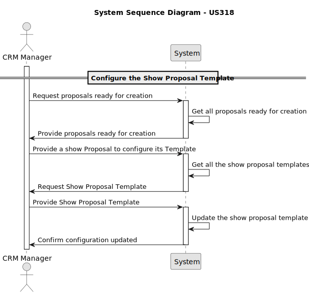

# US 318 - Configure Proposal Template

## 1. Context

*As CRM Manager, I want to be able to configure the template that formats the document to be sent to the customer. The plugin used to validate the proposal template must be previously registered in the system.*
## 2. Requirements

**US 318** As CRM Manager, I want to be able to configure the template that formats the document to be sent to the customer.

**Acceptance Criteria:**

- US318.1 The plugin used to validate the proposal template must be previously registered in the system.

**Dependencies/References:**

*There is a dependency with US255,  as it needs to be implemented in order to verify possible proposals.*


**Forum Insight:**

* Still no questions related to this user story on forum.
* 
## 3. Analysis



## 4. Design

### 4.1. Sequence Diagram


### 4.3. Applied Patterns

- Controller
- Creator
- Polymorphism
- Indirection
- DTO

### 4.4. Acceptance Tests

**Test 1:** *Verifies that a template is created correctly*

```
    @Test
    void createTemplate_success() {
        when(templateRepository.isNameUsed(validName)).thenReturn(false);
        when(templateRepository.isContentUsed(validContent)).thenReturn(false);
        when(templateRepository.save(any(Template.class))).thenReturn(template);

        Template result = service.createTemplate(validName, validContent);

        assertNotNull(result);
        assertEquals(validName, result.name());
        assertEquals(validContent, result.content());

        verify(templateRepository).isNameUsed(validName);
        verify(templateRepository).isContentUsed(validContent);
        verify(templateRepository).save(any(Template.class));
    }

````

**Test 2:** *Verifies if the inputted name is already in use*

```

    @Test
    void isNameUsed_returnsTrueWhenNameExists() {
        when(templateRepository.isNameUsed(validName)).thenReturn(true);

        boolean result = service.isNameUsed(validName);

        assertTrue(result);
        verify(templateRepository).isNameUsed(validName);
    }

````

**Test 3:** *Verifies if the template content inputted is already in use*

```

    @Test
    void isContentUsed_returnsTrueWhenContentExists() {
        when(templateRepository.isContentUsed(validContent)).thenReturn(true);

        boolean result = service.isContentUsed(validContent);

        assertTrue(result);
        verify(templateRepository).isContentUsed(validContent);
    }

````
## 5. Implementation

**ConfigureTemplateAction**

```java
public class ConfigureTemplateAction implements Action {

    @Override
    public boolean execute() {
        return new ConfigureTemplateUI().show();
    }
}


```
**ConfigureTemplateUI**
```java
public class ConfigureTemplateUI extends AbstractUI {

    private final ConfigureTemplateController controller = new ConfigureTemplateController();

    @Override
    protected boolean doShow() {

        String name = null, content = null;

        while (true) {
            try {
                name = Console.readLine("Enter the name of the template: ");
                if (name.trim().isEmpty()) {
                    throw new IllegalArgumentException("Name of the template cannot be empty.");
                }
                if (controller.isNameUsed(name)) {
                    throw new IllegalArgumentException("Name of the template is already in use.");
                }
                break;
            } catch (IllegalArgumentException e) {
                System.out.println("Error: " + e.getMessage());
            }
        }
        while (true) {
            try {
                content = Console.readLine("Enter the path to the content of the template: ");
                if (content.trim().isEmpty()) {
                    throw new IllegalArgumentException("Content of the template cannot be empty.");
                }
                if (controller.isContentUsed(content)) {
                    throw new IllegalArgumentException("Content of the template is already in use.");
                }
                break;
            } catch (IllegalArgumentException e) {
                System.out.println("Error: " + e.getMessage());
            }
        }

        try {
            if (controller.registerTemplate(name, content)) {
                System.out.println("Template configured successfully!");
                return true;
            } else {
                System.out.println("Error configuring template.");
                return false;
            }
        } catch (IllegalArgumentException | IOException e) {
            System.out.println("\nERROR: " + e.getMessage() + "\n");
        }
        return false;
    }

    @Override
    public String headline() {
        return "Configure Show Proposal Template";
    }

}
```

**ConfigureTemplateController**
```java
@UseCaseController
public class ConfigureTemplateController {
    private final AuthorizationService authz = AuthzRegistry.authorizationService();
    private final TemplateRepository templateRepository = PersistenceContext.repositories().templates();
    private final TemplateManagementService templateManagementSvc = new TemplateManagementService(templateRepository);

    public boolean registerTemplate(String name, String contentPath)  throws IOException {
        authz.ensureAuthenticatedUserHasAnyOf(Roles.CRM_MANAGER, Roles.POWER_USER);
        String template = Files.readString(Paths.get(contentPath));
        if (ShowProposalValidator.validateShowProposalPlaceholders(template)) {
            templateManagementSvc.createTemplate(name, template);
            return true;
        }
        throw new IllegalArgumentException("Template content does not contain the required placeholders.");
    }

    public boolean isNameUsed(String name) {
        return templateManagementSvc.isNameUsed(name);
    }

    public boolean isContentUsed(String content) {
        return templateManagementSvc.isContentUsed(content);
    }
}

```
**TemplateManagementService**
```Java
public class TemplateManagementService {

    private final TemplateRepository templateRepository;

    public TemplateManagementService(final TemplateRepository templateRepository) {
        this.templateRepository = templateRepository;
    }

    public Template createTemplate(final String name, final String content) {
        if (name == null || name.isEmpty()) {
            throw new IllegalArgumentException("Template Name cannot be null or empty");
        } else if (isNameUsed(name)) {
            throw new IllegalArgumentException("Template Name already in use");
        }
        if (content == null || content.isEmpty()) {
            throw new IllegalArgumentException("Template Content cannot be null or empty");
        } else if (isContentUsed(content)) {
            throw new IllegalArgumentException("Template Content already in use");
        }

        final Template template = new Template(name, content);
        return this.templateRepository.save(template);
    }

    public Iterable<Template> listAllTemplates() {
        return this.templateRepository.findAll();
    }

    public boolean isNameUsed(final String name) {
        return this.templateRepository.isNameUsed(name);
    }

    public boolean isContentUsed(final String content) {
        return this.templateRepository.isContentUsed(content);
    }
}


```
**Template**
```Java
@Entity
public class Template implements AggregateRoot<Long> {

    @Id
    @GeneratedValue(strategy = GenerationType.AUTO)
    private Long templateId;

    @Column(unique = true)
    private String name;

    @Column(name = "CONTENT", length = 5000, unique = true)
    private String content;

    protected Template() {
    }

    public Template (String name, String content) {
        this.name = name;
        this.content = content;
    }


    public String name (){return this.name;}

    public String content (){return this.content;}

    @Override
    public String toString() {
        return "Template{" +
                "templateId=" + templateId +
                ", name='" + name + '\'' +
                ", content='" + content + '\'' +
                '}';
    }

    @Override
    public boolean equals(Object o) {
        if (this == o) return true;
        if (o == null || getClass() != o.getClass()) return false;
        Template template = (Template) o;
        return Objects.equals(templateId, template.templateId) && Objects.equals(name, template.name);
    }

    @Override
    public int hashCode() {
        return Objects.hash(templateId, name);
    }

    @Override
    public boolean sameAs(Object other) {
        return false;
    }

    @Override
    public Long identity() {
        return this.templateId;
    }
}
```


## 6. Integration/Demonstration

**Configure Template**


***Database Result***

**Database Before**


**Database After**


