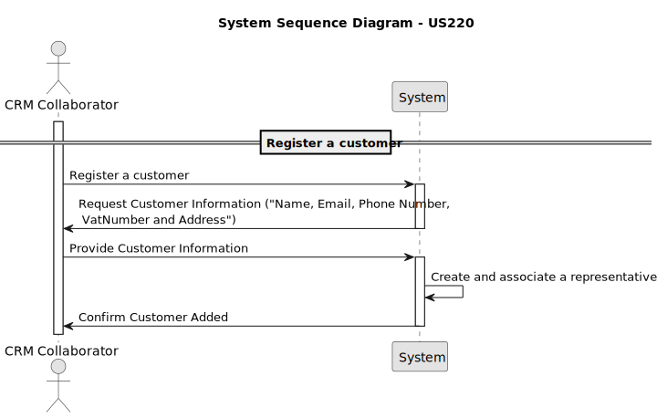

# US 326 - Add maintenance record to a drone

## 1. Context

*This user story is part of the Drone Management System, which allows users to manage drones, their maintenance records, and associated operations. The goal of this user story is to enable Drone Technicians to add maintenance records to existing drones, ensuring that the maintenance history is accurately tracked and managed.*
## 2. Requirements

**US 326** As a Drone Tech, I want to add a maintenance record to a given drone.

**Acceptance Criteria:**

- US326.1 A maintenance record is of an existing maintenance type.
- US326.2 Some maintenance operations reset the usage time counter of the drone.
**Dependencies/References:**

*There is a dependency with US325, since there should already exist a maintenance type to be able to register a maintenance record and US 240 because there must also exist a drone*

**Forum Insight:**

* Still no questions related to this user story on forum.

## 3. Analysis



## 4. Design

### 4.1. Sequence Diagram


### 4.3. Applied Patterns

- Information Expert
- Creator
- Controller
- Low Coupling
- High Cohesion
- Polymorphism
- Pure Fabrication
- Indirection
- Protected Variations

### 4.4. Acceptance Tests

**Test 1:** *Verifies that a customer is created correctly*

```
    @Test
    void registerNewCustomer_shouldRegisterSuccessfully() {
        when(customerRepository.isEmailUsed("client@email.com")).thenReturn(false);
        when(customerRepository.isVatNumberUsed("CC123456")).thenReturn(false);
        when(customerRepository.save(any(Customer.class))).thenReturn(customer);

        Customer result = service.registerNewCustomer(
                "Client Name",
                "Client Address",
                "client@email.com",
                "VAT123",
                "910000000",
                "CC123456",
                systemUser
        );

        assertNotNull(result);
        assertEquals("Client Name", result.customerName());
        verify(customerRepository).save(any(Customer.class));
    }

````

**Test 2:** *Verifies that the representative is created along with the customer*

```

@Test
    void addRepresentative_shouldAddSuccessfully() {
        Representative rep = new Representative("Alice Smith", "alice@email.com", now, "password123", "912345678", customer, "Sales Manager", user);

        customer.addRepresentative(rep);

        assertEquals(1, customer.representatives().size());
        assertTrue(customer.representatives().contains(rep));
    }

````
## 5. Implementation

**RegisterCustomerAction**

```java
package eapli.base.app.backoffice.presentation.customerManagement;

import eapli.framework.actions.Action;

public class RegisterCustomerAction implements Action {

    @Override
    public boolean execute() {
        return new RegisterCustomerUI().show();
    }
}

```
**RegisterCustomerUI**
```java
public class RegisterCustomerUI extends AbstractUI {

    private final RegisterCustomerController theController = new RegisterCustomerController();

    @Override
    protected boolean doShow() {
        final String customerName = Console.readLine("Customer Name");
        final String customerAddress = Console.readLine("Customer Address");
        final String customerEmail = Console.readLine("Customer Email");
        final String password = Console.readLine("Password");
        final String customerPhoneNumber = Console.readLine("Customer Phone Number");
        final String customerVatNumber = Console.readLine("Customer VAT Number");
        final String representativeName = Console.readLine("Representative Name");
        final String representativeEmail = Console.readLine("Representative Email");
        final String representativePassword = Console.readLine("Representative Password");
        final String representativePhoneNumber = Console.readLine("Representative Phone Number");
        final String representativePosition = Console.readLine("Representative Position");


        try {
            this.theController.registerCustomer(customerName, customerAddress, customerEmail, password, customerPhoneNumber, customerVatNumber,
                    representativeName, representativeEmail, representativePassword, representativePhoneNumber, representativePosition);
        } catch (IllegalArgumentException e) {
            System.out.println("\nERROR: " + e.getMessage() + "\n");
        }
        return true;
    }

    @Override
    public String headline() {return "Register Customer";}

}
```

**RegisterCustomerController**
```java
public class RegisterCustomerController {
    private final AuthorizationService authz = AuthzRegistry.authorizationService();

    private final CustomerRepository repo = PersistenceContext.repositories().customers();
    private final RepresentativeRepository repo2 = PersistenceContext.repositories().representatives();

    private final CustomerManagementService customersvc = new CustomerManagementService(repo);
    private final RepresentativeManagementService representativesvc = new RepresentativeManagementService(repo2, repo);

    public Customer registerCustomer(final String customerName, final String customerAddress, final String customerEmail, final String password, final String customerPhoneNumber, final String customerVatNumber, final String representativeName, final String representativeEmail, final String representativePassword,  final String representativePhoneNumber,final String representativePosition) {
        authz.ensureAuthenticatedUserHasAnyOf(Roles.CRM_COLLABORATOR);
        Customer newCustomer = customersvc.registerNewCustomer(customerName, customerAddress, customerEmail, password, customerPhoneNumber, customerVatNumber, authz.session().get().authenticatedUser());
        representativesvc.registerNewRepresentative(representativeName, representativeEmail, representativePassword, representativePhoneNumber, newCustomer, representativePosition, authz.session().get().authenticatedUser());
        return newCustomer;
    }
}


```
**CustomerManagementService**
```Java
public class CustomerManagementService {

    private final CustomerRepository customerRepository;

    public CustomerManagementService(final CustomerRepository customerRepository) {
        this.customerRepository = customerRepository;
    }

    public Customer registerNewCustomer(final String customerName, final String customerAddress, final String customerEmail, final String password, final String customerPhoneNumber, final String customerVatNumber, final SystemUser createdBy, final Customer.CustomerStatus status, final Calendar createdOn) {
        if (customerName == null || customerName.isEmpty()) {
            throw new IllegalArgumentException("Customer name cannot be null or empty");
        }
        if (customerAddress == null || customerAddress.isEmpty()) {
            throw new IllegalArgumentException("Customer address cannot be null or empty");
        }
        if (customerEmail == null || customerEmail.isEmpty() || isEmailUsed(customerEmail)) {
            throw new IllegalArgumentException("Customer email cannot be null or empty");
        }
        if (password == null || password.isEmpty()) {
            throw new IllegalArgumentException("Customer password cannot be null or empty");
        }
        if (customerPhoneNumber == null || customerPhoneNumber.isEmpty()) {
            throw new IllegalArgumentException("Customer phone number cannot be null or empty");
        }
        if (customerVatNumber == null || customerVatNumber.isEmpty() || isVatNumberUsed(customerVatNumber)) {
            throw new IllegalArgumentException("Customer VAT number cannot be null or empty");
        }
        if (createdBy == null) {
            throw new IllegalArgumentException("Created by cannot be null");
        }
        if (status == null) {
            throw new IllegalArgumentException("Customer status cannot be null");
        }
        Customer newCustomer = new Customer(customerName, customerAddress, customerEmail, password, customerPhoneNumber, customerVatNumber, createdBy, status, createdOn);
        return (Customer) this.customerRepository.save(newCustomer);
    }

    public Customer registerNewCustomer(final String customerName, final String customerAddress, final String customerEmail, final String password, final String customerPhoneNumber, final String customerVatNumber, final SystemUser createdBy) {
        return registerNewCustomer(customerName, customerAddress, customerEmail, password, customerPhoneNumber, customerVatNumber, createdBy, Customer.CustomerStatus.CREATED, CurrentTimeCalendars.now());
    }

    public Optional<Customer> findCustomerById(final Long id) {
        return this.customerRepository.findById(id);
    }

    public Iterable<Customer> findAllActiveCustomers() {
        return this.customerRepository.findByActive();
    }

    public Iterable<Customer> findAllCustomers() {
        return this.customerRepository.findAll();
    }

    public Customer changeCustomerStatus(final Customer customer, final Customer.CustomerStatus status) {
        customer.changeStatus(status);
        return (Customer) this.customerRepository.save(customer);
    }


    public boolean isEmailUsed(String customerEmail) {
        return this.customerRepository.isEmailUsed(customerEmail);
    }

    public boolean isVatNumberUsed(String customerVatNumber) {
        return this.customerRepository.isVatNumberUsed(customerVatNumber);
    }
}


```
**RepresentativeManagementService**
```Java
public class RepresentativeManagementService {

    private final RepresentativeRepository representativeRepository;
    private final CustomerRepository customerRepository;

    public RepresentativeManagementService(final RepresentativeRepository representativeRepository, final CustomerRepository customerRepository) {
        this.representativeRepository = representativeRepository;
        this.customerRepository = customerRepository;
    }

    public void registerNewRepresentative(final String representativeName, final String representativeEmail, final Calendar createdOn, final String representativePassword, final String representativePhoneNumber, final Customer associatedCustomer, final String representativePosition, final SystemUser createdBy){
        if(representativeName == null || representativeName.isEmpty()){
            throw new IllegalArgumentException("Representative Name cannot be null or empty!");
        }
        if(representativeEmail == null || representativeEmail.isEmpty() || isEmailUsed(representativeEmail)){
            throw new IllegalArgumentException("Representative Email is already in use. (Also it cannot be null or empty!)");
        }
        if(representativePassword == null || representativePassword.isEmpty()){
            throw new IllegalArgumentException("Representative Password cannot be null or empty!");
        }
        if(representativePhoneNumber == null || representativePhoneNumber.isEmpty()){
            throw new IllegalArgumentException("Representative Phone Number cannot be null or empty!");
        }
        if(associatedCustomer == null){
            throw new IllegalArgumentException("Associated Customer cannot be null!");
        }
        if(representativePosition == null || representativePosition.isEmpty()){
            throw new IllegalArgumentException("Representative Position cannot be null or empty!");
        }
        if(createdBy == null){
            throw new IllegalArgumentException("Created By cannot be null!");
        }

        Representative newRepresentative = new Representative(representativeName, representativeEmail, createdOn, representativePassword, representativePhoneNumber, associatedCustomer, representativePosition, createdBy);
        associatedCustomer.addRepresentative(newRepresentative);
        this.customerRepository.save(associatedCustomer);
    }

    public void registerNewRepresentative(final String representativeName, final String representativeEmail,final String representativePassword, final String representativePhoneNumber, final Customer associatedCustomer, final String representativePosition, final SystemUser createdBy){
        registerNewRepresentative(representativeName, representativeEmail, CurrentTimeCalendars.now(), representativePassword, representativePhoneNumber, associatedCustomer, representativePosition, createdBy);
    }

    public void editRepresentative(final Representative representative, final String newName, final String newEmail, final String newPassword, final String newPhoneNumber, final String newPosition){
        boolean edited = false;
        if(newName == null || newName.isEmpty()){
            throw new IllegalArgumentException("Representative Name cannot be null or empty!");
        }else if(!newName.equals("N")){
            edited = true;
            representative.changeName(newName);
        }
        if(newEmail == null || newEmail.isEmpty() || isEmailUsed(newEmail) || isEmailUsed(newEmail)){
            throw new IllegalArgumentException("Representative Email is already in use. (Also it cannot be null or empty!)");
        }else if(!newEmail.equals("N")){
            edited = true;
            representative.changeEmail(newEmail);
        }
        if(newPassword == null || newPassword.isEmpty()){
            throw new IllegalArgumentException("Representative Password cannot be null or empty!");
        }else if(!newPassword.equals("N")){
            edited = true;
            representative.changePassword(newPassword);
        }
        if(newPhoneNumber == null || newPhoneNumber.isEmpty()){
            throw new IllegalArgumentException("Representative Phone Number cannot be null or empty!");
        }else if(!newPhoneNumber.equals("N")){
            edited = true;
            representative.changePhoneNumber(newPhoneNumber);
        }
        if(newPosition == null || newPosition.isEmpty()){
            throw new IllegalArgumentException("Representative Position cannot be null or empty!");
        }else if(!newPosition.equals("N")){
            edited = true;
            representative.changePosition(newPosition);
        }

        if (edited) {
            representative.changeChangedOn();
            this.representativeRepository.save(representative);
        }
    }

    public boolean isEmailUsed(String representativeEmail) {
        return this.representativeRepository.isEmailUsed(representativeEmail);
    }

    public boolean isPhoneNumberUsed(String representativePhoneNumber) {
        return this.representativeRepository.isPhoneNumberUsed(representativePhoneNumber);
    }

    public Optional<Representative> findById(final Long id){
        return this.representativeRepository.findById(id);
    }
    public Iterable<Representative> findByActive(final boolean active){
        return this.representativeRepository.findByActive(active);
    }
    public Iterable<Representative> findAll(){
        return this.representativeRepository.findAll();
    }
    public Iterable<Representative> findByAssociatedCustomer(final Customer associatedCustomer){
        return this.representativeRepository.findByAssociatedCustomer(associatedCustomer);
    }

    public Representative deactivateCustomerRepresentative(final Representative representative) {
        representative.deactivate(CurrentTimeCalendars.now());
        return (Representative) this.representativeRepository.save(representative);
    }
    public Representative activateRepresentative(final Representative representative) {
        representative.activate();
        return (Representative) this.representativeRepository.save(representative);
    }
}

```
**Customer**
```Java
public class Customer implements AggregateRoot<Long> {

    @Id
    @GeneratedValue(strategy = GenerationType.AUTO)
    private Long customerId;

    @Column( unique = true, nullable = false)
    private String customerName;

    @Column
    private String customerAddress;
    @Column
    private String customerEmail;
    @Column
    private String customerPassword;
    @Column
    private String customerPhoneNumber;
    @Column
    private String customerVatNumber;

    @OneToMany(cascade = CascadeType.ALL, orphanRemoval = true)
    private List<Representative> representatives;

    @ManyToOne
    private SystemUser createdBy;
    @Temporal(TemporalType.DATE)
    private Calendar createdOn;

    @Enumerated(EnumType.STRING)
    @Column(nullable = false)
    private CustomerStatus status;


    public enum CustomerStatus {
        DELETED,
        INFRINGEMENT,
        CREATED,
        REGULAR,
        VIP
    }

    protected Customer() {
    }

    public Customer(final String customerName, final String customerAddress, final String customerEmail, final String password, final String customerPhoneNumber, final String customerVatNumber, final SystemUser createdBy, final CustomerStatus status, final Calendar createdOn) {
        this.customerName = customerName;
        this.customerAddress = customerAddress;
        this.customerEmail = customerEmail;
        this.customerPassword = password;
        this.customerPhoneNumber = customerPhoneNumber;
        this.customerVatNumber = customerVatNumber;
        this.createdBy = createdBy;
        this.status = status;
        this.createdOn = createdOn == null ? CurrentTimeCalendars.now() : createdOn;
        this.representatives = new ArrayList<>();
    }

    public String customerName() {
        return this.customerName;
    }
    public String customerAddress() {
        return this.customerAddress;
    }
    public String customerEmail() {
        return this.customerEmail;
    }
    public String customerPassword() {
        return this.customerPassword;
    }
    public String customerPhoneNumber() {
        return this.customerPhoneNumber;
    }
    public String customerVatNumber() {
        return this.customerVatNumber;
    }
    public SystemUser createdBy() {
        return this.createdBy;
    }
    public Calendar createdOn() {
        return this.createdOn;
    }

    public CustomerStatus status() {
        return this.status;
    }
    public void changeStatus(CustomerStatus newStatus) {
        this.status = newStatus;
    }
    public List<Representative> representatives() {
        return this.representatives;
    }
    public void addRepresentative(Representative representative) {
        this.representatives.add(representative);
    }

    @Override
    public String toString() {
        return "Customer{" +
                "customerName='" + customerName + '\'' +
                ", customerAddress='" + customerAddress + '\'' +
                ", customerEmail='" + customerEmail + '\'' +
                ", CustomerPassword='" + customerPassword + '\'' +
                ", customerPhoneNumber='" + customerPhoneNumber + '\'' +
                ", customerVatNumber='" + customerVatNumber + '\'' +
                ", status=" + status + '\'' +
                ", createdBy=" + createdBy + '\'' +
                ", createdOn=" + createdOn + '\'' +
                ", representatives=" + representatives +
                '}';
    }

    @Override
    public boolean sameAs(final Object other) {
        if (this == other) return true;
        if (!(other instanceof Customer)) return false;
        Customer that = (Customer) other;
        return customerId != null && customerId.equals(that.customerId);
    }

    @Override
    public Long identity() {
        return this.customerId;
    }
}
```
**Representative**

```Java
public class Representative implements AggregateRoot<Long> {

    @Id
    @GeneratedValue(strategy = GenerationType.AUTO)
    private Long representativeId;
    @Column
    private String representativeName;
    @Column
    private String representativeEmail;
    @Column
    private String representativePassword;
    @Column
    private String representativePhoneNumber;

    @ManyToOne
    private Customer associatedCustomer;
    @Column
    private String representativePosition;

    private boolean active;
    @Temporal(TemporalType.DATE)
    private Calendar deactivatedOn;

    @Temporal(TemporalType.DATE)
    private Calendar createdOn;

    @Temporal(TemporalType.DATE)
    private Calendar changedOn;
    @ManyToOne
    private SystemUser createdBy;

    protected Representative() {
    }

    public Representative(final String representativeName, final String representativeEmail, final Calendar createdOn, final String representativePassword, final String representativePhoneNumber, final Customer associatedCustomer, final String representativePosition, final SystemUser createdBy) {
        this.representativeName = representativeName;
        this.representativeEmail = representativeEmail;
        this.representativePassword = representativePassword;
        this.representativePhoneNumber = representativePhoneNumber;
        this.associatedCustomer = associatedCustomer;
        this.representativePosition = representativePosition;
        this.createdBy = createdBy;
        this.createdOn = createdOn == null ? CurrentTimeCalendars.now() : createdOn;
        this.changedOn = createdOn == null ? CurrentTimeCalendars.now() : createdOn;
        this.active = true;
    }

    public String representativeName() {
        return this.representativeName;
    }
    public String representativeEmail() {
        return this.representativeEmail;
    }
    public String representativePassword() {
        return this.representativePassword;
    }
    public String representativePhoneNumber() {
        return this.representativePhoneNumber;
    }
    public Customer associatedCustomer() {
        return this.associatedCustomer;
    }
    public String representativePosition() {
        return this.representativePosition;
    }
    public SystemUser createdBy() {
        return this.createdBy;
    }
    public Calendar createdOn() {
        return this.createdOn;
    }
    public Calendar changedOn() {return this.changedOn;}
    public boolean isActive() {
        return this.active;
    }
    public Calendar deactivatedOn(){
        return this.deactivatedOn;
    }
    public void deactivate(final Calendar deactivatedOn) {
        if (deactivatedOn != null && !deactivatedOn.before(this.createdOn)) {
            if (!this.active) {
                throw new IllegalStateException("Cannot deactivate an inactive Drone Model!");
            } else {
                this.active = false;
                this.deactivatedOn = deactivatedOn;
            }
        } else {
            throw new IllegalArgumentException();
        }
    }

    public void changeName(final String representativeName) {
        this.representativeName = representativeName;
    }
    public void changeEmail(final String representativeEmail) {
        this.representativeEmail = representativeEmail;
    }
    public void changePassword(final String representativePassword) {
        this.representativePassword = representativePassword;
    }
    public void changePhoneNumber(final String representativePhoneNumber) {
        this.representativePhoneNumber = representativePhoneNumber;
    }
    public void changePosition(final String representativePosition) {
        this.representativePosition = representativePosition;
    }
    public void changeChangedOn() {
        this.changedOn = Calendar.getInstance();
    }

    public void activate() {
        if (!this.isActive()) {
            this.active = true;
            this.deactivatedOn = null;
        }
    }
    @Override
    public boolean sameAs(final Object other) {
        if (this == other) return true;
        if (!(other instanceof Representative)) return false;
        Representative that = (Representative) other;
        return representativeId != null && representativeId.equals(that.representativeId);
    }
    @Override
    public String toString() {
        return "Representative{" +
                "representativeName='" + representativeName + '\'' +
                ", representativeEmail='" + representativeEmail + '\'' +
                ", representativePassword='" + representativePassword + '\'' +
                ", representativePhoneNumber='" + representativePhoneNumber + '\'' +
                ", associatedCustomer=" + associatedCustomer +
                ", representativePosition='" + representativePosition + '\'' +
                ", active=" + active +
                '}';
    }
    @Override
    public Long identity() {
        return this.representativeId;
    }
}
```


## 6. Integration/Demonstration

**Registering Customer**


**Database Result**


