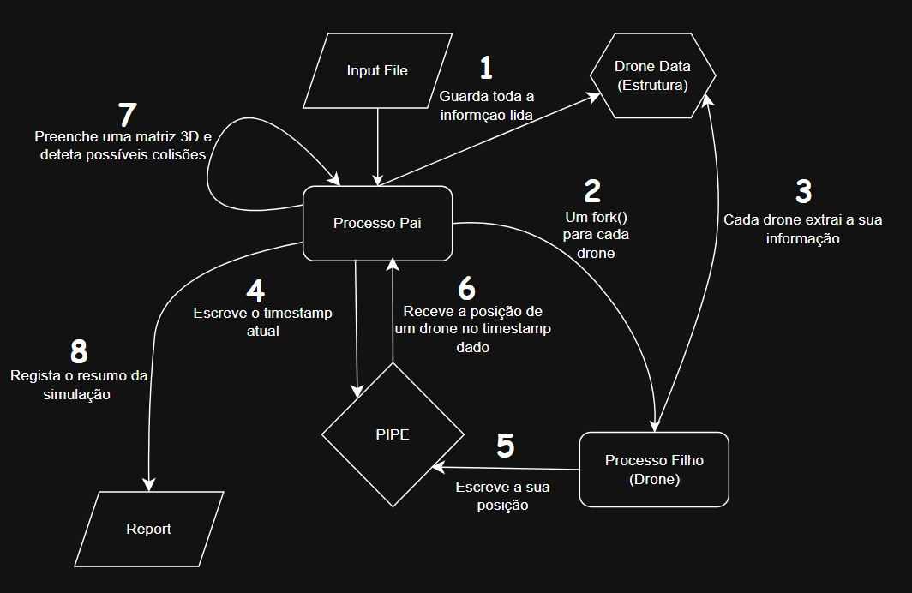
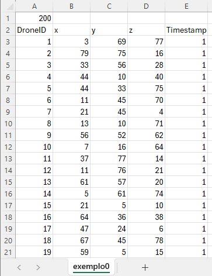

# SCOMP

## DIAGRAMA

* O diagrama abaixo é uma representação simples da estrutura do nosso simulador. Os números representam a ordem dos acontecimentos, havendo um ciclo entre os passos 4 - 5 - 6 - 7.

## EXEMPLOS

* Com o propósito de testar vários cenários de simulação, foram criados vários exemplos de entrada. Optamos também por utilizar o formato csv.

* O exemplo 0 é o mais complexo, contendo 200 drones que se movimentam de maneira aleatória por 5 segundos. O resto dos exemplos são mais simples contendo menos drones.

* A estrutura que utilizamos é composta da seguinte forma:
  * Na primeira linha, primeira coluna, temos o número de drones presentes na simulação.
  * Na segunda linha, primeira coluna, temos o ID do drone.
  * Na segunda linha, segunda, terceira e quarta coluna, temos a posição do drone, sendo a segunda coluna a posição x, a terceira a y e a quarta a z. 
  * Na segunda linha, quinta coluna, temos time step.

**Exemplo0.csv :**

## DESCRIÇÃO

### US 261

* O objetivo desta user story é inicializar uma simulação para uma determinada figura. Nós começamos na ui.c e é pedido ao utilizador
do sistema para inserir um csv com as posições dos drones e o threshold de colisões, ou seja, quantas colisões serão permitidas durante a simulação.
De seguida, a ui.c chama a função simulator_run, definida na classe simulator.c, que irá correr a simulação. Nesta função começamos por instanciar um pointer para DroneData
(estrutura definida no simulator.h). Esta estrutura irá guardar as informações do csv (droneID, x, y, z, e time step) ao chamar a função readCsv.
Também é criada uma matriz tridimensional de MatrixCellInfo (estrutura definida no simulator.h que guarda droneID e time step).
Posteriormente, são criados pipes para permitir a comunicação entre cada drone e o processo principal. É ainda configurada uma estrutura sigaction para tratamento de sinais.
Por fim, é feito um ciclo para criar os processos filhos (drones). Assim que um processo filho é criado, o seu droneID é definido (myDroneID = i + 1;).
Cada drone também instancia o seu próprio apontador para DroneData, no qual serão armazenadas apenas as informações relativas ao seu droneID, utilizando a função getSpecificDroneData().

### US 262

* Nesta user story, o objetivo é receber a posição dos drones para cada time step, sendo esta US dependente da US264, pois para haver
comunicação entre os drones e o processo principal nós guiamo-nos por time steps.
Na realização desta US implementamos um while no código dos filhos que fica à espera que o processo pai envie um time step. Após receber o time step, o drone procura a sua posição correspondente a esse instante e
envia-a de volta para o processo pai através do pipe (envia um DroneData com o droneID, x, y, z e time step).
Quando o drone recebe o time step especial -999, executa um break para sair do while, fecha os pipes, liberta a memória alocada para a estrutura DroneData e termina a sua execução.
No processo principal, existe um ciclo que percorre todos os time steps (explicado com mais detalhe na US264), no qual o pai envia o time step atual para todos os drones.
De seguida, há outro ciclo que percorre cada drone, ficando à espera de receber a estrutura DroneData correspondente, enviada através dos respetivos pipes.

### US 263

*

### US 264

* Esta user story é essencial para a comunicação entre o processo pai e os drones. O processo principal precisa de ter todos os time steps, por isso foi criada a função getAllTimestamps(),
que recolhe todos os time steps da estrutura DroneData (que armazena todos os dados lidos do CSV) e os organiza por ordem crescente, utilizando um bubble sort (função definida no utils.c). 
Depois de ter os time steps ordenados, o processo principal vai fazer um loop para cada time step e vai enviar o time step para os drones através do pipe.
Após enviar o time step,faz outro ciclo para cada drone e espera que estes enviem as suas posições (DroneData) através dos respetivos pipes.
Só depois de receber todas as posições e detetar as possíveis colisões (explicado na US263), é que o processo avança para o próximo time step. Este processo repete-se até que todos os time steps sejam processados.
  No final, o processo principal envia o time step especial -999 para todos os drones, indicando que devem terminar a sua execução.
 
### US 265

*

## AUTOAVALIAÇÃO

### 1231031 - Rafael Costa - 100%
### 1231267 - Rúben Freitas - 100%
### 1230927 - José Ribeiro - 100%
### 1222123 - João Sousa - 100%