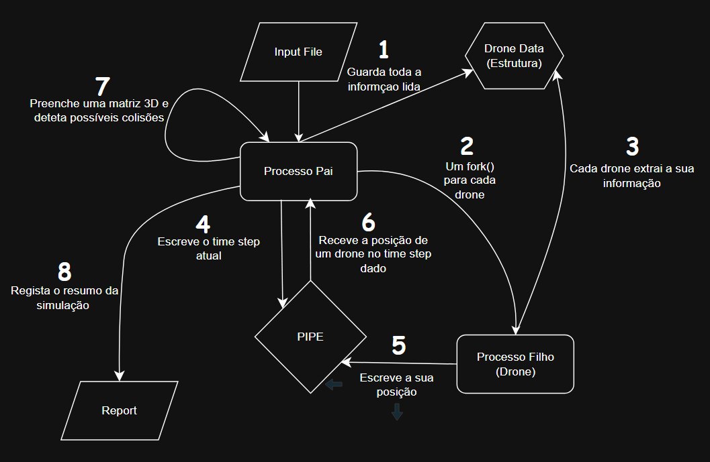

# SCOMP

## SPRINT 2

#### DIAGRAMA

* O diagrama abaixo é uma representação simples da estrutura do nosso simulador. Os números representam a ordem dos acontecimentos, havendo um ciclo entre os passos 4 - 5 - 6 - 7.

#### EXEMPLOS

* Com o propósito de testar vários cenários de simulação, foram criados vários exemplos de entrada. Optamos também por utilizar o formato csv.

* O exemplo 0 é o mais complexo, contendo 200 drones que se movimentam de maneira aleatória por 5 segundos. O resto dos exemplos são mais simples contendo menos drones.

* A estrutura que utilizamos é composta da seguinte forma:
  * Na primeira linha, primeira coluna, temos o número de drones presentes na simulação.
  * Na segunda linha, primeira coluna, temos o ID do drone.
  * Na segunda linha, segunda, terceira e quarta coluna, temos a posição do drone, sendo a segunda coluna a posição x, a terceira a y e a quarta a z. 
  * Na segunda linha, quinta coluna, temos time step.

**Exemplo0.csv :**

#### DESCRIÇÃO

##### US 261

* O objetivo desta user story é inicializar uma simulação para uma determinada figura. Nós começamos na ui.c e é pedido ao utilizador
do sistema para inserir um csv com as posições dos drones e o threshold de colisões, ou seja, quantas colisões serão permitidas durante a simulação.
De seguida, a ui.c chama a função simulator_run, definida na classe simulator.c, que irá correr a simulação. Nesta função começamos por instanciar um pointer para DroneData
(estrutura definida no simulator.h). Esta estrutura irá guardar as informações do csv (droneID, x, y, z, e time step) ao chamar a função readCsv.
Também é criada uma matriz tridimensional de MatrixCellInfo (estrutura definida no simulator.h que guarda droneID e time step).
Posteriormente, são criados pipes para permitir a comunicação entre cada drone e o processo principal. É ainda configurada uma estrutura sigaction para tratamento de sinais.
Por fim, é feito um ciclo para criar os processos filhos (drones). Assim que um processo filho é criado, o seu droneID é definido (myDroneID = i + 1;).
Cada drone também instancia o seu próprio apontador para DroneData, no qual serão armazenadas apenas as informações relativas ao seu droneID, utilizando a função getSpecificDroneData().

##### US 262

* Nesta user story, o objetivo é receber a posição dos drones para cada time step, sendo esta US dependente da US264, pois para haver
comunicação entre os drones e o processo principal nós guiamo-nos por time steps.
Na realização desta US implementamos um while no código dos filhos que fica à espera que o processo pai envie um time step. Após receber o time step, o drone procura a sua posição correspondente a esse instante e
envia-a de volta para o processo pai através do pipe (envia um DroneData com o droneID, x, y, z e time step).
Quando o drone recebe o time step especial -999, executa um break para sair do while, fecha os pipes, liberta a memória alocada para a estrutura DroneData e termina a sua execução.
No processo principal, existe um ciclo que percorre todos os time steps (explicado com mais detalhe na US264), no qual o pai envia o time step atual para todos os drones.
De seguida, há outro ciclo que percorre cada drone, ficando à espera de receber a estrutura DroneData correspondente, enviada através dos respetivos pipes.

##### US 263

* Com esta user story é possível detetar colisões entre os drones durante uma simulação. Esta funcionalidade é executada durante o ciclo que percorre todos os drones ao longo dos time steps. Quando, num determinado 
instante, o drone envia para o processo principal a sua informação, esta é usada pelo método updateMatrix. Este método recebe como parâmetros uma matriz 3D temporária, que é inicializada entre o ciclo for que percorre 
todos os time steps e o que percorre todos os drones, e a informação do drone.
No método updateMatrix tentamos atualizar a posição dada pelo drone. Se a posição estiver disponível, então o drone é guardado nela e o método retorna 0; se não estiver disponível, significa que já existe um drone 
nessa posição, retornando assim o ID desse drone.
Caso o valor retornado pelo updateMatrix seja diferente de 0, significa que ocorreu uma colisão. Com isto, o processo principal envia sinais para os drones envolvidos e um contador de colisões é incrementado. Antes de 
prosseguir, é verificado se o threshold de colisões foi atingido e, se tiver sido, então a simulação e os drones são abortados e terminados. Caso contrário, uma nova posição será encontrada para o drone que colidiu, 
utilizando a função findFreeAdjacentPosition.
Esta função recebe como parâmetros a matriz 3D temporária e a informação do drone, e procura pela posição adjacente mais próxima. O drone é então colocado na matriz temporária, retornando a sua informação atualizada 
com a nova posição. De forma simples, este método define um raio de procura e vai, eixo a eixo e posição a posição, procurar por um lugar vazio. Ou seja, começa no eixo do X e verifica a posição (x+1, y, z), na próxima
iteração (x-1, y, z), até chegar ao (x, y, z-raio). Se ainda assim não encontrar uma posição, esse drone, nesse time step, não é colocado na simulação.
Depois de encontrar uma nova posição, é chamado o updateMatrix para colocar o drone na sua nova posição, sendo também documentada toda esta informação no report.

##### US 264

* Esta user story é essencial para a comunicação entre o processo pai e os drones. O processo principal precisa de ter todos os time steps, por isso foi criada a função getAllTimestamps(),
que recolhe todos os time steps da estrutura DroneData (que armazena todos os dados lidos do CSV) e os organiza por ordem crescente, utilizando um bubble sort (função definida no utils.c). 
Depois de ter os time steps ordenados, o processo principal vai fazer um loop para cada time step e vai enviar o time step para os drones através do pipe.
Após enviar o time step,faz outro ciclo para cada drone e espera que estes enviem as suas posições (DroneData) através dos respetivos pipes.
Só depois de receber todas as posições e detetar as possíveis colisões (explicado na US263), é que o processo avança para o próximo time step. Este processo repete-se até que todos os time steps sejam processados.
  No final, o processo principal envia o time step especial -999 para todos os drones, indicando que devem terminar a sua execução.

##### US 265

* O objetivo desta user story é gerar um relatório da simulação em tempo real, à medida que a simulação decorre, e guardar os resultados num ficheiro. O relatório começa com um cabeçalho (header),
inicial, e vai sendo atualizado progressivamente com informação sobre colisões, posições e estados dos drones.\
-Início da simulação:\
Antes de começar a simulação dos time steps, a função escreve um cabeçalho no ficheiro simulation_report_nomeficheiroinput.txt, com o número total de drones.\
-Durante a simulação:\
Caso ocorra uma colisão, esta é imediatamente registada no relatório com o timestamp, as coordenadas da colisão e os drones envolvidos nela.\
Após o registo da colisão será escrito a nova localização do drone indentificando o mesmo.\
-Fim da simulação:\
Após a simulação terminar será escrito no report o execution status dos drones juntamente com uma mensagem a dizer se a figura passou ou falhou na validação

#### AUTOAVALIAÇÃO

### 1231031 - Rafael Costa - 100%
### 1231267 - Rúben Freitas - 100%
### 1230927 - José Ribeiro - 100%
### 1222123 - João Sousa - 100%

## SPRINT 3

#### DIAGRAMA

* O diagrama abaixo é uma representação simples da estrutura do novo simulador feito no Sprint 3. Tem ciclo entre os números 5 e 17

#### EXEMPLOS

Continuamos a usar os mesmos exemplos que foram usados no sprint passado pois estes exemplos simulam todas as situações possíveis.

#### DESCRIÇÃO

##### US 361

* Com esta user story iniciámos o simulador para testar uma show proposal. Começámos por ler o CSV fornecido pelo user e encher uma estrutura DroneData com
todos os dados. Decidimos continuar com a lógica do simulador utilizada no sprint passado, mas alterámos alguns aspetos. Começámos por modificar a comunicação entre o processo pai e os filhos, 
utilizando semáforos (removemos os pipes), e dividimos as funções de deteção de colisões e de preenchimento do ficheiro de relatório entre duas threads.

##### US 362

* Esta user story é essencial para o funcionamento do simulador pois usamos 2 threads: a collisions thread e a 
report thread. A collisions thread é criada e executa a função colision_detection_thread(void* arg), esta
thread recebe uma estrutura ThreadArgs com os PIDs, o número da threshold de colisões e o número total de drones.
Esta thread fica bloqueada no while, à espera do semáforo (sem_colisions_read). Mais tarde, noutra user story, será  
aprofundada a comunicação entre a thread e o processo pai.
* Já a report thread é criada e executa a função report_generation_thread(). Esta thread dá lock num mutex e, em seguida, fica bloqueada
num while, à espera de um sinal enviado pela collisions thread (sinal que só será recebido se houver colisão). 
* Ambas as threads alteram uma variável chamada should_log. Quando ocorre uma colisão, a thread das colisões atualiza a memória partilhada (shared_info_struct)
com os dados da colisão, define should_log = 1 e envia o sinal para a thread do report, já esta thread recebe o sinal e atualiza o report file com
os dados que estão na memória partilhada e volta a alterar o should_log para 0, indicando que já acabou de atualizar o txt e que a thread das colisões pode continuar 
a tentar detetar colisões. Quando esta thread acaba de ver a posição de todos os drones, aumenta o valor do semáforo sem_colisions_write, que indica
ao processo pai que acabou de detetar as colisões para todos os drones num timestamp específico.

##### US 363

* Esta user story tem o mesmo objetivo que a US263 do segundo sprint, sendo este detetar possíveis colisões. Porém, agora a informação é recebida por uma thread, a collision_detection_thread, e, em caso de colisão, é transmitida pela report_generation_thread.
A thread das colisões recebe como argumentos os PIDs, o número total de drones e o número máximo de colisões. Entrando no while, ela fica presa no sem_wait, à espera de receber o sinal do processo pai. Ao receber o sinal, então ela começa, dá lock no mutex porque vamos precisar de aceder à memória partilhada, e antes de começar a ver as posições dos drones naquele timestamp, verifica se a simulação pode continuar. Se não puder, já é enviado um sinal para a thread do relatório (report_thread), para que seja registado o término da simulação, e é dado unlock no mutex.
Chegando ao for dos drones, o processo é muito idêntico ao do Sprint 2, pois são percorridos todos os drones, acedendo à sua posição na memória partilhada e colocando-os numa matriz tridimensional, usando o método updateMatrix.
Como já visto no Sprint 2, se o updateMatrix retornar algo que não seja 0, significa que houve colisão. Então, nesse caso, enviamos um sinal para os processos, aumentamos um contador de colisões presente na memória partilhada e encontramos uma nova posição usando o método findFreeAdjacentPosition. Este método funciona da mesma maneira que no Sprint 2.
Encontrando uma nova posição, a matriz já é atualizada e é feita a verificação se o número máximo de colisões foi atingido. Se for o caso, então atualizamos o timestamp com o número de término, é enviado um sinal para a report_thread para que seja feito o log, e também é dado unlock no mutex.
Caso não tenha sido atingido, a variável should_log é mudada para 1, e é enviado um sinal para a report_thread. No fim, se tudo correr bem, é dado um sem_post para o pai saber que pode continuar para o próximo timestamp. 
Por último, quando a simulação acaba, a thread sai do while e dá sem_post para fechar.

##### US 364

* Esta user story é fulcral para a comunicação entre o processo pai e os filhos (drones). O processo pai começa por esperar
pelo sem_colisions_write (espera que o collisions thread acabe), este semáforo começa com o valor 1 pois na primeira iteração o pai não tem de esperar pelo colisions thread.
Após passar por esse wait o processo pai atualiza a shared_struct com o timestamp e aumenta o valor do sem_read pelo número de drones. Estes drones (processos filho) já vão
estar à espera com sem_wait(sem_read) e após conseguirem sair daí atualizam a shared_struct_list com a sua posição. Como esta memória partilhada é uma lista com o length do 
número de drones, não é preciso sincronização entre os processos filhos pois cada um escreve no seu index da lista, assim não há o problema de dois ou mais drones escreverem
no mesmo lugar da memória. Após cada drone atualizar a sua posição, eles dão sem_post(sem_arrival) onde o processo pai já estará à espera dos drones, e para finalizar eles ficam presos
numa barreira (sem_wait(sem_barrier)). Só depois do processo pai finalizar o loop de sem_wait(sem_arrival), irá libertar os filhos da barreira que depois irão ficar presos
no sem_wait(sem_read) denovo à espera de novo timestamp.
* Para finalizar o timestamp, o processo pai faz post no sem_colisions_read, que indica à thread das colisões que pode começar a detetar as colisões. Quando esta thread acaba ela
dá post no sem_colisions_write, onde o pai estará a espera e será libertado para começar num novo timestamp.

##### US 365

* O objetivo desta user story é gerar e guardar o relatório final da simulação após a sua conclusão.
Este relatório deve consolidar toda a informação relevante sobre a execução da simulação — incluindo o estado final de cada drone,
colisões registadas (com timestamp e coordenadas), e o resultado da validação global da figura.
Este relatório permite ao técnico de drones avaliar a segurança e o desempenho da simulação como um todo.
* A thread de geração do relatório final agrega os dados necessários da memória partilhada.
* Com base no número de colisões e nos critérios definidos, é calculado o resultado de validação final da figura (PASSED/FAILED),
que é claramente indicado no relatório.
* Toda esta informação é escrita no ficheiro simulation_report_<nome>.txt, no final da simulação,
garantindo um registo completo e persistente dos resultados para futura análise.

#### INFORMAÇÕES UTÉIS

* simulationStatus: 
  - 0: significa que o threshold de colisões foi atingido e a simulação tem de ser abortada
  - 1: significa que a simulação está valida e o threshold ainda não foi atingido

* should_log (variável usada para sincronização entre as duas threads):
  - 0: significa que a thread de reports já atualizou o report file 
  - 1: significa que a thread das colisões detetou uma colisão e a shared_info_struct já está atualizada com a colisão recente 

* função updateMatrix:
 - = 0: significa que não houve colisão com o drone enviado para a função nesse timestamp
 - != 0: significa que houve colisão entre o drone enviado para a função e o número retornado é o id do outro drone envolvido na colisão

#### AUTOAVALIAÇÃO

### 1231031 - Rafael Costa - 25%
### 1231267 - Rúben Freitas - 25%
### 1230927 - José Ribeiro - 25%
### 1222123 - João Sousa - 25%
